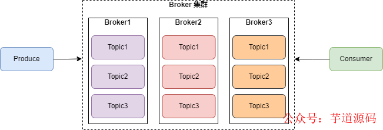
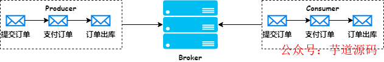
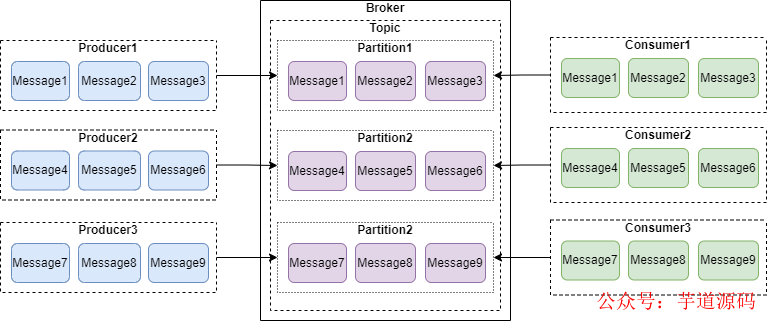
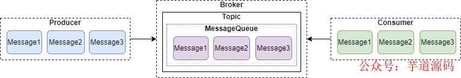
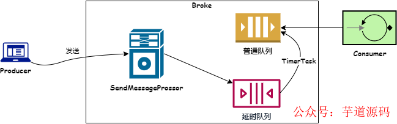
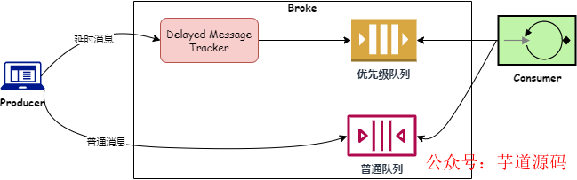
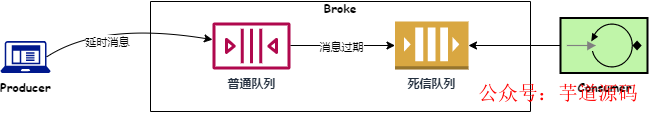
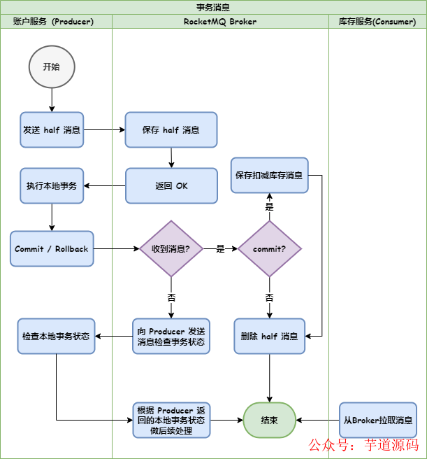
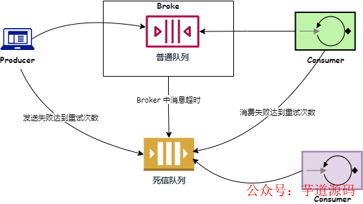
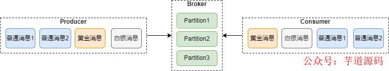

- [消息队列技术选型的 7 种消息场景](https://mp.weixin.qq.com/s/KGtP5msW0puxSGTPgmf0mA)

我们在做消息队列的技术选型时，往往会结合业务场景进行考虑。今天来聊一聊消息队列可能会用到的 7 种消息场景。

## 1. 普通消息
消息队列最基础的功能就是生产者发送消息、Broker 保存消息，消费者来消费消息，以此实现系统解耦、削峰填谷的作用。



普通消息是消息队列必备的消息类型，也是系统使用场景最多的一种消息。

## 2. 顺序消息
顺序消息是指生产者发送消息的顺序和消费者消费消息的顺序是一致的。比如在一个电商场景，同一个用户提交订单、订单支付、订单出库，这三个消息消费者需要按照顺序来进行消费。如下图：



顺序消息的实现并不容易，原因如下：

- 生产者集群中，有多个生产者发送消息，网络延迟不一样，很难保证发送到 Broker 的消息落盘顺序是一致的；
- 如果 Broker 有多个分区或队列，生产者发送的消息会进入多个分区，也无法保证顺序消费；
- 如果有多个消费者来异步消费同一个分区，很难保证消费顺序跟生产者发送顺序一致。

要保证消息有序，需要满足两个条件：

- 同一个生产者必须同步发送消息到同一个分区；
- 一个分区只能给同一个消费者消费。

如下图：



上面第二个条件是比较容易实现的，一个分区绑定一个消费者就可以，主要是第一个条件。

在主流消息队列的实现中，Kafka 和 Pulsar 的实现方式类似，生产者给消息赋值一个 key，对 key 做 Hash 运算来指定消息发送到哪一个分区。比如上面电商的例子，对同一个用户的一笔订单，提交订单、订单支付、订单出库这三个消息赋值同一个 key，就可以把这三条消息发送到同一个分区。

对于 RocketMQ，生产者在发送消息的时候，可以通过 MessageQueueSelector 指定把消息投递到那个 MessageQueue，如下图：



示例代码如下：
```java
public static void main(String[] args) throws UnsupportedEncodingException {
 try {
  DefaultMQProducer producer = new DefaultMQProducer("please_rename_unique_group_name");
  producer.start();

  String[] tags = new String[] {"TagA", "TagB", "TagC", "TagD", "TagE"};
  for (int i = 0; i < 100; i++) {
   int orderId = i % 10;
   Message msg =
    new Message("TopicTestjjj", tags[i % tags.length], "KEY" + i,
     ("Hello RocketMQ " + i).getBytes(RemotingHelper.DEFAULT_CHARSET));
   SendResult sendResult = producer.send(msg, new MessageQueueSelector() {
    @Override
    public MessageQueue select(List<MessageQueue> mqs, Message msg, Object arg) {
     Integer id = (Integer) arg;
     int index = id % mqs.size();
     return mqs.get(index);
    }
   }, orderId);

   System.out.printf("%s%n", sendResult);
  }

  producer.shutdown();
 } catch (MQClientException | RemotingException | MQBrokerException | InterruptedException e) {
  e.printStackTrace();
 }
}
```

RabbitMQ 的实现是 Exchange 根据设置好的 Route Key 将数据路由到不同的 Queue 中。示例代码如下：
```java
@Resource
private AmqpTemplate rabbitTemplate;

public void send1(String message) {
 rabbitTemplate.convertAndSend("testExchange", "testRoutingKey", message);
}
```

## 3. 延时消息
或者也叫定时消息，是指消息发送后不会立即被消费，而是指定一个时间，到时间后再消费。经典的场景比如电商购物时，30 分钟未支付订单，让订单自动失效。

### 3.1 RocketMQ 实现
RocketMQ 定义了 18 个延时级别，每个延时级别对应一个延时时间。下面如果延迟级别是 3，则消息会延迟 10s 才会拉取。
```java
//MessageStoreConfig类
private String messageDelayLevel = "1s 5s 10s 30s 1m 2m 3m 4m 5m 6m 7m 8m 9m 10m 20m 30m 1h 2h";
```

RocketMQ 的延时消息如下图：



生产者把消费发送到 Broker 后，Broker 首先把消息保存到 `SCHEDULE_TOPIC_XXXX` 这个 Topic，然后调度任务会判断是否到期，如果到期，会把消息从 `SCHEDULE_TOPIC_XXXX` 取出投递到原始的 queue，这样消费者就可以消费到了。

RocketMQ 的延时消息只支持最大两个小时的延时，不过 RocketMQ5.0 基于时间轮算法实现了定时消息，解决了这个问题。

### 3.2 Pulsar 实现
Pulsar 的实现如下图：



Pulsar 的延时消息首先会写入一个 Delayed Message Tracker 的数据结构中，Delayed Message Tracker 根据延时时间构建 delayed index 优先级队列。消费者拉取消息时，首先去 Delayed Message Tracker 检查是否有到期的消息。如果有则直接拉取进行消费。

### 3.3 RabbitMQ 实现
RabbitMQ 的实现方式有两种，一种是投递到普通队列都不消费，等消息过期后被投递到死信队列，消费者消费死信队列。如下图：



第二种方式是生产者发送消息时，先发送到本地 Mnesia 数据库，消息到期后定时器再将消息投递到 broker。

### 3.4 Kafka 实现
Kafka 本身并没有延时队列，不过可以通过生产者拦截器来实现消息延时发送，也可以定义延时 Topic，利用类似 RocketMQ 的方案来实现延时消息。

## 4. 事务消息
事务消息是指生产消息和消费消息满足事务的特性。

RabbitMQ 和 Kafka 的事务消息都是只支持生产消息的事务特性，即一批消息要不全部发送成功，要不全部发送失败。

RabbitMQ 通过 Channel 来开启事务消息，代码如下：
```java
ConnectionFactory factory=new ConnectionFactory();
connection=factory.newConnection();
Channel channel=connection.createChannel();
//开启事务
channel.txSelect();
channel.basicPublish("directTransactionExchange","transactionRoutingKey",null,message.getBytes("utf-8"));
//提交事务 或者 channel.txRollback()回滚事务
channel.txCommit();
```

Kafka 可以给多个生产者设置同一个事务 ID ，从而把多个 Topic 、多个 Partition 放在一个事务中，实现原子性写入。

Pulsar 的事务消息对于事务语义的定义是：允许事件流应用将消费、处理、生产消息整个过程定义为一个原子操作。可见，Pulsar 的事务消息可以覆盖消息流整个过程。

RocketMQ 的事务消息是通过 half 消息来实现的。以电商购物场景来看，账户服务扣减账户金额后，发送消息给 Broker，库存服务来消费这条消息进行扣减库存。如下图:



可见，RocketMQ 只能保证生产者发送消息和本地事务的原子性，并不能保证消费消息的原子性。

## 5. 轨迹消息
轨迹消息主要用于跟踪消息的生命周期，当消息丢失时可以很方便地找出原因。

轨迹消息也跟普通消息一样，也需要存储和查询，也会占用消息队列的资源，所以选择轨迹消息要考虑下面几点：

- 消息生命周期的关键节点一定要记录；
- 不能影响正常消息的发送和消费性能；
- 不能影响 Broker 的消息存储性能；
- 要考虑消息查询维度和性能。

RabbitMQ Broker 实现了轨迹消息的功能，打开 Trace 开关，就可以把轨迹消息发送到 `amq.rabbitmq.trace` 这个 exchange，但是要考虑轨迹消息会不会给 Broker 造成 压力进而导致消息积压。RabbitMQ 的生产者和消费者都没有实现轨迹消息，需要开发者自己来实现。

RocketMQ 生产者、Broker 和消费者都实现了轨迹消息，不过默认是关闭的，需要手工开启。

使用轨迹消息，需要考虑记录哪些节点、存储介质、性能、查询方式等问题。

## 6. 死信队列
在消息队列中，死信队列主要应对一些异常的情况，如下图：



RocketMQ 实现了消费端的死信队列，当消费者消费失败时，会进行重试，如果重试 16 次还是失败，则这条消息会被发送到死信队列。

RabbitMQ 实现了生产者和 Broker 的死信队列，下面三种情况，消息会被发送到死信队列：

- 生产者发送消息被拒绝，并且 requeue 参数设置为 false；
- Broker 消息过期了；
- 队列达到最大长度。

RabbitMQ 消息变成死信消息后，会被发送到死信交换机（Dead-Letter-Exchange）。

## 7. 优先级消息
有一些业务场景下，我们需要优先处理一些消息，比如银行里面的金卡客户、银卡客户优先级高于普通客户，他们的业务需要优先处理。如下图：



主流消息队列中，RabbitMQ 是支持优先级队列的，代码如下：
```java
ConnectionFactory factory=new ConnectionFactory();
connection=factory.newConnection();
Channel channel=connection.createChannel();
Map<String, Object> args = new HashMap<String, Object>();
//设置优先级为 5
args.put("x-max-priority", 5);
channel.queueDeclare("my-priority-queue", true, false, false, args);
```

## 8. 总结
消息队列技术选型，要考虑的因素很多，本文主要从业务场景来分析需要考虑的因素，同时技术上也需要考虑运维复杂度、业务规模、社区活跃度、学习成本等因素。希望本文对你使用消息队列有所帮助。
