- [Management Center Doc](https://docs.hazelcast.com/management-center/latest/getting-started/overview)
- [Management Center Install](https://docs.hazelcast.com/management-center/latest/getting-started/install)
- [Management Center Download](https://hazelcast.com/open-source-projects/downloads/archives/#hazelcast-management_center)

## 一、部署管理中心
以Docker部署为例
```shell
docker run -d \
 --publish 35700:8080 \
 --restart always \
 --network dev \
 --name hazelcast-management-center \
 hazelcast/management-center:5.3.3

docker exec -it -u root hazelcast-management-center /bin/bash

docker cp hazelcast-management-center:/opt/hazelcast/management-center/bin/hz-mc        ./hz-mc
docker cp hazelcast-management-center:/opt/hazelcast/management-center/bin/mc-conf.sh   ./mc-conf.sh
docker cp hazelcast-management-center:/opt/hazelcast/management-center/bin/mc-start.sh  ./mc-start.sh
```

1. 安装完成后打开[Web管理页面](http://localhost:35700)，选择 `Local`
2. 初始化管理员账号密码 `hazelcast` / `Local@2023`，并登录

## 二、应用配置
配置示例
```yaml
hazelcast:
  # 集群名称: 同名称的节点组成集群，thing message单独组成集群，其余服务组成集群
  cluster-name: simple-cluster
  executor-service:
    exec:
      pool-size: 20
      queue-capacity: 1000
      statistics-enabled: true
      split-brain-protection-ref: splitbrainprotection
  # 将以下功能开放给hazelcast管理中心
  management-center:
    scripting-enabled: true
    console-enabled: true
    data-access-enabled: true
  # 支持在管理中心以sql的形式管理缓存数据
  jet:
    enabled: true
  #  # 使用ip指定集群地址
  #  network:
  #    # https://docs.hazelcast.com/hazelcast/latest/clusters/discovery-mechanisms
  #    join:
  #      auto-detection:
  #        enabled: true
  #      # https://docs.hazelcast.com/hazelcast/latest/clusters/discovering-by-tcp
  #      tcp-ip:
  #        enabled: true
  #        member-list:
  #          - 192.168.9.21

  # 以下配置用于kubernetes环境的网络通讯，如果在k8s中使用，需打开以下配置并执行以下命令，使hazelcast具有访问kubernetes api的权限
  # 注意：如果服务运行的不是k8s默认的default命名空间，请修改kubernetes-rbac.yaml中的namespace和服务的k8s.yaml中的namespace一致
  #      k8s.yaml中需要配置hazelcast的端口号 5701
  #      kubectl apply -f https://raw.githubusercontent.com/hazelcast/hazelcast/master/kubernetes-rbac.yaml
  network:
    port:
      port: 35701
    join:
      multicast:
        enabled: false
      kubernetes:
        enabled: true
        namespace: svc-pd-service
        service-label-name: name
        service-label-value: simple-hazelcast
```

集成管理中心的核心配置
```properties
# 将以下功能开放给hazelcast管理中心
hazelcast.management-center.scripting-enabled: true
hazelcast.management-center.console-enabled: true
hazelcast.management-center.data-access-enabled: true

# 支持在管理中心以sql的形式管理缓存数据
hazelcast.jet.enabled: true

# 绑定hazelcast端口，方便管理中心连接
hazelcast.network.port.port: 35701
```

## 三、管理中心连接缓存集群

1. 选择 `Cluster Connections` 点击 `Add` 添加缓存集群

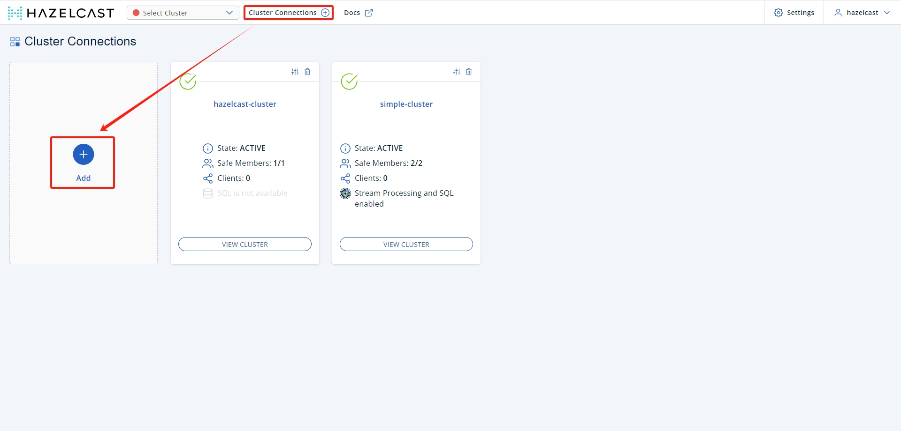

2. 输入 集群名称 `Cluster Name` 和节点地址 `Member Addresses`

- `Cluster Name`: `simple-cluster`
- `Member Addresses`: `192.168.3.49:35701,192.168.3.49:35702`

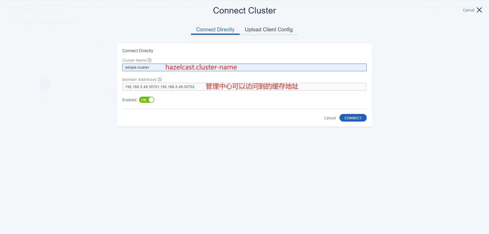

3. 添加完成后点击 `VIEW CLUSTER` 进入集群管理页面

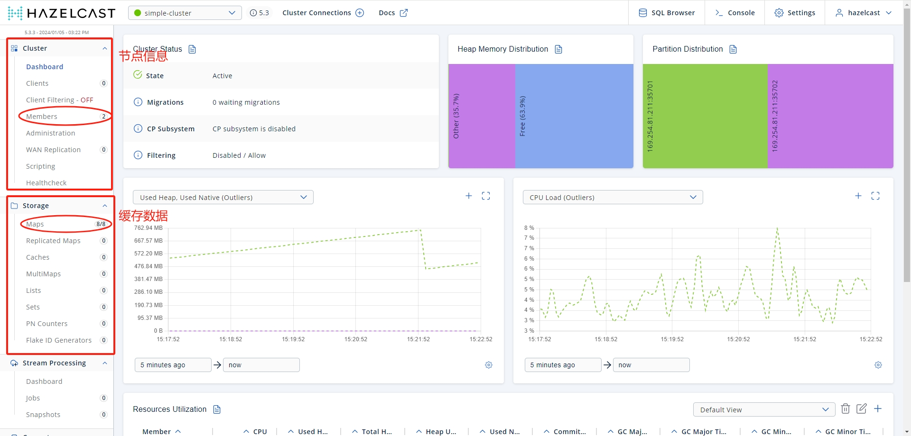

节点信息
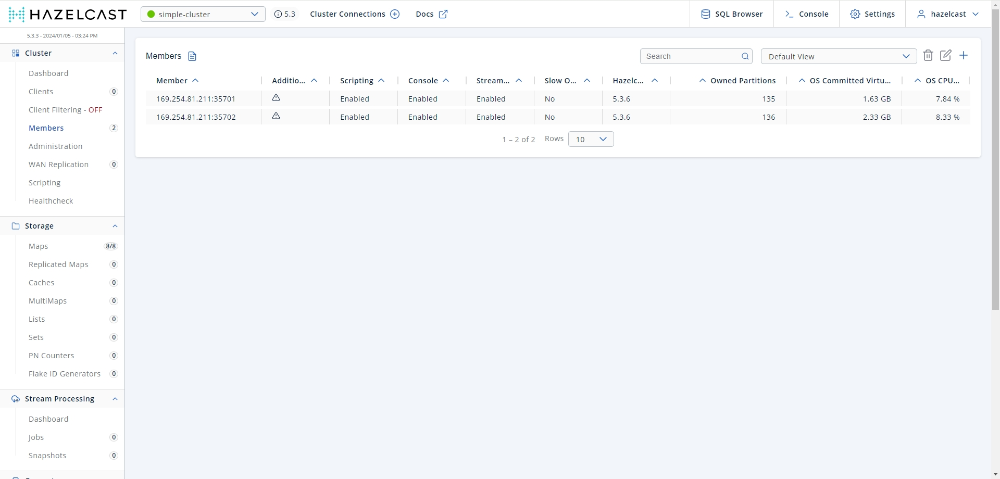

Map缓存数据
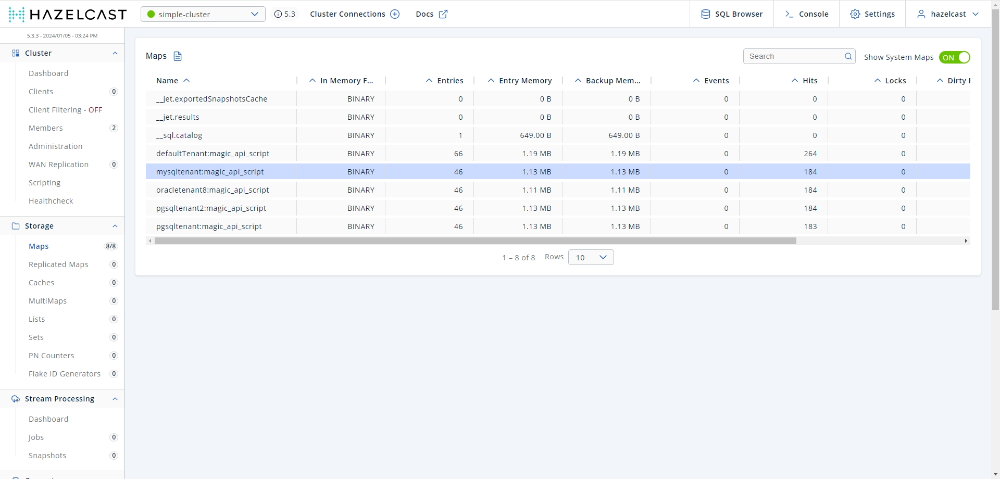

## 四、命令行查询缓存数据
1. 选择右上角 Console 进入查询命令行交互界面

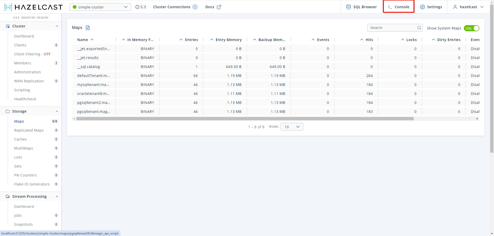

2. 输入 `help` 查看帮助

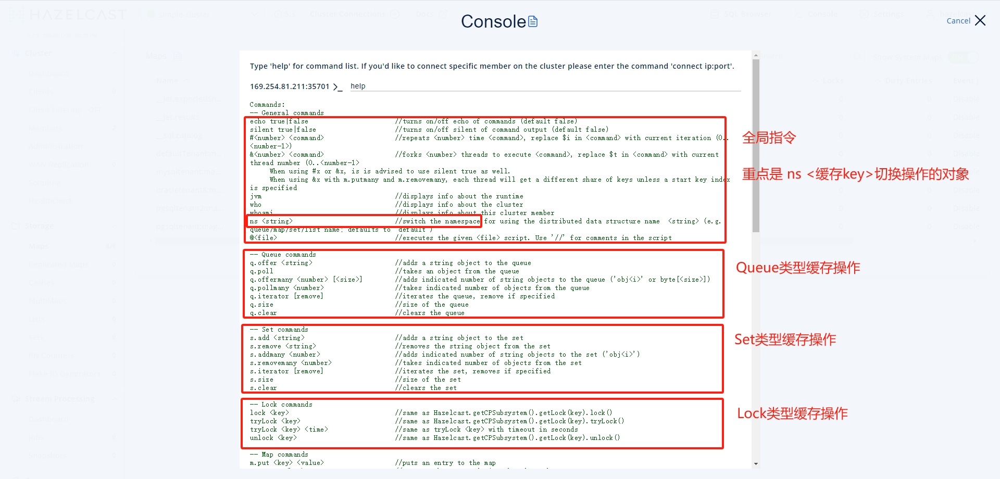

```shell
Commands:
-- General commands
echo true|false                      //turns on/off echo of commands (default false)
silent true|false                    //turns on/off silent of command output (default false)
#<number> <command>                  //repeats <number> time <command>, replace $i in <command> with current iteration (0..<number-1>)
&<number> <command>                  //forks <number> threads to execute <command>, replace $t in <command> with current thread number (0..<number-1>
     When using #x or &x, is is advised to use silent true as well.
     When using &x with m.putmany and m.removemany, each thread will get a different share of keys unless a start key index is specified
jvm                                  //displays info about the runtime
who                                  //displays info about the cluster
whoami                               //displays info about this cluster member
ns <string>                          //switch the namespace for using the distributed data structure name  <string> (e.g. queue/map/set/list name; defaults to "default")
@<file>                              //executes the given <file> script. Use '//' for comments in the script

-- Queue commands
q.offer <string>                     //adds a string object to the queue
q.poll                               //takes an object from the queue
q.offermany <number> [<size>]        //adds indicated number of string objects to the queue ('obj<i>' or byte[<size>]) 
q.pollmany <number>                  //takes indicated number of objects from the queue
q.iterator [remove]                  //iterates the queue, remove if specified
q.size                               //size of the queue
q.clear                              //clears the queue

-- Set commands
s.add <string>                       //adds a string object to the set
s.remove <string>                    //removes the string object from the set
s.addmany <number>                   //adds indicated number of string objects to the set ('obj<i>')
s.removemany <number>                //takes indicated number of objects from the set
s.iterator [remove]                  //iterates the set, removes if specified
s.size                               //size of the set
s.clear                              //clears the set

-- Lock commands
lock <key>                           //same as Hazelcast.getCPSubsystem().getLock(key).lock()
tryLock <key>                        //same as Hazelcast.getCPSubsystem().getLock(key).tryLock()
tryLock <key> <time>                 //same as tryLock <key> with timeout in seconds
unlock <key>                         //same as Hazelcast.getCPSubsystem().getLock(key).unlock()

-- Map commands
m.put <key> <value>                  //puts an entry to the map
m.remove <key>                       //removes the entry of given key from the map
m.get <key>                          //returns the value of given key from the map
m.putmany <number> [<size>] [<index>]//puts indicated number of entries to the map ('key<i>':byte[<size>], <index>+(0..<number>)
m.removemany <number> [<index>]      //removes indicated number of entries from the map ('key<i>', <index>+(0..<number>)
     When using &x with m.putmany and m.removemany, each thread will get a different share of keys unless a start key <index> is specified
m.keys                               //iterates the keys of the map
m.values                             //iterates the values of the map
m.entries                            //iterates the entries of the map
m.iterator [remove]                  //iterates the keys of the map, remove if specified
m.size                               //size of the map
m.localSize                          //local size of the map
m.clear                              //clears the map
m.destroy                            //destroys the map
m.lock <key>                         //locks the key
m.tryLock <key>                      //tries to lock the key and returns immediately
m.tryLock <key> <time>               //tries to lock the key within given seconds
m.unlock <key>                       //unlocks the key
m.stats                              //shows the local stats of the map

-- MultiMap commands
mm.put <key> <value>                  //puts an entry to the multimap
mm.get <key>                          //returns the value of given key from the multimap
mm.remove <key>                       //removes the entry of given key from the multimap
mm.size                               //size of the multimap
mm.clear                              //clears the multimap
mm.destroy                            //destroys the multimap
mm.iterator [remove]                  //iterates the keys of the multimap, remove if specified
mm.keys                               //iterates the keys of the multimap
mm.values                             //iterates the values of the multimap
mm.entries                            //iterates the entries of the multimap
mm.lock <key>                         //locks the key
mm.tryLock <key>                      //tries to lock the key and returns immediately
mm.tryLock <key> <time>               //tries to lock the key within given seconds
mm.unlock <key>                       //unlocks the key
mm.stats                              //shows the local stats of the multimap

-- List commands:
l.add <string>                        //adds a string object to the list
l.add <index> <string>                //adds a string object as an item with given index in the list
l.contains <string>                   //checks if the list contains a string object
l.remove <string>                     //removes a string object from the list
l.remove <index>                      //removes the item with given index from the list
l.set <index> <string>                //sets a string object to the item with given index in the list
l.iterator [remove]                   //iterates the list, remove if specified
l.size                                //size of the list
l.clear                               //clears the list

-- IAtomicLong commands:
a.get                                 //returns the value of the atomic long
a.set <long>                          //sets a value to the atomic long
a.inc                                 //increments the value of the atomic long by one
a.dec                                 //decrements the value of the atomic long by one

-- Executor Service commands:
execute <echo-input>                                     //executes an echo task on random member
executeOnKey <echo-input> <key>                          //executes an echo task on the member that owns the given key
executeOnMember <echo-input> <memberIndex>               //executes an echo task on the member with given index
executeOnMembers <echo-input>                            //executes an echo task on all of the members
e<threadcount>.simulateLoad <task-count> <delaySeconds>  //simulates load on executor with given number of thread (e1..e16)
```
3. 以 `pgsqltenant:magic_api_script` 缓存为例，输入 `ns pgsqltenant:magic_api_script`

4. 获取 Map 缓存中的所有 key，输入 `m.keys`

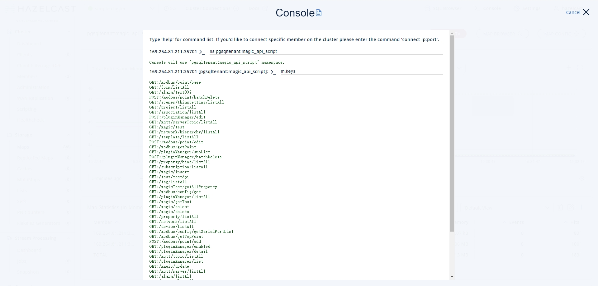

5. 获取 `GET:/modbus/point/page` 对应的 value，输入 `m.get GET:/modbus/point/page`

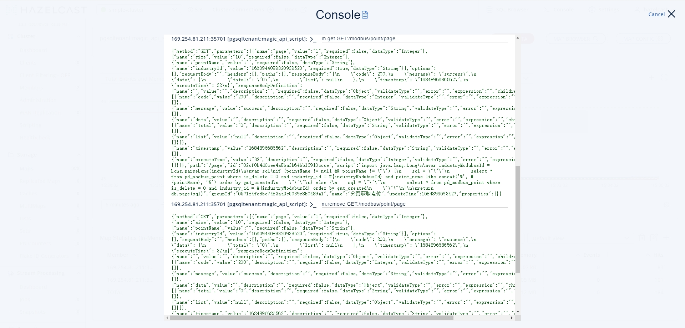

6. 删除 `GET:/modbus/point/page` ，输入 `m.remove GET:/modbus/point/page`，再次查询，值已被删除

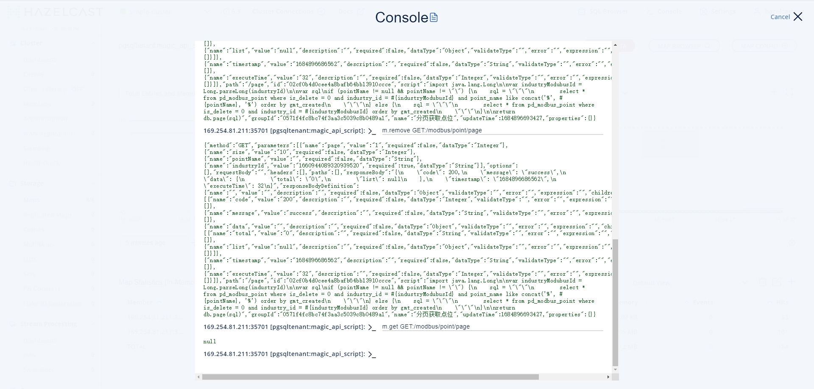

## 五、Sql查询缓存数据
1. 选择右上角 SQL Browser 进入SQL查询交互界面

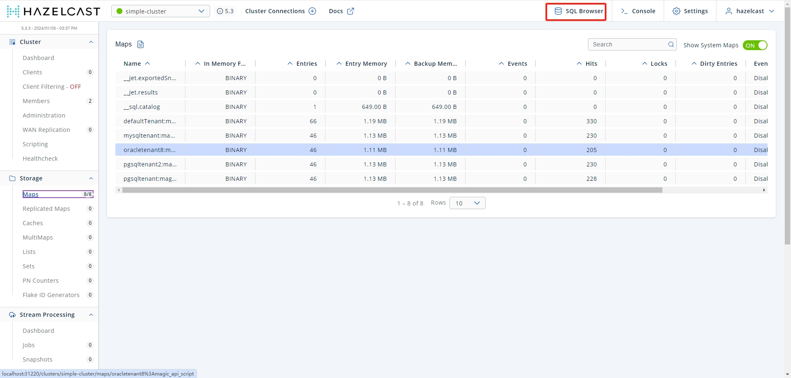

2. 根据数据向导，映射数据源 `Connector Wizard`

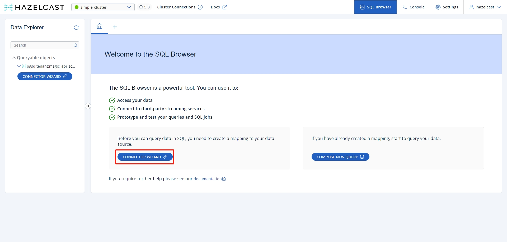

3. 下拉选择连接器类型`Choose a connector type`和`Map`，此处选择
- `Choose a connector type`: `Create mapping for hazelcast Map`，从Hazelcast缓存创建映射
- `Map`: `defaultTenant:magic_api_script`，选择需要操作的缓存key

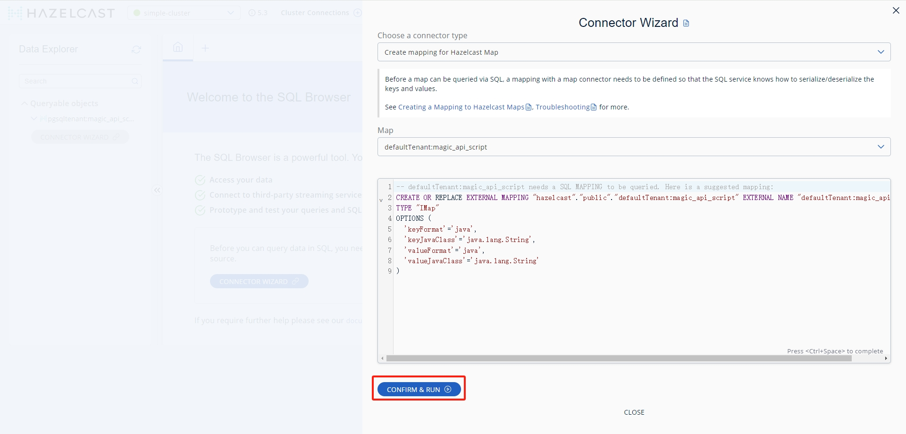

点击`CONFIRM & RUN`，出现`Query executed successfully.`即为创建成功

4. 返回上一页，选择 `COMPOSE NEW QUERY`，打开SQL编辑器页面

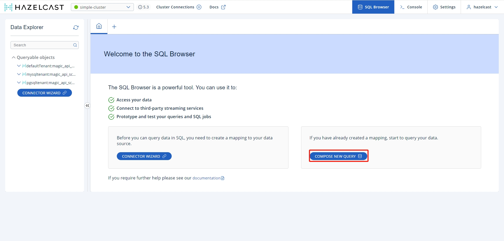

5. 输入SQL，查询缓存数据 `SELECT * FROM "defaultTenant:magic_api_script";`

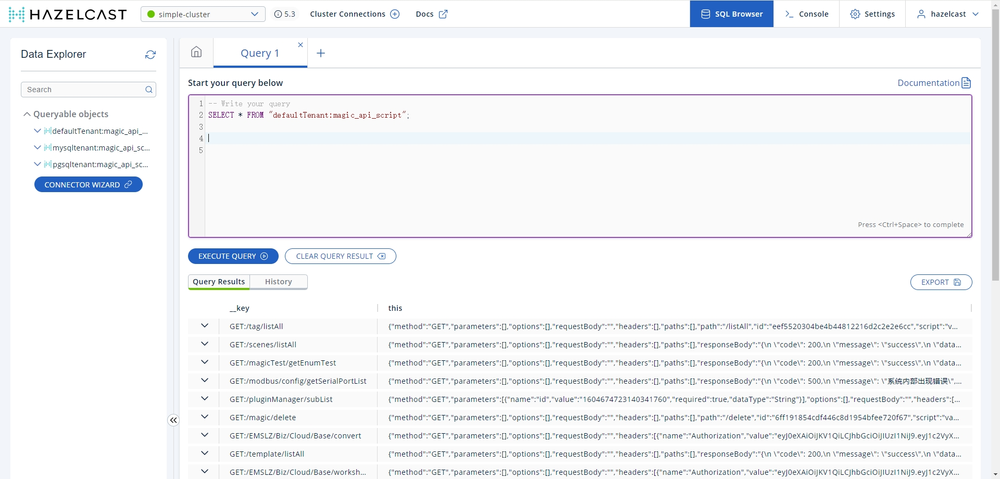

6. 输入SQL，删除指定数据 `DELETE FROM "defaultTenant:magic_api_script" WHERE __key = 'GET:/tag/listAll';`

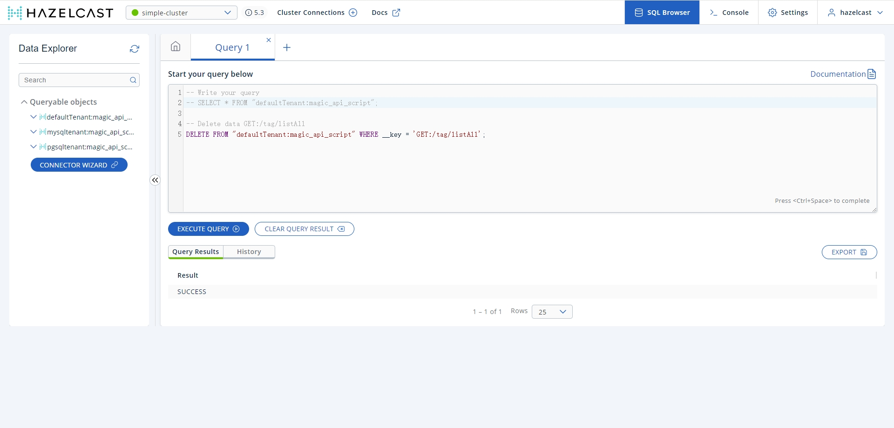

再次查询，数据已被删除 `SELECT * FROM "defaultTenant:magic_api_script" WHERE __key = 'GET:/tag/listAll';`
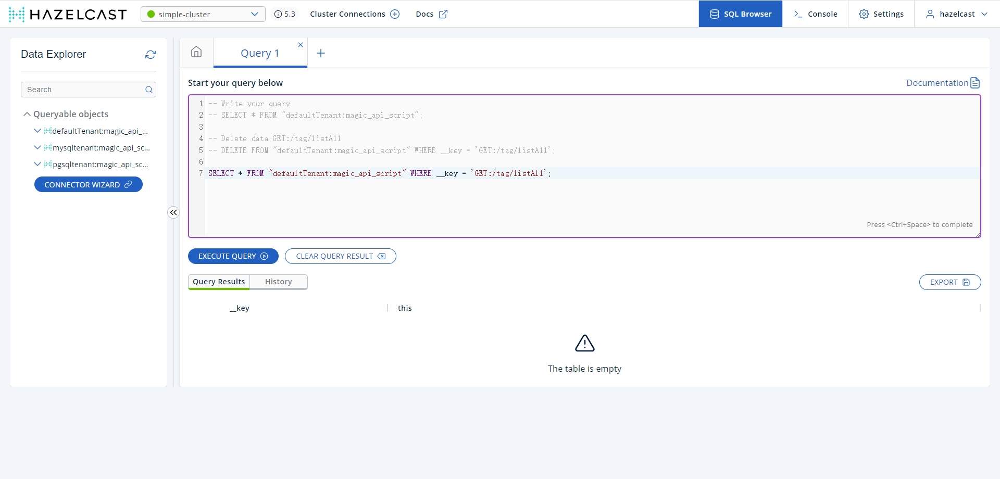
