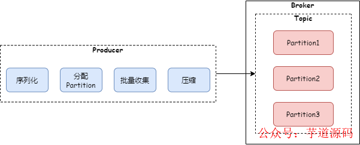
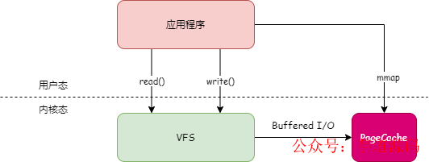
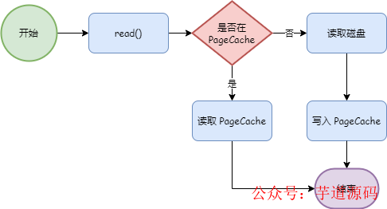
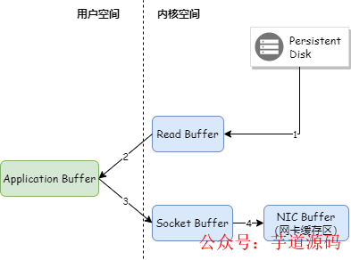
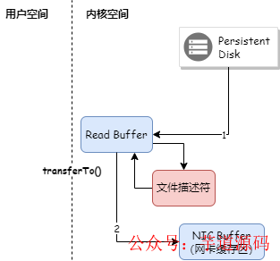
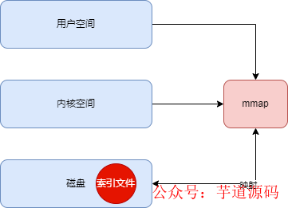

- [6 个技术点带你理解 Kafka 高性能背后的原理](https://mp.weixin.qq.com/s/jn-LRh9uoGPLI0OgXkcMkQ)

Kafka 是一款性能非常优秀的消息队列，每秒处理的消息体量可以达到千万级别。今天来聊一聊 Kafka 高性能背后的技术原理。

## 1. 批量发送
Kafka 收发消息都是批量进行处理的。我们看一下 Kafka 生产者发送消息的代码：

```java
private Future<RecordMetadata> doSend(ProducerRecord<K, V> record, Callback callback) {
 TopicPartition tp = null;
 try {
  //省略前面代码
  Callback interceptCallback = new InterceptorCallback<>(callback, this.interceptors, tp);
  //把消息追加到之前缓存的这一批消息上
  RecordAccumulator.RecordAppendResult result = accumulator.append(tp, timestamp, serializedKey,
    serializedValue, headers, interceptCallback, remainingWaitMs);
  //积累到设置的缓存大小，则发送出去
  if (result.batchIsFull || result.newBatchCreated) {
   log.trace("Waking up the sender since topic {} partition {} is either full or getting a new batch", record.topic(), partition);
   this.sender.wakeup();
  }
  return result.future;
  // handling exceptions and record the errors;
  // for API exceptions return them in the future,
  // for other exceptions throw directly
 } catch /**省略 catch 代码*/
}
```

从代码中可以看到，生产者调用 `doSend` 方法后，并不会直接把消息发送出去，而是把消息缓存起来，缓存消息量达到配置的批量大小后，才会发送出去。

- **注意：**从上面 `accumulator.append` 代码可以看到，一批消息属于同一个 `topic` 下面的同一个 `partition`。

Broker 收到消息后，并不会把批量消息解析成单条消息后落盘，而是作为批量消息进行落盘，同时也会把批量消息直接同步给其他副本。

消费者拉取消息，也不会按照单条进行拉取，而是按照批量进行拉取，拉取到一批消息后，再解析成单条消息进行消费。

使用批量收发消息，减轻了客户端和 `Broker` 的交互次数，提升了 Broker 处理能力。

## 2. 消息压缩
如果消息体比较大，Kafka 消息吞吐量要达到千万级别，网卡支持的网络传输带宽会是一个瓶颈。Kafka 的解决方案是消息压缩。发送消息时，如果增加参数 `compression.type`，就可以开启消息压缩：

```java
public static void main(String[] args) {
 Properties props = new Properties();
 props.put("bootstrap.servers", "localhost:9092");
 props.put("key.serializer", "org.apache.kafka.common.serialization.StringSerializer");
 props.put("value.serializer", "org.apache.kafka.common.serialization.StringSerializer");
    //开启消息压缩
 props.put("compression.type", "gzip");
 Producer<String, String> producer = new KafkaProducer<>(props);

 ProducerRecord<String, String> record = new ProducerRecord<>("my_topic", "key1", "value1");

 producer.send(record, new Callback() {
  @Override
  public void onCompletion(RecordMetadata metadata, Exception exception) {
   if (exception != null) {
    logger.error("sending message error: ", e);
   } else {
    logger.info("sending message successful, Offset: ", metadata.offset());
   }
  }
 });

 producer.close();
}
```

如果 `compression.type` 的值设置为 none，则不开启压缩。那消息是在什么时候进行压缩呢？前面提到过，生产者缓存一批消息后才会发送，在发送这批消息之前就会进行压缩，代码如下：

```java
public RecordAppendResult append(TopicPartition tp,
         long timestamp,
         byte[] key,
         byte[] value,
         Header[] headers,
         Callback callback,
         long maxTimeToBlock) throws InterruptedException {
 // ...
 try {
  // ...
  buffer = free.allocate(size, maxTimeToBlock);
  synchronized (dq) {
   //...
   RecordAppendResult appendResult = tryAppend(timestamp, key, value, headers, callback, dq);
   if (appendResult != null) {
    // Somebody else found us a batch, return the one we waited for! Hopefully this doesn't happen often...
    return appendResult;
   }
            //这批消息缓存已满，这里进行压缩
   MemoryRecordsBuilder recordsBuilder = recordsBuilder(buffer, maxUsableMagic);
   ProducerBatch batch = new ProducerBatch(tp, recordsBuilder, time.milliseconds());
   FutureRecordMetadata future = Utils.notNull(batch.tryAppend(timestamp, key, value, headers, callback, time.milliseconds()));

   dq.addLast(batch);
   incomplete.add(batch);

   // Don't deallocate this buffer in the finally block as it's being used in the record batch
   buffer = null;

   return new RecordAppendResult(future, dq.size() > 1 || batch.isFull(), true);
  }
 } finally {
  if (buffer != null)
   free.deallocate(buffer);
  appendsInProgress.decrementAndGet();
 }
}
```

上面的 recordsBuilder 方法最终调用了下面 MemoryRecordsBuilder 的构造方法。

```java
public MemoryRecordsBuilder(ByteBufferOutputStream bufferStream,
       byte magic,
       CompressionType compressionType,
       TimestampType timestampType,
       long baseOffset,
       long logAppendTime,
       long producerId,
       short producerEpoch,
       int baseSequence,
       boolean isTransactional,
       boolean isControlBatch,
       int partitionLeaderEpoch,
       int writeLimit) {
 //省略其他代码
 this.appendStream = new DataOutputStream(compressionType.wrapForOutput(this.bufferStream, magic));
}
```

上面的 `wrapForOutput` 方法会根据配置的压缩算法进行压缩或者选择不压缩。目前 Kafka 支持的压缩算法包括：`gzip`、`snappy`、`lz4`，从 2.1.0 版本开始，`Kafka` 支持 `Zstandard` 算法。

在 Broker 端，会解压 header 做一些校验，但不会解压消息体。消息体的解压是在消费端，消费者拉取到一批消息后，首先会进行解压，然后进行消息处理。

**因为压缩和解压都是耗费 CPU 的操作，所以在开启消息压缩时，也要考虑生产者和消费者的 CPU 资源情况**。

有了消息批量收集和压缩，kafka 生产者发送消息的过程如下图：



## 3. 磁盘顺序读写
顺序读写省去了寻址的时间，只要一次寻址，就可以连续读写。

在固态硬盘上，顺序读写的性能是随机读写的好几倍。而在机械硬盘上，寻址时需要移动磁头，这个机械运动会花费很多时间，因此机械硬盘的顺序读写性能是随机读写的几十倍。

Kafka 的 `Broker` 在写消息数据时，首先为每个 `Partition` 创建一个文件，然后把数据顺序地追加到该文件对应的磁盘空间中，如果这个文件写满了，就再创建一个新文件继续追加写。这样大大减少了寻址时间，提高了读写性能。

## 4. PageCache
在 Linux 系统中，所有文件 IO 操作都要通过 `PageCache`，`PageCache` 是磁盘文件在内存中建立的缓存。当应用程序读写文件时，并不会直接读写磁盘上的文件，而是操作 `PageCache`。



应用程序写文件时，都先会把数据写入 `PageCache`，然后操作系统定期地将 `PageCache` 的数据写到磁盘上。如下图：


而应用程序在读取文件数据时，首先会判断数据是否在 `PageCache` 中，如果在则直接读取，如果不在，则读取磁盘，并且将数据缓存到 `PageCache`。



Kafka 充分利用了 `PageCache` 的优势，当生产者生产消息的速率和消费者消费消息的速率差不多时，Kafka 基本可以不用落盘就能完成消息的传输。

## 5. 零拷贝
Kafka Broker 将消息发送给消费端时，即使命中了 `PageCache`，也需要将 `PageCache` 中的数据先复制到应用程序的内存空间，然后从应用程序的内存空间复制到 Socket 缓存区，将数据发送出去。如下图：



Kafka 采用了零拷贝技术把数据直接从 `PageCache` 复制到 `Socket` 缓冲区中，这样数据不用复制到用户态的内存空间，同时 DMA 控制器直接完成数据复制，不需要 CPU 参与。如下图：



Java 零拷贝技术采用 `FileChannel.transferTo()` 方法，底层调用了 `sendfile` 方法。

## 6. mmap
Kafka 的日志文件分为数据文件(`.log`)和索引文件(`.index`)，Kafka 为了提高索引文件的读取性能，对索引文件采用了 `mmap` 内存映射，将索引文件映射到进程的内存空间，这样读取索引文件就不需要从磁盘进行读取。如下图：



## 7. 总结
本文介绍了 Kafka 实现高性能用到的关键技术，这些技术可以为我们学习和工作提供参考。
