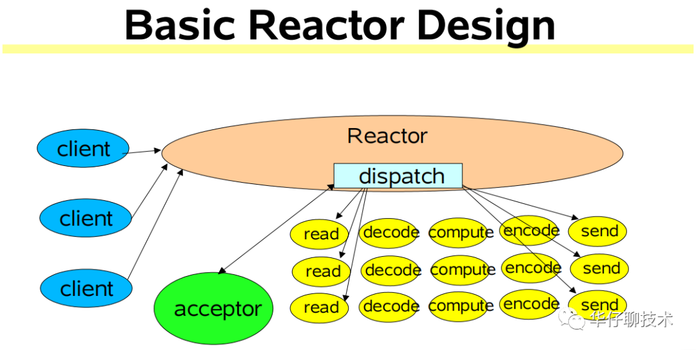
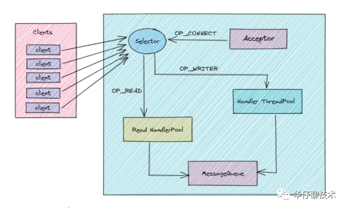
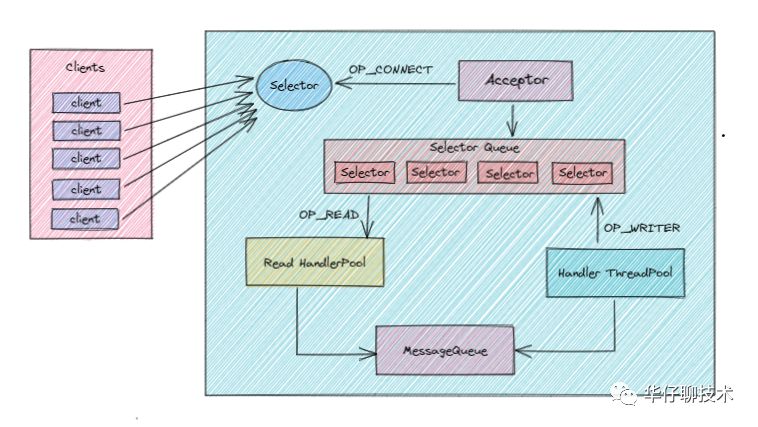
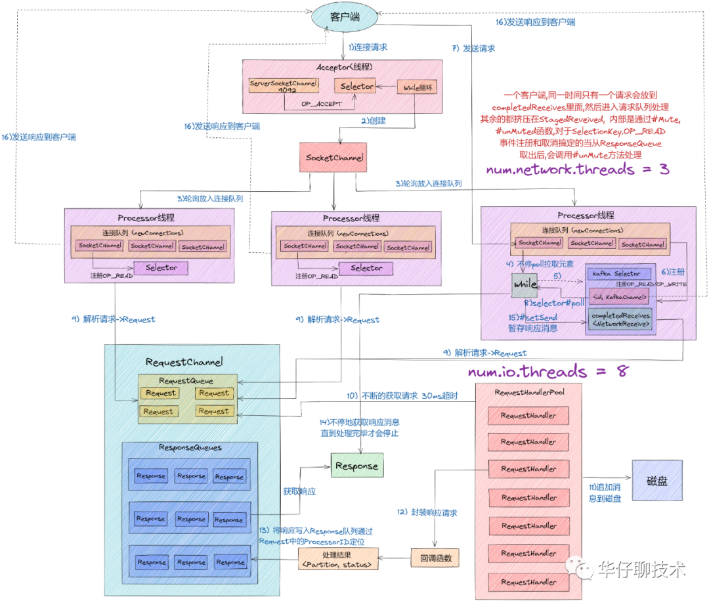
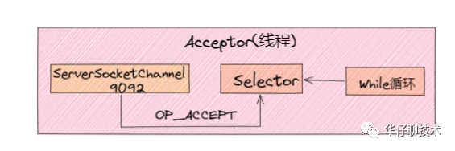
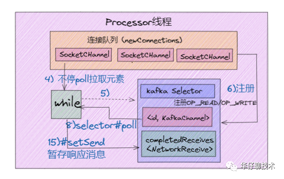

- [深度剖析：Kafka 请求是如何处理的? 看完这篇文章彻底懂了！](https://mp.weixin.qq.com/s/IwNiA0_dGg_Hmx_jN2i2aQ)

国庆假期已经结束，在这个充满悲伤的夜晚，让我们一起来深度剖析下`「Kafka Broker 端网络架构和请求处理流程」`是如何设计的。

相信使用过 Kafka 的朋友都知道其吞吐量可以高达百万，但很少人理解其中的设计原理。

**那么 Kafka Broker 端网络架构和请求处理到底是使用了哪些高大上的技术？它到底解决了什么问题？究竟是怎么解决的？**

只有了解了这些， 我们才能深刻掌握 Kafka 服务端设计精髓所在，更加深刻理解一个高并发、高性能服务端架构该如何设计。

认真读完这篇文章，我相信你会对Kafka Broker请求处理流程和网络架构设计实现细节，有更加深刻的理解。

这篇文章干货很多，希望你可以耐心读完。


图片

## 01 总体概述
要想理解 Kafka Broker 请求处理架构设计，我们需要从简单请求处理模型来说起。


对于日常系统开发，我们都知道是基于 `Request/Response` 的模式来实现的， 对于 Kafka 来说， 无论是 Producer 端、Consumer 端 还是 Broker 端，他们之间的请求交互也都是基于`「Request/Response」`模式来完成的。比如，客户端会通过网络发送消息生产请求给 Broker，而 Broker 处理完成后，会发送对应的响应给到客户端。


下面，我会从自我设计角度出发，如果是我们会如何设计，带你一步步演化出来`「kafka Broker 的网络请求处理」`架构。

在这个过程中，你会看到 Kafka 在处理请求的过程中会遇到哪些高性能和高并发问题，以及架构为什么要这样演进，从而理解 Kafka 这么设计的意义和精妙之处。

## 02 顺序处理模式
我们从最简单的网络编程思路处理方式讲起。

因为对于 Kafka Broker 来说就是用来接收生产者发送过来的请求，那这个时候最简单的实现大概是这样的：
```java
while(true) {
    Request request = accept(connection);
    handle(request);
}
```

如上述代码所示：我们可以理解 Kafka 每个服务器启动起来后就是一个 while 循环， 不断的 accept 生产者提交上来的请求， 然后进行处理并存储到磁盘上，这种方式实现最简单，也非常好理解，但是这种方式存在2个致命的缺陷？

1. 请求阻塞：只能顺序处理每个请求，即每个请求都必须等待前一个请求处理完毕才能得到处理。

2. 吞吐量非常差：由于只能顺序处理，无法并发，效率太低，所以吞吐量非常差，只适合请求发送非常不频繁的系统。


从上面来看很明显，如果你的 Kafka 系统请求并发量很大，意味着要处理的时间就会越久。那按照前面我们提到的 Kafka`「吞吐量」`的标准，这个方案远远无法满足我们对高性能、高并发的要求。

那有什么更好的方案可以快速处理请求吗？

接下来我们可以试着采取这个方案：独立线程异步处理模式。

## 03 多线程异步处理模式
既然同步方式会阻塞请求，吞吐量差， 我们可以尝试着使用独立线程异步方式进行处理， 即经典的 connection per thread 模型， 那这个时候的实现大概是这样的：

```java
while(true) {
    Request request = accept(connection);
    Thread thread = new Thread(() -> handle(request));
    thread.start();
}
```

如上述代码所示：同上还是一个 while 循环不断的 accept 生产者提交上来的请求，但是这时候 Kafka 系统会为每个请求都创建一个`「单独的线程」`来处理。

这个实现方案的好处就是：

1. 吞吐量稍强：相对上面同步方式的方案，一定程度上极大地提高了服务器的吞吐量。

2. 非阻塞：它是完全异步的，每个请求的处理都不会阻塞下一个请求。

但同样缺陷也同样很明显：即为每个请求都创建线程的做法开销很大，在某些高并发场景下会压垮整个服务。可见，这个方案也只适用于请求发送频率很低的业务场景。还是无法满足我们对高性能、高并发的要求。

既然这种方案还是不能满足， 那么我们究竟该使用什么方案来支撑高并发呢？


这个时候我们可以想想我们日常开发用到的7层负载Nginx或者Redis在处理高并发请求的时候是使用什么方案呢？


从上面启发你可以看出，提升系统 I/O 并发性能的关键思路就是：`事件驱动`。


想必大家已经猜到了，没错，就是`「多路复用」`。那么Kafka 是不是也是采用这种方案来实现呢？


这里我们先考虑采用基于`「事件驱动」`的设计方案，当有事件触发时，才会调用处理器进行数据处理。

## 04 Reactor 模式
在高性能网络编程领域，有一个非常著名的模式——Reactor模式。那么何为`「Reactor模式」`，首先它是基于事件驱动的，有一个或多个并发输入源，有一个Service Handler，有多个Request Handler；这个Service Handler会同步的将输入的请求轮询地分发给相应的Request Handler进行处理。


借助于 Doug Lea（就是那位让人无限景仰的大爷）的 "Scalable IO in Java" 中讲述的Reactor模式。


"Scalable IO in Java" 的地址是：http://gee.cs.oswego.edu/dl/cpjslides/nio.pdf


简单来说，`Reactor 模式特别适合应用于处理多个客户端并发向服务器端发送请求的场景`。这里借用大神 PDF 中的一幅图来说明 Reactor 架构：



从上面这张图中，我们可以看出多个客户端会发送请求给到 Reactor。Reactor 有个请求分发线程 Dispatcher，也就是图中的绿色的 Acceptor，它会将不同的请求下分发到多个工作线程中处理。

在这个架构中，Acceptor 线程只是用来进行请求分发，所以非常轻量级，因此会有很高的吞吐量。而这些工作线程可以根据实际系统负载情况动态调节系统负载能力，从而达到请求处理的平衡性。


基于上面的 Reactor 架构， 我们来看看如果是我们该如何设计 Kafka 服务端的架构？



1. 这里我们采用多路复用方案，Reactor 设计模式，并引用 Java NIO 的方式可以更好的解决上面并发请求问题。

2. 当 Client 端将请求发送到 Server 端的时候， 首先在 Server 端有个多路复用器（Selector），然后会启动一个 Accepter 线程将 OP_CONNECT 事件注册到多路复用器上， 主要用来监听连接事件到来。

3. 当监听到连接事件后，就会在多路复用器上注册 OP_READ 事件， 这样 Cient 端发送过来的请求， 都会被接收到。如果请求特别多的话， 我们这里进行优化， 创建一个 Read HandlePool 线程池。

4. 当 Read HandlePool 线程池接收到请求数据后，最终会交给 Handler ThreadPool 线程池进行后续处理。比如如果是生产者发送过来的请求，肯定会解析请求体，处理并最终存储到磁盘中，待处理完后要返回处理结果状态， 这时候就由它在多路复用器上注册 OP_WRITE 事件来完成。这样多路复用器遍历到OP_WRITE 事件后就会将请求返回到 Client 端。 

5. 在上图中我们看到在整个流程中还有一个 MessageQueue 的队列组件存在， 为什么要加这个组件呢？ 我们可以想象一下， 如果请求量非常大，直接交给 Handler ThreadPool 线程池进行处理， 可能会出现该线程池处理不过来的情况发生，如果处理不过来，也会出现阻塞瓶颈。所以这里我们在 Server 端内部也设计一个消息队列， 起到一个缓冲的作用，Handler ThreadPool 线程池会根据自己的负载能力进行处理。

以上就是我们引用了`「多路复用」`的设计方案，但是 Kafka Broker 端就是这样的架构设计方案吗？如果我们是 Kafka 系统架构的设计者，采用这样的架构设计方案会不会还是有什么问题，有没有哪个环节会出现系统性能瓶颈呢？ 

这是个值得思考的问题， 很考验你的架构设计能力。

细心的读者可能会发现：对于 Kafka 这种超高并发系统来说，一个 Selector 多路复用器是 Hold 不住的，从上图可以得出，我们监听这些连接、接收请求、处理响应结果都是同一个 Selector 在进行处理，很容易成为系统性能瓶颈。

接下来，我们将进一步进行优化，为了减轻当前 Selector 的处理负担，引入另外一个Selector 处理队列，如下图所示：



1. 首先上图是目前我认为最接近 Kafka Broker 真实架构设计方案的。

2. 整体架构跟上一版的类似，只不过这里多引入了一个多 Selector 处理队列，原来的 Selector 只负责监听连接， 这时候有读者就会有疑问，请求量超级大的时候，一个 Selector 会不会成为瓶颈呢？ 这里可以大可放心， 这时候它的工作非常单一，是完全能 hold 住的。

3. 那么对于我们接收请求、处理请求、返回状态操作都会交由多 Selector 处理队列，至于这里到底需要多少个 Selector，又会跟什么参数和配置有关系，我们后续再进行分析，总之这里记住有多个 Selector 就行了，这样系统压力就会被分散处理。

4. 另外我们要搞清楚的一点就是对于 Kafka 服务端指的是每个 Broker 节点，如果我们的服务集群总共有10个节点， 每个节点内部都是上面的这样的架构，这样我们就有理由相信如果采用这样的架构设计方案，是可以支持高并发和高性能的。

架构设计方案演进到这里，基本上已经差不多了，接下来我们看看 Kafka 真实超高并发的网络架构是如何设计的。

## 05 Kafka 超高并发网络架构
在上面 Kafka 高性能、高吞吐量架构演进的时候，我们提到了 Java NIO 以及 Reactor 设计模式。实际上，搞透了「Kafka 究竟是怎么使用 NIO 来实现网络通信的」，不仅能让我们掌握 Kafka 请求处理全流程处理，也能让我们对 Reactor 设计模式有更深的理解，还能帮助我们解决很多实际问题。 


在[<kafka 三高架构设计剖析>](https://mp.weixin.qq.com/s/kmRnukY5P2GuvaoctyBHQA) 和 [<聊聊 Kafka Producer 那点事>](https://mp.weixin.qq.com/s/AtGyvCRT5cv5jipQxbNPZg) 中也讲过关于 Kafka 网络架构，读者可以去查阅，今天我们再次深入的对其进行剖析。


那么接下来我们就来深入剖析下 Kafka 的 NIO 通讯机制吧。


我们先从整体上看一下完整的网络通信层架构，如下图所示：



1. 从上图中我们可以看出，Kafka 网络通信架构中用到的组件主要由两大部分构成：SocketServer 和 RequestHandlerPool。

2. SocketServer 组件是 Kafka 超高并发网络通信层中最重要的子模块。它包含 Acceptor 线程、Processor 线程和 RequestChannel 等对象，都是网络通信的重要组成部分。它主要实现了 Reactor 设计模式，主要用来处理外部多个 Clients（这里的 Clients 可能包含 Producer、Consumer 或其他 Broker）的并发请求，并负责将处理结果封装进 Response 中，返还给 Clients。

3. RequestHandlerPool 组件就是我们常说的 I/O 工作线程池，里面定义了若干个 I/O 线程，主要用来执行真实的请求处理逻辑。

4. 这里注意的是：跟 RequestHandler 相比， 上面所说的Acceptor、Processor 线程 还有 RequestChannel 等都不做请求处理， 它们只是请求和响应的「搬运工」。

接下来我们来具体聊聊SocketServer中的实现原理，这里先来讲讲：

1. Acceptor 线程
2. Processor 线程

以Kafka 2.5版本，源码位置：https://github.com/apache/kafka/blob/2.5.0-rc3/core/src/main/scala/kafka/network/SocketServer.scala


### 1、我们先来聊聊 Acceptor 线程

在经典的 Reactor 设计模式有个 「Dispatcher」 的角色，主要用来接收外部请求并分发给下面的实际处理线程。通过上面分析我们知道在 Kafka 网络架构设计中，这个 Dispatcher 就是「Acceptor 线程」。 

Acceptor 线程是用来接收和创建外部 TCP 连接的线程。在Broker 端每个 SocketServer 实例只会创建一个 Acceptor 线程。它的主要功能就是创建连接，并将接收到的 Request 请求传递给下游的 Processor 线程处理。
```java
/**
 * Thread that accepts and configures new connections. There is one of these per endpoint.
 */
private[kafka] class Acceptor(val endPoint: EndPoint,
                              val sendBufferSize: Int,
                              val recvBufferSize: Int,
                              brokerId: Int,
                              connectionQuotas: ConnectionQuotas,
                              metricPrefix: String) extends AbstractServerThread(connectionQuotas) with KafkaMetricsGroup {
  // 1. 创建底层的NIO Selector对象，用来监听连接创建请求、读写请求等
  private val nioSelector = NSelector.open()
  // 2. Broker端创建对应的ServerSocketChannel实例,然后将Channel注册到Selector对象上
  val serverChannel = openServerSocket(endPoint.host, endPoint.port)
  // 3. 创建Processor线程池
  private val processors = new ArrayBuffer[Processor]()
  ......
  /**
   * Accept loop that checks for new connection attempts
   */
  def run(): Unit = {
    //注册OP_ACCEPT事件
    serverChannel.register(nioSelector, SelectionKey.OP_ACCEPT)
    // 等待Acceptor线程启动完成
    startupComplete()
    try {
      // 当前使用的Processor序号，从0开始
      var currentProcessorIndex = 0
      while (isRunning) {
        try {
          // 每500毫秒获取一次就绪I/O事件
          val ready = nioSelector.select(500)
          // 如果有I/O事件准备就绪
          if (ready > 0) {
           ........
                  // 调用accept方法创建Socket连接
                  accept(key).foreach { socketChannel =>
                  ........
                      // 指定由哪个Processor线程进行处理
                      processor = synchronized {
                        .........
                        processors(currentProcessorIndex)
                      }
                      // 更新Processor线程序号
                      currentProcessorIndex += 1
                    }        
      .........
    }
  }
```
这里重点看下 Acceptor 线程中三个非常关键且重要的属性和方法：

1. nioSelector：它就是我们所熟悉的 Java NIO 库中的 Selector 对象实例，所有网络通信组件实现 Java NIO 机制的基础。

2. processors：通过源码我们可以知道在Acceptor 线程在初始化时，需要创建对应的 Processor 线程池。由此可以得出，Processor 线程是在 Acceptor 线程中管理和维护的。 

3.run方法：它是处理 Reactor 模式中分发逻辑的主要实现方法。



1. 从上述源码中，我们可以看出 Acceptor 线程主要使用了 Java NIO 的 Selector 以及 SocketChannel 的方式循环的轮询准备就绪的 I/O 事件。

2. 这里的 I/O 事件主要是指网络连接创建事件即：SelectionKey.OP_ACCEPT。

3. 这样注册好事件后，一旦后续接收到连接请求后，Acceptor 线程就会指定一个 Processor 线程，并将该请求交给它并创建网络连接用于后续处理。

### 2、接下来我们来聊聊 Processor 线程：

从上面分析我们知道 Acceptor 只是做了请求入口连接处理的，那么，真正创建网络连接以及分发网络请求是由 Processor 线程来完成的。


```java
override def run(): Unit = {
    // 等待Processor线程启动完成
    startupComplete()
    try {
      while (isRunning) {
        try {
          // 创建新连接
          configureNewConnections()
          // 发送Response
          processNewResponses()
          // 执行NIO poll，获取对应SocketChannel上准备就绪的I/O操作
          poll()
          // 将接收到的Request放入Request队列
          processCompletedReceives()
          .......
        } catch {
          .........
        }
      }
    } finally {
      ........
    }
  }
  ........
  // 默认连接对接大小
  val ConnectionQueueSize = 20
  // 保存要创建的新连接信息
  private val newConnections = new ArrayBlockingQueue[SocketChannel](connectionQueueSize)
  // 一个临时 Response 队列
  private val inflightResponses = mutable.Map[String, RequestChannel.Response]()
  // Response 队列
  private val responseQueue = new LinkedBlockingDeque[RequestChannel.Response]()

```

从上面 Processor 线程源码，可以看出 Kafka 的代码逻辑实现的非常好，各个子方法的边界非常清楚。


这里我们就不展开源码分析了， 更深入详细的等到源码分析专题再进行。我们简单的看下 Processor 线程初始化时要做的事情。


看上面代码最后部分，我们知道每个 Processor 线程在创建时都会创建 3 个队列。


1. newConnections 队列: 它主要是用来保存要创建的新连接信息，也就是SocketChannel 对象，目前是硬编码队列长度大小为20。每当 Processor 线程接收到新的连接请求时，都会将对应的 SocketChannel 对象放入队列，等到后面创建连接时，从该队列中获取 SocketChannel，然后注册新的连接。

2. inflightResponse 队列：它是一个临时的 Response 队列， 当 Processor 线程将 Repsonse 返回给 Client 之后，要将 Response 放入该队列。它存在的意义：由于有些 Response 回调逻辑要在 Response 被发送回 Request 发送方后，才能执行，因此需要暂存到临时队列。

3. ResponseQueue 队列：它主要是存放需要返回给Request 发送方的所有 Response 对象。通过源码得知：每个 Processor 线程都会维护自己的 Response 队列。




## 06 请求处理核心流程剖析
上面深入的剖析了 Kafka 超高并发网络架构 以及 SocketServer 中的 Acceptor 线程跟 Processor 线程的实现原理， 接下来我们来将请求处理核心流程给串起来。

只有搞透这部分的实现原理，才能帮助我们有针对性的进行 Broker端请求处理的性能调优。

比如：在上面网络架构图，有两个参数跟整个流程有关系，分别是`num.network.threads`、`num.io.threads`。如果我们不掌握请求处理的整个流程，就不能更好的对此进行调整，来达到更高的性能要求。

其中 `num.io.threads` 就是 I/O 工作线程池的大小配置，即 KafkaRequestHandlerPool 线程池，它才是`「真正处理 Kafka 请求」`的地方。

源码位置：https://github.com/apache/kafka/blob/2.5.0-rc3/core/src/main/scala/kafka/server/KafkaRequestHandler.scala

图片

```java
/**
 * A thread that answers kafka requests.
 */
class KafkaRequestHandler(id: Int, //I/O线程序号
     brokerId: Int,  //所在Broker序号，即broker.id值
     val aggregateIdleMeter: Meter,
     val totalHandlerThreads: AtomicInteger, //I/O线程池大小
     val requestChannel: RequestChannel, //请求处理通道
     apis: KafkaApis, //KafkaApis类，用于真正实现请求处理逻辑的类
     time: Time) extends Runnable with Logging {
 ......
 def run(): Unit = {
    while (!stopped) {
      val startSelectTime = time.nanoseconds
      // 从请求队列中获取下一个待处理的请求
      val req = requestChannel.receiveRequest(300)
      val endTime = time.nanoseconds
      // 统计线程空闲时间
      val idleTime = endTime - startSelectTime
      // 更新线程空闲百分比指标
      aggregateIdleMeter.mark(idleTime / totalHandlerThreads.get)

      req match {
         // 当关闭线程请求处理
        case RequestChannel.ShutdownRequest =>
          ......
        // 当普通请求到来时
        case request: RequestChannel.Request =>
          try {
            request.requestDequeueTimeNanos = endTime
            // 由KafkaApis.handle方法执行相应处理逻辑
            apis.handle(request)
          } catch {
            ....
          } finally {
            // 释放请求对象资源
            request.releaseBuffer()
          }
        case null => // continue
      }
    }
    shutdownComplete.countDown()
  }
 }
```

下面我们结合 Kafka 超高并发网络架构图来讲解下一个完整请求处理核心流程：

1. Clients 发送请求给 Acceptor 线程。

2. Acceptor 线程会创建 NIO Selector 对象，并创建 ServerSocketChannel 实例，然后将Channel 和 OP_ACCEPT 事件到 Selector 多路复用器上。

3. Acceptor 线程还会默认创建3个大小的 Processor 线程池，参数：num.network.threads, 并轮询的将请求对象 SocketChannel 放入到连接队列中（newConnections）。

4. 这时候连接队列就源源不断有请求数据了，然后不停地执行 NIO Poll, 获取对应 SocketChannel 上已经准备就绪的 I/O 事件。

5. Processor 线程向 SocketChannel 注册了 OP_READ/OP_WRITE 事件，这样 客户端发过来的请求就会被该 SocketChannel 对象获取到，具体就是CompleteReceives。

6. 这个时候客户端就可以源源不断进行请求发送了，服务端通过 Selector NIO Poll 不停的获取准备就绪的 I/O 事件。

7. 然后根据Channel中获取已经完成的 Receive 对象，构建 Request 对象，并将其存入到 Requestchannel 的 RequestQueue 请求队列中 。

8. 这个时候就该 I/O 线程池上场了，KafkaRequestHandler 线程循环地从请求队列中获取 Request 实例，然后交由KafkaApis 的 handle 方法，执行真正的请求处理逻辑，并最终将数据存储到磁盘中。

9. 待处理完请求后，KafkaRequestHandler 线程会将 Response 对象放入 Processor 线程的 Response 队列。

10. 然后 Processor 线程通过 Request 中的 ProcessorID 不停地从 Response 队列中来定位并取出 Response 对象，返还给 Request 发送方。

至此，我们深入剖析Kafka请求处理`「核心流程」`。

## 07 系统调优
搞透了 Kafka 超高并发网络架构设计和请求处理核心流程后，我们来聊聊 Broker 端参数调优。


对 Kafka 而言，性能一般是指吞吐量和延时。所以高吞吐量、低延时是我们调优 Kafka 集群的主要目标。


Broker 端调优主要就是合理地设置 Broker 端参数值，以匹配你的生产环境。另外还有一点要说明的就是「保证服务器端和客户端版本的一致」，做到这一点，就能获得很多性能收益了。

### num.network.threads
创建 Processor 处理网络请求线程个数，建议设置为 Broker 当前CPU核心数*2，这个值太低经常出现网络空闲太低而缺失副本。

### num.io.threads
创建 KafkaRequestHandler 处理具体请求线程个数，建议设置为Broker磁盘个数*2。

### num.replica.fetchers
建议设置为CPU核心数/4，适当提高可以提升CPU利用率及 Follower同步 Leader 数据当并行度

### compression.type
建议采用lz4压缩类型，压缩可以提升CPU利用率同时可以减少网络传输数据量。

### compression.type
建议采用lz4压缩类型，压缩可以提升CPU利用率同时可以减少网络传输数据量。

### log.flush.xxx
- log.flush.scheduler.interval.ms
- log.flush.interval.ms
- log.flush.interval.messages

这几个参数表示日志数据刷新到磁盘的策略，应该保持默认配置，刷盘策略让操作系统去完成，由操作系统来决定什么时候把数据刷盘；如果设置来这个参数，可能对吞吐量影响非常大

### auto.leader.rebalance.enable
表示是否开启leader自动负载均衡，默认true；我们应该把这个参数设置为false，因为自动负载均衡不可控，可能影响集群性能和稳定。

## 08 总结
这里，我们一起来总结一下这篇文章的重点。

1. 对于 Kafka 这样一个优秀的服务端系统架构来说，应该遵循高可用、高性能、高并发 3 大原则。

2. 本文从最简单的网络编程思路出发一步一步演进到 Reactor 设计模式，假设我们就是 Kafka 架构的设计者，我们该如何设计其服务端网络架构。

3. 通过本文的深度剖析，提升系统I/O性能的核心是基于「事件驱动」模型实现。

4. 在剖析完服务端网络架构后，我们也深度剖析了 SocketServer中两个最重要的线程：Acceptor 线程和 Processor 线程。

5. 接着我们结合 Kafka 超高并发网络架构图又梳理了 Kafka 请求处理核心流程。

6. 最后给大家分析并做了 Broker 端系统调优的方案。 
