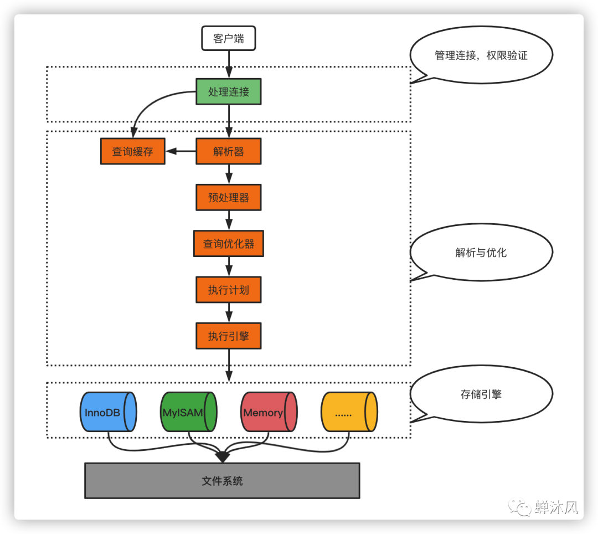
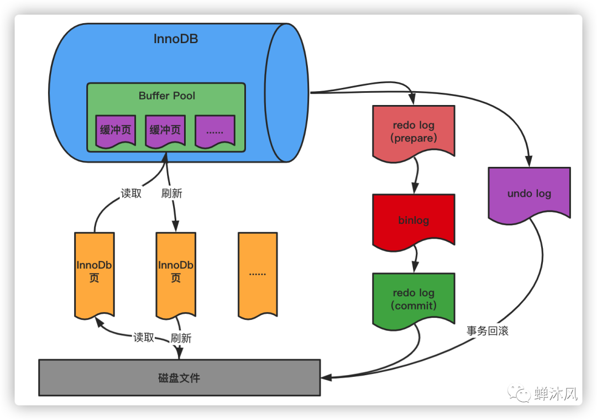

- [图解一条更新SQL语句的执行过程](https://mp.weixin.qq.com/s/AoQkWleStNSl-_zN-9bUTw)
- [图解一条 SQL 的执行过程](https://mp.weixin.qq.com/s/J-jxGhIDFOs1XMNkaY1tEQ)

今天跟大家聊一聊一条SQL更新语句的执行流程，让大家清楚地明白：

- 什么是InnoDB页？缓存页又是什么？为什么这么设计？
- 什么是表空间？不同存储引擎的表在文件系统的底层表示上有什么区别？
- Buffer Pool是什么？为什么需要？有哪些我们需要掌握的细节？
- MySQL的三种日志文件redo日志、undo日志、binlog分别是什么？为什么需要这么多种类型的日志？

正文开始！

---

之前我们讲过了[一条SQL查询语句是如何执行的](https://mp.weixin.qq.com/s/J-jxGhIDFOs1XMNkaY1tEQ)，那么插入（INSERT）、更新（UPDATE）和删除（DELETE）操作的流程又是什么样子呢？

其实对于MySQL而言，只有两种通常意义的操作，一种是Query（查询），另一种是Update（更新），后者包含了我们平常使用的INSERT、UPDATE和DELETE操作。

那么MySQL的更新流程和查询流程有什么区别呢？

其实基本的流程是一致的，也要经过**处理连接**、**解析优化**、**存储引擎**几个步骤。主要区别在更新操作涉及到了MySQL更多的细节。



> **注：** 我们接下来的所有描述，针对的都是InnoDB存储引擎，如果涉及到其他存储引擎，将会特殊说明

## 1. 一些需要知道的概念
对于MySQL任何存储引擎来说，数据都是存储在磁盘中的，存储引擎要操作数据，必须先把磁盘中的数据加载到内存中才可以。

那么问题来了，一次性从磁盘中加载多少数据到内存中合适呢？当获取记录时，InnoDB存储引擎需要一条条地把记录从磁盘中读取出来吗？

当然不行！我们知道磁盘的读写速度和内存读写速度差了几个数量级，如果我们需要读取的数据恰好运行在磁盘的不同位置，那就意味着会产生多次I/O操作。

因此，无论是操作系统也好，MySQL存储引擎也罢，都有一个预读取的概念。概念的依据便是统治计算机界的局部性原理。

> 空间局部性：如果当前数据是正在被使用的，那么与该数据空间地址临近的其他数据在未来有更大的可能性被使用到，因此可以优先加载到寄存器或主存中提高效率

就是当磁盘上的一块数据被读取的时候，我们干脆多读一点，而不是用多少读多少。

### 1.1 InnoDB页
InnoDB存储引擎将数据划分为若干个页，以页作为磁盘和内存之间交互的最小单位。InnoDB中页的大小默认为16KB。也就是默认情况下，一次最少从磁盘中读取16KB的数据到内存中，一次最少把内存中16KB的内容刷新到磁盘上。


对于InnoDB存储引擎而言，所有的数据（存储用户数据的索引、各种元数据、系统数据）都是以页的形式进行存储的。

### 1.2 表空间
为了更好地管理页，MySQL又设计了「表空间」的概念。表空间又有很多类型，具体类型我们不需要知道，我们只需要知道，一个表空间可以划分成很多个InnoDB页，InnoDB表数据都存储在某个表空间的页中。

为了方便我们定位，MySQL贴心地为表空间设计了一个唯一标识——表空间ID（space ID）。同理，InnoDB页也有自己的唯一编号——页号（page number）。

因此，我们可以这么认为。给定表空间ID和页号以及页的偏移量，我们就可以定位到InnoDB页的某条记录，也就是数据库表的某条记录。

#### 1.2.1 数据表在文件系统中的表示
为了更好地让大家理解这个抽象的概念，我创建了名为test的数据库，在其下分别创建了3张表t_user_innodb，t_user_myisam，t_user_memory，对应的存储引擎分别为InnoDB、MyISAM、MEMORY。

进入MySQL的数据目录，找到test目录，看一下test数据库下所有表对应的本地文件目录

```shell
drwxr-x--- 2 mysql mysql  4096 Jan 26 09:28 .
drwxrwxrwt 6 mysql mysql  4096 Jan 26 09:24 ..
-rw-r----- 1 mysql mysql    67 Jan 26 09:24 db.opt
-rw-r----- 1 mysql mysql  8556 Jan 26 09:28 t_user_innodb.frm
-rw-r----- 1 mysql mysql 98304 Jan 26 09:28 t_user_innodb.ibd
-rw-r----- 1 mysql mysql  8556 Jan 26 09:27 t_user_memory.frm
-rw-r----- 1 mysql mysql     0 Jan 26 09:28 t_user_myisam.MYD
-rw-r----- 1 mysql mysql  1024 Jan 26 09:28 t_user_myisam.MYI
-rw-r----- 1 mysql mysql  8556 Jan 26 09:28 t_user_myisam.frm
```

#### 1.2.2 InnoDB是如何存储表数据的
「表空间」是InnoDB存储引擎独有的概念。

我们看到t_user_innodb表在数据库对应的test目录下会生成以下两个文件

- t_user_innodb.frm
- t_user_innodb.ibd

其中，t_user_innodb.ibd就是t_user_innodb表对应的表空间在文件系统上的表示；t_user_innodb.frm用来描述表的结构，如表有哪些列，列的类型是什么等。

### 1.2.3 MyISAM是如何存储表数据的
和InnoDB不同，MyISAM没有表空间的概念，表的数据和索引全都直接存放在对应的数据库子目录下，可以看到t_user_myisam对应了三个文件

- t_user_myisam.MYD
- t_user_myisam.MYI
- t_user_myisam.frm

其中，t_user_myisam.MYD表示表的数据文件，也就是我们实际看到的数据表的内容；t_user_myisam.MYI表示表的索引文件，为该表创建的索引都会存放在这个文件中；t_user_myisam.frm用来描述表的结构。

### 1.2.4 MEMORY是如何存储表数据的
MEMORY存储引擎对应的数据表只有一个描述表结构的文件t_user_memory.frm。

## 2. 缓冲池Buffer Pool
为了更好的利用局部性原理带给我们的优势，InnoDB在处理客户端请求时，如果需要访问某个页的数据，会把该数据所在的页的全部数据加载到内存中。哪怕是只需要访问一个页中的一条数据，也需要加载整个页。

从磁盘中加载数据到内存中的操作太昂贵了！有什么办法可以提高数据操作的效率呢？缓存！

为了缓存磁盘的页，InnoDB在MySQL服务器启动时会向操作系统申请一片连续的内存区域，这片内存区域就是Buffer Pool。

很容易理解，为了更好地缓存页数据，Buffer Pool对应的一片连续内存空间也被划分为若干个页，而且默认情况下，Buffer Pool页的大小和InnoDB页大小一样，都是16KB。为了区分两种不同的页，我们将Buffer Pool中的页面称为缓冲页。


读取数据的时候，InnoDB先判断数据是否在Buffer Pool中，如果是，则直接读取数据进行操作，不用再次从磁盘加载；如果不是，则从磁盘加载到Buffer Pool中，然后读取数据进行操作。

修改数据的时候，也是将数据先写到Buffer Pool缓冲页中，而不是每次更新操作都直接写入磁盘。当缓冲页中的数据和磁盘文件不一致的时候，缓冲页被称为脏页。

那么脏页是什么时候被同步到磁盘呢？

InnoDB中有专门的后台线程每隔一段时间会把脏页的多个修改刷新到磁盘上，这个动作叫做「刷脏」。

## 3. redo日志
### 3.1 为什么需要redo日志
不定时刷脏又带来一个问题。如果脏页的数据还没有刷新到磁盘上，此时数据库突然宕机或重启，这些数据就会丢失。

首先想到的最简单粗暴的解决方案就是在事务提交之前，把该事务修改的所有页面都刷新到磁盘。但是上文说过，页是内存和磁盘交互的最小单位，如果只修改了1个字节，却要刷新16KB的数据到磁盘上，不得不说太浪费了，此路不通！

所以，必须要有一个持久化的措施。

为了解决这个问题，InnoDB把对所有页的更新操作（再强调一遍，包含INSERT、UPDATE、DELETE）专门写入一个日志文件。

当有未同步到磁盘中的数据时，数据库在启动的时候，会根据这个日志文件进行数据恢复。我们常说的关系型数据库的ACID特性中的D（持久性），就是通过这个日志来实现的。

这个日志文件就是大名鼎鼎的redo日志。

> 「re」在英文中的词根含义是“重新”，redo就是「重新做」的意思，顾名思义就是MySQL根据这个日志文件重新进行操作


这就出现了一个有意思的问题，刷新磁盘和写redo日志都是进行磁盘操作，为什么不直接把数据刷新到磁盘中呢？

### 3.2 磁道寻址
我们需要稍微了解一下磁道寻址的过程。磁盘的构造如下图所示。


每个硬盘都有若干个盘片，上图的硬盘有4个盘片。

每个盘片的盘面上有一圈圈的同心圆，叫做「磁道」。

从圆心向外画直线，可以将磁道划分为若干个弧段，每个磁道上一个弧段被称之为一个「扇区」（右上图白色部分）。数据是保存在扇区当中的，扇区是硬盘读写的最小单元，如果要读写数据，必须找到对应的扇区，这个过程叫做「寻址」。

#### 3.2.1 随机I/O
如果我们需要的数据是随机分散在磁盘上不同盘片的不同扇区中，那么找到相应的数据需要等到磁臂旋转到指定的盘片然后继续寻找对应的扇区，才能找到我们所需要的一块数据，持续进行此过程直到找完所有数据，这个就是随机I/O，读取数据速度非常慢。

#### 3.2.2 顺序I/O
假设我们已经找到了第一块数据，并且其他所需的数据就在这一块数据之后，那么就不需要重新寻址，可以依次拿到我们所需的数据，这个就叫顺序 I/O。

现在回答之前的问题。因为刷脏是随机I/O，而记录日志是顺序I/O（连续写的），顺序I/O效率更高，本质上是数据集中存储和分散存储的区别。因此先把修改写入日志文件，在保证了内存数据的安全性的情况下，可以延迟刷盘时机，进而提升系统吞吐。

### 3.3 redo日志的系统变量
redo日志位于MySQL数据目录下，默认有ib_logfile0和ib_logfile1两个文件，如下图所示。


可以发现，两个redo日志文件的大小都是50331648，默认48MB。为什么这个大小是固定的呢？因为如果我们要使用顺序I/O，就必须在申请磁盘空间的时候一次性决定申请的空间大小，这样才能保证申请的磁盘空间在地址上的连续性。

这也就决定了redo日志的旧数据会被覆盖，一旦文件被写满，就会触发Buffer Pool脏页到磁盘的同步，以腾出额外空间记录后面的修改。

可以通过以下指令查看redo日志的系统属性。

```shell
mysql> show variables like 'innodb_log%';
+-----------------------------+----------+
| Variable_name               | Value    |
+-----------------------------+----------+
| innodb_log_buffer_size      | 16777216 |
| innodb_log_checksums        | ON       |
| innodb_log_compressed_pages | ON       |
| innodb_log_file_size        | 50331648 |
| innodb_log_files_in_group   | 2        |
| innodb_log_group_home_dir   | ./       |
| innodb_log_write_ahead_size | 8192     |
+-----------------------------+----------+
```

| 参数名称                  | 含义                                                |
| ------------------------- | --------------------------------------------------- |
| innodb_log_file_size      | 指定每个redo日志文件的大小，默认48MB                |
| innodb_log_files_in_group | 指定redo日志文件的数量，默认2                       |
| innodb_log_group_home_dir | 指定redo文件的路径，如果不指定，则默认为datadir目录 |

介绍到这里，读者朋友可以发现，我们刚才探索的是如何让已经提交的事务保持持久化，但是如果某些事务偏偏在执行到一半的时候出现问题怎么办？

事务的原子性要求事务中的所有操作要么都成功，要么都失败，不允许存在中间状态。就好比我在写这篇文章的时候，会时不时地敲一下ctrl+Z返回到上一步或者过去好几步之前的状态，MySQL也需要“留一手”，把事务回滚时需要的东西都记录下来。

比如，插入数据的时候，至少应该把新增的这条记录的主键的值记录下来，这样回滚的时候只要把这个主键值对应的记录删除就可以了。

MySQL又一个鼎鼎大名的日志——undo日志，正式登场！

## 4. undo日志
undo log（撤销日志或回滚日志）记录了事务发生之前的数据状态，分为insert undo log和update undo log。

如果修改数据时出现异常，可以用 undo log来实现回滚操作（保持原子性）。可以理解为undo日志记录的是反向的操作，比如INSERT操作会记录DELETE，UPDATE会记录UPDATE之前的值，和redo日志记录在哪个物理页面做了什么操作不同，所以这是一种逻辑格式的日志。

undo日志和redo日志与事务密切相关，被统称为「事务日志」。


> 关于undo日志，我们目前只需要了解这么多即可

## 5. SQL更新语句的执行总结——初版
有了事务日志之后，我们来简单总结一下更新操作的流程，这是一个简化的过程。

name 原值是chanmufeng。
```sql
update t_user_innodb set name ='chanmufeng1994' where id = 1;
```

- 事务开始，从内存（Buffer Pool）或磁盘取到包含这条数据的数据页，返回给 Server 的执行器；
- Server 的执行器修改数据页的这一行数据的值为 chanmufeng1994；
- 记录 name=chanmufeng 到undo log；
- 记录 name=chanmufeng1994到redo log；
- 调用存储引擎接口，记录数据页到Buffer Pool（修改 name=penyuyan）；
- 事务提交。

## 6. binlog日志
之前我们讲过，从MySQL整体架构来看，其实可以分成两部分

- **Server 层**，它主要做的是 MySQL功能层面的事情，比如处理连接、解析优化等；
- **存储引擎层**，负责存储相关的具体事宜。
redo日志是InnoDB存储引擎特有的日志，而Server层也有自己的日志，称为 binlog（归档日志），它可以被所有存储引擎使用。

### 6.1 为什么有了redo日志还需要 binlog？
我想你可能会问出这个问题，实际上，更准确的问法是为什么有了binlog还需要有redo日志？主要有以下几个原因。

1. 因为最开始MySQL里并没有InnoDB存储引擎。MySQL自带的引擎是MyISAM，但是 MyISAM没有崩溃恢复的能力，InnoDB后来以插件的形式被引入，顺便带来了redo日志；

2. binlog日志是用来归档的，binlog以事件的形式记录了所有的 DDL和 DML 语句（因为它记录的是操作而不是 数据值，属于逻辑日志），但是不具备宕机恢复的功能，因为可能没有来得及刷新脏页，造成脏页数据的丢失，而这些操作也没有保存到binlog中从而造成数据丢失；

3. binlog记录的是关于一个事务的具体操作内容，即该日志是逻辑日志。而redo日志记录的是关于每个页的更改的物理情况。功能压根不是一回事儿。

### 6.2 binlog日志的作用
#### 6.2.1 主从复制
binlog是实现MySQL主从复制功能的核心组件。

master节点会将所有的写操作记录到binlog中，slave节点会有专门的I/O线程读取master节点的binlog，将写操作同步到当前所在的slave节点。


#### 6.2.2 数据恢复
假如你在阅读这篇文章的时候觉得我写得实在太好，拍案叫绝的时候一不小心把公司的数据库给删了，你该怎么做才能恢复到你删库之前的那个时刻的状态？

这个时候就要用到binlog了，前提是binlog没有被删除，否则，神仙也救不了你了。

通常情况下，公司会定期对数据库进行全量备份，可能隔一个月，一周，甚至可能每天都备份一次。运气好的话你可以使用前一天的全量备份，恢复到前一天的某时刻状态（或者一周、一月之前），然后从全量备份的时刻开始，从binlog中提取该时刻之后（前提是你的binlog里面存放了这段时间的日志）的所有写操作（当然，你得过滤掉你的删库操作），然后进行操作回放就可以了。

是不是很简单？

问题又来了。再看一眼我们的更新语句。
```shell
update t_user_innodb set name ='chanmufeng1994' where id = 1;
```

假如这条更新语句已经被写入到了redo日志，还没来得及写binlog的时候，MySQL宕机重启了，我们看一下会发生什么。

因为redo日志可以在重启的时候用于恢复数据，所以写入磁盘的是chanmufeng1994。但是binlog里面没有记录这个逻辑日志，所以这时候用binlog去恢复数据或者同步到从库，就会出现数据不一致的情况。

所以在写两个日志的情况下，就类似于「分布式事务」的情况，如果你不清楚分布式事务是个什么东西也没关系，我在之后的文章会介绍到。能够明确的就是redo日志和binlog日志如果单纯依次进行提交是无法保证两种日志都写成功或者都写失败的。

我们需要「两阶段提交」。

### 6.3 两阶段提交
两阶段提交不是MySQL的专利，两阶段提交是一种跨系统维持数据逻辑一致性的常见方案，尤其在分布式事务上，所以请读者重点体会思想

我们把redo日志的提交分成两步，两步中redo日志的状态分别是prepare和commit。步骤如下

1. InnoDB存储引擎将更改更新到内存中后，同时将这个更新操作记录到redo日志里面，此时redo日志处于prepare状态；

2. 执行器生成这个操作的binlog，并将binlog刷盘；

3. 执行器调用InnoDB的提交事务接口，InnoDB把刚刚写入的redo日志改成commit状态。至此，所有操作完成。



加上两阶段提交之后我们再来看一下SQL更新语句的执行流程。

## 7. SQL更新语句的执行总结——终版


- 客户端发送更新命令到MySQL服务器，经过处理连接、解析优化等步骤；
- Server层向InnoDB存储引擎要id=1的这条记录；
- 存储引擎先从缓存中查找这条记录，有的话直接返回，没有则从磁盘加载到缓存中然后返回；
- Server层执行器修改这条记录的name字段值；
- 存储引擎更新修改到内存中；
- 存储引擎记录redo日志，并将状态设置为prepare状态；
- 存储引擎通知执行器，修改完毕，可以进行事务提交；
- Server先写了个binlog；
- Server提交事务；
- 存储引擎将redo日志中和当前事务相关的记录状态设置为commit状态。

好了，本文就到这里，如果你觉得有点收获，欢迎点赞、在看、收藏、转发分享给其他需要的人，非常地感谢！

## 参考资料
- MySQL实战45讲
- MySQL是怎样运行的
