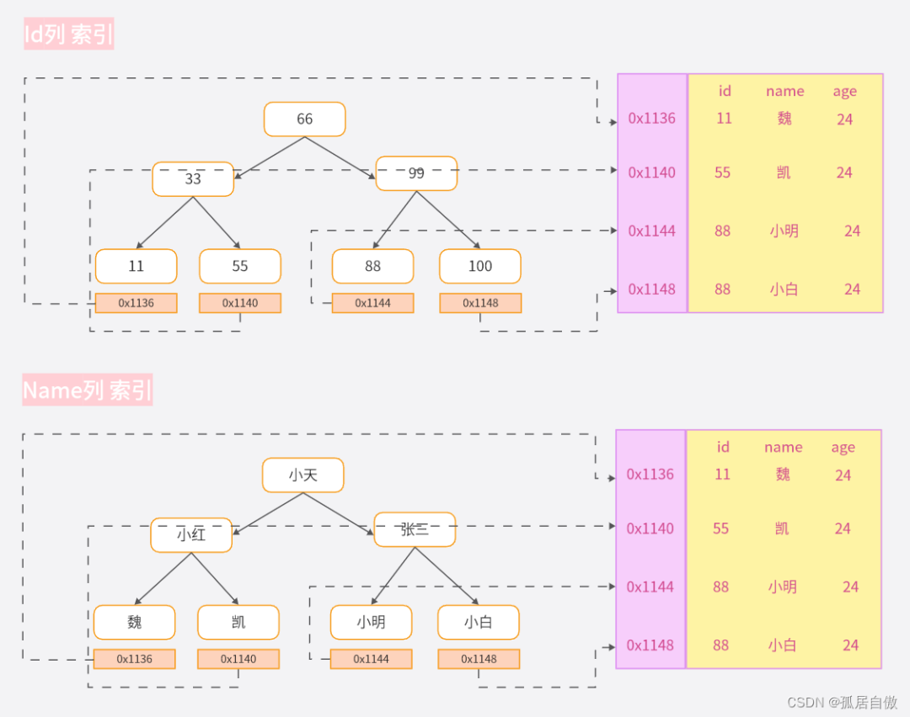
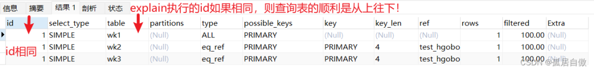
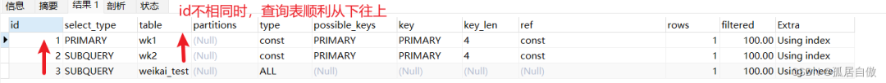
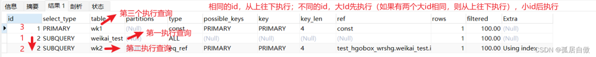
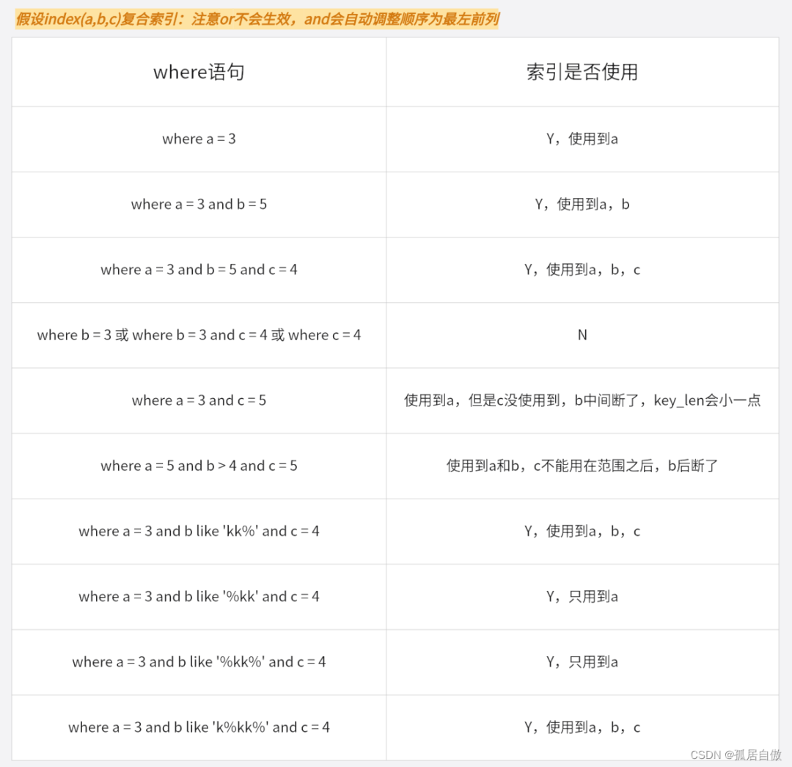
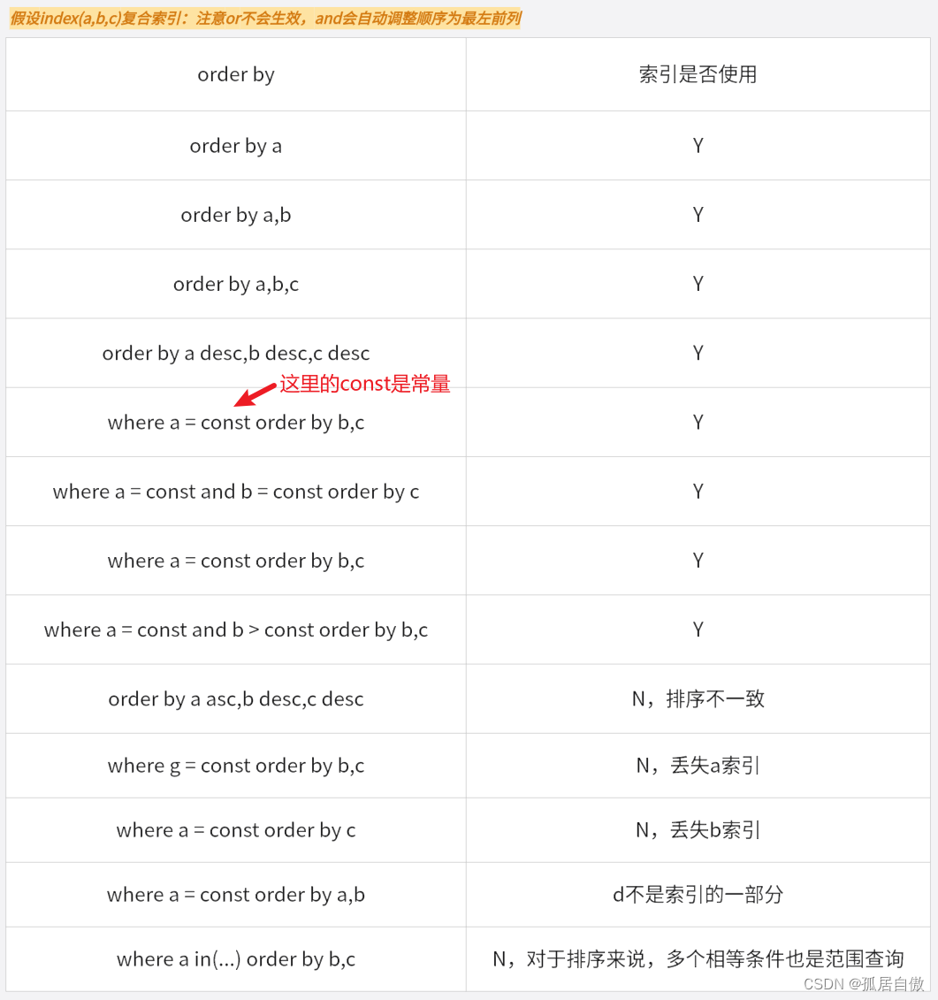
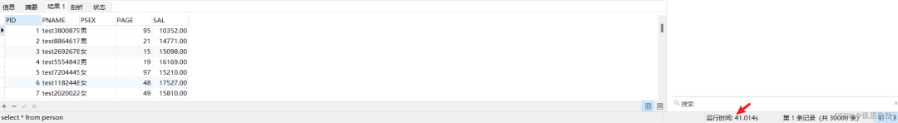
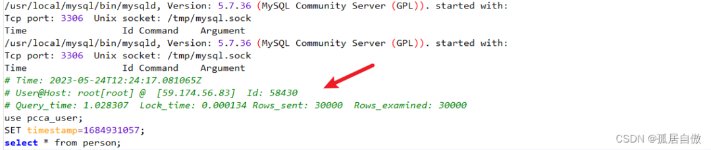

- [Mysql进阶之索引优化](https://blog.csdn.net/qq_43372633/article/details/130846879)
- [MySQL高级进阶：索引优化](https://mp.weixin.qq.com/s/LPtfy7jSd5Hiy-QFloj4QA)

## 一. 索引介绍
### 1.1 什么是Mysql索引
- MySQL官方对于索引的定义：索引是帮助MySQL高效获取数据的数据结构。
- MySQL在存储数据之外，数据库系统中还维护着满足特定查找算法的数据结构，这些数据结构以某种引用(指向)表中的数据，这样我们就可以通过数据结构上实现的高级查找算法来快速找到我们想要的数据。而这种数据结构就是索引。
- 简单理解为“排好序的可以快速查找数据的数据结构”。

### 1.2 索引数据结构
下图是二叉树的索引方式：



二叉树数据结构的弊端：当极端情况下，数据递增插入时，会一直向右插入，形成链表，查询效率会降低。
MySQL中常用的的索引数据结构有BTree索引(Myisam普通索引)，B+Tree索引（Innodb普通索引），Hash索引(memory存储引擎)等等。

### 1.3 索引优势
- 提高数据检索的效率，降低数据库的IO成本。
- 通过索引对数据进行排序，降低数据排序的成本，降低了CPU的消耗。

### 1.4 索引劣势
- 索引实际上也是一张表，保存了主键和索引的字段，并且指向实体表的记录，所以索引也是需要占用空间的。
- 在索引大大提高查询速度的同时，却会降低表的更新速度，在对表进行数据增删改的同时，MySQL不仅要更新数据，还需要保存一下索引文件。
- 每次更新添加了的索引列的字段，都会去调整因为更新带来的减值变化后的索引的信息。

### 1.5 索引使用场景
哪些情况需要创建索引：

- 主键自动建立唯一索引
- 频繁作为查询条件的字段应该创建索引(where 后面的语句)
- 查询中与其它表关联的字段，外键关系建立索引
- 多字段查询下倾向创建组合索引
- 查询中排序的字段，排序字段若通过索引去访问将大大提高排序速度
- 查询中统计或者分组字段

哪些情况不推荐建立索引:

- 表记录太少
- 经常增删改的表
- Where条件里用不到的字段不建立索引

## 二. 索引分类
### 2.1 主键索引
表中的列设定为主键后，数据库会自动建立主键索引。

单独创建和删除主键索引语法：

- 创建主键索引语法：alter table 表名 add primary key (字段);
- 删除主键索引语法：alter table 表名 drop primary key;

### 2.2 唯一索引
表中的列创建了唯一约束时，数据库会自动建立唯一索引。

单独创建和删除唯一索引语法：

- 创建唯一索引语法：alter table 表名 add unique 索引名(字段)；
- 删除唯一索引语法：drop index 索引名 on 表名;

### 2.3 单值索引
即一个索引只包含单个列，一个表可以有多个单值索引。

建表时可随表一起建立单值索引

单独创建和删除单值索引语法：

- 创建单值索引：alter table 表名 add index 索引名(字段);
- 删除单值索引：drop index 索引名 on 表名;

### 2.4 复合索引
即一个索引包含多个列。

建表时可随表一起建立复合索引

单独创建和删除复合索引语法：

- 创建复合索引：alter table 表名 add index 索引名(字段,字段2);
- 删除复合索引：drop index 索引名 on 表名;

## 三. 性能分析
### 3.1 MySQL常见瓶颈
SQL中对大量数据进行比较、关联、排序、分组时CPU的瓶颈。
实例内存满足不了缓存数据或排序等需要，导致产生大量的物理IO。查询数据时扫描过多数据行，导致查询效率低。

### 3.2 Explain
使用EXPLAIN关键字可以模拟优化器执行SQL查询语句，从而知道MYSQL是如何处理SQL语句的。可以用来分析查询语句或是表的结构的性能瓶颈。其作用:

- 表的读取顺序
- 哪些索引可以使用
- 数据读取操作的操作类型
- 那些索引被实际使用
- 表之间的引用
- 每张表有多少行被优化器查询

EXPLAIN关键字使用起来比较简单：explain + SQL语句：

| id  | select_type | table | partitions | type | possible_keys | key | key_len | ref | rows | filtered | Extra |
| --- | ----------- | ----- | ---------- | ---- | ------------- | --- | ------- | --- | ---- | -------- | ----- |

### 3.3 Explain重要字段名
建表语句：
```sql
CREATE TABLE wk1(
 id INT(10) AUTO_INCREMENT,
 name VARCHAR(100),  
 PRIMARY KEY (id)
);
CREATE TABLE wk2(
 id INT(10) AUTO_INCREMENT,
 name VARCHAR(100),
 PRIMARY KEY (id)
);
CREATE TABLE `weikai_test` (
  `id` int NOT NULL,
  `name` varchar(20) DEFAULT NULL,
  `sex` varchar(20) DEFAULT NULL
) ENGINE=InnoDB DEFAULT CHARSET=utf8;

-- 每张表中添加一条数据
INSERT INTO wk1(name) VALUES(CONCAT('wk1_',FLOOR(1+RAND()*1000)));

INSERT INTO wk2(content) VALUES(CONCAT('wk2_',FLOOR(1+RAND()*1000)));

INSERT INTO weikai_test(`id`, `name`, `sex`) VALUES (1, '我', '男');
```

#### id字段介绍：

- select查询的序列号，表示查询中执行select子句或操作表的顺序。
- id相同时，执行顺序由上至下。
- id不同，如果是子查询，id的序号会递增，id值越大优先级越高，则先被执行。
- id相同和不同都存在时，id相同的可以理解为一组，从上往下顺序执行，所有组中，id值越大，优先级越高越先执行。

#### 代码演示：

```shell
#id相同时，执行顺序是从上往下
explain select * from wk1,wk2,wk3 where wk1.id=wk2.id and wk2.id = wk3.id;

#id不相同时，执行顺序是从下往上
explain SELECT wk1.id from wk1 WHERE id = (SELECT wk2.id FROM wk2 WHERE id = (SELECT weikai_test.id FROM weikai_test WHERE name = "我"))

#id相同和id不同
explain  SELECT * FROM wk1 WHERE id = (select wk2.id from wk2,(select * from weikai_test) s3 where s3.id = wk2.id);
```







#### select_type字段介绍：

查询的类型，常见值有：

- SIMPLE :简单的 select 查询,查询中不包含子查询或者UNION。
- PRIMARY:查询中若包含任何复杂的子部分，最外层查询则被标记为Primary。
- DERIVED:在FROM列表中包含的子查询被标记为DERIVED(衍生),MySQL会递归执行这些子查询, 把结果放在临时表里。(mysql5.7+过后)
- SUBQUERY: 在SELECT或WHERE列表中包含了子查询。

#### table字段介绍：

显示这一行的数据是关于哪张表的。
type字段介绍：

访问类型排序(从左往右索引效率越高)：
```shell
ALL -> INDEX -> RANGE -> REF -> EQ_REF -> CONST -> SYSTEM
```

- `System`：表只有一行记录（等于系统表），这是const类型的特列，平时不会出现，这个也可以忽略不计。
- `Const`：表示通过索引一次就找到了,const用于比较primary key或者unique索引。因为只匹配一行数据，所以很快，如将主键置于where列表中，MySQL就能将该查询转换为一个常量。
- `eq_ref`：唯一性索引扫描，对于每个索引键，表中只有一条记录与之匹配。常见于主键或唯一索引扫描。
- `ref`：非唯一性索引扫描，返回匹配某个单独值的所有行。本质上也是一种索引访问，它返回所有匹配某个单独值的行，然而，它可能会找到多个符合条件的行，所以他应该属于查找和扫描的混合体。
- `range`：只检索给定范围的行,使用一个索引来选择行。key 列显示使用了哪个索引 一般就是在你的where语句中出现了`between`、`<`、`>`、`in`等的查询这种范围扫描索引扫描比全表扫描要好，因为它只需要开始于索引的某一点，而结束语另一点，不用扫描全部索引。
- `Index`：Full Index Scan，index与ALL区别为index类型只遍历索引树。这通常比ALL快，因为索引文件通常比数据文件小。也就是说虽然all和Index都是读全表，但index是从索引中读取的，而all是从硬盘中读的。
- `all`：Full Table Scan，将遍历全表以找到匹配的行。

从最好到最差依次是: `system > const > eq_ref > ref > range > index > All` 。一般来说，最好保证查询能达到range级别，最好能达到ref。

#### possible_keys字段介绍：

- 显示可能应用在这张表中的索引，一个或多个。查询涉及到的字段上如果存在索引，则该索引将会被列出来，但不一定会被查询实际使用上。

#### key字段介绍：

- 查询中实际使用的索引，如果为NULL，则没有使用索引。

#### key_len字段介绍：

- 查询中实际使用索引的性能，越大越好。

#### ref字段介绍：

- 显示索引的哪一列被使用了。哪些列或常量被用于查找索引列上的值。

#### rows字段介绍：

- rows列显示MySQL认为它执行查询时必须检查的行数。一般越少越好。

#### extra字段介绍：

一些常见的重要的额外信息：

- Using filesort：MySQL无法利用索引完成的排序操作称为“文件排序”。
- Using temporary：Mysql在对查询结果排序时使用临时表，常见于排序order by和分组查询group by。
- Using index：表示索引被用来执行索引键值的查找，避免访问了表的数据行，效率不错。
- Using where：表示使用了where过滤。
尽量避免Using filesort!

## 四. 查询优化
### 4.1 索引失效
- 最佳左前缀法则：如果索引了多列，要遵循最左前缀法则，指的是查询从索引的最左前列开始并且不跳过索引中的列。
- 不在索引列上做任何计算、函数操作，会导致索引失效而转向全表扫描。
- 存储引擎不能使用索引中范围条件右边的列。
- Mysql在使用不等于时无法使用索引会导致全表扫描。
- is null可以使用索引，但是is not null无法使用索引。
- like以通配符开头会使索引失效导致全表扫描。
- 字符串不加单引号索引会失效。
- 使用or连接时索引失效。

代码演示：
```sql
drop table if exists students;
CREATE TABLE students (
  id INT PRIMARY KEY AUTO_INCREMENT COMMENT "主键id",
  sname VARCHAR (24) COMMENT '学生姓名',
  age INT COMMENT '年龄',
  score INT COMMENT '分数',
 time TIMESTAMP COMMENT '入学时间'
);
 
INSERT INTO students(sname,age,score,time) VALUES('小明',22,100,now());
INSERT INTO students(sname,age,score,time) VALUES('小红',23,80,now());
INSERT INTO students(sname,age,score,time) VALUES('小绿',24,80,now());
INSERT INTO students(sname,age,score,time) VALUES('黑',23,70,now());

-- 添加复合索引
alter table students add index idx_sname_age_score(sname,age,score);

-- 索引失效情况
explain select * from students where sname="小明" and age = 22 and score = 100;
explain select * from students where sname="小明" and age = 22;
explain select * from students where sname="小明";
explain select * from students where sname="小明" and score = 80;
-- 不在索引列上做任何计算、函数操作，会导致索引失效而转向全表扫描。
explain select * from students where left(sname,2) = "小明";
-- 存储引擎不能使用索引中范围条件右边的列。
explain select * from students where sname="小明" and age > 22 and score = 100;
-- Mysql在使用不等于时无法使用索引会导致全表扫描。
explain select * from students where sname!="小明";
-- is null可以使用索引，但是is not null无法使用索引。
explain select * from students where sname is not null;
-- like以通配符开头会使索引失效导致全表扫描。
explain select * from students where sname like "明%";
-- 字符串不加单引号索引会失效。
explain select * from students where sname = 123;
-- 使用or连接时索引失效。
explain select * from students where sname="小明" or age = 22;
```

### 4.2 复合索引练习


### 4.3 单表查询优化
代码演示：
```sql
-- 单表查询优化
CREATE TABLE IF NOT EXISTS article (
id INT(10) PRIMARY KEY AUTO_INCREMENT,
author_id INT(10) NOT NULL,
category_id INT(10) NOT NULL,
views INT(10) NOT NULL,
comments INT(10) NOT NULL,
title VARBINARY(255) NOT NULL,
content TEXT NOT NULL
);
 
INSERT INTO article(author_id, category_id, views, comments, title, content) VALUES
(1, 1, 1, 1, '1', '1'),
(2, 2, 2, 2, '2', '2'),
(1, 1, 3, 3, '3', '3');


-- 1. 查询category_id为1的，且comments大于1的情况下，views最多的id和author_id的信息
explain select id,author_id 
from article
where category_id=1 and comments>1 order by views desc limit 1;

-- 2. 建立索引
alter table article add index idx_ccv(category_id,comments,views);

-- 3. 再次测试
explain select id,author_id 
from article
where category_id=1 and comments>1 order by views desc limit 1;

-- 4. 重新创建索引 这里保证两个索引之间没有其他的索引列 使key_len效率最高
drop index idx_ccv on article;
alter table article add index idx_cv(category_id,views);

-- 5. 再次测试
explain select id,author_id 
from article
where category_id=1 and comments>1 order by views desc limit 1;
```

### 4.4 关联查询优化
内连接时，mysql会自动把小结果集的选为驱动表，所以大表的字段最好加上索引。左外连接时，左表会全表扫描，所以右边大表字段最好加上索引，右外连接同理。我们最好保证被驱动表上的字段建立了索引。

### 4.5 排序优化
- 尽量避免使用Using FileSort方式排序。
- order by语句使用索引最左前列或使用where子句与order by子句条件组合满足索引最左前列。
- where子句中如果出现索引范围查询会导致order by索引失效。



### 4.6 分组优化
代码演示：
```sql
drop table if exists students;
CREATE TABLE students (
  id INT PRIMARY KEY AUTO_INCREMENT COMMENT "主键id",
  sname VARCHAR (24) COMMENT '学生姓名',
  age INT COMMENT '年龄',
  score INT COMMENT '分数',
 time TIMESTAMP COMMENT '入学时间'
);
 
INSERT INTO students(sname,age,score,time) VALUES('小明',22,100,now());
INSERT INTO students(sname,age,score,time) VALUES('小红',23,80,now());
INSERT INTO students(sname,age,score,time) VALUES('小绿',24,80,now());
INSERT INTO students(sname,age,score,time) VALUES('黑',23,70,now());

-- 分组优化
alter table students add index idx_sas(sname,age,score);
explain select count(*),sname 
from students 
where sname="小明" and age > 22
GROUP BY score;
```

### 4.7 慢查询日志
介绍：MySQL的慢查询日志是MySQL提供的一种日志记录，他用来记录在MySQL中响应时间超过阀值的语句，具体指运行时间超过long_query_time值的SQL，则会被记录到慢查询日志中。可以由它来查看哪些SQL超出了我们最大忍耐时间值。

默认情况下，MySQL数据库没有开启慢查询日志，需要手动设置参数：

- 查看是否开启：`show variables like '%slow_query_log%';`
- 开启日志：`set global slow_query_log = 1;`
- 设置时间: `set global long_query_time = 1;`
- 查看时间: `SHOW VARIABLES LIKE 'long_query_time%';`
- 查看超时的sql记录日志：Mysql的数据文件夹下`/data/...-slow.log;` 在Navicat中输入`show variables like '%slow_query_log%`命令，就可以得到文件目录;

代码演示：
```sql
-- 建表语句
DROP TABLE IF EXISTS person;
CREATE TABLE person  (
  PID int(11) AUTO_INCREMENT COMMENT '编号',
  PNAME varchar(50) COMMENT '姓名',
  PSEX varchar(10) COMMENT '性别',
 PAGE int(11) COMMENT '年龄',
  SAL decimal(7, 2) COMMENT '工资',
  PRIMARY KEY (PID)
);
-- 创建存储过程
create procedure insert_person(in max_num int(10))
begin
 declare i int default 0;
 set autocommit = 0; 
 repeat
 set i = i +1;
 insert into person (PID,PNAME,PSEX,PAGE,SAL) values (i,concat('test',floor(rand()*10000000)),IF(RAND()>0.5,'男','女'),FLOOR((RAND()*100)+10),FLOOR((RAND()*19000)+1000));
 until i = max_num
 end repeat;
 commit;
end;
-- 调用存储过程
call insert_person(30000);

-- 慢查询日志
-- 查看是否开启：show variables like '%slow_query_log%';
show variables like '%slow_query_log%';
-- 开启日志：set global slow_query_log = 1;
set global slow_query_log = 1;
-- 设置时间: set global long_query_time = 1;
set global long_query_time = 3;
-- 查看时间: SHOW VARIABLES LIKE 'long_query_time%';
SHOW VARIABLES LIKE 'long_query_time%';

select * from person;
```
结果：




注意：非调优场景下，一般不建议启动改参数，慢查询日志支持将日志记录写入文件，开启慢查询日志会或多或少带来一定的性能影响。