- [Netty如何做到单机百万并发？](https://mp.weixin.qq.com/s/SbaTric6zLs0wL_o46nHQA)

说到Netty，我们知道他极其强悍的性能以及纯异步模型，释放出了极强的生产力，内置的各种编解码编排，心跳包检测，粘包拆包处理等，高效且易于使用，以至于很多耳熟能详的组件都在使用，比如`hadoop`，`dubbo`等。但是他是如何做到这些的呢？本章将会以庖丁解牛的方式，一步一步的来拔出此剑。

## Netty的异步模型

说起netty的异步模型，我相信大多数人，只要是写过服务端的话，都是耳熟能详的，`bossGroup`和`workerGroup`被`ServerBootstrap`所驱动，用起来简直是如虎添翼，再加上各种配置化的`handler`加持，组装起来也是行云流水，俯拾即是。但是，任何一个好的架构，都不是一蹴而就实现的，那她经历了怎样的心路历程呢？

### 1. 经典的多线程模型

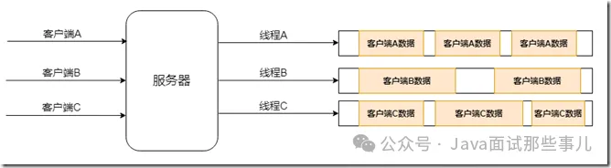

此模型中，服务端起来后，客户端连接到服务端，服务端会为每个客户端开启一个线程来进行后续的读写操作。客户端少的时候，整体性能和功能还是可以的，但是如果客户端非常多的时候，线程的创建将会导致内存的急剧飙升从而导致服务端的性能下降，严重者会导致新客户端连接不上来，更有甚者，服务器直接宕机。此模型虽然简单，但是由于其简单粗暴，所以难堪大用，建议在写服务端的时候，要彻底的避免此种写法。

### 2. 经典的Reactor模型

由于多线程模型难堪大用，所以更好的模型一直在研究之中，`Reactor`模型，作为天选之子，也被引入了进来，由于其强大的基于事件处理的特性，使得其成为异步模型的不二之选，其起源可以参考这篇文章。

`Reactor`模型由于是基于事件处理的，所以一旦有事件被触发，将会派发到对应的`event handler`中进行处理。所以在此模型中，有两个最重要的参与者，列举如下：

- `Reactor`：主要用来将IO事件派发到相对应的`handler`中，可以将其想象为打电话时候的分发总机，你先打电话到总机号码，然后通过总机，你可以分拨到各个分机号码。

- `Handlers`：主要用来处理IO事件相关的具体业务，可以将其想象为拨通分机号码后，实际上为你处理事件的员工。

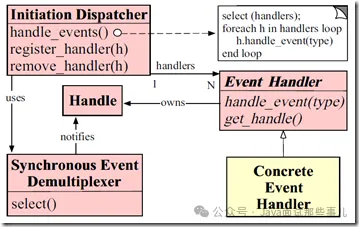

上图为`Reactor`模型的描述图，具体来说一下：

`Initiation Dispatcher`其实扮演的就是`Reactor`的角色，主要进行`Event Demultiplexer`，即事件派发。而其内部一般都有一个`Acceptor`，用于通过对系统资源的操纵来获取资源句柄，然后交由`Reactor`，通过`handle_events`方法派发至具体的`EventHandler`的。

`Synchronous Event Demultiplexer`其实就是`Acceptor`的角色，此角色内部通过调用系统的方法来进行资源操作，比如说，假如客户端连接上来，那么将会获得当前连接，假如需要删除文件，那么将会获得当前待操作的文件句柄等等。这些句柄实际上是要返回给`Reactor`的，然后经由`Reactor`派发下放给具体的`EventHandler`。

`Event Handler`这里，其实就是具体的事件操作了。其内部针对不同的业务逻辑，拥有不同的操作方法，比如说，鉴权`EventHandler`会检测传入的连接，验证其是否在白名单，心跳包`EventHanler`会检测管道是否空闲，业务`EventHandler`会进行具体的业务处理，编解码`EventHandler`会对当前连接传输的内容进行编码解码操作等等。

由于Netty是`Reactor`模型的具体实现，所以在编码的时候，我们可以非常清楚明白的理解`Reactor`的具体使用方式，这里暂时不讲，后面会提到。

由于Doug Lea写过一篇关于NIO的文章，整体总结的极好，所以这里我们就结合他的文章来详细分析一下`Reactor`模型的演化过程。

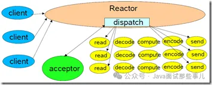

上图模型为单线程`Reator`模型，`Reactor`模型会利用给定的`selectionKeys`进行派发操作，派发到给定的`handler`，之后当有客户端连接上来的时候，`acceptor`会进行`accept`接收操作，之后将接收到的连接和之前派发的`handler`进行组合并启动。

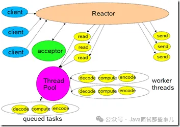

上图模型为池化Reactor模型，此模型将读操作和写操作解耦了出来，当有数据过来的时候，将`handler`的系列操作扔到线程池中来进行，极大的提到了整体的吞吐量和处理速度。

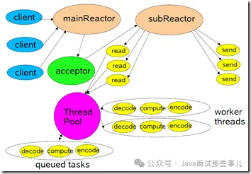

上图模型为多`Reactor`模型，此模型中，将原本单个`Reactor`一分为二，分别为`mainReactor`和`subReactor`，其中`mainReactor`主要进行客户端连接方面的处理，客户端`accept`后发送给`subReactor`进行后续处理处理。这种模型的好处就是整体职责更加明确，同时对于多CPU的机器，系统资源的利用更加高一些。

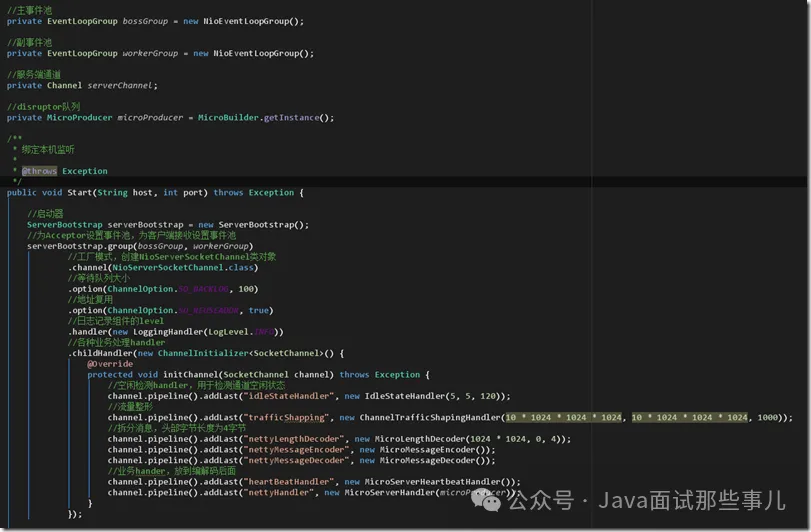

从netty写的`server`端，就可以看出，`boss worker group`对应的正是主副Reactor，之后`ServerBootstrap`进行`Reactor`的创建操作，里面的`group`, `channel`, `option`等进行初始化操作，而设置的`childHandler`则是具体的业务操作，其底层的事件分发器则通过调用linux系统级接口epoll来实现连接并将其传给`Reactor`。

## 石中剑Netty强悍的原理 （JNI）

netty之剑之所以锋利，不仅仅因为其纯异步的编排模型，避免了各种阻塞式的操作，同时其内部各种设计精良的组件，终成一统。且不说让人眼前一亮的缓冲池设计，读写标随心而动，摒弃了繁冗复杂的边界检测，用起来着实舒服之极；原生的流控和高低水位设计，让流速控制真的是随心所欲，铸就了一道相当坚固的护城河；齐全的粘包拆包处理方式，让每一笔数据都能够清晰明了；而高效的空闲检测机制，则让心跳包和断线重连等设计方案变得如此俯拾即是

上层的设计如此优秀，其性能又怎能甘居下风。由于底层通讯方式完全是C语言编写，然后利用JNI机制进行处理，所以整体的性能可以说是达到了原生C语言性能的强悍程度。说道JNI，这里我觉得有必要详细说一下，他是我们利用java直接调用c语言原生代码的关键。

JNI，全称为`Java Native Interface`，翻译过来就是java本地接口，他是java调用C语言的一套规范。具体来看看怎么做的吧。

步骤一，先来写一个简单的java调用函数：

```java
/**
 * @author shichaoyang
 * @Description: 数据同步器
 * @date 2020-10-14 19:41
 */
public class DataSynchronizer {
    /**
     * 加载本地底层C实现库
     */
    static {
        System.loadLibrary("synchronizer");
    }
    /**
     * 底层数据同步方法
     */
    private native String syncData(String status);
    /**
     * 程序启动，调用底层数据同步方法
     *
     * @param args
     */
    public static void main(String... args) {
        String rst = new DataSynchronizer().syncData("ProcessStep2");
        System.out.println("The execute result from C is : " + rst);
    }
}
```

可以看出，是一个非常简单的java类，此类中，`syncData`方法前面带了`native`修饰，代表此方法最终将会调用底层C语言实现。`main`方法是启动类，将C语言执行的结果接收并打印出来。

然后，打开我们的linux环境，这里由于我用的是`linux mint`，依次执行如下命令来设置环境：

1. 执行`apt install default-jdk` 安装java环境，安装完毕。
2. 通过`update-alternatives --list java` 获取java安装路径，这里为：`/usr/lib/jvm/java-11-openjdk-amd64`   
3. 设置java环境变量 `export JAVA_HOME=/usr/lib/jvm/java-11-openjdk-amd64`

环境设置完毕之后，就可以开始进行下一步了。

步骤二，编译

首先，进入到代码`DataSynchronizer.c`所在的目录，然后运行如下命令来编译java源码：
```shell
javac -h . DataSynchronizer.java
```

编译完毕之后，可以看到当前目录出现了如下几个文件：


其中`DataSynchronizer.h`是生成的头文件，这个文件尽量不要修改，整体内容如下：

```cpp
/* DO NOT EDIT THIS FILE - it is machine generated */
#include <jni.h>
/* Header for class DataSynchronizer */
#ifndef _Included_DataSynchronizer
#define _Included_DataSynchronizer
#ifdef __cplusplus
extern "C" {
#endif
/*
 * Class:     DataSynchronizer
 * Method:    syncData
 * Signature: (Ljava/lang/String;)Ljava/lang/String;
 */
JNIEXPORT jstring JNICALL Java_DataSynchronizer_syncData
  (JNIEnv *, jobject, jstring);
#ifdef __cplusplus
}
#endif
#endif
```

其中`JNIEXPORT jstring JNICALL Java_DataSynchronizer_syncData`方法，就是给我们生成的本地C语言方法，我们这里只需要创建一个C语言文件，名称为`DataSynchronizer.c`，将此头文件加载进来，实现此方法即可：

```cpp
#include <jni.h>
#include <stdio.h>
#include "DataSynchronizer.h"

JNIEXPORT jstring JNICALL Java_DataSynchronizer_syncData(JNIEnv *env, jobject obj, jstring str) {
   // Step 1: Convert the JNI String (jstring) into C-String (char*)
   const char *inCStr = (*env)->GetStringUTFChars(env, str, NULL);
   if (NULL == inCStr) {
        return NULL;
    }

   // Step 2: Perform its intended operations
   printf("In C, the received string is: %s\n", inCStr);
   (*env)->ReleaseStringUTFChars(env, str, inCStr);  // release resources

   // Prompt user for a C-string
   char outCStr[128];
   printf("Enter a String: ");
   scanf("%s", outCStr);

   // Step 3: Convert the C-string (char*) into JNI String (jstring) and return
   return (*env)->NewStringUTF(env, outCStr);
}
```

其中需要注意的是，`JNIEnv*`变量，实际上指的是当前的JNI环境。而`jobject`变量则类似`java`中的`this`关键字。`jstring`则是c语言层面上的字符串，相当于`java`中的`String`。整体对应如下

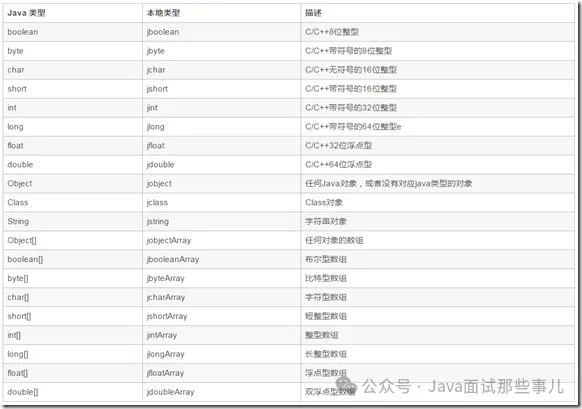

最后，我们来编译一下：

```shell
gcc -fPIC -I"$JAVA_HOME/include" -I"$JAVA_HOME/include/linux" -shared -o libsynchronizer.so DataSynchronizer.c
```

编译完毕后，可以看到当前目录下又多了一个`libsynchronizer.so`文件（这个文件类似windows上编译后生成的.dll类库文件）：


此时我们可以运行了，运行如下命令进行运行：

```shell
java -Djava.library.path=. DataSynchronizer
```

得到结果如下：

```shell
java -Djava.library.path=. DataSynchronizer
In C, the received string is: ProcessStep2
Enter a String: sdfsdf
The execute result from C is : sdfsdf
```

从这里看到，我们正确的通过java jni技术，调用了C语言底层的逻辑，然后获取到结果，打印了出来。在netty中，也是利用了jni的技术，然后通过调用底层的C语言逻辑实现，来实现高效的网络通讯的。感兴趣的同学可以扒拉下netty源码，在`transport-native-epoll`模块中，就可以见到具体的实现方法了。

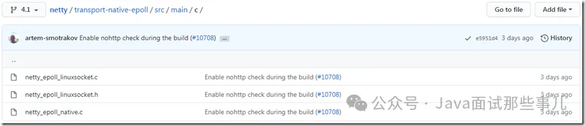

## IO多路复用模型

石中剑，之所以能荡平英格兰全境，自然有其最强悍的地方。相应的，Netty，则也是不遑多让，之所以能够被各大知名的组件所采用，自然也有其最强悍的地方，而本章节的IO多路复用模型，则是其强悍的理由之一。

在说IO多路复用模型之前，我们先来大致了解下Linux文件系统。在Linux系统中，不论是你的鼠标，键盘，还是打印机，甚至于连接到本机的socket client端，都是以文件描述符的形式存在于系统中，诸如此类，等等等等，所以可以这么说，一切皆文件。来看一下系统定义的文件描述符说明：

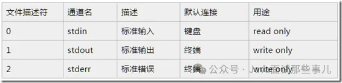

从上面的列表可以看到，文件描述符0,1,2都已经被系统占用了，当系统启动的时候，这三个描述符就存在了。其中0代表标准输入，1代表标准输出，2代表错误输出。当我们创建新的文件描述符的时候，就会在2的基础上进行递增。可以这么说，文件描述符是为了管理被打开的文件而创建的系统索引，他代表了文件的身份ID。对标windows的话，你可以认为和句柄类似，这样就更容易理解一些。

由于网上对linux文件这块的原理描述的文章已经非常多了，所以这里我不再做过多的赘述，感兴趣的同学可以从Wikipedia翻阅一下。由于这块内容比较复杂，不属于本文普及的内容，建议读者另行自研，这里我非常推荐马士兵老师将linux文件系统这块，讲解的真的非常好。

## select模型

此模型是IO多路复用的最早期使用的模型之一，距今已经几十年了，但是现在依旧有不少应用还在采用此种方式，可见其长生不老。首先来看下其具体的定义（来源于man二类文档）：
`int select(int nfds, fd_set *readfds, fd_set *writefds, fd_set *errorfds, struct timeval *timeout);`
这里解释下其具体参数：

- 参数一：`nfds`，也即maxfd，最大的文件描述符递增一。这里之所以传最大描述符，为的就是在遍历fd_set的时候，限定遍历范围。
- 参数二：`readfds`，可读文件描述符集合。
- 参数三：`writefds`，可写文件描述符集合。
- 参数四：`errorfds`，异常文件描述符集合。
- 参数五：`timeout`，超时时间。在这段时间内没有检测到描述符被触发，则返回。

下面的宏处理，可以对fd_set集合（准确的说是bitmap，一个描述符有变更，则会在描述符对应的索引处置1）进行操作：


- `FD_CLR(inr fd,fd_set* set)`      用来清除描述词组set中相关fd 的位，即bitmap结构中索引值为fd的值置为0。

- `FD_ISSET(int fd,fd_set *set)`   用来测试描述词组set中相关fd 的位是否为真，即bitmap结构中某一位是否为1。

- `FD_SET（int fd,fd_set*set）`   用来设置描述词组set中相关fd的位，即将bitmap结构中某一位设置为1，索引值为fd。

- `FD_ZERO（fd_set *set）`        用来清除描述词组set的全部位，即将bitmap结构全部清零。

首先来看一段服务端采用了select模型的示例代码：

```cpp
//创建server端套接字，获取文件描述符
    int listenfd = socket(PF_INET,SOCK_STREAM,0);
    if(listenfd < 0) return -1;
    
    //绑定服务器
    bind(listenfd,(struct sockaddr*)&address,sizeof(address));
    //监听服务器
    listen(listenfd,5); 
    
    struct sockaddr_in client;
    socklen_t addr_len = sizeof(client);
    
    //接收客户端连接
    int connfd = accept(listenfd,(struct sockaddr*)&client,&addr_len);
    
    //读缓冲区
    char buff[1024]; 
    
    //读文件操作符
    fd_set read_fds;  
    
    while(1)
    {
        memset(buff,0,sizeof(buff));
        
        //注意：每次调用select之前都要重新设置文件描述符connfd，因为文件描述符表会在内核中被修改
        FD_ZERO(&read_fds);
        FD_SET(connfd,&read_fds);
        
        //注意：select会将用户态中的文件描述符表放到内核中进行修改，内核修改完毕后再返回给用户态，开销较大
        ret = select(connfd+1,&read_fds,NULL,NULL,NULL);
        if(ret < 0)
        {
            printf("Fail to select!\n");
            return -1;
        }
        
        //检测文件描述符表中相关请求是否可读
        if(FD_ISSET(connfd, &read_fds))
        {
            ret = recv(connfd,buff,sizeof(buff)-1,0);
            printf("receive %d bytes from client: %s \n",ret,buff);
        }
    }
```

上面的代码我加了比较详细的注释了，大家应该很容易看明白，说白了大概流程其实如下：

首先，创建socket套接字，创建完毕后，会获取到此套接字的文件描述符。

然后，bind到指定的地址进行监听listen。这样，服务端就在特定的端口启动起来并进行监听了。

之后，利用开启accept方法来监听客户端的连接请求。一旦有客户端连接，则将获取到当前客户端连接的connection文件描述符。

双方建立连接之后，就可以进行数据互传了。需要注意的是，在循环开始的时候，务必每次都要重新设置当前connection的文件描述符，是因为文件描描述符表在内核中被修改过，如果不重置，将会导致异常的情况。

重新设置文件描述符后，就可以利用select函数从文件描述符表中，来轮询哪些文件描述符就绪了。此时系统会将用户态的文件描述符表发送到内核态进行调整，即将准备就绪的文件描述符进行置位，然后再发送给用户态的应用中来。

用户通过FD_ISSET方法来轮询文件描述符，如果数据可读，则读取数据即可。

举个例子，假设此时连接上来了3个客户端，connection的文件描述符分别为 4,8,12，那么其`read_fds`文件描述符表（bitmap结构）的大致结构为 `00010001000100000....0`，由于`read_fds`文件描述符的长度为1024位，所以最多允许1024个连接。


而在select的时候，涉及到用户态和内核态的转换，所以整体转换方式如下：

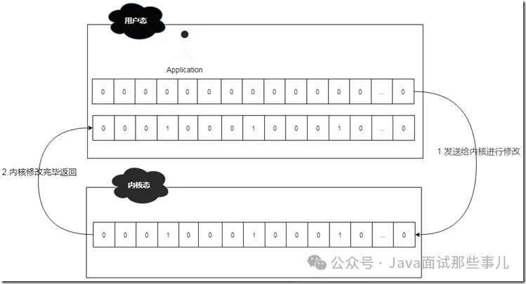

所以，综合起来，select整体还是比较高效和稳定的，但是呈现出来的问题也不少，这些问题进一步限制了其性能发挥：

1. 文件描述符表为`bitmap`结构，且有长度为1024的限制。
2. `fdset`无法做到重用，每次循环必须重新创建。
3. 频繁的用户态和内核态拷贝，性能开销较大。
4. 需要对文件描述符表进行遍历，`O(n)`的轮询时间复杂度。

## poll模型

考虑到select模型的几个限制，后来进行了改进，这也就是poll模型，既然是select模型的改进版，那么肯定有其亮眼的地方，一起来看看吧。当然，这次我们依旧是先翻阅linux man二类文档，因为这是官方的文档，对其有着最为精准的定义。

```cpp
int poll(struct pollfd *fds, nfds_t nfds, int timeout);
```

其实，从运行机制上说来，poll所做的功能和select是基本上一样的，都是等待并检测一组文件描述符就绪，然后在进行后续的IO处理工作。只不过不同的是，select中，采用的是bitmap结构，长度限定在1024位的文件描述符表，而poll模型则采用的是pollfd结构的数组fds，也正是由于poll模型采用了数组结构，则不会有1024长度限制，使其能够承受更高的并发。

pollfd结构内容如下：

```cpp
struct pollfd {
    int   fd;         /* 文件描述符 */
    short events;     /* 关心的事件 */
    short revents;    /* 实际返回的事件 */
};
```

从上面的结构可以看出，fd很明显就是指文件描述符，也就是当客户端连接上来后，fd会将生成的文件描述符保存到这里；而events则是指用户想关注的事件；`revents`则是指实际返回的事件，是由系统内核填充并返回，如果当前的fd文件描述符有状态变化，则`revents`的值就会有相应的变化。

`events`事件列表如下：

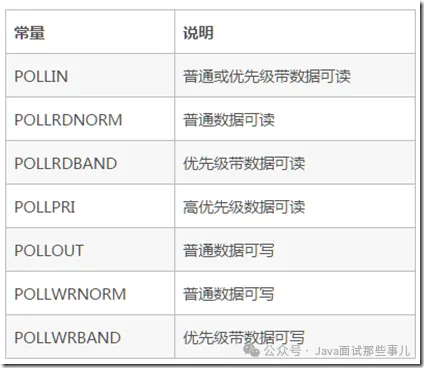

`revents`事件列表如下：

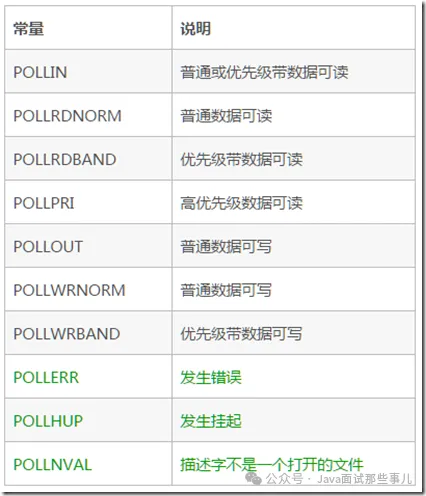

从列表中可以看出，`revents`是包含`events`的。接下来结合示例来看一下：

```cpp
//创建server端套接字，获取文件描述符
    int listenfd = socket(PF_INET,SOCK_STREAM,0);
    if(listenfd < 0) return -1;
    
    //绑定服务器
    bind(listenfd,(struct sockaddr*)&address,sizeof(address));
    //监听服务器
    listen(listenfd,5); 
    
    struct pollfd pollfds[1];
    socklen_t addr_len = sizeof(client);
    
    //接收客户端连接
    int connfd = accept(listenfd,(struct sockaddr*)&client,&addr_len);
    
    //放入fd数组
    pollfds[0].fd = connfd;
    pollfds[0].events = POLLIN;
    
    //读缓冲区
    char buff[1024]; 
    
    //读文件操作符
    fd_set read_fds;  
    
    while(1)
    {
        memset(buff,0,sizeof(buff));
        
        /**
         ** SELECT模型专用
         ** 注意：每次调用select之前都要重新设置文件描述符connfd，因为文件描述符表会在内核中被修改
         ** FD_ZERO(&read_fds);
         ** FD_SET(connfd,&read_fds);
        ** 注意：select会将用户态中的文件描述符表放到内核中进行修改，内核修改完毕后再返回给用户态，开销较大
        ** ret = select(connfd+1,&read_fds,NULL,NULL,NULL);
        **/
        
        ret = poll(pollfds, 1, 1000);
        if(ret < 0)
        {
            printf("Fail to poll!\n");
            return -1;
        }
        
        /**
         ** SELECT模型专用
         ** 检测文件描述符表中相关请求是否可读
         ** if(FD_ISSET(connfd, &read_fds))
         ** {
         **   ret = recv(connfd,buff,sizeof(buff)-1,0);
         **   printf("receive %d bytes from client: %s \n",ret,buff);
         ** }
         **/
        //检测文件描述符数组中相关请求
        if(pollfds[0].revents & POLLIN){
            pollfds[0].revents = 0;
            ret = recv(connfd,buff,sizeof(buff)-1,0);
            printf("receive %d bytes from client: %s \n",ret,buff);
        }
    }
```

由于源码中，我做了比较详细的注释，同时将和select模型不一样的地方都列了出来，这里就不再详细解释了。总体说来，poll模型比select模型要好用一些，去掉了一些限制，但是仍然避免不了如下的问题：

1. 用户态和内核态仍需要频繁切换，因为`revents`的赋值是在内核态进行的，然后再推送到用户态，和select类似，整体开销较大。
2. 仍需要遍历数组，时间复杂度为`O(N)`。

## epoll模型

如果说select模型和poll模型是早期的产物，在性能上有诸多不尽人意之处，那么自linux 2.6之后新增的epoll模型，则彻底解决了性能问题，一举使得单机承受百万并发的课题变得极为容易。现在可以这么说，只需要一些简单的设置更改，然后配合上epoll的性能，实现单机百万并发轻而易举。同时，由于epoll整体的优化，使得之前的几个比较耗费性能的问题不再成为羁绊，所以也成为了linux平台上进行网络通讯的首选模型。

讲解之前，还是`linux man`文档镇楼：`linux man epoll 4类文档` `linux man epoll 7类文档`，俩文档结合着读，会对epoll有个大概的了解。和之前提到的select和poll不同的是，此二者皆属于系统调用函数，但是epoll则不然，他是存在于内核中的数据结构，可以通过`epoll_create`，`epoll_ctl`及`epoll_wait`三个函数结合来对此数据结构进行操控。

说道`epoll_create`函数，其作用是在内核中创建一个epoll数据结构实例，然后将返回此实例在系统中的文件描述符。此epoll数据结构的组成其实是一个链表结构，我们称之为`interest list`，里面会注册连接上来的client的文件描述符。

其简化工作机制如下：

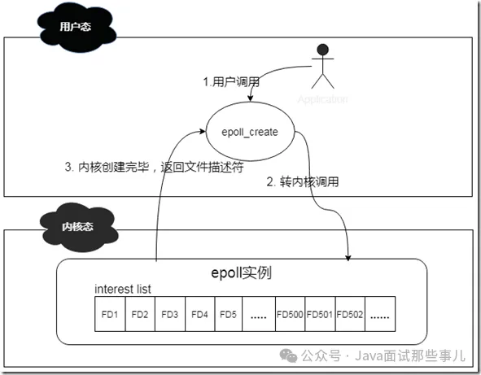

说道epoll_ctl函数，其作用则是对epoll实例进行增删改查操作。有些类似我们常用的CRUD操作。这个函数操作的对象其实就是epoll数据结构，当有新的client连接上来的时候，他会将此client注册到epoll中的`interest list`中，此操作通过附加`EPOLL_CTL_ADD`标记来实现；

当已有的client掉线或者主动下线的时候，他会将下线的client从epoll的`interest list`中移除，此操作通过附加`EPOLL_CTL_DEL`标记来实现；当有client的文件描述符有变更的时候，他会将events中的对应的文件描述符进行更新，此操作通过附加EPOLL_CTL_MOD来实现；当`interest list`中有client已经准备好了，可以进行IO操作的时候，他会将这些clients拿出来，然后放到一个新的ready list里面。

其简化工作机制如下：

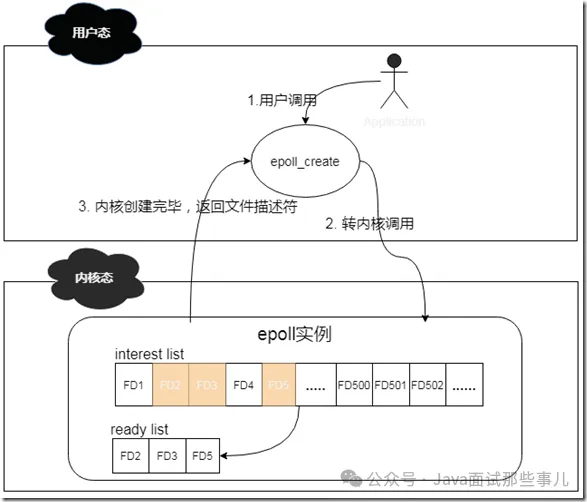

说道epoll_wait函数，其作用就是扫描`ready list`，处理准备就绪的client IO，其返回结果即为准备好进行IO的client的个数。通过遍历这些准备好的client，就可以轻松进行IO处理了。

上面这三个函数是epoll操作的基本函数，但是，想要彻底理解epoll，则需要先了解这三块内容，即：`inode`，`链表`，`红黑树`。

在linux内核中，针对当前打开的文件，有一个`open file table`，里面记录的是所有打开的文件描述符信息；同时也有一个`inode table`，里面则记录的是底层的文件描述符信息。这里假如文件描述符B fork了文件描述符A，虽然在`open file table`中，我们看新增了一个文件描述符B，但是实际上，在`inode table`中，A和B的底层是一模一样的。这里，将inode table中的内容理解为windows中的文件属性，会更加贴切和易懂。这样存储的好处就是，无论上层文件描述符怎么变化，由于epoll监控的数据永远是inode table的底层数据，那么我就可以一直能够监控到文件的各种变化信息，这也是epoll高效的基础。

简化流程如下：


数据存储这块解决了，那么针对连接上来的客户端socket，该用什么数据结构保存进来呢？这里用到了红黑树，由于客户端socket会有频繁的新增和删除操作，而红黑树这块时间复杂度仅仅为`O(logN)`，还是挺高效的。有人会问为啥不用哈希表呢？当大量的连接频繁的进行接入或者断开的时候，扩容或者其他行为将会产生不少的rehash操作，而且还要考虑哈希冲突的情况。虽然查询速度的确可以达到`O(1)`，但是rehash或者哈希冲突是不可控的，所以基于这些考量，我认为红黑树占优一些。

客户端socket怎么管理这块解决了，接下来，当有socket有数据需要进行读写事件处理的时候，系统会将已经就绪的socket添加到双向链表中，然后通过epoll_wait方法检测的时候，其实检查的就是这个双向链表，由于链表中都是就绪的数据，所以避免了针对整个客户端socket列表进行遍历的情况，使得整体效率大大提升。

整体的操作流程为：

- 首先，利用epoll_create在内核中创建一个epoll对象。其实这个epoll对象，就是一个可以存储客户端连接的数据结构。

- 然后，客户端socket连接上来，会通过epoll_ctl操作将结果添加到epoll对象的红黑树数据结构中。

- 然后，一旦有socket有事件发生，则会通过回调函数将其添加到ready list双向链表中。

- 最后，epoll_wait会遍历链表来处理已经准备好的socket，然后通过预先设置的水平触发或者边缘触发来进行数据的感知操作。

从上面的细节可以看出，由于epoll内部监控的是底层的文件描述符信息，可以将变更的描述符直接加入到ready list，无需用户将所有的描述符再进行传入。同时由于epoll_wait扫描的是已经就绪的文件描述符，避免了很多无效的遍历查询，使得epoll的整体性能大大提升，可以说现在只要谈论linux平台的IO多路复用，epoll已经成为了不二之选。

## 水平触发和边缘触发

上面说到了epoll，主要讲解了client端怎么连进来，但是并未详细的讲解`epoll_wait`怎么被唤醒的，这里我将来详细的讲解一下。

水平触发，意即`Level Trigger`，边缘触发，意即`Edge Trigger`，如果单从字面意思上理解，则不太容易，但是如果将硬件设计中的水平沿，上升沿，下降沿的概念引进来，则理解起来就容易多了。比如我们可以这样认为：

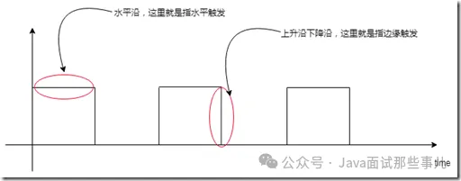

如果将上图中的方块看做是buffer的话，那么理解起来则就更加容易了，比如针对水平触发，buffer只要是一直有数据，则一直通知；而边缘触发，则buffer容量发生变化的时候，才会通知。虽然可以这样简单的理解，但是实际上，其细节处理部分，比图示中展现的更加精细，这里来详细的说一下。

## 边缘触发

针对读操作，也就是当前fd处于EPOLLIN模式下，即可读。此时意味着有新的数据到来，接收缓冲区可读，以下buffer都指接收缓冲区：

1. buffer由空变为非空，意即有数据进来的时候，此过程会触发通知。

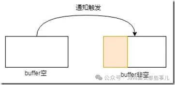

2. buffer原本有些数据，这时候又有新数据进来的时候，数据变多，此过程会触发通知。

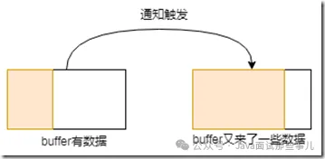

3. buffer中有数据，此时用户对操作的fd注册`EPOLL_CTL_MOD`事件的时候，会触发通知。

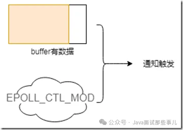

针对写操作，也就是当前fd处于`EPOLLOUT`模式下，即可写。此时意味着缓冲区可以写了，以下buffer都指发送缓冲区：

1. buffer满了，这时候发送出去一些数据，数据变少，此过程会触发通知。


2. buffer原本有些数据，这时候又发送出去一些数据，数据变少，此过程会触发通知。

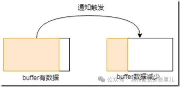

这里就是ET这种模式触发的几种情形，可以看出，基本上都是围绕着接收缓冲区或者发送缓冲区的状态变化来进行的。

晦涩难懂？不存在的，举个栗子：

在服务端，我们开启边缘触发模式，然后将`buffer size`设为10个字节，来看看具体的表现形式。

服务端开启，客户端连接，发送单字符A到服务端，输出结果如下：

```shell
-->ET Mode: it was triggered once
get 1 bytes of content: A
-->wait to read!
```

可以看到，由于buffer从空到非空，边缘触发通知产生，之后在`epoll_wait`处阻塞，继续等待后续事件。

这里我们变一下，输入ABCDEFGHIJKLMNOPQ，可以看到，客户端发送的字符长度超过了服务端`buffer size`，那么输出结果将是怎么样的呢？

```shell
-->ET Mode: it was triggered once
get 9 bytes of content: ABCDEFGHI
get 8 bytes of content: JKLMNOPQ
-->wait to read!
```

可以看到，这次发送，由于发送的长度大于`buffer size`，所以内容被折成两段进行接收，由于用了边缘触发方式，buffer的情况是从空到非空，所以只会产生一次通知。

## 水平触发

水平触发则简单多了，他包含了边缘触发的所有场景，简而言之如下：

当接收缓冲区不为空的时候，有数据可读，则读事件会一直触发。

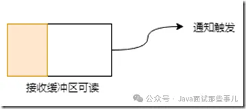

当发送缓冲区未满的时候，可以继续写入数据，则写事件一直会触发。


同样的，为了使表达更清晰，我们也来举个栗子，按照上述入输入方式来进行。

服务端开启，客户端连接并发送单字符A，可以看到服务端输出情况如下：

```shell
-->LT Mode: it was triggered once!
get 1 bytes of content: A
```

这个输出结果，毋庸置疑，由于buffer中有数据，所以水平模式触发，输出了结果。

服务端开启，客户端连接并发送ABCDEFGHIJKLMNOPQ，可以看到服务端输出情况如下：

```shell
-->LT Mode: it was triggered once!
get 9 bytes of content: ABCDEFGHI
-->LT Mode: it was triggered once!
get 8 bytes of content: JKLMNOPQ
```

从结果中，可以看出，由于buffer中数据读取完毕后，还有未读完的数据，所以水平模式会一直触发，这也是为啥这里水平模式被触发了两次的原因。

有了这两个栗子的比对，不知道聪明的你，get到二者的区别了吗？

在实际开发过程中，实际上LT更易用一些，毕竟系统帮助我们做了大部分校验通知工作，之前提到的SELECT和POLL，默认采用的也都是这个。但是需要注意的是，当有成千上万个客户端连接上来开始进行数据发送，由于LT的特性，内核会频繁的处理通知操作，导致其相对于ET来说，比较的耗费系统资源，所以，随着客户端的增多，其性能也就越差。

而边缘触发，由于监控的是FD的状态变化，所以整体的系统通知并没有那么频繁，高并发下整体的性能表现也要好很多。但是由于此模式下，用户需要积极的处理好每一笔数据，带来的维护代价也是相当大的，稍微不注意就有可能出错。所以使用起来须要非常小心才行。

至于二者如何抉择，诸位就仁者见仁智者见智吧。

行文到这里，关于epoll的讲解基本上完毕了，大家从中是不是学到了很多干货呢？由于从netty研究到linux epoll底层，其难度非常大，可以用曲高和寡来形容，所以在这块探索的文章是比较少的，很多东西需要自己照着man文档和源码一点一点的琢磨（linux源码详见eventpoll.c等）。

这里我来纠正一下搜索引擎上，说epoll高性能是因为利用mmap技术实现了用户态和内核态的内存共享，所以性能好，我前期被这个观点误导了好久，后来下来了linux源码，翻了一下，并没有在epoll中翻到mmap的技术点，所以这个观点是错误的。这些错误观点的文章，国内不少，国外也不少，希望大家能审慎抉择，避免被错误带偏。

所以，epoll高性能的根本就是，其高效的文件描述符处理方式加上颇具特性边的缘触发处理模式，以极少的内核态和用户态的切换，实现了真正意义上的高并发。

## 手写epoll服务端

实践是最好的老师，我们现在已经知道了epoll之剑怎么嵌入到石头中的，现在就让我们不妨尝试着拔一下看看。手写epoll服务器，具体细节如下（非C语言coder，代码有参考）：

```cpp
#include <stdio.h>
#include <sys/types.h>
#include <sys/socket.h>
#include <netinet/in.h>
#include <arpa/inet.h>
#include <unistd.h>
#include <string.h>
#include <fcntl.h>
#include <stdlib.h>
#include <sys/epoll.h>
#include <pthread.h>
#include <errno.h>
#include <stdbool.h>
#define MAX_EVENT_NUMBER 1024   //事件总数量
#define BUFFER_SIZE 10          //缓冲区大小，这里为10个字节
#define ENABLE_ET 0             //ET模式
/* 文件描述符设为非阻塞状态
 * 注意：这个设置很重要，否则体现不出高性能
 */
int SetNonblocking(int fd)
{
    int old_option = fcntl(fd, F_GETFL);
    int new_option = old_option | O_NONBLOCK;
    fcntl(fd, F_SETFL, new_option);
    return old_option;
}
/* 将文件描述符fd放入到内核中的epoll数据结构中并将fd设置为EPOLLIN可读，同时根据ET开关来决定使用水平触发还是边缘触发模式 
 * 注意：默认为水平触发，或上EPOLLET则为边缘触发
*/
void AddFd(int epoll_fd, int fd, bool enable_et)
{
    struct epoll_event event;  //为当前fd设置事件
    event.data.fd = fd;        //指向当前fd
    event.events = EPOLLIN;    //使得fd可读
    if(enable_et)
    {
        event.events |= EPOLLET; //设置为边缘触发
    }
    epoll_ctl(epoll_fd, EPOLL_CTL_ADD, fd, &event);  //将fd添加到内核中的epoll实例中
    SetNonblocking(fd);  //设为非阻塞模式                      
}
/*  LT水平触发 
 *  注意：水平触发简单易用，性能不高，适合低并发场合
 *        一旦缓冲区有数据，则会重复不停的进行通知，直至缓冲区数据读写完毕
 */
void lt_process(struct epoll_event* events, int number, int epoll_fd, int listen_fd)
{
    char buf[BUFFER_SIZE];
    int i;
    for(i = 0; i < number; i++) //已经就绪的事件，这些时间可读或者可写
    {
        int sockfd = events[i].data.fd; //获取描述符
        if(sockfd == listen_fd)  //如果监听类型的描述符，则代表有新的client接入，则将其添加到内核中的epoll结构中
        {
            struct sockaddr_in client_address;
            socklen_t client_addrlength = sizeof(client_address);
            int connfd = accept(listen_fd, (struct sockaddr*)&client_address, &client_addrlength); //创建连接并返回文件描述符（实际进行的三次握手过程）
            AddFd(epoll_fd, connfd, false);  //添加到epoll结构中并初始化为LT模式
        }
        else if(events[i].events & EPOLLIN) //如果客户端有数据过来
        {
            printf("-->LT Mode: it was triggered once!\n");
            memset(buf, 0, BUFFER_SIZE); 
            int ret = recv(sockfd, buf, BUFFER_SIZE - 1, 0);
            if(ret <= 0)  //读取数据完毕后，关闭当前描述符
            {
                close(sockfd);
                continue;
            }
            printf("get %d bytes of content: %s\n", ret, buf);
        }
        else
        {
            printf("something unexpected happened!\n");
        }
    }
}
/*  ET Work mode features: efficient but potentially dangerous */
/*  ET边缘触发
 *  注意：边缘触发由于内核不会频繁通知，所以高效，适合高并发场合，但是处理不当将会导致严重事故
          其通知机制和触发方式参见之前讲解，由于不会重复触发，所以需要处理好缓冲区中的数据，避免脏读脏写或者数据丢失等
 */
void et_process(struct epoll_event* events, int number, int epoll_fd, int listen_fd)
{
    char buf[BUFFER_SIZE];
    int i;
    for(i = 0; i < number; i++)
    {
        int sockfd = events[i].data.fd;
        if(sockfd == listen_fd) //如果有新客户端请求过来，将其添加到内核中的epoll结构中并默认置为ET模式
        {
            struct sockaddr_in client_address;
            socklen_t client_addrlength = sizeof(client_address);
            int connfd = accept(listen_fd, (struct sockaddr*)&client_address, &client_addrlength);
            AddFd(epoll_fd, connfd, true); 
        }
        else if(events[i].events & EPOLLIN) //如果客户端有数据过来
        {
            printf("-->ET Mode: it was triggered once\n");
            while(1) //循环等待
            {
                memset(buf, 0, BUFFER_SIZE);
                int ret = recv(sockfd, buf, BUFFER_SIZE - 1, 0);
                if(ret < 0)
                {
                    if(errno == EAGAIN || errno == EWOULDBLOCK) //通过EAGAIN检测，确认数据读取完毕
                    {
                        printf("-->wait to read!\n");
                        break;
                    }
                    close(sockfd);
                    break;
                }
                else if(ret == 0) //数据读取完毕，关闭描述符
                {
                    close(sockfd);
                }
                else //数据未读取完毕，继续读取
                {
                    printf("get %d bytes of content: %s\n", ret, buf);
                }
            }
        }
        else
        {
            printf("something unexpected happened!\n");
        }
    }
}
int main(int argc, char* argv[])
{
    const char* ip = "10.0.76.135";
    int port = 9999;
    
    //套接字设置这块，参见https://www.gta.ufrj.br/ensino/eel878/sockets/sockaddr_inman.html
    int ret = -1;
    struct sockaddr_in address; 
    bzero(&address, sizeof(address));
    address.sin_family = AF_INET;
    inet_pton(AF_INET, ip, &address.sin_addr);
    address.sin_port = htons(port);
    int listen_fd = socket(PF_INET, SOCK_STREAM, 0);    //创建套接字并返回描述符
    if(listen_fd < 0)
    {
        printf("fail to create socket!\n");
        return -1;
    }
    ret = bind(listen_fd, (struct sockaddr*)&address, sizeof(address)); //绑定本机
    if(ret == -1)
    {
        printf("fail to bind socket!\n");
        return -1;
    }
    ret = listen(listen_fd, 5); //在端口上监听
    if(ret == -1)
    {
        printf("fail to listen socket!\n");
        return -1;
    }
    struct epoll_event events[MAX_EVENT_NUMBER];
    int epoll_fd = epoll_create(5);  //在内核中创建epoll实例，flag为5只是为了分配空间用，实际可以不用带
    if(epoll_fd == -1)
    {
        printf("fail to create epoll!\n");
        return -1;
    }
    AddFd(epoll_fd, listen_fd, true); //添加文件描述符到epoll对象中
    while(1)
    {
        int ret = epoll_wait(epoll_fd, events, MAX_EVENT_NUMBER, -1); //拿出就绪的文件描述符并进行处理
        if(ret < 0)
        {
            printf("epoll failure!\n");
            break;
        }
        if(ENABLE_ET) //ET处理方式
        {
            et_process(events, ret, epoll_fd, listen_fd);
        }
        else  //LT处理方式
        {
            lt_process(events, ret, epoll_fd, listen_fd);
        }
    }
    close(listen_fd); //退出监听
    return 0;
}
```

详细的注释我都已经写上去了，这就是整个`epoll server`端全部源码了，仅仅只有200行左右，是不是很惊讶，接下来让我们来测试下性能，看看能够达到我们所说的单机百万并发吗？其实悄悄的给你说，netty底层的c语言实现，和这个是差不多的。

## 单机百万并发实战

在实际测试过程中，由于要实现高并发，那么肯定得使用ET模式了。但是由于这块内容更多的是linux配置的调整，且前人已经有了具体的文章了，

这里我们主要是利用vmware虚拟机一主三从，参数调优，来实现百万并发。

此块内容由于比较复杂，先暂时放一放，后续将会搭建环境并对此手写server进行压测。
