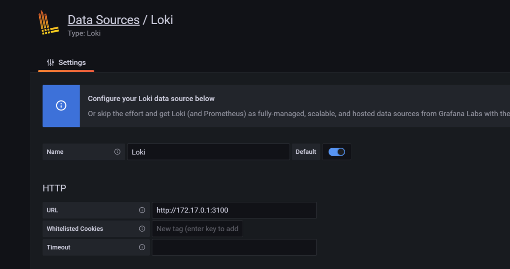
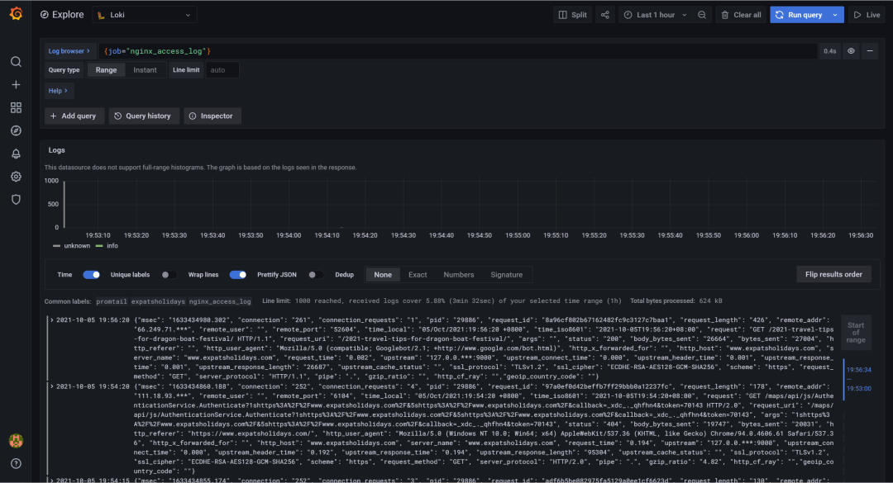
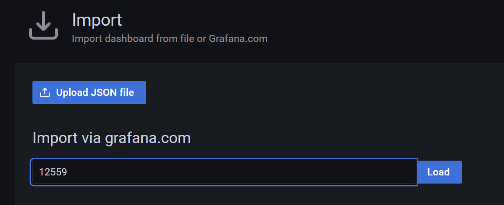
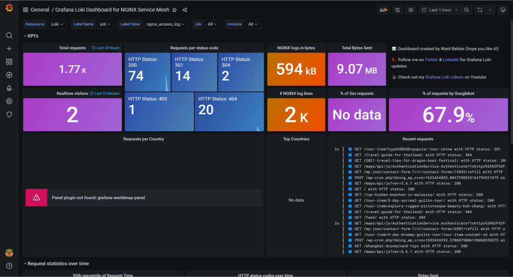
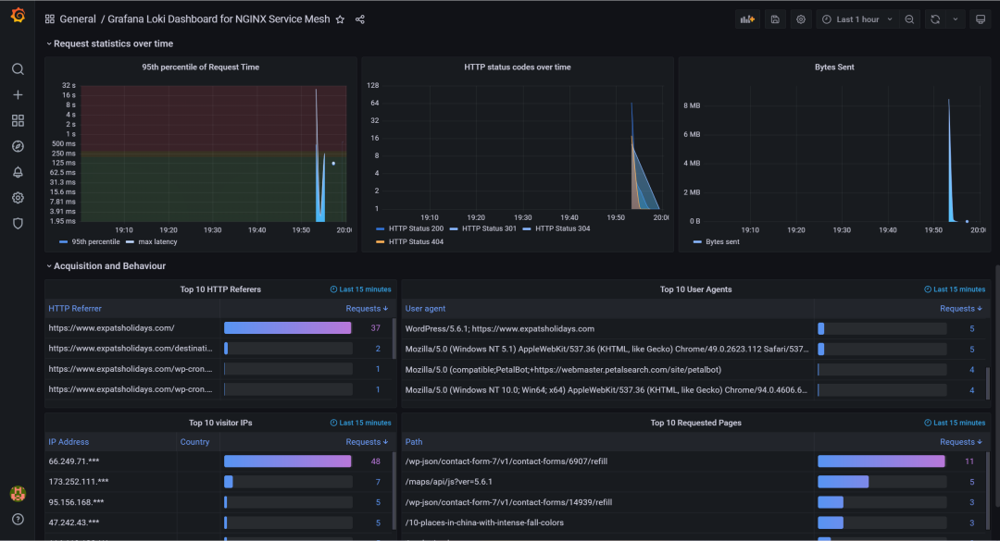
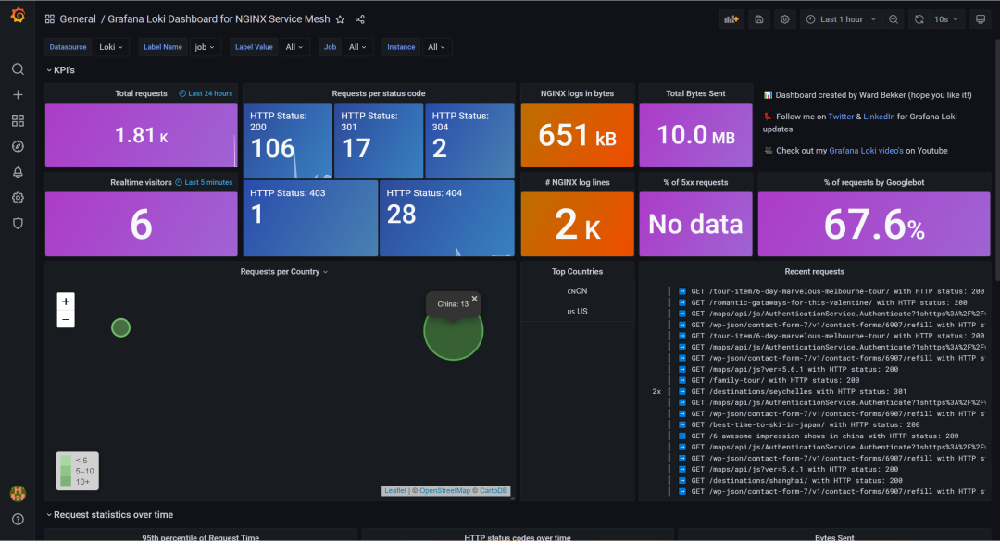

- [这套Nginx日志解决方案，真香！](https://cloud.tencent.com/developer/article/2115373)
- [不好意思，ELK 该换了！](https://mp.weixin.qq.com/s/3bu6onEnRRz2b1r-Ztn64A)

最近客户有个新需求，就是想查看网站的访问情况，由于网站没有做google的统计和百度的统计，所以访问情况，只能通过日志查看，通过脚本的形式给客户导出也不太实际，给客户写个简单的页面，咱也做不到

成熟的日志解决方案，那就是ELK，还有现在比较火的Loki，（当然还有很多其他解决方案，比如Splunk、Datadog等），那我们这个小网站，小体量，必然是选择Loki来做

所以这次就采用`Nginx` + `Promtail` + `Loki` + `Grafana` 来做一个简单的 `Nginx` 日志展示


Nginx的安装不多说，Promtail和Loki都选用二进制的方式进行安装，直接下载对应版本的二进制文件，解压后指定配置文件启动即可

其中promtail配置文件如下配置：
```yaml
server:
  http_listen_port: 9080
  grpc_listen_port: 0

positions:
  filename: /tmp/positions.yaml

clients:
  - url: http://localhost:3100/loki/api/v1/push

scrape_configs:
- job_name: nginx
  pipeline_stages:
  - replace:
      expression: '(?:[0-9]{1,3}\.){3}([0-9]{1,3})'
      replace: '***'
  static_configs:
  - targets:
      - localhost
    labels:
      job: nginx_access_log
      host: expatsxxxxs
      agent: promtail
      __path__: /var/log/nginx/expatshxxxxs.access.log
```

日志收集工作完成后，在Nginx中，需要修改日志格式，修改Nginx的日志格式为Json格式，配置如下：
```json
log_format json_analytics escape=json '{'
                    '"msec": "$msec", ' # request unixtime in seconds with a milliseconds resolution
                    '"connection": "$connection", ' # connection serial number
                    '"connection_requests": "$connection_requests", ' # number of requests made in connection
                    '"pid": "$pid", ' # process pid
                    '"request_id": "$request_id", ' # the unique request id
                    '"request_length": "$request_length", ' # request length (including headers and body)
                    '"remote_addr": "$remote_addr", ' # client IP
                    '"remote_user": "$remote_user", ' # client HTTP username
                    '"remote_port": "$remote_port", ' # client port
                    '"time_local": "$time_local", '
                    '"time_iso8601": "$time_iso8601", ' # local time in the ISO 8601 standard format
                    '"request": "$request", ' # full path no arguments if the request
                    '"request_uri": "$request_uri", ' # full path and arguments if the request
                    '"args": "$args", ' # args
                    '"status": "$status", ' # response status code
                    '"body_bytes_sent": "$body_bytes_sent", ' # the number of body bytes exclude headers sent to a client
                    '"bytes_sent": "$bytes_sent", ' # the number of bytes sent to a client
                    '"http_referer": "$http_referer", ' # HTTP referer
                    '"http_user_agent": "$http_user_agent", ' # user agent
                    '"http_x_forwarded_for": "$http_x_forwarded_for", ' # http_x_forwarded_for
                    '"http_host": "$http_host", ' # the request Host: header
                    '"server_name": "$server_name", ' # the name of the vhost serving the request
                    '"request_time": "$request_time", ' # request processing time in seconds with msec resolution
                    '"upstream": "$upstream_addr", ' # upstream backend server for proxied requests
                    '"upstream_connect_time": "$upstream_connect_time", ' # upstream handshake time incl. TLS
                    '"upstream_header_time": "$upstream_header_time", ' # time spent receiving upstream headers
                    '"upstream_response_time": "$upstream_response_time", ' # time spend receiving upstream body
                    '"upstream_response_length": "$upstream_response_length", ' # upstream response length
                    '"upstream_cache_status": "$upstream_cache_status", ' # cache HIT/MISS where applicable
                    '"ssl_protocol": "$ssl_protocol", ' # TLS protocol
                    '"ssl_cipher": "$ssl_cipher", ' # TLS cipher
                    '"scheme": "$scheme", ' # http or https
                    '"request_method": "$request_method", ' # request method
                    '"server_protocol": "$server_protocol", ' # request protocol, like HTTP/1.1 or HTTP/2.0
                    '"pipe": "$pipe", ' # "p" if request was pipelined, "." otherwise
                    '"gzip_ratio": "$gzip_ratio", '
                    '"http_cf_ray": "$http_cf_ray",'
                    '"geoip_country_code": "$geoip_country_code"'
                    '}';
```

配置文件中，需要注意的是`geoip`的配置，需要在nginx中添加geoip模块

首先通过yum安装geoip及lib库
```shell
yum -y install GeoIP GeoIP-data GeoIP-devel
```

之后，重新编译Nginx，通过`--with-http_geoip_module`添加nginx的geoip模块

编译完成后，在objs目录下生成新的Nginx可执行文件，替换原先的，通过kill -USR2信号，升级Nginx

此时配置的log_format不会再报错geoip指令找不到，配置完成后，配置网站的access日志，引用刚才配置的json格式的log_format

查看此时的日志格式
```shell
{"msec": "1633430998.322", "connection": "4", "connection_requests": "1", "pid": "29887", "request_id": "40770fec38c2e5a68714df5f7a67283d", "request_length": "392", "remote_addr": "106.19.96.55", "remote_user": "", "remote_port": "43746", "time_local": "05/Oct/2021:18:49:58 +0800", "time_iso8601": "2021-10-05T18:49:58+08:00", "request": "GET / HTTP/2.0", "request_uri": "/", "args": "", "status": "200", "body_bytes_sent": "60949", "bytes_sent": "61222", "http_referer": "https://cn.bing.com/search?q=expat+tourism+agent+in+china&go=Search&qs=n&form=QBRE&sp=-1&pq=expat+tourism+agent+in+chi&sc=0-26&sk=&cvid=8BD2D4B79B3A4FA682571CB5BC7334D4", "http_user_agent": "Mozilla/5.0 (iPhone; CPU iPhone OS 13_6 like Mac OS X) AppleWebKit/605.1.15 (KHTML, like Gecko) Version/13.1.2 Mobile/15E148 Safari/604.1", "http_x_forwarded_for": "", "http_host": "www.expatsholidays.com", "server_name": "www.expatsholidays.com", "request_time": "0.003", "upstream": "127.0.0.1:9000", "upstream_connect_time": "0.000", "upstream_header_time": "0.002", "upstream_response_time": "0.002", "upstream_response_length": "60991", "upstream_cache_status": "", "ssl_protocol": "TLSv1.2", "ssl_cipher": "ECDHE-RSA-AES128-GCM-SHA256", "scheme": "https", "request_method": "GET", "server_protocol": "HTTP/2.0", "pipe": ".", "gzip_ratio": "", "http_cf_ray": "","geoip_country_code": ""}
{"msec": "1633430998.709", "connection": "4", "connection_requests": "2", "pid": "29887", "request_id": "430fd53a457ea580c47e9b055da2b4d0", "request_length": "56", "remote_addr": "106.19.96.55", "remote_user": "", "remote_port": "43746", "time_local": "05/Oct/2021:18:49:58 +0800", "time_iso8601": "2021-10-05T18:49:58+08:00", "request": "GET /maps/api/js?ver=5.6.1 HTTP/2.0", "request_uri": "/maps/api/js?ver=5.6.1", "args": "ver=5.6.1", "status": "200", "body_bytes_sent": "41262", "bytes_sent": "41406", "http_referer": "https://www.expatsholidays.com/", "http_user_agent": "Mozilla/5.0 (iPhone; CPU iPhone OS 13_6 like Mac OS X) AppleWebKit/605.1.15 (KHTML, like Gecko) Version/13.1.2 Mobile/15E148 Safari/604.1", "http_x_forwarded_for": "", "http_host": "www.expatsholidays.com", "server_name": "www.expatsholidays.com", "request_time": "0.000", "upstream": "", "upstream_connect_time": "", "upstream_header_time": "", "upstream_response_time": "", "upstream_response_length": "", "upstream_cache_status": "", "ssl_protocol": "TLSv1.2", "ssl_cipher": "ECDHE-RSA-AES128-GCM-SHA256", "scheme": "https", "request_method": "GET", "server_protocol": "HTTP/2.0", "pipe": ".", "gzip_ratio": "3.06", "http_cf_ray": "","geoip_country_code": ""}
```

已经转为JSON格式，接着安装grafana，最快捷的方式，通过docker直接起一个
```shell
docker run -d -p 3000:3000 grafana/grafana

```

启动后，通过 `admin` / `admin` 默认用户名密码登录，登陆后提示重置密码，之后进入grafana界面

我们直接添加数据源`loki`



先通过explore查询，日志是否存入loki



可以看到，日志已经存入loki

接着添加Dashboard，通过ID导入



导入如下





可以看到，这里地图没展示，缺少`grafana-worldmap-panel`插件，我们装一下，通过命令行
```shell
grafana-cli plugins install grafana-worldmap-panel

```

安装完成后，重启grafana，重新查看dashboard



地图可以展示，这里因为地图的地址是国外的地址，所以地图的图片无法加载，可以通过反代的方式解决

ok，今天内容就这些，通过简单快速的方式，为客户呈现网站的详细访问情况，Loki+Grafana是绝佳的组合
