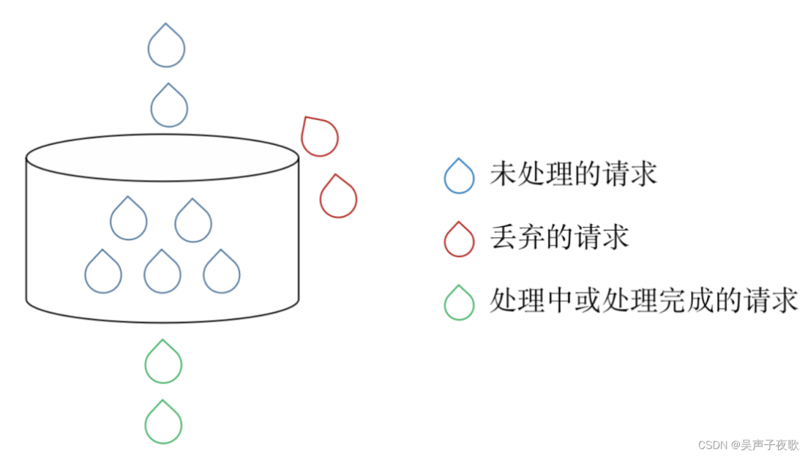
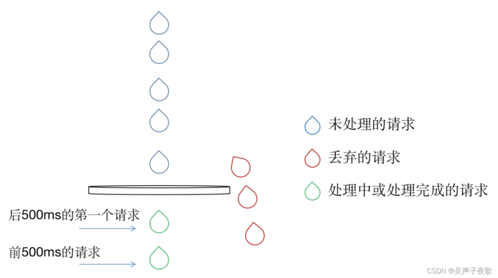
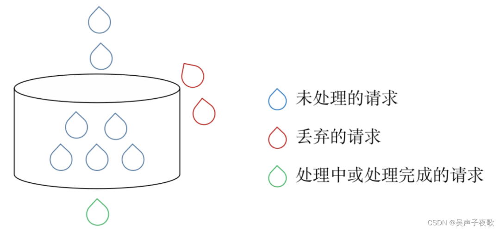
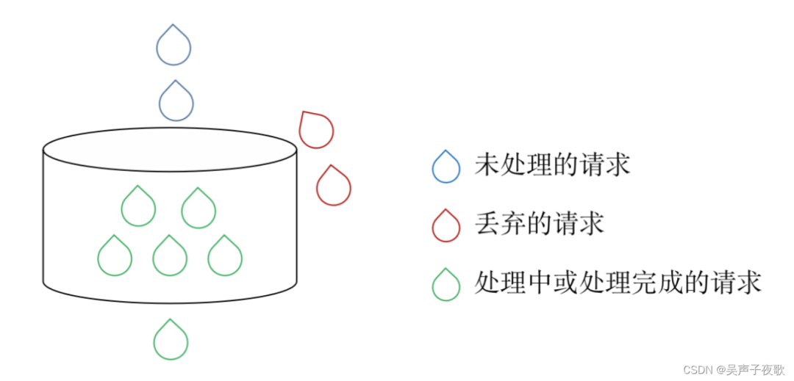

- [Nginx 配置限流](https://blog.csdn.net/cold___play/article/details/1320948651)
- [Nginx 配置限流，技能拉满！](https://mp.weixin.qq.com/s/t-uzbduHREn7E9r3xAsFpQ)

## 一、概述

限流（Rate Limitting）是服务降级的一种方式，通过限制系统的输入和输出流量以达到保护系统的目的。


比如我们的网站暴露在公网环境中，除了用户的正常访问，网络爬虫、恶意攻击或者大促等突发流量都可能都会对系统造成压力，如果这种压力超出了服务器的处理能力，会造成响应过慢甚至系统崩溃的问题。

因此，当并发请求数过大时，我们通过限制一部分请求（比如限制同一IP的频繁请求）来保证服务器可以正确响应另一部分的请求。

nginx 提供了两种限流方式:
- 一种是限制请求速率
- 一种是限制连接数量


另外还提供了对下载/上传速度的限制。

## 二、限制请求速率

nginx 的 `ngx_http_limit_req_module` 模块提供限制请求处理速率的能力，使用了漏桶算法（leaky bucket algorithm）。我们可以想像有一只上面进水、下面匀速出水的桶，如果桶里面有水，那刚进去的水就要存在桶里等下面的水流完之后才会流出，如果进水的速度大于水流出的速度，桶里的水就会满，这时水就不会进到桶里，而是直接从桶的上面溢出。

对应到处理网络请求，水代表从客户端来的请求，而桶代表一个队列，请求在该队列中依据先进先出（FIFO）算法等待被处理。漏的水代表请求离开缓冲区并被服务器处理，溢出代表了请求被丢弃并且永不被服务。



### 2.1、正常限流

nginx 中有两个主要的指令可以用来配置限流：`limit_req_zone` 和 `limit_req`。

下面是一个最简单的限流的例子：
```conf
limit_req_zone $binary_remote_addr zone=test:10m rate=2r/s;

server {
    location / {
        limit_req zone=test;
    }
}
```

`imit_req_zone` 用于设置限流和共享内存区域的参数，格式为：`limit_req_zone key zone rate`。


- `key`： 定义限流对象，`$binary_remote_addr` 是 nginx 中的变量，表示基于 `remote_addr`(客户端IP) 来做限流，binary_ 是二进制存储。使用 `$binary_remote_addr` 而不是 `$remote_addr` 是因为二进制存储可以压缩内存占用量。`$remote_addr` 变量的大小从7到15个字节不等，而 `$binary_remote_addr` 变量的大小对于 IPv4 始终为4个字节，对于 IPv6 地址则为16个字节。


- `zone`： 定义共享内存区来存储访问信息，访问信息包括每个 IP 地址状态和访问受限请求 URL 的频率等。zone 的定义又分为两个部分：由 `zone=` 关键字标识的区域名称，以及冒号后面的区域大小。test:10m 表示一个大小为10M，名字为 test 的内存区域。1M 能存储16000个 IP 地址的访问信息，test 大概可以存储约160000个地址。nginx 创建新记录的时候，会移除前60秒内没有被使用的记录，如果释放的空间还是存储不了新的记录，会返回503的状态码。


- `rate`： 设置最大的访问速率。`rate=2r/s`（为了好模拟，rate 设置的值比较小），表示每秒最多处理 2个请求。事实上 nginx 是以毫秒为粒度追踪请求的，`rate=2r/s` 实际上是每500毫秒1个请求，也就是说，上一个请求完成后，如果500毫秒内还有请求到达，这些请求会被拒绝（默认返回503，如果想修改返回值，可以设置`limit_req_status`）。


`limit_req_zone` 只是设置限流参数，如果要生效的话，必须和 `limit_req` 配合使用。`limit_req` 的格式为：`limit_req zone=name [burst=number] [nodelay]`。


上面的例子只简单指定了 `zone=test`，表示使用 test 这个区域的配置，在请求 html 文件时进行限流。我们可以理解为这个桶目前没有任何储存水滴的能力，到达的所有不能立即漏出的请求都会被拒绝。如果我1秒内发送了10次请求，其中前500毫秒1次，后500毫秒9次，那么只有前500毫秒的请求和后500毫秒的第一次请求会响应，其余请求都会被拒绝。



### 2.2、处理突发流量


上面的配置保证了 nginx 以固定的速度提供服务（`2r/s`），但是这种情况不适用于有突发流量的情况，我们希望可以尽可能的缓存请求并处理它们，此时需要在 `limit_req` 上增加 burst 参数：
```conf
limit_req_zone $binary_remote_addr zone=test:10m rate=2r/s;

server {
    location / {
        limit_req zone=test burst=5;
    }
}
```

burst 表示在超过设定的访问速率后能额外处理的请求数。当 `rate=2r/s` 时，表示每500ms 可以处理一个请求。`burst=5`时，如果同时有10个请求到达，nginx 会处理第1个请求，剩余9个请求中，会有5个被放入队列，剩余的4个请求会直接被拒绝。然后每隔500ms从队列中获取一个请求进行处理，此时如果后面继续有请求进来，如果队列中的请求数目超过了5，会被拒绝，不足5的时候会添加到队列中进行等待。我们可以理解为现在的桶可以存5滴水：



配置 burst 之后，虽然同时到达的请求不会全部被拒绝，但是仍需要等待500ms 一次的处理时间，放入桶中的第5个请求需要等待`500ms * 4`的时间才能被处理，更长的等待时间意味着用户的流失，在许多场景下，这个等待时间是不可接受的。此时我们需要增加 `nodelay` 参数，和 burst 配合使用。
```conf
limit_req_zone $binary_remote_addr zone=test:10m rate=2r/s;

server {
    location / {
        limit_req zone=test burst=5 nodelay;
    }
}
```

`nodelay` 表示不延迟。设置 `nodelay` 后，第一个到达的请求和队列中的请求会立即进行处理，不会出现等待的请求。



需要注意的是，虽然队列中的5个请求立即被处理了，但是队列中的位置依旧是按照500ms 的速度依次被释放的。后面的4个请求依旧是被拒绝的，长期来看并不会提高吞吐量的上限，长期吞吐量的上限是由设置的 rate 决定的。

### 2.3、设置白名单


如果遇到不需要限流的情况，比如测试要压测，可以通过配置白名单，取消限流的设置。白名单要用到 `nginx` 的 `ngx_http_geo_module` 和 `ngx_http_map_module` 模块。
```conf
geo $limit {
    default 1;
    10.0.0.0/8 0;
    192.168.0.0/24 0;
}

map $limit $limit_key {
    0 "";
    1 $binary_remote_addr;
}

limit_req_zone $limit_key zone=mylimit:10m rate=2r/s;
```

`geo` 指令可以根据 IP 创建变量 `$limit`。`$limit` 的默认值是1，如果匹配到了下面的 IP，则返回对应的值（这里返回的是0）。


之后通过 map 指令，将 `$limit` 的值映射为`$limit_key`：在白名单内的，`$limit_key` 为空字符串，不在白名单内的，则为 `$binary_remote_addr`。当`limit_req_zone`指令的第一个参数是一个空字符串，限制不起作用，因此白名单的 IP 地址（在`10.0.0.0/8`和`192.168.0.0/24`子网中）没有被限制，其它 IP 地址都被限制为 `2r/s`


### 2.4、`limit_req`重复


如果同一个 `location` 下配置了多条 `limit_req` 的指令，这些指令所定义的限制都会被使用。
```conf
geo $limit {
    default 1;
    10.0.0.0/8 0;
    192.168.0.0/24 0;
}

map $limit $limit_key {
    0 "";
    1 $binary_remote_addr;
}

limit_req_zone $limit_key zone=mylimit:10m rate=2r/s;
limit_req_zone $binary_remote_addr zone=myLimit2:10m rate=10r/s;
server {
    location ~* \.(html)$ {
        limit_req zone=mylimit burst=5 nodelay;
        limit_req zone=myLimit2 burst=5 nodelay;
    }
} 
```

上面的例子配置了两条规则，`myLimit` 和 `myLimit2`。白名单用户虽然没有匹配到mylimit的规则，但是根据规则 mylimit2，被限制为`10r/s`。对于不在白名单的用户，则需要同时匹配mylimit 和 mylimit2，两者中最严格的条件 `2r/s` 会起作用。


## 三、限制连接数


nginx 的 `ngx_http_limit_conn_module` 模块提供限制连接数的能力，包含两个指令`limit_conn_zone` 和 `limit_conn`，格式为`limit_conn_zone key zone`。
```conf
limit_conn_zone $binary_remote_addr zone=perip:10m;
limit_conn_zone $server_name zone=perserver:10m;
server {
    location ~* \.(html)$ {
        limit_conn perip 10;
        limit_conn perserver 100;
    }
}
```

- `limit_conn perip 10`：key 是`$binary_remote_addr`，表示限制单个IP同时最多能持有10个连接。

- `limit_conn perserver 100`：key 是 `$server_name`，表示虚拟主机(server) 同时能处理并发连接的总数为100。

> 需要注意的是：只有当 `request header` 被后端server处理后，这个连接才进行计数。


## 四、上传/下载速率限制


`limit_rate`主要用于限制用户和服务器之间传输的字节数，最常用的场景可能就是下载/上传限速。`limit_rate`并没有单独的一个模块，而是在`ngx_http_core_module`中，同时它的相关指令也比较少，只有`limit_rate`和`limit_rate_after`这两个指令。


### 4.1、`limit_rate`
```conf
server {
    location / {
        limit_rate 4k;
    }
}
```

`limit_rate`的用法非常简单，后面跟随的rate就是具体限速的阈值

注意默认的单位是`bytes/s`，也就是每秒传输的字节数Bytes而不是比特数bits

rate可以设置为变量，从而可以实现动态限速

限速指令的生效范围是根据每个连接确定的，例如上面限定每个连接的速率为4k，也就是当客户端发起两个连接的时候，速率就可以变为8k


### 4.2、`limit_rate_after`
```conf
server {
    location / {
     limit_rate_after 500k;
        limit_rate 4k;
    }
}
```

`limit_rate_after`允许在传输了一部分数据之后再进行限速，例如上面的配置中就是传输的前500k数据不限速，500k之后再进行限速。比较常见的应用场景如分段下载限速，超过指定大小的部分再进行限速；


又或者是流媒体视频网站一般为了保证用户体验而不会对第一个画面进行限速，确保其能够尽快加载出来，等用户开始观看视频之后，再把带宽限制在合理的范围内，从而降低因客户端网速过快导致提前加载过多内容带来的额外成本。

### 4.3、`proxy_limit_rate`


`proxy_limit_rate`的基本原理和用法与`limit_rate`几乎一样，唯一不同的是`proxy_limit_rate`是限制nginx和后端upstream服务器之间的连接速率而`limit_rate`限制的是nginx和客户端之间的连接速率。需要注意的是`proxy_limit_rate`需要开启了`proxy_buffering`这个指令才会生效。
```shell
#语法：
Syntax: proxy_limit_rate rate;
Default:    proxy_limit_rate 0;
Context:    http, server, location
This directive appeared in version 1.7.7.
```

### 4.4、动态限速


`limit_rate`的一大特点就是能够使用变量，这就意味着和map指令之类的进行组合就可以实现动态限速功能，这里只列几个简单的示范


#### 4.4.1、基于时间动态限速


这里引入了nginx内置的一个ssi模块，这个模块有两个比较有意思的时间变量：`$date_local`和`$date_gmt`，分别对应当前时间和GMT时间


这里使用变量和map指令组合的方式，利用正则表达式匹配不同的时间段，再结合map变量将不同时间段和不同的限速对应起来。
```conf
map $date_local $limit_rate_time {
    default 4K;
    ~(00:|01:|02:|03:|04:|05:|06:|07:).*:.* 16K;
    ~(08:|12:|13:|18:).*:.* 8K;
    ~(19:|20:|21:|22:|23:).*:.* 16K;
}

limit_rate $limit_rate_time
```

#### 4.4.2、基于变量动态限速


有些服务可能会对不用的用户进行不同的限速，例如VIP用户的速度要更快一些等，例如下面可以针对不同的`cookie`进行限速
```conf
map $cookie_User $limit_rate_cookie {
    gold 64K;
    silver 32K;
    copper 16K;
    iron 8K;
}

limit_rate $limit_rate_cookie
```
