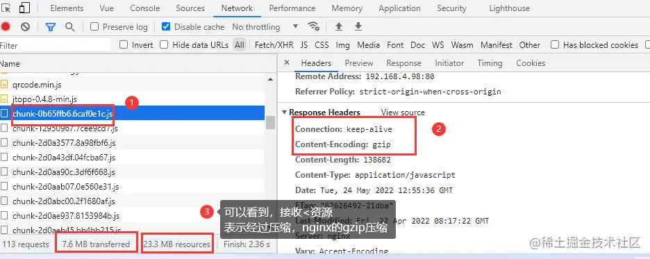
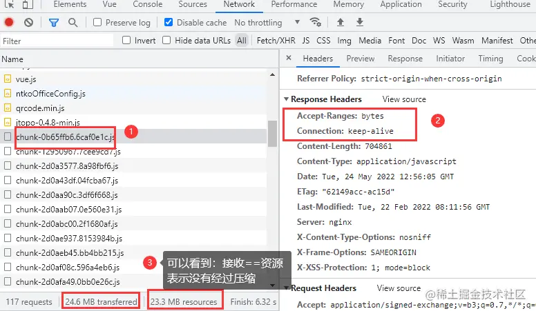
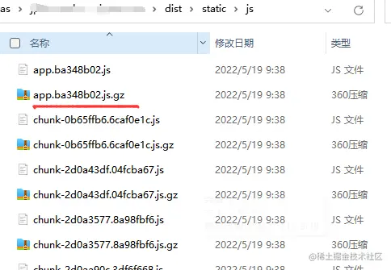
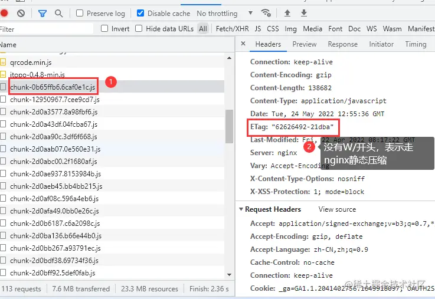
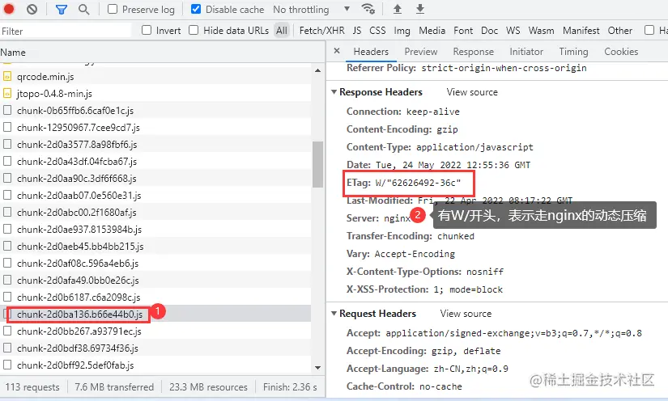

- [Nginx静态压缩和代码压缩,提高访问速度!](https://juejin.cn/post/7101663374957608974)
- [Nginx静态压缩和代码压缩，提高访问速度！](https://mp.weixin.qq.com/s/4lz7t6RX0ilJ28QJ97XA9Q)

基于目前大部分的应用，都使用了前后端分离的框架，vue的前端应用，也是十分的流行。不知道大家有无遇到这样的问题：

随着前端框架的页面，功能开发不断的迭代；安装的依赖，不断的增多；

这样导致的问题，就是我们的前端框架，会变得十分庞大，打包出来的dist目录会变得很大了喔！！！

这样就会导致一个问题：首次访问应用，会变得很慢！！！

这确实是一个严重的问题！！！T_T

对于这个问题，咋们今天就从代码压缩+nginx静态资源压缩，两个方面进行研究解决！！！

## nginx静态资源动态压缩

### nginx开启gzip压缩

```conf
server {
    listen       80;
    listen  [::]:80;
    server_name  localhost;
    server_tokens off;

    # 开启gzip压缩
    gzip                on;
    gzip_disable        "msie6";
    gzip_vary           on;
    gzip_proxied        any;
    gzip_comp_level     6;
    gzip_buffers 16     8k;
    gzip_http_version   1.1;
    gzip_types          text/plain application/css text/css application/xml text/javascript application/javascript application/x-javascript;
    
    #llsydn 前端
    location /jxbp {           
        alias  /opt/llsydn/jxbp;
        index index.html;
        try_files $uri $uri/ /dist/index.html;
    }
}
```

然后重启nginx：`nginx -s reload`

看看是否已经生效！！！

### 压缩的效果图


### 没有压缩的效果图


从上面两张图可以看到:

- 第一张经过压缩：finish时间为2.36s，transferred为7.6MB
- 第二张没有压缩：finish时间为6.32s，transferred为24.6MB

很明显，经过了nginx的静态资源压缩，访问速度提高了，显著的！！！

看到这，咋们会有这样的一个问题，这压缩都是nginx干的活，那当访问量变大，那对于nginx的压力，是十分大的，毕竟都是动态压缩的！！！

那有无解决方法呢？

nginx静态资源动态压缩的原理，无非就帮我们将js、css等文件，压缩为一个.gz文件，然后传输给前端浏览器，进行解析。说到这，咋们不禁会说：那咋们先将js、css等文件，生成对应的.gz文件，不就不需要nginx动态压缩了嘛？好像是这么一回事！！！

天才呀！！！

## nginx静态资源静态压缩

### 将js、css等文件，生成对应的.gz文件
这个，就可以借助一些依赖进行处理了：`compression-webpack-plugin`

- 安装依赖：
```shell
npm install compression-webpack-plugin -D
```

- `vue.config.js`

```javascript
const CompressionWebpackPlugin = require('compression-webpack-plugin')
const productionGzipExtensions = ['js', 'css']
vueConfig.configureWebpack.plugins.push(new CompressionWebpackPlugin({
    test:/.js$|.html$|.\css/, // 匹配文件名
    threshold: 1024, // 对超过1k的数据压缩
    deleteOriginalAssets: false // 不删除源文件
}))
```

- 打包：
```shell
npm run build
```



可以看到，已经帮我们生成对应的.gz文件了！！！

### nginx配置

在上面的基础上，再加上

```conf
gzip_static on
```

nginx得安装下面得模块：

```shell
ngx_http_gzip_module        模块
ngx_http_gzip_static_module 模块
ngx_http_gunzip_module      模块
```

nginx开启gzip压缩

```conf
server {
    listen       80;
    listen  [::]:80;
    server_name  localhost;
    server_tokens off;

    # 开启gzip压缩
    gzip                on;
    gzip_static         on
    gzip_disable        "msie6";
    gzip_vary           on;
    gzip_proxied        any;
    gzip_comp_level     6;
    gzip_buffers 16     8k;
    gzip_http_version   1.1;
    gzip_types          text/plain application/css text/css application/xml text/javascript application/javascript application/x-javascript;
    
    #llsydn 前端
    location /jxbp {           
        alias  /opt/llsydn/jxbp;
        index index.html;
        try_files $uri $uri/ /dist/index.html;
    }
}
```

然后重启nginx：`nginx -s reload`

看看是否已经生效！！！

### 静态压缩


### 动态压缩


好了，nginx的静态压缩，就到这里了！！！
