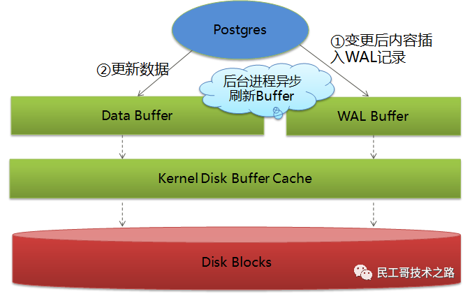
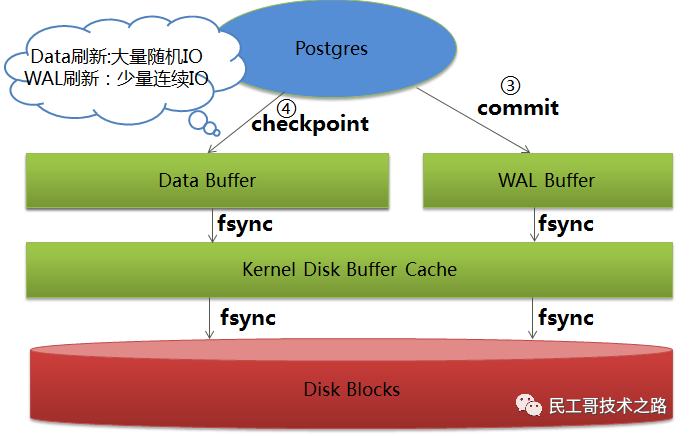
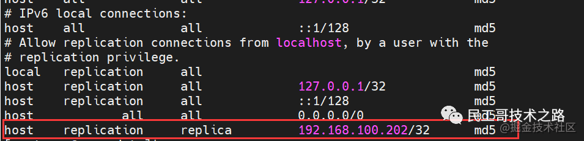
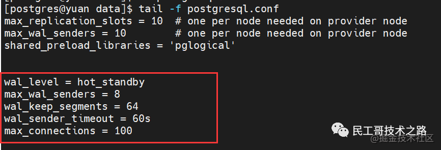
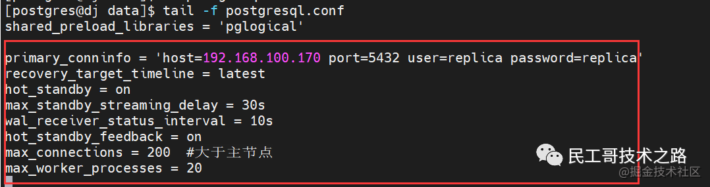

- [进阶数据库系列（十五）：PostgreSQL 主从同步原理与实践](https://blog.csdn.net/pgdba/article/details/133820811)

前面介绍了 [PostgreSQL 常用函数](https://www.rockdata.net/zh-cn/tutorial/postgres-functions/)、锁操作、[执行计划](https://doc.rockdata.net/zh-cn/optimization/query-plan/)、[视图](https://www.rockdata.net/zh-cn/tutorial/ddl-views/)与[触发器](https://www.rockdata.net/zh-cn/tutorial/ddl-triggers/)、[存储过程](https://www.rockdata.net/zh-cn/tutorial/postgres-plpgsql/)、[索引](https://www.rockdata.net/zh-cn/tutorial/indexes/)、[分区分表](https://www.rockdata.net/zh-cn/docs/14/ddl-partitioning.html)、[事务](https://www.rockdata.net/zh-cn/tutorial/dml-transaction/)与并发控制相关的知识点，今天我将详细的为大家介绍 PostgreSQL 主从同步复制原理与实践相关知识，希望大家能够从中收获多多！如有帮助，请点在看、转发支持一波！！！

在正式介绍 PostgreSQL 主从同步复制 之前，我们先了解一下 PostgreSQL 的预写日志机制（WAL）。

## PostgreSQL 预写日志机制（WAL）
### 1. 关于持久性
持久性是指，事务提交后，对系统的影响必须是永久的，即使系统意外宕机，也必须确保事务提交时的修改已真正永久写入到永久存储中。

最简单的实现方法，当然是在事务提交后立即刷新事务修改后的数据到磁盘。但是磁盘和内存之间的IO操作是最影响数据库系统影响时间的，一有事务提交就去刷新磁盘，会对数据库性能产生不好影响。

WAL机制的引入，即保证了事务持久性和数据完整性，又尽量地避免了频繁IO对性能的影响。

### 2. WAL过程分析
Write-Ahead Logging，前写日志。

在MVCC的部分中，我们已经分析了PostgreSQL的存储结构：元组-文件页-物理段-表；
以及写数据的步骤：先写到缓冲区Buffer-再刷新到磁盘Disk。

WAL机制实际是在这个写数据的过程中加入了对应的写wal log的过程，步骤一样是先到Buffer，再刷新到Disk。

- Change发生时：
  - 先将变更后内容记入WAL Buffer
  - 再将更新后的数据写入Data Buffer

- Commit发生时：
  - WAL Buffer刷新到Disk
  - Data Buffer写磁盘推迟

- Checkpoint发生时：
  - 将所有Data Buffer刷新到磁盘



- 数据发生变动时



[commit](https://www.rockdata.net/zh-cn/docs/14/sql-commit.html) 和 [checkpoint](https://www.rockdata.net/zh-cn/docs/14/sql-checkpoint.html)

更多关于 PostgreSQL 系列的学习文章，请参阅：PostgreSQL 数据库，本系列持续更新中。

## WAL的好处
通过上面的分析，可以看到：

当宕机发生时，

- Data Buffer的内容还没有全部写入到永久存储中，数据丢失；
- 但是WAL Buffer的内容已写入磁盘，根据WAL日志的内容，可以恢复库丢失的内容。

在提交时，仅把WAL刷新到了磁盘，而不是Data刷新：

- 从IO次数来说，WAL刷新是少量IO，Data刷新是大量IO，WAL刷新次数少得多；
- 从IO花销来说，WAL刷新是连续IO，Data刷新是随机IO，WAL刷新花销小得多。

因此WAL机制在保证事务持久性和数据完整性的同时，成功地提升了系统性能。

## 主从复制
### 1. [基于文件的日志传送](https://www.rockdata.net/zh-cn/docs/14/warm-standby.html)

创建一个高可用性（HA）集群配置可采用连续归档，集群中主服务器工作在连续归档模式下，备服务器工作在连续恢复模式下（1台或多台可随时接管主服务器），备持续从主服务器读取WAL文件。

连续归档不需要对数据库表做任何改动，可有效降低管理开销，对主服务器的性能影响也相对较低。

直接从一个数据库服务器移动 WAL 记录到另一台服务器被称为日志传送，PostgreSQL 通过一次一文件（WAL段）的WAL记录传输实现了基于文件的日志传送。

- 日志传送所需的带宽取根据主服务器的事务率而变化；
- 日志传送是异步的，即WAL记录是在事务提交后才被传送，那么在一个窗口期内如果主服务器发生灾难性的失效则会导致数据丢失，还没有被传送的事务将会被丢失；
- 数据丢失窗口可以通过使用参数archive_timeout进行限制，可以低至数秒，但同时会增加文件传送所需的带宽。

### 2. 流复制
PostgreSQL 在9.x之后引入了主从的流复制机制，所谓[流复制](https://www.rockdata.net/zh-cn/docs/14/warm-standby.html#STREAMING-REPLICATION)，就是备服务器通过tcp流从主服务器中同步相应的数据，主服务器在WAL记录产生时即将它们以流式传送给备服务器，而不必等到WAL文件被填充。

- 默认情况下流复制是异步的，这种情况下主服务器上提交一个事务与该变化在备服务器上变得可见之间客观上存在短暂的延迟，但这种延迟相比基于文件的日志传送方式依然要小得多，在备服务器的能力满足负载的前提下延迟通常低于一秒；
- 在流复制中，备服务器比使用基于文件的日志传送具有更小的数据丢失窗口，不需要采用archive_timeout来缩减数据丢失窗口；
- 将一个备服务器从基于文件日志传送转变成基于流复制的步骤是：把recovery.conf文件中的[primary_conninfo](https://www.rockdata.net/zh-cn/docs/14/runtime-config-replication.html#GUC-PRIMARY-CONNINFO)设置指向主服务器；设置主服务器配置文件的[listen_addresses](https://www.rockdata.net/zh-cn/docs/14/runtime-config-connection.html#GUC-LISTEN-ADDRESSES)参数与认证文件即可。
- 更多关于 PostgreSQL 系列的学习文章，请参阅：PostgreSQL 数据库，本系列持续更新中。

## PostgreSql 主从同步搭建

### 1. 环境
- 操作系统： CentOS Linux release 7.6.1810 (Core)
- 数据库版本： PostgreSQL 12.4
- 主库IP 192.168.100.170 
- 从库IP 192.168.100.202 

### 2. 主库配置
#### 主库创建账号同步数据
```shell
psql -h localhost -p 5432 -U postgres -W -d postgres

CREATE ROLE replica login replication encrypted password 'replica';
DROP ROLE "replica";
DROP USER "light";
```

#### 主库 pg_hba.conf 文件增加备库访问控制
```shell
host    replication     replica         192.168.100.202/32      trust
```


#### 主库 postgresql.conf 文件添加主从同步参数
```shell
wal_level = hot_standby 
max_wal_senders = 8 
wal_keep_segments = 64 
wal_sender_timeout = 60s
max_connections = 100 
```


#### 主库重启
```shell
[postgres@yuan data]$ pg_ctl restart -D $PGDATA -l $PGLOG
waiting for server to shut down.... done
server stopped
waiting for server to start.... done
server started
```

### 3. 从库配置

#### 从库验证可访问主库
返回输入密码即表示可访问
```shell
[postgres@dj ~]$ psql -h 192.168.100.170 -U postgres
Password for user postgres:
```

#### 停止从库
```shell
[postgres@dj ~]$ pg_ctl stop -D $PGDATA -l $PGLOG
waiting for server to shut down.... done
server stopped
```

#### 清空从库数据文件
```shell
[postgres@dj data]$ rm -rf  /app/pgsql/data/*
[postgres@dj data]$ ll
total 0
```

#### 拉取主库数据文件
```shell
[postgres@dj data]$ pg_basebackup -h 192.168.100.170 -D /app/pgsql/data -p 5432 -U replica -Fp -Xs -Pv -R --checkpoint=fast
Password:
pg_basebackup: initiating base backup, waiting for checkpoint to complete
pg_basebackup: checkpoint completed
pg_basebackup: write-ahead log start point: 0/D000028 on timeline 1
pg_basebackup: starting background WAL receiver
pg_basebackup: created temporary replication slot "pg_basebackup_17064"
50729/50729 kB (100%), 1/1 tablespace
pg_basebackup: write-ahead log end point: 0/D000100
pg_basebackup: waiting for background process to finish streaming ...
pg_basebackup: syncing data to disk ...
pg_basebackup: base backup completed
[postgres@dj data]$ ll
total 128
-rw-------. 1 postgres postgres   224 Jul 12 03:43 backup_label
drwx------. 7 postgres postgres  4096 Jul 12 03:43 base
drwx------. 2 postgres postgres  4096 Jul 12 03:43 global
drwx------. 2 postgres postgres  4096 Jul 12 03:43 pg_commit_ts
drwx------. 2 postgres postgres  4096 Jul 12 03:43 pg_dynshmem
-rw-------. 1 postgres postgres  4886 Jul 12 03:43 pg_hba.conf
-rw-------. 1 postgres postgres  1636 Jul 12 03:43 pg_ident.conf
drwx------. 4 postgres postgres  4096 Jul 12 03:43 pg_logical
drwx------. 4 postgres postgres  4096 Jul 12 03:43 pg_multixact
drwx------. 2 postgres postgres  4096 Jul 12 03:43 pg_notify
drwx------. 2 postgres postgres  4096 Jul 12 03:43 pg_replslot
drwx------. 2 postgres postgres  4096 Jul 12 03:43 pg_serial
drwx------. 2 postgres postgres  4096 Jul 12 03:43 pg_snapshots
drwx------. 2 postgres postgres  4096 Jul 12 03:43 pg_stat
drwx------. 2 postgres postgres  4096 Jul 12 03:43 pg_stat_tmp
drwx------. 2 postgres postgres  4096 Jul 12 03:43 pg_subtrans
drwx------. 2 postgres postgres  4096 Jul 12 03:43 pg_tblspc
drwx------. 2 postgres postgres  4096 Jul 12 03:43 pg_twophase
-rw-------. 1 postgres postgres     3 Jul 12 03:43 PG_VERSION
drwx------. 3 postgres postgres  4096 Jul 12 03:43 pg_wal
drwx------. 5 postgres postgres  4096 Jul 12 03:43 pg_walminer
drwx------. 2 postgres postgres  4096 Jul 12 03:43 pg_xact
-rw-------. 1 postgres postgres   267 Jul 12 03:43 postgresql.auto.conf
-rw-------. 1 postgres postgres 27115 Jul 12 03:43 postgresql.conf
-rw-------. 1 postgres postgres    30 Jul 12 03:43 postmaster.opts.bak
-rw-------. 1 postgres postgres     0 Jul 12 03:43 standby.signal
```

#### 从库 postgresql.conf 文件修改主从同步参数
删掉主库添加的同步参数，添加如下参数：
```shell
primary_conninfo = 'host=192.168.100.170 port=5432 user=replica password=replica'
recovery_target_timeline = latest 
hot_standby = on
max_standby_streaming_delay = 30s
wal_receiver_status_interval = 10s
hot_standby_feedback = on
max_connections = 200  #大于主节点
max_worker_processes = 20
```


### 4. 验证同步
#### 启动从库
```shell
[postgres@dj data]$ pg_ctl start -D $PGDATA -l $PGLOG
waiting for server to start.... done
server started
```

#### 主从同步验证
```shell
--主库查询
postgres=# select client_addr,usename,backend_start,application_name,sync_state,sync_priority FROM pg_stat_replication;
   client_addr   | usename |         backend_start         | application_name | sync_state | sync_priority
-----------------+---------+-------------------------------+------------------+------------+---------------
 192.168.100.202 | replica | 2021-08-24 18:03:32.089937+08 | walreceiver      | async      |             0
 
 
--测试创建删除数据库观察从库是否同步
create database test;
drop database test;
```

更多关于 PostgreSQL 系列的学习文章，请参阅：PostgreSQL 数据库，本系列持续更新中。

## PostgreSql 主从流复制切换
### 1. 概述
PostgreSql 数据库主库意外宕机，手动切换主备数据库流程。
```shell
环境：PostgreSql v12 + Centos 7
主库：192.168.100.170
备库：192.168.100.171
```

### 2. 备库提升为主库
此时主库已意外宕机。
```shell
--提升备库为主库（171）
pg_ctl promote -D $PGDATA
 
--检查数据库状态，为 in production，说明备库已提升为主库（171）
pg_controldata | grep cluster
```

此时应用可以连接备库地址进行业务办理。

### 3. 原主库恢复
排查原主库宕机原因，进行恢复。

原主库调整为备库
将恢复完成后的原主库调整为备库，有如下两种方式可选。

#### 方式一：重新拉取主库数据进行同步

- 优势：不用提前修改数据库参数，步骤较简单。
- 劣势：只能全量重新同步，无法增量，数据库数据量大时不适用。

```shell
--停原主库（170）
pg_ctl stop
 
--备份原主库数据文件（170）
mv /data/pgdata /data/pgdata20220503
 
--拉取新主库数据（170）
pg_basebackup -h 192.168.100.171  -p 5432 -U postgres -D $PGDATA -Fp -P -Xs -R -v -l postgresbak
 
--启动数据库（170）
pg_ctl start
--新主库查询同步状态（171）
select pid,state,client_addr,sync_priority,sync_state from pg_stat_replication;
 
--进行简单的同步测试
新主库（171）
create database test;
新备库（170）
\l
可查询到主库创建的 test 数据库，说明主从同步正常。
新主库（171）
drop database test;
```

#### 方式二：使用 [pg_rewind](https://www.rockdata.net/zh-cn/docs/14/app-pgrewind.html) 工具进行同步
- 优势：可以增量同步数据。
- 劣势：需要提前修改数据库参数，步骤多了几步。

使用前提：需要数据库 `wal_log_hints`（默认 off，未开启），`full_page_writes`（默认 on，开启），这两个参数开启。
```sql
--原主库检查参数开启状态，若未开启，进行开启（170）
show wal_log_hints;
show full_page_writes;
 
alter system set wal_log_hints = 'on';
```

```sql
pg_ctl restart
 
--停原主库，pg_rewind 拉取新主库增量数据（170）
pg_ctl stop
pg_rewind --target-pgdata /data/pgdata --source-server='host=192.168.100.171 port=5432 user=postgres dbname=postgres password=Syd@171345'
 
--原主库配置文件追加同步信息参数（170）
vi $PGDATA/postgresql.auto.conf
 
primary_conninfo = 'user=postgres password=Syd@171345 host=192.168.100.171 port=5432'
recovery_target_timeline = 'latest'
 
--原主库创建恢复标识文件（170）
此文件为 PG v12 版本后引入的，之前版本使用上一步骤中 postgresql.auto.conf 文件中追加 standby_mode = 'on' 实现
 
touch $PGDATA/standby.signal
 
--启动数据库（170）
pg_ctl start
```

```sql
--新主库查询同步状态（171）
select pid,state,client_addr,sync_priority,sync_state from pg_stat_replication;
 
--进行简单的同步测试
新主库（171）
create database test;
新备库（170）
\l
可查询到主库创建的 test 数据库，说明主从同步正常。
新主库（171）
drop database test;
```

以上就是主从同步的原理与整个部署过程介绍。以及主从故障切换的模拟操作过程。更多关于 PostgreSQL 系列的学习文章，请参阅：PostgreSQL 数据库，本系列持续更新中。
