- [玩转 Spring Boot 集成篇（RabbitMQ）](https://cloud.tencent.com/developer/article/1947188)

MQ 经常被应用于流量削峰、异步消息、应用解耦，常见的 MQ 开源组件有 RabbitMQ、Kafka、ActiveMQ、RocketMQ 等。

## 1. RabbitMQ

RabbitMQ 最初起源于金融系统，用于分布式系统中存储转发消息；在易用性、扩展性、高可用性等方面表现不俗。

### 1.1. 核心概念
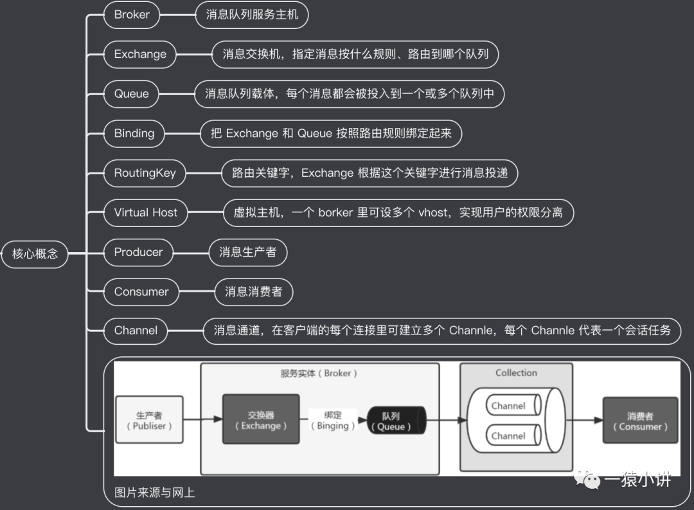

### 1.2. 消息发送模式
#### 1.2.1 简单队列模式
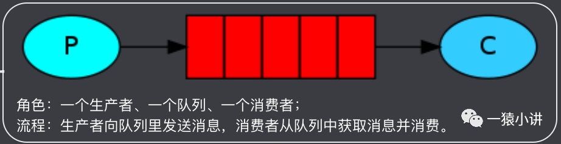

#### 1.2.2 工作队列模式
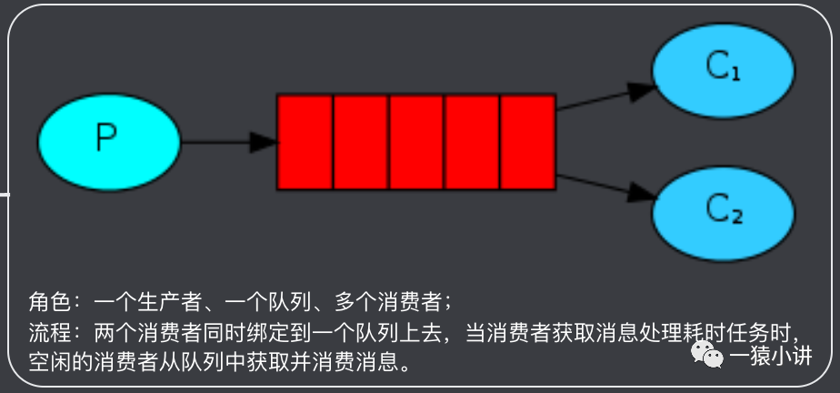

#### 1.2.3 发布/订阅模式
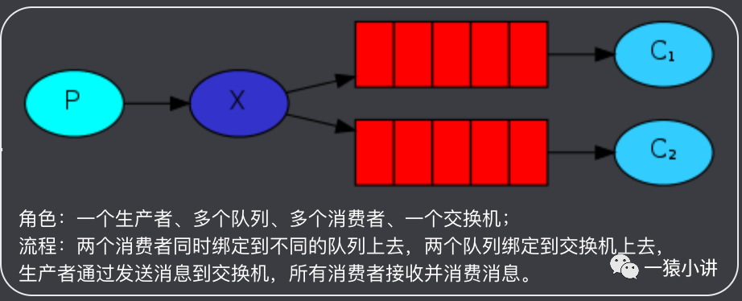

#### 1.2.4 路由模式
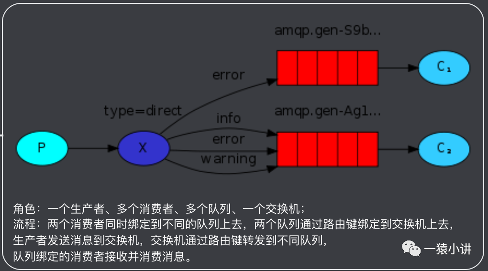

#### 1.2.5 通配符模式
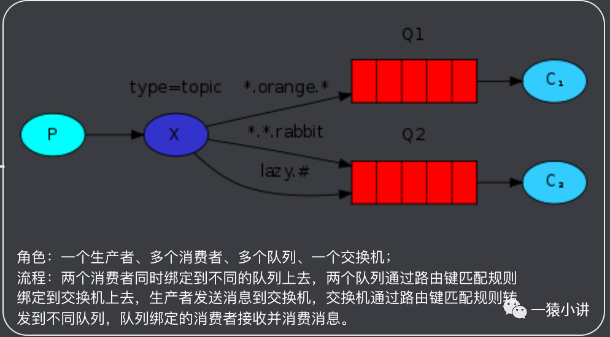

### 1.3. RabbitMQ 安装&体验

#### 1.3.1 通过 brew 来安装 

```shell
brew install rabbitmq
```

#### 1.3.2 启用 rabbitmq management 管理插件

```shell
cd /usr/local/Cellar/rabbitmq/3.9.13
# 启用 rabbitmq management 插件
sudo sbin/rabbitmq-plugins enable rabbitmq_management
```

#### 1.3.3 配置环境变量

```shell
sudo vi /etc/profile
export RABBIT_HOME=/usr/local/Cellar/rabbitmq/3.9.13
export PATH=$PATH:$RABBIT_HOME/sbin
# 配置生效
source /etc/profile
```

#### 1.3.4 启停操作

```shell
# 后台启动
sudo rabbitmq-server -detached
# 查看状态
sudo rabbitmqctl status
# 关闭 rabbitmq
sudo rabbitmqctl stop
```

#### 1.3.5 访问管理界面

[Dashboard](http://localhost:15672/)
- Account: rabbitmq / rabbitmq

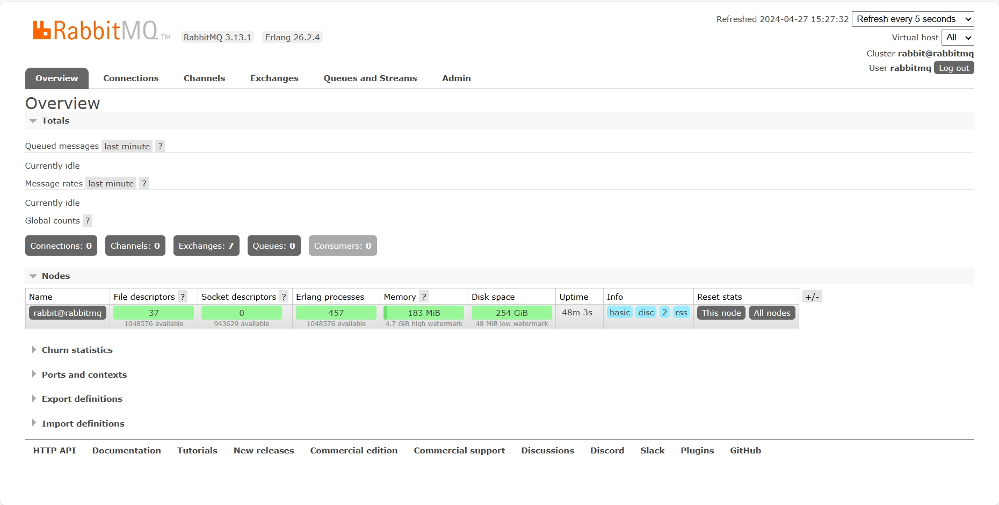

RabbitMQ 基础准备工作就分享到这里，接下来将重点分享 Spring Boot 如何集成 RabbitMQ。

## 2. Spring Boot 集成 RabbitMQ

Spring Boot 提供了 `spring-boot-starter-amqp` 依赖包，对消息队列进行支持，仅需要很少的配置便可集成并实现完整的消息队列服务。

### 2.1. 加入依赖

```xml
<dependency>
    <groupId>org.springframework.boot</groupId>
    <artifactId>spring-boot-starter-amqp</artifactId>
</dependency>
```

### 2.2. 添加配置

在 `application.properties` 文件中加入 RabbitMQ 配置。

```yaml
# RabbitMQ服务的地址
spring.rabbitmq.host=localhost
spring.rabbitmq.port=5672
spring.rabbitmq.username=guest
spring.rabbitmq.password=guest
# RabbitMQ 服务创建的虚拟主机(非必须)
spring.rabbitmq.virtual-host=/
```
### 2.3. 简单消息的发送和接收

#### 2.3.1 创建生产者

生产者需要用到 `RabbitTemplate` 类来生产消息并进行消息发送，代码如下。

```java
import org.springframework.amqp.rabbit.core.RabbitTemplate;
import org.springframework.beans.factory.annotation.Autowired;
import org.springframework.stereotype.Component;

@Component
public class Producer {

    @Autowired
    private RabbitTemplate rabbitTemplate;

    public void produce() {
        String message = "疫情期间注意防护";
        System.out.println("乡长说：" + message);
        rabbitTemplate.convertAndSend("notice_queue", message);
    }
}
```

#### 2.3.2 创建消费者

```java
import org.springframework.amqp.rabbit.annotation.Queue;
import org.springframework.amqp.rabbit.annotation.RabbitHandler;
import org.springframework.amqp.rabbit.annotation.RabbitListener;
import org.springframework.stereotype.Component;

@Component
public class Consumer {

    @RabbitHandler
    @RabbitListener(queuesToDeclare = @Queue("notice_queue"))
    public void process(String message) {
        System.out.println("村里猿公子收到通知：" + message);
    }
}
```

`Consumer` 消费者通过 `@RabbitListener` 注解创建侦听器端点，绑定 `notice_queue` 队列。

- `@RabbitListener` 注解提供了`@QueueBinding`、`@Queue`、`@Exchange` 等对象，通过这个组合注解配置交换机、绑定路由并且配置监听功能等。
- `@RabbitHandler` 注解为具体接收的方法。

#### 2.3.3 集成验证

```java
import com.example.client_app.amqp.Producer;
import org.junit.jupiter.api.Test;
import org.springframework.beans.factory.annotation.Autowired;
import org.springframework.boot.test.context.SpringBootTest;

@SpringBootTest
public class RabbitMQTests {

    @Autowired
    Producer producer;

    @Test
    public void amqpTest() throws InterruptedException {
        // 生产者发送消息
        producer.produce();
        // 让子弹飞一会儿
        Thread.sleep(1000);
    }
}
```

控制台输出如下：

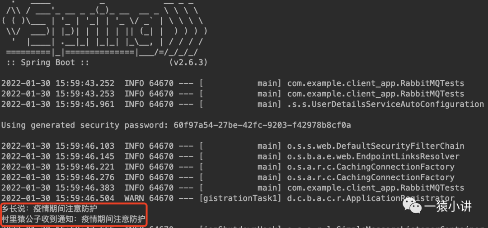

访问 rabbitmq web 页面，效果如下：

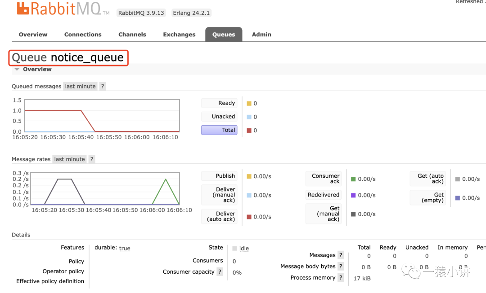

### 2.4. 实体对象消息的发送和接收

#### 2.4.1 生产者代码调整

```java
import com.example.client_app.model.ScProduct;
import org.springframework.amqp.rabbit.core.RabbitTemplate;
import org.springframework.beans.factory.annotation.Autowired;
import org.springframework.stereotype.Component;

@Component
public class Producer {

    @Autowired
    private RabbitTemplate rabbitTemplate;

    public void produce() {
        // 创建一个商品
        ScProduct product = new ScProduct();
        product.setName("苹果 14，512G，银灰");
        product.setNumber(8);
        product.setId(2022);
        product.setProductImg("./iphone14.png");
        // 转换发送商品信息
        System.out.println("产品被" + product.getName() + "秒杀，发送通知");
        rabbitTemplate.convertAndSend("notice_product_queue", product);
    }
}
```

#### 2.4.2 消费者代码调整

```java
import com.example.client_app.model.ScProduct;
import org.springframework.amqp.rabbit.annotation.Queue;
import org.springframework.amqp.rabbit.annotation.RabbitHandler;
import org.springframework.amqp.rabbit.annotation.RabbitListener;
import org.springframework.stereotype.Component;

@Component
public class Consumer {

    @RabbitHandler
    @RabbitListener(queuesToDeclare = @Queue("notice_product_queue"))
    public void process(ScProduct product) {
        System.out.println("收到秒杀产品信息为：" + product);
    }
}
```

##### 2.4.3 集成验证

单元测试类无需调整，控制台输出如下。

```java
产品被苹果 14，512G，银灰秒杀，发送通知
收到秒杀产品信息为：ScProduct{id=2022, name='苹果 14，512G，银灰', productImg='./iphone14.png', number=8, startTime=null, endTime=null, createTime=null}
```

访问管理台页面，展示如下:

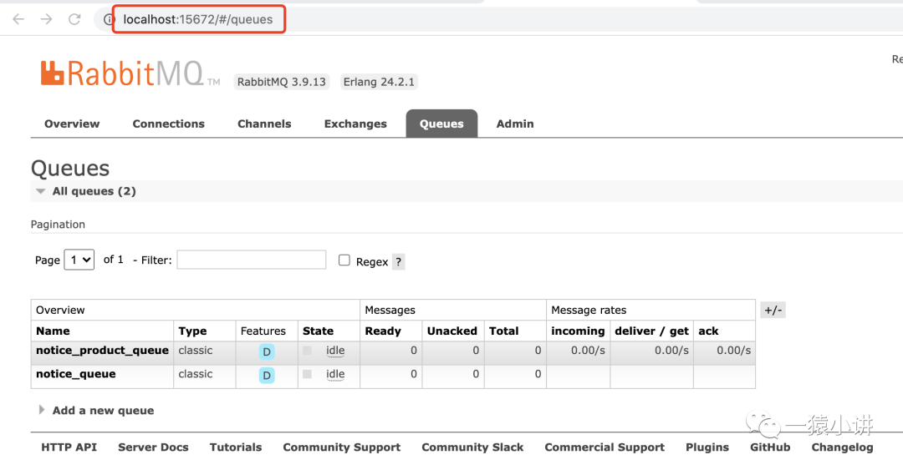

至此，Spring Boot 集成 RabbitMQ 简单队列模式就完成了，至于 RabbitMQ 其余的几种模式的整合，可直接参考 RabbitMQ 官网进行学习。

## 3. 例行回顾

本文是 Spring Boot 项目集成 RabbitMQ 的讲解，主要分享了如下部分：

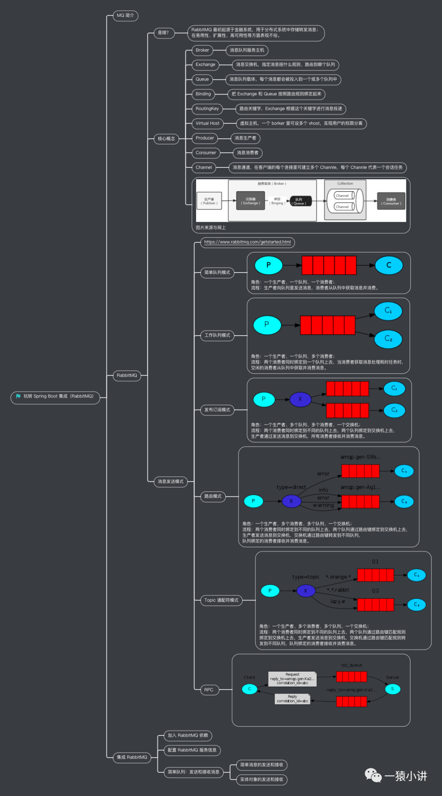
