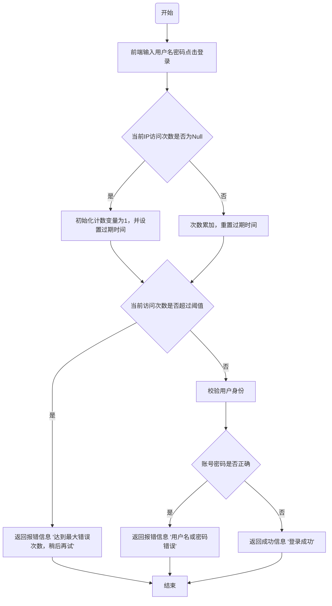

- [三次输错密码后，系统是怎么做到不让我继续尝试的？](https://juejin.cn/post/7232128694503145533)
- [三次输错密码后，系统是怎么做到不让我继续尝试的](https://mp.weixin.qq.com/s/mhGdMuMddObHF56Qh28wEQ)

## 1 故事背景
忘记密码这件事，相信绝大多数人都遇到过，输一次错一次，错到几次以上，就不允许你继续尝试了。

但当你尝试重置密码，又发现新密码不能和原密码重复：

图片
相信此刻心情只能用一张图形容：

图片
虽然，但是，密码还是很重要的，顺便我有了一个问题：三次输错密码后，系统是怎么做到不让我继续尝试的？

## 2 我想了想，有如下几个问题需要搞定
- 是只有输错密码才锁定，还是账户名和密码任何一个输错就锁定？
- 输错之后也不是完全冻结，为啥隔了几分钟又可以重新输了？
- 技术栈到底麻不麻烦？
去网上搜了搜，也问了下ChatGPT，找到一套解决方案：SpringBoot+Redis+Lua脚本。

这套方案也不算新，很早就有人在用了，不过难得是自己想到的问题和解法，就记录一下吧。

顺便回答一下上面的三个问题：

- 锁定的是IP，不是输入的账户名或者密码，也就是说任一一个输错3次就会被锁定
- Redis的Lua脚本中实现了key过期策略，当key消失时锁定自然也就消失了
- 技术栈同SpringBoot+Redis+Lua脚本

## 3 那么自己动手实现一下
### 前端部分

首先写一个账密输入页面，使用很简单HTML加表单提交
```html
<!DOCTYPE html>
<html>
<head>
 <title>登录页面</title>
 <style>
  body {
   background-color: #F5F5F5;
  }
  form {
   width: 300px;
   margin: 0 auto;
   margin-top: 100px;
   padding: 20px;
   background-color: white;
   border-radius: 5px;
   box-shadow: 0 0 10px rgba(0,0,0,0.2);
  }
  label {
   display: block;
   margin-bottom: 10px;
  }
  input[type="text"], input[type="password"] {
   border: none;
   padding: 10px;
   margin-bottom: 20px;
   border-radius: 5px;
   box-shadow: 0 0 5px rgba(0,0,0,0.1);
   width: 100%;
   box-sizing: border-box;
   font-size: 16px;
  }
  input[type="submit"] {
   background-color: #30B0F0;
   color: white;
   border: none;
   padding: 10px;
   border-radius: 5px;
   box-shadow: 0 0 5px rgba(0,0,0,0.1);
   width: 100%;
   font-size: 16px;
   cursor: pointer;
  }
  input[type="submit"]:hover {
   background-color: #1C90D6;
  }
 </style>
</head>
<body>
 <form action="http://localhost:8080/login" method="get">
  <label for="username">用户名</label>
  <input type="text" id="username" name="username" placeholder="请输入用户名" required>
  <label for="password">密码</label>
  <input type="password" id="password" name="password" placeholder="请输入密码" required>
  <input type="submit" value="登录">
 </form>
</body>
</html>
```

效果如下:

图片

### 后端部分
#### 技术选型分析
首先我们画一个流程图来分析一下这个登录限制流程。



- 从流程图上看，首先访问次数的统计与判断不是在登录逻辑执行后，而是执行前就加1了；
- 其次登录逻辑的成功与失败并不会影响到次数的统计；
- 最后还有一点流程图上没有体现出来，这个次数的统计是有过期时间的，当过期之后又可以重新登录了。

#### 那为什么是Redis+Lua脚本呢？

Redis的选择不难看出，这个流程比较重要的是存在一个用来计数的变量，这个变量既要满足分布式读写需求，还要满足全局递增或递减的需求，那Redis的incr方法是最优选了。

那为什么需要Lua脚本呢？流程上在验证用户操作前有些操作，如图：

这里至少有3步Redis的操作，`get`、`incr`、`expire`，如果全放到应用里面来操作，有点慢且浪费资源。

Lua脚本的优点如下：

- **减少网络开销**。 可以将多个请求通过脚本的形式一次发送，减少网络时延。
- **原子操作**。 Redis会将整个脚本作为一个整体执行，中间不会被其他请求插入。因此在脚本运行过程中无需担心会出现竞态条件，无需使用事务。
- **复用**。 客户端发送的脚本会永久存在redis中，这样其他客户端可以复用这一脚本，而不需要使用代码完成相同的逻辑。

最后为了增加功能的复用性，我打算使用Java注解的方式实现这个功能。

## 4 代码实现
项目结构如下

### 配置文件

pom.xml
```xml
<?xml version="1.0" encoding="UTF-8"?>
<project xmlns="http://maven.apache.org/POM/4.0.0" xmlns:xsi="http://www.w3.org/2001/XMLSchema-instance"
         xsi:schemaLocation="http://maven.apache.org/POM/4.0.0 https://maven.apache.org/xsd/maven-4.0.0.xsd">
    <modelVersion>4.0.0</modelVersion>
    <parent>
        <groupId>org.springframework.boot</groupId>
        <artifactId>spring-boot-starter-parent</artifactId>
        <version>2.7.11</version>
        <relativePath/> <!-- lookup parent from repository -->
    </parent>
    <groupId>com.example</groupId>
    <artifactId>LoginLimit</artifactId>
    <version>0.0.1-SNAPSHOT</version>
    <name>LoginLimit</name>
    <description>Demo project for Spring Boot</description>
    <properties>
        <java.version>1.8</java.version>
    </properties>
    <dependencies>
        <dependency>
            <groupId>org.springframework.boot</groupId>
            <artifactId>spring-boot-starter-web</artifactId>
        </dependency>

        <dependency>
            <groupId>org.springframework.boot</groupId>
            <artifactId>spring-boot-starter-test</artifactId>
            <scope>test</scope>
        </dependency>
        <!-- redis -->
        <dependency>
            <groupId>org.springframework.boot</groupId>
            <artifactId>spring-boot-starter-data-redis</artifactId>
        </dependency>
        <!-- Jedis -->
        <dependency>
            <groupId>redis.clients</groupId>
            <artifactId>jedis</artifactId>
        </dependency>
        <!--切面依赖 -->
        <dependency>
            <groupId>org.aspectj</groupId>
            <artifactId>aspectjweaver</artifactId>
        </dependency>
        <!-- commons-lang3 -->
        <dependency>
            <groupId>org.apache.commons</groupId>
            <artifactId>commons-lang3</artifactId>
        </dependency>
        <!-- guava -->
        <dependency>
            <groupId>com.google.guava</groupId>
            <artifactId>guava</artifactId>
            <version>23.0</version>
        </dependency>
        <!-- lombok -->
        <dependency>
            <groupId>org.projectlombok</groupId>
            <artifactId>lombok</artifactId>
            <optional>true</optional>
        </dependency>
    </dependencies>

    <build>
        <plugins>
            <plugin>
                <groupId>org.springframework.boot</groupId>
                <artifactId>spring-boot-maven-plugin</artifactId>
            </plugin>
        </plugins>
    </build>

</project>
```

application.properties

```properties
## Redis配置
spring.redis.host=127.0.0.1
spring.redis.port=6379
spring.redis.password=
spring.redis.timeout=1000
## Jedis配置
spring.redis.jedis.pool.min-idle=0
spring.redis.jedis.pool.max-idle=500
spring.redis.jedis.pool.max-active=2000
spring.redis.jedis.pool.max-wait=10000
```

### 注解部分 
LimitCount.java
```java
package com.example.loginlimit.annotation;

import java.lang.annotation.ElementType;
import java.lang.annotation.Retention;
import java.lang.annotation.RetentionPolicy;
import java.lang.annotation.Target;

/**
 * 次数限制注解
 * 作用在接口方法上
 */
@Target(ElementType.METHOD)
@Retention(RetentionPolicy.RUNTIME)
public @interface LimitCount {
    /**
     * 资源名称，用于描述接口功能
     */
    String name() default "";

    /**
     * 资源 key
     */
    String key() default "";

    /**
     * key prefix
     *
     * @return
     */
    String prefix() default "";

    /**
     * 时间的，单位秒
     * 默认60s过期
     */
    int period() default 60;

    /**
     * 限制访问次数
     * 默认3次
     */
    int count() default 3;
}
```

### 核心处理逻辑类
LimitCountAspect.java
```java
package com.example.loginlimit.aspect;

import java.io.Serializable;
import java.lang.reflect.Method;
import java.util.Objects;

import javax.servlet.http.HttpServletRequest;

import com.example.loginlimit.annotation.LimitCount;
import com.example.loginlimit.util.IPUtil;
import com.google.common.collect.ImmutableList;
import lombok.extern.slf4j.Slf4j;
import org.apache.commons.lang3.StringUtils;
import org.aspectj.lang.ProceedingJoinPoint;
import org.aspectj.lang.annotation.Around;
import org.aspectj.lang.annotation.Aspect;
import org.aspectj.lang.annotation.Pointcut;
import org.aspectj.lang.reflect.MethodSignature;
import org.springframework.beans.factory.annotation.Autowired;
import org.springframework.data.redis.core.RedisTemplate;
import org.springframework.data.redis.core.script.DefaultRedisScript;
import org.springframework.data.redis.core.script.RedisScript;
import org.springframework.stereotype.Component;
import org.springframework.web.context.request.RequestContextHolder;
import org.springframework.web.context.request.ServletRequestAttributes;

@Slf4j
@Aspect
@Component
public class LimitCountAspect {

    private final RedisTemplate<String, Serializable> limitRedisTemplate;

    @Autowired
    public LimitCountAspect(RedisTemplate<String, Serializable> limitRedisTemplate) {
        this.limitRedisTemplate = limitRedisTemplate;
    }

    @Pointcut("@annotation(com.example.loginlimit.annotation.LimitCount)")
    public void pointcut() {
        // do nothing
    }

    @Around("pointcut()")
    public Object around(ProceedingJoinPoint point) throws Throwable {
        HttpServletRequest request = ((ServletRequestAttributes)Objects.requireNonNull(
            RequestContextHolder.getRequestAttributes())).getRequest();

        MethodSignature signature = (MethodSignature)point.getSignature();
        Method method = signature.getMethod();
        LimitCount annotation = method.getAnnotation(LimitCount.class);
        //注解名称
        String name = annotation.name();
        //注解key
        String key = annotation.key();
        //访问IP
        String ip = IPUtil.getIpAddr(request);
        //过期时间
        int limitPeriod = annotation.period();
        //过期次数
        int limitCount = annotation.count();

        ImmutableList<String> keys = ImmutableList.of(StringUtils.join(annotation.prefix() + "_", key, ip));
        String luaScript = buildLuaScript();
        RedisScript<Number> redisScript = new DefaultRedisScript<>(luaScript, Number.class);
        Number count = limitRedisTemplate.execute(redisScript, keys, limitCount, limitPeriod);
        log.info("IP:{} 第 {} 次访问key为 {}，描述为 [{}] 的接口", ip, count, keys, name);
        if (count != null && count.intValue() <= limitCount) {
            return point.proceed();
        } else {
            return "接口访问超出频率限制";
        }
    }

    /**
     * 限流脚本
     * 调用的时候不超过阈值，则直接返回并执行计算器自加。
     *
     * @return lua脚本
     */
    private String buildLuaScript() {
        return "local c" +
            "\nc = redis.call('get',KEYS[1])" +
            "\nif c and tonumber(c) > tonumber(ARGV[1]) then" +
            "\nreturn c;" +
            "\nend" +
            "\nc = redis.call('incr',KEYS[1])" +
            "\nif tonumber(c) == 1 then" +
            "\nredis.call('expire',KEYS[1],ARGV[2])" +
            "\nend" +
            "\nreturn c;";
    }

}
```

### 获取IP地址工具类
IPUtil.java
```java
package com.example.loginlimit.util;

import javax.servlet.http.HttpServletRequest;

public class IPUtil {

    private static final String UNKNOWN = "unknown";

    protected IPUtil() {

    }

    /**
     * 获取 IP地址
     * 使用 Nginx等反向代理软件， 则不能通过 request.getRemoteAddr()获取 IP地址
     * 如果使用了多级反向代理的话，X-Forwarded-For的值并不止一个，而是一串IP地址，
     * X-Forwarded-For中第一个非 unknown的有效IP字符串，则为真实IP地址
     */
    public static String getIpAddr(HttpServletRequest request) {
        String ip = request.getHeader("x-forwarded-for");
        if (ip == null || ip.length() == 0 || UNKNOWN.equalsIgnoreCase(ip)) {
            ip = request.getHeader("Proxy-Client-IP");
        }
        if (ip == null || ip.length() == 0 || UNKNOWN.equalsIgnoreCase(ip)) {
            ip = request.getHeader("WL-Proxy-Client-IP");
        }
        if (ip == null || ip.length() == 0 || UNKNOWN.equalsIgnoreCase(ip)) {
            ip = request.getRemoteAddr();
        }
        return "0:0:0:0:0:0:0:1".equals(ip) ? "127.0.0.1" : ip;
    }

}
```

Lua限流脚本的说明，脚本代码如下：
```java
  private String buildLuaScript() {
        return "local c" +
            "\nc = redis.call('get',KEYS[1])" +
            "\nif c and tonumber(c) > tonumber(ARGV[1]) then" +
            "\nreturn c;" +
            "\nend" +
            "\nc = redis.call('incr',KEYS[1])" +
            "\nif tonumber(c) == 1 then" +
            "\nredis.call('expire',KEYS[1],ARGV[2])" +
            "\nend" +
            "\nreturn c;";
    }
```

这段脚本有一个判断， `tonumber(c) > tonumber(ARGV[1])`这行表示如果当前key 的值大于了`limitCount`，直接返回；否则调用incr方法进行累加1，且调用expire方法设置过期时间。

### 配置类
RedisConfig.java
```java
package com.example.loginlimit.config;

import java.io.IOException;
import java.io.Serializable;
import java.time.Duration;
import java.util.Arrays;

import com.fasterxml.jackson.core.JsonProcessingException;
import com.fasterxml.jackson.databind.ObjectMapper;
import org.apache.commons.lang3.StringUtils;
import org.springframework.beans.factory.annotation.Value;
import org.springframework.boot.autoconfigure.condition.ConditionalOnMissingBean;
import org.springframework.cache.CacheManager;
import org.springframework.cache.annotation.CachingConfigurerSupport;
import org.springframework.cache.interceptor.KeyGenerator;
import org.springframework.context.annotation.Bean;
import org.springframework.context.annotation.Configuration;
import org.springframework.data.redis.cache.RedisCacheManager;
import org.springframework.data.redis.connection.RedisConnectionFactory;
import org.springframework.data.redis.connection.RedisPassword;
import org.springframework.data.redis.connection.RedisStandaloneConfiguration;
import org.springframework.data.redis.connection.jedis.JedisClientConfiguration;
import org.springframework.data.redis.connection.jedis.JedisConnectionFactory;
import org.springframework.data.redis.core.RedisTemplate;
import org.springframework.data.redis.core.StringRedisTemplate;
import org.springframework.data.redis.serializer.GenericJackson2JsonRedisSerializer;
import org.springframework.data.redis.serializer.RedisSerializer;
import org.springframework.data.redis.serializer.SerializationException;
import org.springframework.data.redis.serializer.StringRedisSerializer;
import redis.clients.jedis.JedisPool;
import redis.clients.jedis.JedisPoolConfig;

@Configuration
public class RedisConfig extends CachingConfigurerSupport {

    @Value("${spring.redis.host}")
    private String host;

    @Value("${spring.redis.port}")
    private int port;

    @Value("${spring.redis.password}")
    private String password;

    @Value("${spring.redis.timeout}")
    private int timeout;

    @Value("${spring.redis.jedis.pool.max-idle}")
    private int maxIdle;

    @Value("${spring.redis.jedis.pool.max-wait}")
    private long maxWaitMillis;

    @Value("${spring.redis.database:0}")
    private int database;

    @Bean
    public JedisPool redisPoolFactory() {
        JedisPoolConfig jedisPoolConfig = new JedisPoolConfig();
        jedisPoolConfig.setMaxIdle(maxIdle);
        jedisPoolConfig.setMaxWaitMillis(maxWaitMillis);
        if (StringUtils.isNotBlank(password)) {
            return new JedisPool(jedisPoolConfig, host, port, timeout, password, database);
        } else {
            return new JedisPool(jedisPoolConfig, host, port, timeout, null, database);
        }
    }

    @Bean
    JedisConnectionFactory jedisConnectionFactory() {
        RedisStandaloneConfiguration redisStandaloneConfiguration = new RedisStandaloneConfiguration();
        redisStandaloneConfiguration.setHostName(host);
        redisStandaloneConfiguration.setPort(port);
        redisStandaloneConfiguration.setPassword(RedisPassword.of(password));
        redisStandaloneConfiguration.setDatabase(database);

        JedisClientConfiguration.JedisClientConfigurationBuilder jedisClientConfiguration = JedisClientConfiguration
            .builder();
        jedisClientConfiguration.connectTimeout(Duration.ofMillis(timeout));
        jedisClientConfiguration.usePooling();
        return new JedisConnectionFactory(redisStandaloneConfiguration, jedisClientConfiguration.build());
    }

    @Bean(name = "redisTemplate")
    @SuppressWarnings({"rawtypes"})
    @ConditionalOnMissingBean(name = "redisTemplate")
    public RedisTemplate<Object, Object> redisTemplate(RedisConnectionFactory redisConnectionFactory) {
        RedisTemplate<Object, Object> template = new RedisTemplate<>();
        //使用 fastjson 序列化
        JacksonRedisSerializer jacksonRedisSerializer = new JacksonRedisSerializer<>(Object.class);
        // value 值的序列化采用 fastJsonRedisSerializer
        template.setValueSerializer(jacksonRedisSerializer);
        template.setHashValueSerializer(jacksonRedisSerializer);
        // key 的序列化采用 StringRedisSerializer
        template.setKeySerializer(new StringRedisSerializer());
        template.setHashKeySerializer(new StringRedisSerializer());

        template.setConnectionFactory(redisConnectionFactory);
        return template;
    }

    //缓存管理器
    @Bean
    public CacheManager cacheManager(RedisConnectionFactory redisConnectionFactory) {
        RedisCacheManager.RedisCacheManagerBuilder builder = RedisCacheManager.RedisCacheManagerBuilder
            .fromConnectionFactory(redisConnectionFactory);
        return builder.build();
    }

    @Bean
    @ConditionalOnMissingBean(StringRedisTemplate.class)
    public StringRedisTemplate stringRedisTemplate(RedisConnectionFactory redisConnectionFactory) {
        StringRedisTemplate template = new StringRedisTemplate();
        template.setConnectionFactory(redisConnectionFactory);
        return template;
    }

    @Bean
    public KeyGenerator wiselyKeyGenerator() {
        return (target, method, params) -> {
            StringBuilder sb = new StringBuilder();
            sb.append(target.getClass().getName());
            sb.append(method.getName());
            Arrays.stream(params).map(Object::toString).forEach(sb::append);
            return sb.toString();
        };
    }

    @Bean
    public RedisTemplate<String, Serializable> limitRedisTemplate(RedisConnectionFactory redisConnectionFactory) {
        RedisTemplate<String, Serializable> template = new RedisTemplate<>();
        template.setKeySerializer(new StringRedisSerializer());
        template.setValueSerializer(new GenericJackson2JsonRedisSerializer());
        template.setConnectionFactory(redisConnectionFactory);
        return template;
    }
}

class JacksonRedisSerializer<T> implements RedisSerializer<T> {
    private Class<T> clazz;
    private ObjectMapper mapper;

    JacksonRedisSerializer(Class<T> clazz) {
        super();
        this.clazz = clazz;
        this.mapper = new ObjectMapper();
        mapper.enableDefaultTyping(ObjectMapper.DefaultTyping.NON_FINAL);
    }

    @Override
    public byte[] serialize(T t) throws SerializationException {
        try {
            return mapper.writeValueAsBytes(t);
        } catch (JsonProcessingException e) {
            e.printStackTrace();
            return null;
        }
    }

    @Override
    public T deserialize(byte[] bytes) throws SerializationException {
        if (bytes.length <= 0) {
            return null;
        }
        try {
            return mapper.readValue(bytes, clazz);
        } catch (IOException e) {
            e.printStackTrace();
            return null;
        }
    }
}
```

### Web接口 
LoginController.java
```java
package com.example.loginlimit.controller;

import javax.servlet.http.HttpServletRequest;

import com.example.loginlimit.annotation.LimitCount;
import lombok.extern.slf4j.Slf4j;
import org.apache.commons.lang3.StringUtils;
import org.springframework.web.bind.annotation.GetMapping;
import org.springframework.web.bind.annotation.RequestParam;
import org.springframework.web.bind.annotation.RestController;

@Slf4j
@RestController
public class LoginController {

    @GetMapping("/login")
    @LimitCount(key = "login", name = "登录接口", prefix = "limit")
    public String login(
        @RequestParam(required = true) String username,
        @RequestParam(required = true) String password, HttpServletRequest request) throws Exception {
        if (StringUtils.equals("张三", username) && StringUtils.equals("123456", password)) {
            return "登录成功";
        }
        return "账户名或密码错误";
    }

}
```

### 启动类 
LoginLimitApplication.java
```java
package com.example.loginlimit;

import org.springframework.boot.SpringApplication;
import org.springframework.boot.autoconfigure.SpringBootApplication;

@SpringBootApplication
public class LoginLimitApplication {

    public static void main(String[] args) {
        SpringApplication.run(LoginLimitApplication.class, args);
    }

}
```

## 5 演示效果
上面这套限流的逻辑感觉用在小型或中型的项目上应该问题不大，不过目前的登录很少有直接锁定账号不能输入的，一般都是弹出一个验证码框，让你输入验证码再提交。我觉得用我这套逻辑改改应该不成问题，核心还是接口尝试次数的限制嘛！
