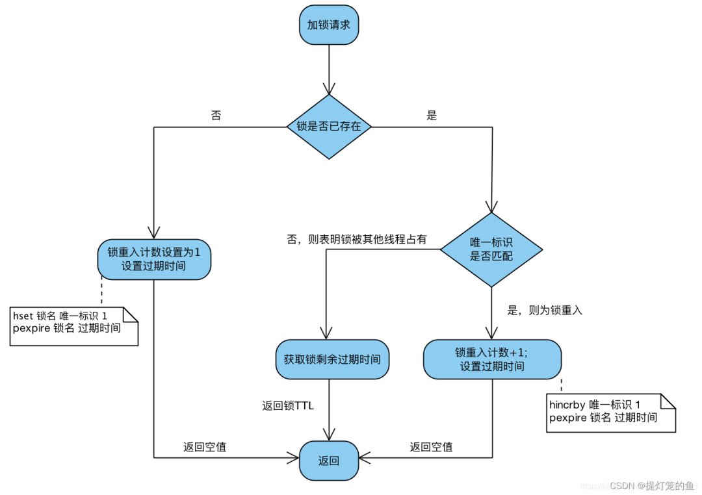
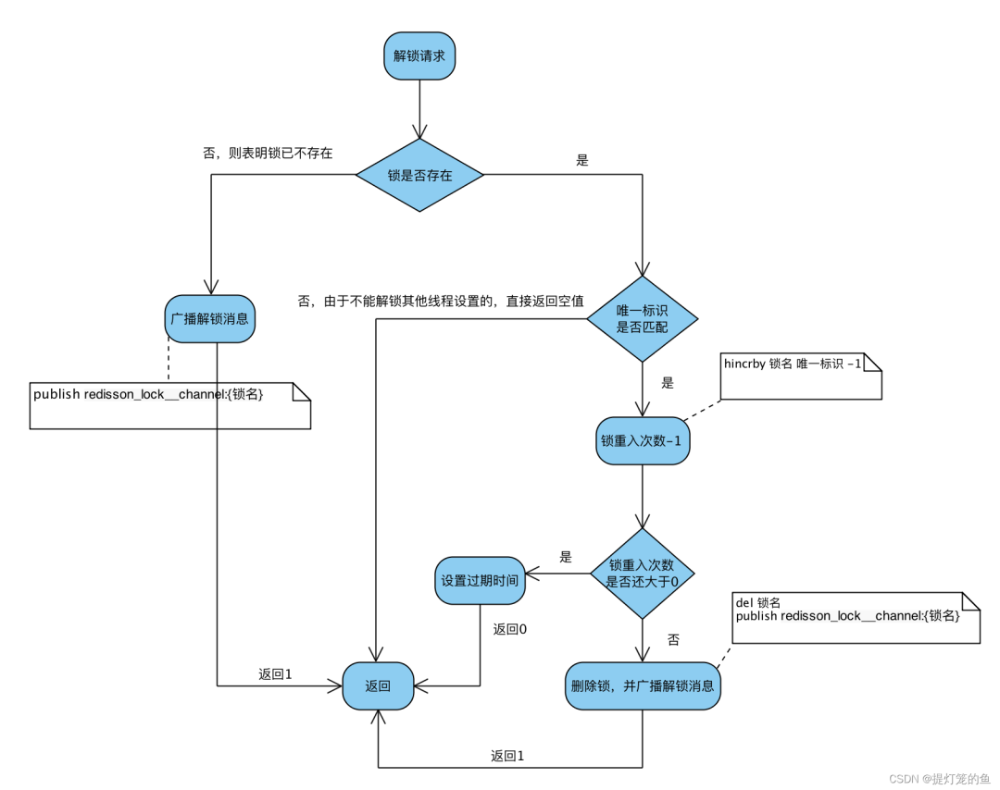

- [分布式锁 — Redisson 全面解析！](https://mp.weixin.qq.com/s/A7H6L9bZEkD7Z3WaRxh5iQ)

## 前言
分布式锁主要是解决集群，分布式下数据一致性的问题。在单机的环境下，应用是在同一进程下的，只需要保证单进程多线程环境中的线程安全性，通过 JAVA 提供的 `volatile`、`ReentrantLock`、`synchronized` 以及 `concurrent` 并发包下一些线程安全的类等就可以做到。

分布式锁的实现主要有以下方式：

- 基于数据库
- 基于分布式协调系统
- 基于缓存
  - 基于redis命令。如:`setnx`等操作
  - 基于redis Lua脚本能力（本文介绍的实现方式 redisson）

## 一、Redisson的使用
Redisson 支持单点模式、主从模式、哨兵模式、集群模式，这里以单点模式为例

### 1. 引入maven依赖
```xml
<!-- maven版本号根据项目版本自行调整 -->
<!--redis-->
<dependency>
    <groupId>org.springframework.boot</groupId>
    <artifactId>spring-boot-starter-data-redis</artifactId>
    <version>2.4.0</version>
</dependency>
<!--使用redisson作为分布式锁-->
<dependency>
    <groupId>org.redisson</groupId>
    <artifactId>redisson</artifactId>
    <version>3.16.8</version>
</dependency>
```

### 2. yml配置
```yaml
spring:
  redis:
    # Redis数据库索引（默认为0）
    database: 0
    # Redis服务器地址
    host: 127.0.0.1
    # Redis服务器连接端口
    port: 6379
    # Redis服务器链接密码（默认为空）
    password:
    jedis:
      pool:
        # 连接池最大链接数（负值表示没有限制）
        max-active: 20
        # 连接池最大阻塞等待时间（负值表示没有限制）
        max-wait: -1
        # 链接池中最大空闲链接
        max-idle: 10
        # 连接池中最小空闲链接
        min-idle: 0
    # 链接超市时间（毫秒）
    timeout: 1000
```

### 3. Redisson配置
```java
@Configuration
public class RedissonConfig {

    @Value("${spring.redis.host}")
    private String redisHost;
    @Value("${spring.redis.password}")
    private String redisPassword;
    @Value("${spring.redis.port}")
    private String port;

    @Bean
    @ConditionalOnMissingBean
    public RedissonClient redissonClient() {
        Config config = new Config();
        //单机模式  依次设置redis地址和密码
        System.out.println(redisHost);
        // config.useSingleServer().setAddress("redis://" + redisHost + ":" + port).setPassword(redisPassword);
        // 没有配置redis密码
        config.useSingleServer().setAddress("redis://" + redisHost + ":" + port);
        return Redisson.create(config);
    }
}
```

### 4. 测试用例
```java
package com.example.aopdemo;

import com.example.aopdemo.springbootaopdemo.SpringBootDemoxzApplication;
import java.util.concurrent.TimeUnit;
import javax.annotation.Resource;
import lombok.extern.slf4j.Slf4j;
import org.junit.jupiter.api.Test;
import org.redisson.api.RLock;
import org.redisson.api.RedissonClient;
import org.springframework.boot.test.context.SpringBootTest;
import org.springframework.scheduling.concurrent.ThreadPoolTaskExecutor;

/**
 * @ClassName RedissonTest
 * @Description Redisson测试用例
 * @Author 阿Q
 * @Date 2022/11/26
 */
@Slf4j
@SpringBootTest(classes = SpringBootDemoxzApplication.class)
public class RedissonTest {

    @Resource
    private RedissonClient redissonClient;

    @Resource
    private ThreadPoolTaskExecutor executor;

    // redisson分布式锁的key
    private static final String LOCK_TEST_KEY = "redisson:lock:test";

    int n = 500;

    /**
     * 分布式锁测试用例
     */
    @Test
    public void lockTest() {
        // 利用 循环+多线程 模仿高并发请求
        for (int i = 0; i < 10; i++) {
            executor.execute(() -> {
                // 这里获取公平锁，遵循先进先出原则，方便测试
                RLock fairLock = redissonClient.getFairLock(LOCK_TEST_KEY);

                try {
                    // 尝试加锁
                    // waitTimeout 尝试获取锁的最大等待时间，超过这个值，则认为获取锁失败
                    // leaseTime   锁的持有时间,超过这个时间锁会自动失效（值应设置为大于业务处理的时间，确保在锁有效期内业务能处理完）
                    boolean lock = fairLock.tryLock(3000, 30, TimeUnit.MILLISECONDS);
                    if (lock){
                        log.info("线程:" + Thread.currentThread().getName() + "获得了锁");
                        log.info("剩余数量:{}", --n);
                    }
                } catch (InterruptedException e) {
                    e.printStackTrace();

                } finally {
                    log.info("线程:" + Thread.currentThread().getName() + "准备释放锁");
                    // 注意，无论出现任何情况，都要主动解锁
                    fairLock.unlock();
                }
            });
        }

        try {
            // ->_-> 这里使当前方法占用的线程休息10秒，不要立即结束
            Thread.sleep(10000);
        } catch (InterruptedException e) {
            e.printStackTrace();
        }
    }
}
```

## 二、Redisson源码分析
redisson这个框架的实现依赖了Lua脚本和Netty，以及各种`Future`及`FutureListener`的异步、同步操作转换，加锁和解锁过程中还巧妙地利用了redis的发布订阅功能

### 1. 简单了解Lua脚本（Redisson 版本 3.16.8）
想要真正读懂redisson底层的加锁解锁实现，基本的lua脚本还是要了解一下的，这里作者就不深入了（毕竟我也是门外汉），大家有兴趣的可以去深入一下，这里只针对锁的实现来解释一下。另外，搜索公众号Linux就该这样学后台回复“猴子”，获取一份惊喜礼包。

### 2. 加锁脚本
- `KEYS[1]` 锁的名字
- `ARGV[1]` 锁自动失效时间（毫秒，默认30s（看门狗续期时长））
- `ARGV[2]` hash子项的key(`uuid+threadId`)
```lua
--如果锁不存在
if (redis.call('exists', KEYS[1]) == 0) then
--重入次数初始为0后加一
redis.call('hincrby', KEYS[1], ARGV[2], 1);
--设锁的过期时间
redis.call('pexpire', KEYS[1], ARGV[1]);
--返回null-代表加锁成功
return nil;
--结束符
end;
--如果加锁的进程已存在
if (redis.call('hexists', KEYS[1], ARGV[2]) == 1) then
--重入次数加一
redis.call('hincrby', KEYS[1], ARGV[2], 1);
--更新锁的过期时间(毫秒)
redis.call('pexpire', KEYS[1], ARGV[1]);
--返回null-代表重入成功
return nil;
--结束符
end;
--返回锁的剩余时间（毫秒）-代表加锁失败
return redis.call('pttl', KEYS[1]);
```



> 结论：当且仅当返回nil，才表示加锁成功；

### 3. 解锁脚本
- `KEYS[1]` 锁的名字
- `KEYS[2]` 发布订阅的`channel=redisson_lock__channel:{lock_name}`
- `ARGV[1]` 发布订阅中解锁消息=0
- `ARGV[2]` 看门狗续期时间
- `ARGV[3]` hash子项的key=`uuid+threadId`
```lua
--如果锁不存在
if (redis.call('hexists', KEYS[1], ARGV[3]) == 0) then
--返回null-代表解锁成功
return nil;
end;
--重入次数减一
local counter = redis.call('hincrby', KEYS[1], ARGV[3], -1);
--如果重入次数不为0，对锁进行续期（使用看门狗的续期时间，默认续期30s）
if (counter > 0) then
redis.call('pexpire', KEYS[1], ARGV[2]);
--返回0-代表锁的重入次数减一，解锁成功
return 0;
--否则重入次数<=0
else
--删除key
redis.call('del', KEYS[1]);
--向channel中发布删除key的消息
redis.call('publish', KEYS[2], ARGV[1]);
--返回1-代表锁被删除，解锁成功
return 1;
end;
return nil;
```



> 结论：当且仅当返回1，才表示当前请求真正解锁；

### 4. 看门口续期lua脚本
`io.netty.util.TimerTask`每10秒执行一次（30（续期时间）/3）

- `KEYS[1]` 锁的名字
- `ARGV[1]`

```lua
--自己加的锁存在
if (redis.call('hexists', KEYS[1], ARGV[2]) == 1) then
--续期
redis.call('pexpire', KEYS[1], ARGV[1]);
--1代表续期成功
return 1;
end;
--自己加的锁不存在，后续不需要再续期
return 0;
```


## 三、源码鉴赏

### 1. 加锁逻辑
```java
// tryLock 是Redisson加锁的核心代码，在这里，我们基本可以了解加锁的整个逻辑流程
@Override
public boolean tryLock(long waitTime, long leaseTime, TimeUnit unit) throws InterruptedException {
    // 获取锁能容忍的最大等待时长
    long time = unit.toMillis(waitTime);
    // 获取当前系统时间 - 节点一
    long current = System.currentTimeMillis();
    // 获取当前线程id
    long threadId = Thread.currentThread().getId();
    
    // 【核心点1】尝试获取锁，若返回值为null，则表示已获取到锁
    Long ttl = tryAcquire(waitTime, leaseTime, unit, threadId);
    if (ttl == null) {
        return true;
    }
    
   // 剩余等待时长 =   最大等待时长-（当前时间-节点一）
    time -= System.currentTimeMillis() - current;
    if (time <= 0) {
        acquireFailed(waitTime, unit, threadId);
        return false;
    }
    
    current = System.currentTimeMillis();
    
    // 【核心点2】订阅解锁消息
    CompletableFuture<RedissonLockEntry> subscribeFuture = subscribe(threadId);
    try {
        // 以阻塞的方式获取订阅结果，最大等待时常time
        subscribeFuture.toCompletableFuture().get(time, TimeUnit.MILLISECONDS);
    } catch (ExecutionException | TimeoutException e) {
        // 判断异步任务是否不存在
        if (!subscribeFuture.cancel(false)) {
            subscribeFuture.whenComplete((res, ex) -> {
                // 异步任务出现异常，取消订阅
                if (ex == null) {
                    unsubscribe(res, threadId);
                }
            });
        }
        acquireFailed(waitTime, unit, threadId);
        return false;
    }

    try {
        // 剩余等待时长
        time -= System.currentTimeMillis() - current;
        if (time <= 0) {
            acquireFailed(waitTime, unit, threadId);
            return false;
        }
    
    // 循环获取锁      
        while (true) {
            long currentTime = System.currentTimeMillis();
            // 再次获取锁，成功则返回
            ttl = tryAcquire(waitTime, leaseTime, unit, threadId);
            // lock acquired
            if (ttl == null) {
                return true;
            }

            time -= System.currentTimeMillis() - currentTime;
            if (time <= 0) {
                acquireFailed(waitTime, unit, threadId);
                return false;
            }

            currentTime = System.currentTimeMillis();
            
            // 【核心点3】阻塞等待信号量唤醒或者超时，接收到订阅时唤醒
         // 使用的是Semaphore#tryAcquire()
           // 判断 锁的占有时间（ttl）是否小于等待时间  
            if (ttl >= 0 && ttl < time) {
                commandExecutor.getNow(subscribeFuture).getLatch().tryAcquire(ttl, TimeUnit.MILLISECONDS);
            } else {
                commandExecutor.getNow(subscribeFuture).getLatch().tryAcquire(time, TimeUnit.MILLISECONDS);
            }

            time -= System.currentTimeMillis() - currentTime;
            if (time <= 0) {
                acquireFailed(waitTime, unit, threadId);
                return false;
            }
        }
    } finally {
        // 因为是同步操作，所以无论加锁成功或失败，都取消订阅
        unsubscribe(commandExecutor.getNow(subscribeFuture), threadId);
    }
}
```

### 2. 接下来，我们再一起看一下 `tryAcquire()`
```java
private Long tryAcquire(long waitTime, long leaseTime, TimeUnit unit, long threadId) {
    // get方法就是以线程阻塞的方式获取结果，这里不再展示，有兴趣的朋友可以自行查看源码
    return get(tryAcquireAsync(waitTime, leaseTime, unit, threadId));
}
/**
 * 异步的方式尝试获取锁
 */
private <T> RFuture<Long> tryAcquireAsync(long waitTime, long leaseTime, TimeUnit unit, long threadId) {
        RFuture<Long> ttlRemainingFuture;
     
        // 占有时间等于 -1 表示会一直持有锁，直到业务进行完成，主动解锁（这里就显示出了finally的重要性）
        if (leaseTime != -1) {
            // 【核心点4】这里就是直接使用lua脚本
            ttlRemainingFuture = tryLockInnerAsync(waitTime, leaseTime, unit, threadId, RedisCommands.EVAL_LONG);
        } else {
            ttlRemainingFuture = tryLockInnerAsync(waitTime, internalLockLeaseTime,
                    TimeUnit.MILLISECONDS, threadId, RedisCommands.EVAL_LONG);
        }
        CompletionStage<Long> f = ttlRemainingFuture.thenApply(ttlRemaining -> {
            // lock acquired
            if (ttlRemaining == null) {
                if (leaseTime != -1) {
                    internalLockLeaseTime = unit.toMillis(leaseTime);
                } else {
                    scheduleExpirationRenewal(threadId);
                }
            }
            return ttlRemaining;
        });
        return new CompletableFutureWrapper<>(f);
    }
/**
 * 兄弟们看到这里应该就恍然大悟了吧，redisson最底层就是lua脚本的直接调用
 * 这里就不作说明了，上面的lua脚本分析已经说的很明白了
 */
<T> RFuture<T> tryLockInnerAsync(long waitTime, long leaseTime, TimeUnit unit, long threadId, RedisStrictCommand<T> command) {
        return evalWriteAsync(getRawName(), LongCodec.INSTANCE, command,
                "if (redis.call('exists', KEYS[1]) == 0) then " +
                        "redis.call('hincrby', KEYS[1], ARGV[2], 1); " +
                        "redis.call('pexpire', KEYS[1], ARGV[1]); " +
                        "return nil; " +
                        "end; " +
                        "if (redis.call('hexists', KEYS[1], ARGV[2]) == 1) then " +
                        "redis.call('hincrby', KEYS[1], ARGV[2], 1); " +
                        "redis.call('pexpire', KEYS[1], ARGV[1]); " +
                        "return nil; " +
                        "end; " +
                        "return redis.call('pttl', KEYS[1]);",
                Collections.singletonList(getRawName()), unit.toMillis(leaseTime), getLockName(threadId));
    }
```

### 3. 解锁逻辑

```java
/**
* 解锁逻辑
*/
@Override
public void unlock() {
    try {
        // 相信看来上面的逻辑，兄弟们应该已经很熟悉redisson作者的编码习惯了，照例get还是以线程阻塞的方式获取结果
        get(unlockAsync(Thread.currentThread().getId()));
    } catch (RedisException e) {
        if (e.getCause() instanceof IllegalMonitorStateException) {
            throw (IllegalMonitorStateException) e.getCause();
        } else {
            throw e;
        }
    }
}
```

```java
// 异步解锁
@Override
public RFuture<Void> unlockAsync(long threadId) {
    // 调用异步解锁方法
 // unlockInnerAsync() 是抽象方法，所有的实现方法都是直接调用lua脚本，这里不做展示，感兴趣的同学可以自行查看
 // 调用真正的实现取决于上面我们创建什么样的lock对象        
    RFuture<Boolean> future = unlockInnerAsync(threadId);

    CompletionStage<Void> f = future.handle((opStatus, e) -> {
        cancelExpirationRenewal(threadId);

        if (e != null) {
            throw new CompletionException(e);
        }
        if (opStatus == null) {
            IllegalMonitorStateException cause = new IllegalMonitorStateException("attempt to unlock lock, not locked by current thread by node id: "
                    + id + " thread-id: " + threadId);
            throw new CompletionException(cause);
        }

        return null;
    });

    return new CompletableFutureWrapper<>(f);
}
```
