- [Redis 八种常用数据类型常用命令和应用场景](https://mp.weixin.qq.com/s/tjf3nBq0GsTh564NTVUq3g)

夯实基础，通过这篇文章带着大家简单回顾一下 Redis 中的 8 种常用数据类型：

- 5 种基础数据类型：String（字符串）、List（列表）、Set（集合）、Hash（散列）、Zset（有序集合）。
- 3 种特殊数据类型：HyperLogLog（基数统计）、Bitmap （位图）、Geospatial (地理位置)。

## Redis 5 种基本数据类型
Redis 共有 5 种基本数据类型：String（字符串）、List（列表）、Set（集合）、Hash（散列）、Zset（有序集合）。

这 5 种数据类型是直接提供给用户使用的，是数据的保存形式，其底层实现主要依赖这 8 种数据结构：简单动态字符串（SDS）、LinkedList（双向链表）、Dict（哈希表/字典）、SkipList（跳跃表）、Intset（整数集合）、ZipList（压缩列表）、QuickList（快速列表）。

Redis 5 种基本数据类型对应的底层数据结构实现如下表所示：

| String | List                         | Hash          | Set          | Zset              |
| ------ | ---------------------------- | ------------- | ------------ | ----------------- |
| SDS    | LinkedList/ZipList/QuickList | Dict、ZipList | Dict、Intset | ZipList、SkipList |

Redis 3.2 之前，List 底层实现是 LinkedList 或者 ZipList。Redis 3.2 之后，引入了 LinkedList 和 ZipList 的结合 QuickList，List 的底层实现变为 QuickList。从 Redis 7.0 开始， ZipList 被 ListPack 取代。

你可以在 Redis 官网上找到 Redis 数据类型/结构非常详细的介绍：

- Redis Data Structures[1]
- Redis Data types tutorial[2]

未来随着 Redis 新版本的发布，可能会有新的数据结构出现，通过查阅 Redis 官网对应的介绍，你总能获取到最靠谱的信息。

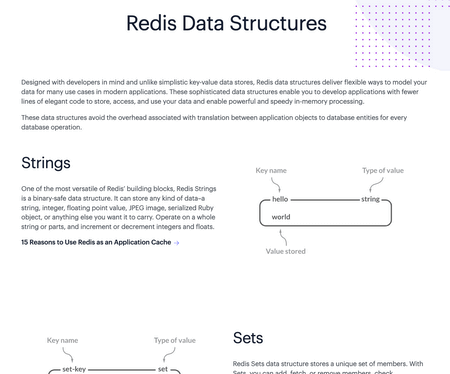

## String（字符串）
### 介绍
String 是 Redis 中最简单同时也是最常用的一个数据类型。

String 是一种二进制安全的数据类型，可以用来存储任何类型的数据比如字符串、整数、浮点数、图片（图片的 base64 编码或者解码或者图片的路径）、序列化后的对象。

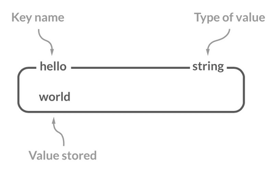

虽然 Redis 是用 C 语言写的，但是 Redis 并没有使用 C 的字符串表示，而是自己构建了一种 简单动态字符串（Simple Dynamic String，SDS）。相比于 C 的原生字符串，Redis 的 SDS 不光可以保存文本数据还可以保存二进制数据，并且获取字符串长度复杂度为 O(1)（C 字符串为 O(N)）,除此之外，Redis 的 SDS API 是安全的，不会造成缓冲区溢出。

### 常用命令
| 命令                            | 介绍                             |
| ------------------------------- | -------------------------------- |
| SET key value                   | 设置指定 key 的值                |
| SETNX key value                 | 只有在 key 不存在时设置 key 的值 |
| GET key                         | 获取指定 key 的值                |
| MSET key1 value1 key2 value2 …… | 设置一个或多个指定 key 的值      |
| MGET key1 key2 ...              | 获取一个或多个指定 key 的值      |
| STRLEN key                      | 返回 key 所储存的字符串值的长度  |
| INCR key                        | 将 key 中储存的数字值增一        |
| DECR key                        | 将 key 中储存的数字值减一        |
| EXISTS key                      | 判断指定 key 是否存在            |
| DEL key（通用）                 | 删除指定的 key                   |
| EXPIRE key seconds（通用）      | 给指定 key 设置过期时间          |

更多 Redis String 命令以及详细使用指南，请查看 Redis 官网对应的介绍：https://redis.io/commands/?group=string 。

### 基本操作：

```shell
> SET key value
OK
> GET key
"value"
> EXISTS key
(integer) 1
> STRLEN key
(integer) 5
> DEL key
(integer) 1
> GET key
(nil)
```

### 批量设置：

```shell
> MSET key1 value1 key2 value2
OK
> MGET key1 key2 # 批量获取多个 key 对应的 value
1) "value1"
2) "value2"
```

### 计数器（字符串的内容为整数的时候可以使用）：

```shell
> SET number 1
OK
> INCR number # 将 key 中储存的数字值增一
(integer) 2
> GET number
"2"
> DECR number # 将 key 中储存的数字值减一
(integer) 1
> GET number
"1"
```

### 设置过期时间（默认为永不过期）：
```shell
> EXPIRE key 60
(integer) 1
> SETEX key 60 value # 设置值并设置过期时间
OK
> TTL key
(integer) 56
```

### 应用场景
1. 需要存储常规数据的场景

   - 举例：缓存 Session、Token、图片地址、序列化后的对象(相比较于 Hash 存储更节省内存)。
   - 相关命令：SET、GET。

2. 需要计数的场景

   - 举例：用户单位时间的请求数（简单限流可以用到）、页面单位时间的访问数。
   - 相关命令：SET、GET、 INCR、DECR 。

3. 分布式锁

   - 利用 SETNX key value 命令可以实现一个最简易的分布式锁（存在一些缺陷，通常不建议这样实现分布式锁）。

## List（列表）
### 介绍
Redis 中的 List 其实就是链表数据结构的实现。我在 线性数据结构 :数组、链表、栈、队列[3] 这篇文章中详细介绍了链表这种数据结构，我这里就不多做介绍了。

许多高级编程语言都内置了链表的实现比如 Java 中的 LinkedList，但是 C 语言并没有实现链表，所以 Redis 实现了自己的链表数据结构。Redis 的 List 的实现为一个 双向链表，即可以支持反向查找和遍历，更方便操作，不过带来了部分额外的内存开销。

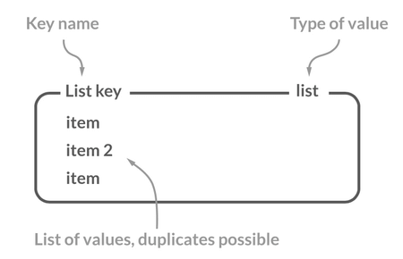

### 常用命令
| 命令                        | 介绍                                       |
| --------------------------- | ------------------------------------------ |
| RPUSH key value1 value2 ... | 在指定列表的尾部（右边）添加一个或多个元素 |
| LPUSH key value1 value2 ... | 在指定列表的头部（左边）添加一个或多个元素 |
| LSET key index value        | 将指定列表索引 index 位置的值设置为 value  |
| LPOP key                    | 移除并获取指定列表的第一个元素(最左边)     |
| RPOP key                    | 移除并获取指定列表的最后一个元素(最右边)   |
| LLEN key                    | 获取列表元素数量                           |
| LRANGE key start end        | 获取列表 start 和 end 之间 的元素          |

更多 Redis List 命令以及详细使用指南，请查看 Redis 官网对应的介绍：https://redis.io/commands/?group=list 。

### 通过 RPUSH/LPOP 或者 LPUSH/RPOP实现队列：
```shell
> RPUSH myList value1
(integer) 1
> RPUSH myList value2 value3
(integer) 3
> LPOP myList
"value1"
> LRANGE myList 0 1
1) "value2"
2) "value3"
> LRANGE myList 0 -1
1) "value2"
2) "value3"
```

### 通过 RPUSH/RPOP或者LPUSH/LPOP 实现栈：
```shell
> RPUSH myList2 value1 value2 value3
(integer) 3
> RPOP myList2 # 将 list的最右边的元素取出
"value3"
```

我专门画了一个图方便大家理解 RPUSH , LPOP , lpush , RPOP 命令：

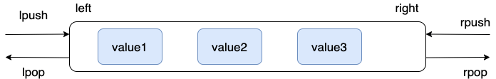

### 通过 LRANGE 查看对应下标范围的列表元素：
```shell
> RPUSH myList value1 value2 value3
(integer) 3
> LRANGE myList 0 1
1) "value1"
2) "value2"
> LRANGE myList 0 -1
1) "value1"
2) "value2"
3) "value3"
```

通过 LRANGE 命令，你可以基于 List 实现分页查询，性能非常高！

### 通过 LLEN 查看链表长度：
```shell
> LLEN myList
(integer) 3
```

### 应用场景
1. 信息流展示

   - 举例：最新文章、最新动态。
   - 相关命令：LPUSH、LRANGE。

2. 消息队列

List 可以用来做消息队列，只是功能过于简单且存在很多缺陷，不建议这样做。

相对来说，Redis 5.0 新增加的一个数据结构 Stream 更适合做消息队列一些，只是功能依然非常简陋。和专业的消息队列相比，还是有很多欠缺的地方比如消息丢失和堆积问题不好解决。

## Hash（哈希）
### 介绍
Redis 中的 Hash 是一个 String 类型的 field-value（键值对） 的映射表，特别适合用于存储对象，后续操作的时候，你可以直接修改这个对象中的某些字段的值。

Hash 类似于 JDK1.8 前的 HashMap，内部实现也差不多(数组 + 链表)。不过，Redis 的 Hash 做了更多优化。

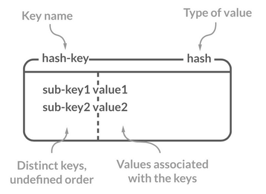

### 常用命令
| 命令                                      | 介绍                                                     |
| ----------------------------------------- | -------------------------------------------------------- |
| HSET key field value                      | 设置指定哈希表中指定字段的值                             |
| HSETNX key field value                    | 只有指定字段不存在时设置指定字段的值                     |
| HMSET key field1 value1 field2 value2 ... | 同时将一个或多个 field-value (域-值)对设置到指定哈希表中 |
| HGET key field                            | 获取指定哈希表中指定字段的值                             |
| HMGET key field1 field2 ...               | 获取指定哈希表中一个或者多个指定字段的值                 |
| HGETALL key                               | 获取指定哈希表中所有的键值对                             |
| HEXISTS key field                         | 查看指定哈希表中指定的字段是否存在                       |
| HDEL key field1 field2 ...                | 删除一个或多个哈希表字段                                 |
| HLEN key                                  | 获取指定哈希表中字段的数量                               |
| HINCRBY key field increment               | 对指定哈希中的指定字段做运算操作（正数为加，负数为减）   |

更多 Redis Hash 命令以及详细使用指南，请查看 Redis 官网对应的介绍：https://redis.io/commands/?group=hash 。

### 模拟对象数据存储：

```shell
> HMSET userInfoKey name "guide" description "dev" age 24
OK
> HEXISTS userInfoKey name # 查看 key 对应的 value中指定的字段是否存在。
(integer) 1
> HGET userInfoKey name # 获取存储在哈希表中指定字段的值。
"guide"
> HGET userInfoKey age
"24"
> HGETALL userInfoKey # 获取在哈希表中指定 key 的所有字段和值
1) "name"
2) "guide"
3) "description"
4) "dev"
5) "age"
6) "24"
> HSET userInfoKey name "GuideGeGe"
> HGET userInfoKey name
"GuideGeGe"
> HINCRBY userInfoKey age 2
(integer) 26
```

### 应用场景
1. 对象数据存储场景

   - 举例：用户信息、商品信息、文章信息、购物车信息。
   - 相关命令：HSET （设置单个字段的值）、HMSET（设置多个字段的值）、HGET（获取单个字段的值）、HMGET（获取多个字段的值）。

## Set（集合）
### 介绍
Redis 中的 Set 类型是一种无序集合，集合中的元素没有先后顺序但都唯一，有点类似于 Java 中的 HashSet 。当你需要存储一个列表数据，又不希望出现重复数据时，Set 是一个很好的选择，并且 Set 提供了判断某个元素是否在一个 Set 集合内的重要接口，这个也是 List 所不能提供的。

你可以基于 Set 轻易实现交集、并集、差集的操作，比如你可以将一个用户所有的关注人存在一个集合中，将其所有粉丝存在一个集合。这样的话，Set 可以非常方便的实现如共同关注、共同粉丝、共同喜好等功能。这个过程也就是求交集的过程。

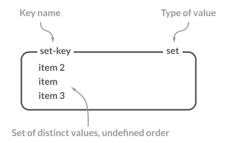

### 常用命令
| 命令                                  | 介绍                                      |
| ------------------------------------- | ----------------------------------------- |
| SADD key member1 member2 ...          | 向指定集合添加一个或多个元素              |
| SMEMBERS key                          | 获取指定集合中的所有元素                  |
| SCARD key                             | 获取指定集合的元素数量                    |
| SISMEMBER key member                  | 判断指定元素是否在指定集合中              |
| SINTER key1 key2 ...                  | 获取给定所有集合的交集                    |
| SINTERSTORE destination key1 key2 ... | 将给定所有集合的交集存储在 destination 中 |
| SUNION key1 key2 ...                  | 获取给定所有集合的并集                    |
| SUNIONSTORE destination key1 key2 ... | 将给定所有集合的并集存储在 destination 中 |
| SDIFF key1 key2 ...                   | 获取给定所有集合的差集                    |
| SDIFFSTORE destination key1 key2 ...  | 将给定所有集合的差集存储在 destination 中 |
| SPOP key count                        | 随机移除并获取指定集合中一个或多个元素    |
| SRANDMEMBER key count                 | 随机获取指定集合中指定数量的元素          |

更多 Redis Set 命令以及详细使用指南，请查看 Redis 官网对应的介绍：https://redis.io/commands/?group=set 。

### 基本操作：
```shell
> SADD mySet value1 value2
(integer) 2
> SADD mySet value1 # 不允许有重复元素，因此添加失败
(integer) 0
> SMEMBERS mySet
1) "value1"
2) "value2"
> SCARD mySet
(integer) 2
> SISMEMBER mySet value1
(integer) 1
> SADD mySet2 value2 value3
(integer) 2
mySet : value1、value2 。
mySet2：value2、value3 。
```

### 求交集：

```shell
> SINTERSTORE mySet3 mySet mySet2
(integer) 1
> SMEMBERS mySet3
1) "value2"
```

### 求并集：

```shell
> SUNION mySet mySet2
1) "value3"
2) "value2"
3) "value1"
```

### 求差集：

```shell
> SDIFF mySet mySet2 # 差集是由所有属于 mySet 但不属于 A 的元素组成的集合
1) "value1"
```

### 应用场景
1. 需要存放的数据不能重复的场景

- 举例：网站 UV 统计（数据量巨大的场景还是 HyperLogLog更适合一些）、文章点赞、动态点赞等场景。
- 相关命令：SCARD（获取集合数量） 。


2. 需要获取多个数据源交集、并集和差集的场景

- 举例：共同好友(交集)、共同粉丝(交集)、共同关注(交集)、好友推荐（差集）、音乐推荐（差集）、订阅号推荐（差集+交集） 等场景。
- 相关命令：SINTER（交集）、SINTERSTORE （交集）、SUNION （并集）、SUNIONSTORE（并集）、SDIFF（差集）、SDIFFSTORE （差集）。

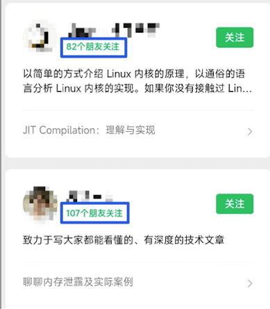

3. 需要随机获取数据源中的元素的场景

- 举例：抽奖系统、随机点名等场景。
- 相关命令：SPOP（随机获取集合中的元素并移除，适合不允许重复中奖的场景）、SRANDMEMBER（随机获取集合中的元素，适合允许重复中奖的场景）。

## Sorted Set（有序集合）
### 介绍
Sorted Set 类似于 Set，但和 Set 相比，Sorted Set 增加了一个权重参数 score，使得集合中的元素能够按 score 进行有序排列，还可以通过 score 的范围来获取元素的列表。有点像是 Java 中 HashMap 和 TreeSet 的结合体。

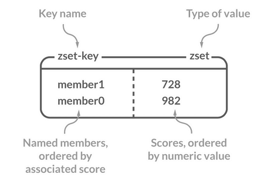

### 常用命令
| 命令                                          | 介绍                                                                                                          |
| --------------------------------------------- | ------------------------------------------------------------------------------------------------------------- |
| ZADD key score1 member1 score2 member2 ...    | 向指定有序集合添加一个或多个元素                                                                              |
| ZCARD KEY                                     | 获取指定有序集合的元素数量                                                                                    |
| ZSCORE key member                             | 获取指定有序集合中指定元素的 score 值                                                                         |
| ZINTERSTORE destination numkeys key1 key2 ... | 将给定所有有序集合的交集存储在 destination 中，对相同元素对应的 score 值进行 SUM 聚合操作，numkeys 为集合数量 |
| ZUNIONSTORE destination numkeys key1 key2 ... | 求并集，其它和 ZINTERSTORE 类似                                                                               |
| ZDIFFSTORE destination numkeys key1 key2 ...  | 求差集，其它和 ZINTERSTORE 类似                                                                               |
| ZRANGE key start end                          | 获取指定有序集合 start 和 end 之间的元素（score 从低到高）                                                    |
| ZREVRANGE key start end                       | 获取指定有序集合 start 和 end 之间的元素（score 从高到底）                                                    |
| ZREVRANK key member                           | 获取指定有序集合中指定元素的排名(score 从大到小排序)                                                          |

更多 Redis Sorted Set 命令以及详细使用指南，请查看 Redis 官网对应的介绍：https://redis.io/commands/?group=sorted-set 。

### 基本操作：
```shell
> ZADD myZset 2.0 value1 1.0 value2
(integer) 2
> ZCARD myZset
2
> ZSCORE myZset value1
2.0
> ZRANGE myZset 0 1
1) "value2"
2) "value1"
> ZREVRANGE myZset 0 1
1) "value1"
2) "value2"
> ZADD myZset2 4.0 value2 3.0 value3
(integer) 2

myZset : value1(2.0)、value2(1.0) 。
myZset2：value2 （4.0）、value3(3.0) 。
```

### 获取指定元素的排名：
```shell
> ZREVRANK myZset value1
0
> ZREVRANK myZset value2
1
```

### 求交集：
```shell
> ZINTERSTORE myZset3 2 myZset myZset2
1
> ZRANGE myZset3 0 1 WITHSCORES
value2
5
```

### 求并集：
```shell
> ZUNIONSTORE myZset4 2 myZset myZset2
3
> ZRANGE myZset4 0 2 WITHSCORES
value1
2
value3
3
value2
5
```

### 求差集：
```shell
> ZDIFF 2 myZset myZset2 WITHSCORES
value1
2
```

### 应用场景
1. 需要随机获取数据源中的元素根据某个权重进行排序的场景

- 举例：各种排行榜比如直播间送礼物的排行榜、朋友圈的微信步数排行榜、王者荣耀中的段位排行榜、话题热度排行榜等等。
- 相关命令：ZRANGE (从小到大排序)、 ZREVRANGE （从大到小排序）、ZREVRANK (指定元素排名)。

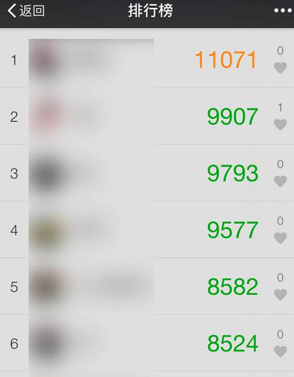

[《Java 面试指北》](https://mp.weixin.qq.com/s/hBfIGnU70Rke41P0GcMZCw) 的「技术面试题篇」就有一篇文章详细介绍如何使用 Sorted Set 来设计制作一个排行榜。

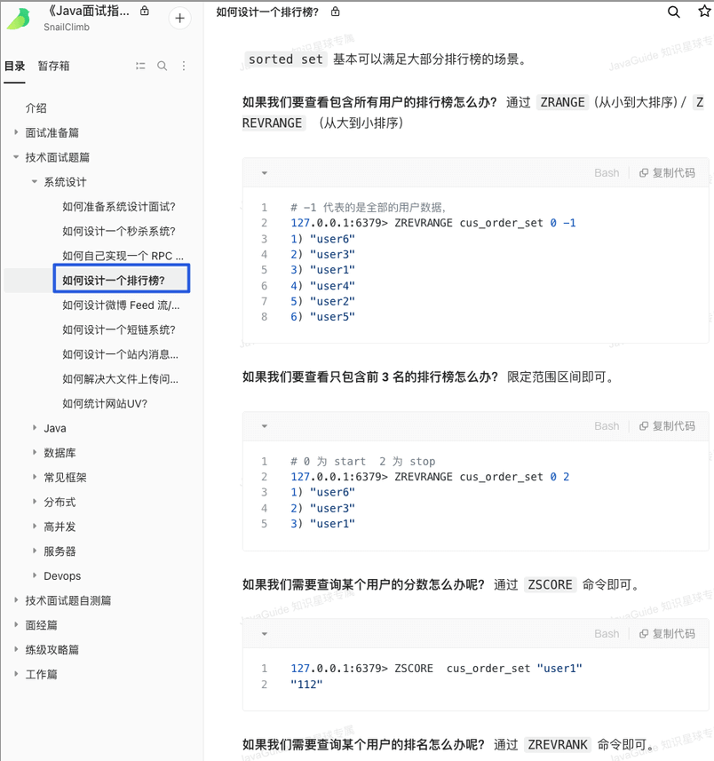

2. 需要存储的数据有优先级或者重要程度的场景 比如优先级任务队列。

- 举例：优先级任务队列。
- 相关命令：ZRANGE (从小到大排序)、 ZREVRANGE （从大到小排序）、ZREVRANK (指定元素排名)。

## 总结
| 数据类型 | 说明                                                                                                                                                                                 |
| -------- | ------------------------------------------------------------------------------------------------------------------------------------------------------------------------------------ |
| String   | 一种二进制安全的数据类型，可以用来存储任何类型的数据比如字符串、整数、浮点数、图片（图片的 base64 编码或者解码或者图片的路径）、序列化后的对象。                                     |
| List     | Redis 的 List 的实现为一个双向链表，即可以支持反向查找和遍历，更方便操作，不过带来了部分额外的内存开销。                                                                             |
| Hash     | 一个 String 类型的 field-value（键值对） 的映射表，特别适合用于存储对象，后续操作的时候，你可以直接修改这个对象中的某些字段的值。                                                    |
| Set      | 无序集合，集合中的元素没有先后顺序但都唯一，有点类似于 Java 中的 HashSet 。                                                                                                          |
| Zset     | 和 Set 相比，Sorted Set 增加了一个权重参数 score，使得集合中的元素能够按 score 进行有序排列，还可以通过 score 的范围来获取元素的列表。有点像是 Java 中 HashMap 和 TreeSet 的结合体。 |

## Redis 3 种特殊的数据类型
除了 5 种基本的数据类型之外，Redis 还支持 3 种特殊的数据类型：Bitmap、HyperLogLog、GEO。

## Bitmap （位图）
### 介绍
根据官网介绍：

> Bitmaps are not an actual data type, but a set of bit-oriented operations defined on the String type which is treated like a bit vector. Since strings are binary safe blobs and their maximum length is 512 MB, they are suitable to set up to 2^32 different bits.

Bitmap 不是 Redis 中的实际数据类型，而是在 String 类型上定义的一组面向位的操作，将其视为位向量。由于字符串是二进制安全的块，且最大长度为 512 MB，它们适合用于设置最多 2^32 个不同的位。

Bitmap 存储的是连续的二进制数字（0 和 1），通过 Bitmap, 只需要一个 bit 位来表示某个元素对应的值或者状态，key 就是对应元素本身 。我们知道 8 个 bit 可以组成一个 byte，所以 Bitmap 本身会极大的节省储存空间。

你可以将 Bitmap 看作是一个存储二进制数字（0 和 1）的数组，数组中每个元素的下标叫做 offset（偏移量）。

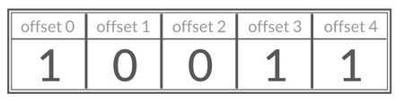

### 常用命令
| 命令	| 介绍| 
| SETBIT key offset value	| 设置指定 offset 位置的值| 
| GETBIT key offset	| 获取指定 offset 位置的值| 
| BITCOUNT key start end	| 获取 start 和 end 之前值为 1 的元素个数| 
| BITOP operation destkey key1 key2 ...	| 对一个或多个 Bitmap 进行运算，可用运算符有 AND, OR, XOR 以及 NOT| 

### Bitmap 基本操作演示：
```shell
# SETBIT 会返回之前位的值（默认是 0）这里会生成 7 个位
> SETBIT mykey 7 1
(integer) 0
> SETBIT mykey 7 0
(integer) 1
> GETBIT mykey 7
(integer) 0
> SETBIT mykey 6 1
(integer) 0
> SETBIT mykey 8 1
(integer) 0
# 通过 bitcount 统计被被设置为 1 的位的数量。
> BITCOUNT mykey
(integer) 2
```

### 应用场景
1. 需要保存状态信息（0/1 即可表示）的场景

- 举例：用户签到情况、活跃用户情况、用户行为统计（比如是否点赞过某个视频）。
- 相关命令：SETBIT、GETBIT、BITCOUNT、BITOP。

## HyperLogLog（基数统计）
### 介绍
HyperLogLog 是一种有名的基数计数概率算法 ，基于 LogLog Counting(LLC)优化改进得来，并不是 Redis 特有的，Redis 只是实现了这个算法并提供了一些开箱即用的 API。

Redis 提供的 HyperLogLog 占用空间非常非常小，只需要 12k 的空间就能存储接近2^64个不同元素。这是真的厉害，这就是数学的魅力么！并且，Redis 对 HyperLogLog 的存储结构做了优化，采用两种方式计数：

- 稀疏矩阵：计数较少的时候，占用空间很小。
- 稠密矩阵：计数达到某个阈值的时候，占用 12k 的空间。

Redis 官方文档中有对应的详细说明：

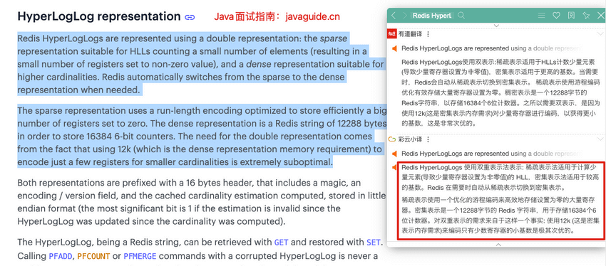

基数计数概率算法为了节省内存并不会直接存储元数据，而是通过一定的概率统计方法预估基数值（集合中包含元素的个数）。因此， HyperLogLog 的计数结果并不是一个精确值，存在一定的误差（标准误差为 0.81% ）。


HyperLogLog 的使用非常简单，但原理非常复杂。HyperLogLog 的原理以及在 Redis 中的实现可以看这篇文章：HyperLogLog 算法的原理讲解以及 Redis 是如何应用它的[4] 。

再推荐一个可以帮助理解 HyperLogLog 原理的工具：Sketch of the Day: HyperLogLog — Cornerstone of a Big Data Infrastructure[5] 。

除了 HyperLogLog 之外，Redis 还提供了其他的概率数据结构，对应的官方文档地址：https://redis.io/docs/data-types/probabilistic/ 。

### 常用命令
HyperLogLog 相关的命令非常少，最常用的也就 3 个。

| 命令                                      | 介绍                                                                             |
| ----------------------------------------- | -------------------------------------------------------------------------------- |
| PFADD key element1 element2 ...           | 添加一个或多个元素到 HyperLogLog 中                                              |
| PFCOUNT key1 key2                         | 获取一个或者多个 HyperLogLog 的唯一计数。                                        |
| PFMERGE destkey sourcekey1 sourcekey2 ... | 将多个 HyperLogLog 合并到 destkey 中，destkey 会结合多个源，算出对应的唯一计数。 |

### HyperLogLog 基本操作演示：
```shell
> PFADD hll foo bar zap
(integer) 1
> PFADD hll zap zap zap
(integer) 0
> PFADD hll foo bar
(integer) 0
> PFCOUNT hll
(integer) 3
> PFADD some-other-hll 1 2 3
(integer) 1
> PFCOUNT hll some-other-hll
(integer) 6
> PFMERGE desthll hll some-other-hll
"OK"
> PFCOUNT desthll
(integer) 6
```

### 应用场景
1. 数量量巨大（百万、千万级别以上）的计数场景

- 举例：热门网站每日/每周/每月访问 ip 数统计、热门帖子 uv 统计、
- 相关命令：PFADD、PFCOUNT 。

## Geospatial (地理位置)
### 介绍
Geospatial index（地理空间索引，简称 GEO） 主要用于存储地理位置信息，基于 Sorted Set 实现。

通过 GEO 我们可以轻松实现两个位置距离的计算、获取指定位置附近的元素等功能。

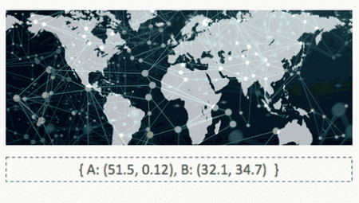

### 常用命令
| 命令                                             | 介绍                                                                                                 |
| ------------------------------------------------ | ---------------------------------------------------------------------------------------------------- |
| GEOADD key longitude1 latitude1 member1 ...      | 添加一个或多个元素对应的经纬度信息到 GEO 中                                                          |
| GEOPOS key member1 member2 ...                   | 返回给定元素的经纬度信息                                                                             |
| GEODIST key member1 member2 M/KM/FT/MI           | 返回两个给定元素之间的距离                                                                           |
| GEORADIUS key longitude latitude radius distance | 获取指定位置附近 distance 范围内的其他元素，支持 ASC(由近到远)、DESC（由远到近）、Count(数量) 等参数 |
| GEORADIUSBYMEMBER key member radius distance     | 类似于 GEORADIUS 命令，只是参照的中心点是 GEO 中的元素                                               |

### 基本操作：
```shell
> GEOADD personLocation 116.33 39.89 user1 116.34 39.90 user2 116.35 39.88 user3
3
> GEOPOS personLocation user1
116.3299986720085144
39.89000061669732844
> GEODIST personLocation user1 user2 km
1.4018
```

通过 Redis 可视化工具查看 personLocation ，果不其然，底层就是 Sorted Set。

GEO 中存储的地理位置信息的经纬度数据通过 GeoHash 算法转换成了一个整数，这个整数作为 Sorted Set 的 score(权重参数)使用。

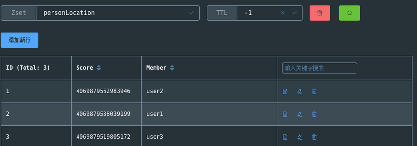

### 获取指定位置范围内的其他元素：

```shell
> GEORADIUS personLocation 116.33 39.87 3 km
user3
user1
> GEORADIUS personLocation 116.33 39.87 2 km
> GEORADIUS personLocation 116.33 39.87 5 km
user3
user1
user2
> GEORADIUSBYMEMBER personLocation user1 5 km
user3
user1
user2
> GEORADIUSBYMEMBER personLocation user1 2 km
user1
user2
```

GEORADIUS 命令的底层原理解析可以看看阿里的这篇文章：Redis 到底是怎么实现“附近的人”这个功能的呢？[6] 。

### 移除元素：

GEO 底层是 Sorted Set ，你可以对 GEO 使用 Sorted Set 相关的命令。
```shell
> ZREM personLocation user1
1
> ZRANGE personLocation 0 -1
user3
user2
> ZSCORE personLocation user2
4069879562983946
```

### 应用场景
1. 需要管理使用地理空间数据的场景

- 举例：附近的人。
- 相关命令: GEOADD、GEORADIUS、GEORADIUSBYMEMBER 。

## 总结
| 数据类型	| 说明| 
| --- | --- |
| Bitmap	| 你可以将 Bitmap 看作是一个存储二进制数字（0 和 1）的数组，数组中每个元素的下标叫做 offset（偏移量）。通过 Bitmap, 只需要一个 bit 位来表示某个元素对应的值或者状态，key 就是对应元素本身 。我们知道 8 个 bit 可以组成一个 byte，所以 Bitmap 本身会极大的节省储存空间。| 
| HyperLogLog	| Redis 提供的 HyperLogLog 占用空间非常非常小，只需要 12k 的空间就能存储接近2^64个不同元素。不过，HyperLogLog 的计数结果并不是一个精确值，存在一定的误差（标准误差为 0.81% ）。| 
| Geospatial index	| Geospatial index（地理空间索引，简称 GEO） 主要用于存储地理位置信息，基于 Sorted Set 实现。| 

## 参考资料
- [1]Redis Data Structures: https://redis.com/redis-enterprise/data-structures/

- [2]Redis Data types tutorial: https://redis.io/docs/manual/data-types/data-types-tutorial/

- [3]线性数据结构 :数组、链表、栈、队列: https://javaguide.cn/cs-basics/data-structure/linear-data-structure.html

- [4]HyperLogLog 算法的原理讲解以及 Redis 是如何应用它的: https://juejin.cn/post/6844903785744056333

- [5]Sketch of the Day: HyperLogLog — Cornerstone of a Big Data Infrastructure: http://content.research.neustar.biz/blog/hll.html

- [6]Redis 到底是怎么实现“附近的人”这个功能的呢？: https://juejin.cn/post/6844903966061363207

