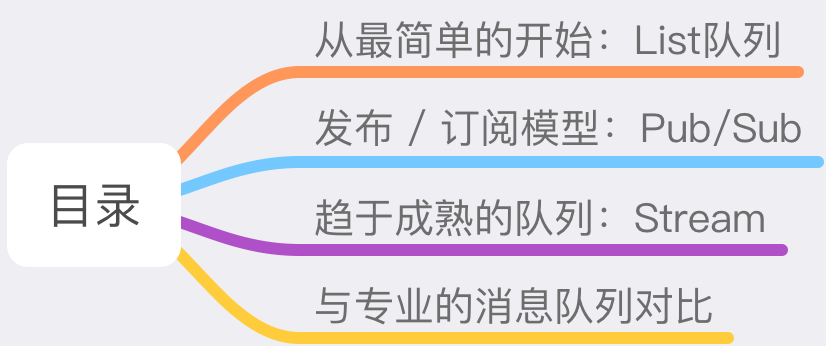
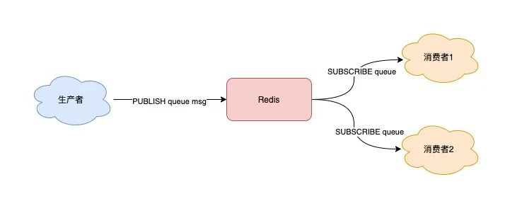
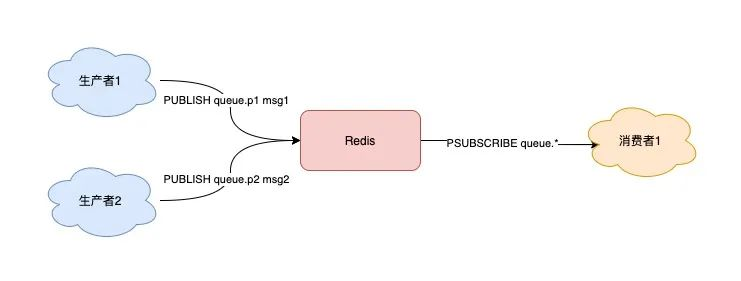
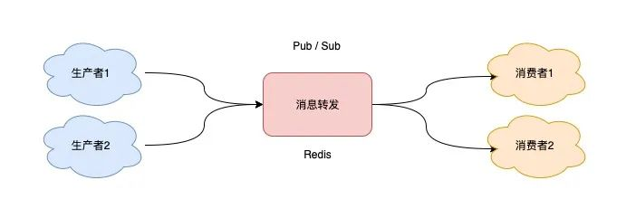
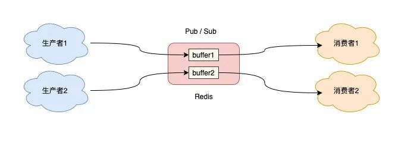
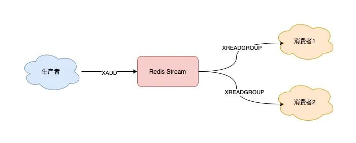

- [把Redis当作队列来用，真的合适吗？](https://mp.weixin.qq.com/s/n-VnDzVAm5TlFSciH-zwVg)

我经常听到很多人讨论，关于「把 `Redis` 当作队列来用是否合适」的问题。

有些人表示赞成，他们认为 `Redis` 很轻量，用作队列很方便。

也些人则反对，认为 `Redis` 会「丢」数据，最好还是用「专业」的队列中间件更稳妥。

究竟哪种方案更好呢？

这篇文章，我就和你聊一聊把 `Redis` 当作队列，究竟是否合适这个问题。

我会从简单到复杂，一步步带你梳理其中的细节，把这个问题真正的讲清楚。

看完这篇文章后，我希望你对这个问题你会有全新的认识。

在文章的最后，我还会告诉你关于「技术选型」的思路，文章有点长，希望你可以耐心读完。



## 从最简单的开始：List 队列
首先，我们先从最简单的场景开始讲起。

如果你的业务需求足够简单，想把 `Redis` 当作队列来使用，肯定最先想到的就是使用 `List` 这个数据类型。

因为 `List` 底层的实现就是一个「链表」，在头部和尾部操作元素，时间复杂度都是 `O(1)`，这意味着它非常符合消息队列的模型。

如果把 `List` 当作队列，你可以这么来用。

生产者使用 `LPUSH` 发布消息：

```shell
127.0.0.1:6379> LPUSH queue msg1
(integer) 1
127.0.0.1:6379> LPUSH queue msg2
(integer) 2
```

消费者这一侧，使用 `RPOP` 拉取消息：

```shell
127.0.0.1:6379> RPOP queue
"msg1"
127.0.0.1:6379> RPOP queue
"msg2"
```

这个模型非常简单，也很容易理解。


但这里有个小问题，当队列中已经没有消息了，消费者在执行 `RPOP` 时，会返回 `NULL`。

```shell
127.0.0.1:6379> RPOP queue
(nil)   // 没消息了
```

而我们在编写消费者逻辑时，一般是一个「死循环」，这个逻辑需要不断地从队列中拉取消息进行处理，伪代码一般会这么写：

```cpp
while true:
    msg = redis.rpop("queue")
    // 没有消息，继续循环
    if msg == null:
        continue
    // 处理消息
    handle(msg)
```

如果此时队列为空，那消费者依旧会频繁拉取消息，这会造成「CPU 空转」，不仅浪费 CPU 资源，还会对 `Redis` 造成压力。

怎么解决这个问题呢？

也很简单，当队列为空时，我们可以「休眠」一会，再去尝试拉取消息。代码可以修改成这样：

```cpp
while true:
    msg = redis.rpop("queue")
    // 没有消息，休眠2s
    if msg == null:
        sleep(2)
        continue
    // 处理消息        
    handle(msg)
```

这就解决了 CPU 空转问题。

这个问题虽然解决了，但又带来另外一个问题：当消费者在休眠等待时，有新消息来了，那消费者处理新消息就会存在「延迟」。

假设设置的休眠时间是 2s，那新消息最多存在 2s 的延迟。

要想缩短这个延迟，只能减小休眠的时间。但休眠时间越小，又有可能引发 CPU 空转问题。

鱼和熊掌不可兼得。

那如何做，既能及时处理新消息，还能避免 CPU 空转呢？

`Redis` 是否存在这样一种机制：如果队列为空，消费者在拉取消息时就「阻塞等待」，一旦有新消息过来，就通知我的消费者立即处理新消息呢？

幸运的是，`Redis` 确实提供了「阻塞式」拉取消息的命令：`BRPOP / BLPOP`，这里的 `B` 指的是阻塞（`Block`）。


现在，你可以这样来拉取消息了：

```cpp
while true:
    // 没消息阻塞等待，0表示不设置超时时间
    msg = redis.brpop("queue", 0)
    if msg == null:
        continue
    // 处理消息
    handle(msg)
```

使用 `BRPOP` 这种阻塞式方式拉取消息时，还支持传入一个「超时时间」，如果设置为 0，则表示不设置超时，直到有新消息才返回，否则会在指定的超时时间后返回 `NULL`。

这个方案不错，既兼顾了效率，还避免了 CPU 空转问题，一举两得。

> 注意：如果设置的超时时间太长，这个连接太久没有活跃过，可能会被 `Redis Server` 判定为无效连接，之后 `Redis Server` 会强制把这个客户端踢下线。所以，采用这种方案，客户端要有重连机制。

解决了消息处理不及时的问题，你可以再思考一下，这种队列模型，有什么缺点？

我们一起来分析一下：

1. **不支持重复消费**：消费者拉取消息后，这条消息就从 `List` 中删除了，无法被其它消费者再次消费，即不支持多个消费者消费同一批数据
2. **消息丢失**：消费者拉取到消息后，如果发生异常宕机，那这条消息就丢失了

第一个问题是功能上的，使用 `List` 做消息队列，它仅仅支持最简单的，一组生产者对应一组消费者，不能满足多组生产者和消费者的业务场景。

第二个问题就比较棘手了，因为从 `List` 中 `POP` 一条消息出来后，这条消息就会立即从链表中删除了。也就是说，无论消费者是否处理成功，这条消息都没办法再次消费了。

这也意味着，如果消费者在处理消息时异常宕机，那这条消息就相当于丢失了。

针对这 2 个问题怎么解决呢？我们一个个来看。

## 发布/订阅模型：Pub/Sub
从名字就能看出来，这个模块是 `Redis` 专门是针对「发布/订阅」这种队列模型设计的。

它正好可以解决前面提到的第一个问题：重复消费。

即多组生产者、消费者的场景，我们来看它是如何做的。

`Redis` 提供了 `PUBLISH / SUBSCRIBE` 命令，来完成发布、订阅的操作。



假设你想开启 2 个消费者，同时消费同一批数据，就可以按照以下方式来实现。

首先，使用 `SUBSCRIBE` 命令，启动 2 个消费者，并「订阅」同一个队列。
```shell
// 2个消费者 都订阅一个队列
127.0.0.1:6379> SUBSCRIBE queue
Reading messages... (press Ctrl-C to quit)
1) "subscribe"
2) "queue"
3) (integer) 1
```

此时，2 个消费者都会被阻塞住，等待新消息的到来。

之后，再启动一个生产者，发布一条消息。

```shell
127.0.0.1:6379> PUBLISH queue msg1
(integer) 1
```

这时，2 个消费者就会解除阻塞，收到生产者发来的新消息。

```shell
127.0.0.1:6379> SUBSCRIBE queue
// 收到新消息
1) "message"
2) "queue"
3) "msg1"
```

看到了么，使用 `Pub/Sub` 这种方案，既支持阻塞式拉取消息，还很好地满足了多组消费者，消费同一批数据的业务需求。

除此之外，`Pub/Sub` 还提供了「匹配订阅」模式，允许消费者根据一定规则，订阅「多个」自己感兴趣的队列。

```shell
// 订阅符合规则的队列
127.0.0.1:6379> PSUBSCRIBE queue.*
Reading messages... (press Ctrl-C to quit)
1) "psubscribe"
2) "queue.*"
3) (integer) 1
```

这里的消费者，订阅了 `queue.*` 相关的队列消息。

之后，生产者分别向 `queue.p1` 和 `queue.p2` 发布消息。

```shell
127.0.0.1:6379> PUBLISH queue.p1 msg1
(integer) 1
127.0.0.1:6379> PUBLISH queue.p2 msg2
(integer) 1
```

这时再看消费者，它就可以接收到这 2 个生产者的消息了。

```shell
127.0.0.1:6379> PSUBSCRIBE queue.*
Reading messages... (press Ctrl-C to quit)
...
// 来自queue.p1的消息
1) "pmessage"
2) "queue.*"
3) "queue.p1"
4) "msg1"

// 来自queue.p2的消息
1) "pmessage"
2) "queue.*"
3) "queue.p2"
4) "msg2"
```



我们可以看到，`Pub/Sub` 最大的优势就是，支持多组生产者、消费者处理消息。

讲完了它的优点，那它有什么缺点呢？

其实，`Pub/Sub` 最大问题是：**丢数据**。

如果发生以下场景，就有可能导致数据丢失：

- 消费者下线
- Redis 宕机
- 消息堆积

究竟是怎么回事？

这其实与 `Pub/Sub` 的实现方式有很大关系。

`Pub/Sub` 在实现时非常简单，它没有基于任何数据类型，也没有做任何的数据存储，它只是单纯地为生产者、消费者建立「数据转发通道」，把符合规则的数据，从一端转发到另一端。

一个完整的发布、订阅消息处理流程是这样的：

1. 消费者订阅指定队列，`Redis` 就会记录一个映射关系：队列->消费者
2. 生产者向这个队列发布消息，那 `Redis` 就从映射关系中找出对应的消费者，把消息转发给它



看到了么，整个过程中，没有任何的数据存储，一切都是实时转发的。

这种设计方案，就导致了上面提到的那些问题。

例如，如果一个消费者异常挂掉了，它再重新上线后，只能接收新的消息，在下线期间生产者发布的消息，因为找不到消费者，都会被丢弃掉。

如果所有消费者都下线了，那生产者发布的消息，因为找不到任何一个消费者，也会全部「丢弃」。

所以，当你在使用 `Pub/Sub` 时，一定要注意：**消费者必须先订阅队列，生产者才能发布消息，否则消息会丢失**。

这也是前面讲例子时，我们让消费者先订阅队列，之后才让生产者发布消息的原因。

另外，因为 `Pub/Sub` 没有基于任何数据类型实现，所以它也不具备「数据持久化」的能力。

也就是说，`Pub/Sub` 的相关操作，不会写入到 `RDB` 和 `AOF` 中，当 `Redis` 宕机重启，`Pub/Sub` 的数据也会全部丢失。

最后，我们来看 `Pub/Sub` 在处理「消息积压」时，为什么也会丢数据？

当消费者的速度，跟不上生产者时，就会导致数据积压的情况发生。

如果采用 `List` 当作队列，消息积压时，会导致这个链表很长，最直接的影响就是，`Redis` 内存会持续增长，直到消费者把所有数据都从链表中取出。

但 `Pub/Sub` 的处理方式却不一样，**当消息积压时，有可能会导致消费失败和消息丢失！**

这是怎么回事？

还是回到 `Pub/Sub` 的实现细节上来说。

每个消费者订阅一个队列时，`Redis` 都会在 `Server` 上给这个消费者在分配一个「缓冲区」，这个缓冲区其实就是一块内存。

当生产者发布消息时，`Redis` 先把消息写到对应消费者的缓冲区中。

之后，消费者不断地从缓冲区读取消息，处理消息。



但是，问题就出在这个缓冲区上。

因为这个缓冲区其实是有「上限」的（可配置），如果消费者拉取消息很慢，就会造成生产者发布到缓冲区的消息开始积压，缓冲区内存持续增长。

如果超过了缓冲区配置的上限，此时，`Redis` 就会「强制」把这个消费者踢下线。

这时消费者就会消费失败，也会丢失数据。

如果你有看过 `Redis` 的配置文件，可以看到这个缓冲区的默认配置：`client-output-buffer-limit pubsub 32mb 8mb 60`。

它的参数含义如下：

- `32mb`：缓冲区一旦超过 `32MB`，`Redis` 直接强制把消费者踢下线
- `8mb + 60`：缓冲区超过 `8MB`，并且持续 60 秒，`Redis` 也会把消费者踢下线

`Pub/Sub` 的这一点特点，是与 `List` 作队列差异比较大的。

从这里你应该可以看出，**List 其实是属于「拉」模型，而 Pub/Sub 其实属于「推」模型**。

`List` 中的数据可以一直积压在内存中，消费者什么时候来「拉」都可以。

但 `Pub/Sub` 是把消息先「推」到消费者在 `Redis Server` 上的缓冲区中，然后等消费者再来取。

当生产、消费速度不匹配时，就会导致缓冲区的内存开始膨胀，`Redis` 为了控制缓冲区的上限，所以就有了上面讲到的，强制把消费者踢下线的机制。

好了，现在我们总结一下 `Pub/Sub` 的优缺点：

- 支持发布 / 订阅，支持多组生产者、消费者处理消息
- 消费者下线，数据会丢失
- 不支持数据持久化，`Redis` 宕机，数据也会丢失
- 消息堆积，缓冲区溢出，消费者会被强制踢下线，数据也会丢失

有没有发现，除了第一个是优点之外，剩下的都是缺点。

所以，很多人看到 `Pub/Sub` 的特点后，觉得这个功能很「鸡肋」。

也正是以上原因，`Pub/Sub` 在实际的应用场景中用得并不多。

> 目前只有哨兵集群和 Redis 实例通信时，采用了 `Pub/Sub` 的方案，因为哨兵正好符合即时通讯的业务场景。

我们再来看一下，`Pub/Sub` 有没有解决，消息处理时异常宕机，无法再次消费的问题呢？

其实也不行，`Pub/Sub` 从缓冲区取走数据之后，数据就从 `Redis` 缓冲区删除了，消费者发生异常，自然也无法再次重新消费。

好，现在我们重新梳理一下，我们在使用消息队列时的需求。

当我们在使用一个消息队列时，希望它的功能如下：

- 支持阻塞等待拉取消息
- 支持发布 / 订阅模式
- 消费失败，可重新消费，消息不丢失
- 实例宕机，消息不丢失，数据可持久化
- 消息可堆积

`Redis` 除了 `List` 和 `Pub/Sub` 之外，还有符合这些要求的数据类型吗？

其实，`Redis` 的作者也看到了以上这些问题，也一直在朝着这些方向努力着。

`Redis` 作者在开发 `Redis` 期间，还另外开发了一个开源项目 `disque`。

这个项目的定位，就是一个基于内存的分布式消息队列中间件。

但由于种种原因，这个项目一直不温不火。

终于，在 `Redis 5.0` 版本，作者把 `disque` 功能移植到了 `Redis` 中，并给它定义了一个新的数据类型：`Stream`。

下面我们就来看看，它能符合上面提到的这些要求吗？

## 趋于成熟的队列：Stream
我们来看 `Stream` 是如何解决上面这些问题的。

我们依旧从简单到复杂，依次来看 `Stream` 在做消息队列时，是如何处理的？

首先，`Stream` 通过 `XADD` 和 `XREAD` 完成最简单的生产、消费模型：

- `XADD`：发布消息
- `XREAD`：读取消息

生产者发布 2 条消息：

```shell
// *表示让Redis自动生成消息ID
127.0.0.1:6379> XADD queue * name zhangsan
"1618469123380-0"
127.0.0.1:6379> XADD queue * name lisi
"1618469127777-0"
```

使用 `XADD` 命令发布消息，其中的`「*」`表示让 `Redis` 自动生成唯一的消息 ID。

这个消息 ID 的格式是「时间戳-自增序号」。

消费者拉取消息：
```shell
// 从开头读取5条消息，0-0表示从开头读取
127.0.0.1:6379> XREAD COUNT 5 STREAMS queue 0-0
1) 1) "queue"
   1) 1) 1) "1618469123380-0"
         1) 1) "name"
            1) "zhangsan"
      1) 1) "1618469127777-0"
         1) 1) "name"
            1) "lisi"
```

如果想继续拉取消息，需要传入上一条消息的 ID：

```shell
127.0.0.1:6379> XREAD COUNT 5 STREAMS queue 1618469127777-0
(nil)
```

没有消息，`Redis` 会返回 NULL。


以上就是 Stream 最简单的生产、消费。

> 这里不再重点介绍 `Stream` 命令的各种参数，我在例子中演示时，凡是大写的单词都是「固定」参数，凡是小写的单词，都是可以自己定义的，例如队列名、消息长度等等，下面的例子规则也是一样，为了方便你理解，这里有必要提醒一下。

下面我们来看，针对前面提到的消息队列要求，`Stream` 都是如何解决的？

### 1) Stream 是否支持「阻塞式」拉取消息？

可以的，在读取消息时，只需要增加 BLOCK 参数即可。

```shell
// BLOCK 0 表示阻塞等待，不设置超时时间
127.0.0.1:6379> XREAD COUNT 5 BLOCK 0 STREAMS queue 1618469127777-0
```

这时，消费者就会阻塞等待，直到生产者发布新的消息才会返回。

### 2) Stream 是否支持发布 / 订阅模式？

也没问题，`Stream` 通过以下命令完成发布订阅：

- `XGROUP`：创建消费者组
- `XREADGROUP`：在指定消费组下，开启消费者拉取消息

下面我们来看具体如何做？

首先，生产者依旧发布 2 条消息：

```shell
127.0.0.1:6379> XADD queue * name zhangsan
"1618470740565-0"
127.0.0.1:6379> XADD queue * name lisi
"1618470743793-0"
```

之后，我们想要开启 2 组消费者处理同一批数据，就需要创建 2 个消费者组：

```shell
// 创建消费者组1，0-0表示从头拉取消息
127.0.0.1:6379> XGROUP CREATE queue group1 0-0
OK
// 创建消费者组2，0-0表示从头拉取消息
127.0.0.1:6379> XGROUP CREATE queue group2 0-0
OK
```

消费者组创建好之后，我们可以给每个「消费者组」下面挂一个「消费者」，让它们分别处理同一批数据。

第一个消费组开始消费：

```shell
// group1的consumer开始消费，>表示拉取最新数据
127.0.0.1:6379> XREADGROUP GROUP group1 consumer COUNT 5 STREAMS queue >
1) 1) "queue"
   2) 1) 1) "1618470740565-0"
         2) 1) "name"
            2) "zhangsan"
      2) 1) "1618470743793-0"
         2) 1) "name"
            2) "lisi"
```

同样地，第二个消费组开始消费：

```shell
// group2的consumer开始消费，>表示拉取最新数据
127.0.0.1:6379> XREADGROUP GROUP group2 consumer COUNT 5 STREAMS queue >
1) 1) "queue"
   2) 1) 1) "1618470740565-0"
         2) 1) "name"
            2) "zhangsan"
      2) 1) "1618470743793-0"
         2) 1) "name"
            2) "lisi"
```

我们可以看到，这 2 组消费者，都可以获取同一批数据进行处理了。

这样一来，就达到了多组消费者「订阅」消费的目的。



### 3) 消息处理时异常，Stream 能否保证消息不丢失，重新消费？

除了上面拉取消息时用到了消息 ID，这里为了保证重新消费，也要用到这个消息 ID。

当一组消费者处理完消息后，需要执行 `XACK` 命令告知 `Redis`，这时 `Redis` 就会把这条消息标记为「处理完成」。

```shell
// group1下的 1618472043089-0 消息已处理完成
127.0.0.1:6379> XACK queue group1 1618472043089-0
```


如果消费者异常宕机，肯定不会发送` XACK`，那么 `Redis` 就会依旧保留这条消息。

待这组消费者重新上线后，`Redis` 就会把之前没有处理成功的数据，重新发给这个消费者。这样一来，即使消费者异常，也不会丢失数据了。

```shell
// 消费者重新上线，0-0表示重新拉取未ACK的消息
127.0.0.1:6379> XREADGROUP GROUP group1 consumer1 COUNT 5 STREAMS queue 0-0
// 之前没消费成功的数据，依旧可以重新消费
1) 1) "queue"
   2) 1) 1) "1618472043089-0"
         2) 1) "name"
            2) "zhangsan"
      2) 1) "1618472045158-0"
         2) 1) "name"
            2) "lisi"
```

### 4) Stream 数据会写入到 RDB 和 AOF 做持久化吗？

`Stream` 是新增加的数据类型，它与其它数据类型一样，每个写操作，也都会写入到 `RDB` 和 `AOF` 中。

我们只需要配置好持久化策略，这样的话，就算 `Redis` 宕机重启，`Stream` 中的数据也可以从 `RDB` 或 `AOF` 中恢复回来。

### 5) 消息堆积时，Stream 是怎么处理的？

其实，当消息队列发生消息堆积时，一般只有 2 个解决方案：

- 生产者限流：避免消费者处理不及时，导致持续积压
- 丢弃消息：中间件丢弃旧消息，只保留固定长度的新消息

而 `Redis` 在实现 `Stream` 时，采用了第 2 个方案。

在发布消息时，你可以指定队列的最大长度，防止队列积压导致内存爆炸。

```shell
// 队列长度最大10000
127.0.0.1:6379> XADD queue MAXLEN 10000 * name zhangsan
"1618473015018-0"
```

当队列长度超过上限后，旧消息会被删除，只保留固定长度的新消息。

这么来看，`Stream` 在消息积压时，如果指定了最大长度，还是有可能丢失消息的。

> 除了以上介绍到的命令，`Stream` 还支持查看消息长度（`XLEN`）、查看消费者状态（`XINFO`）等命令，使用也比较简单，你可以查询官方文档了解一下，这里就不过多介绍了。

好了，通过以上介绍，我们可以看到，`Redis` 的 `Stream` 几乎覆盖到了消息队列的各种场景，是不是觉得很完美？

**既然它的功能这么强大，这是不是意味着，Redis 真的可以作为专业的消息队列中间件来使用呢？**

但是还「差一点」，就算 `Redis` 能做到以上这些，也只是「趋近于」专业的消息队列。

原因在于 `Redis` 本身的一些问题，如果把其定位成消息队列，还是有些欠缺的。

到这里，就不得不把 `Redis` 与专业的队列中间件做对比了。

下面我们就来看一下，`Redis` 在作队列时，到底还有哪些欠缺？

## 与专业的消息队列对比
其实，一个专业的消息队列，必须要做到两大块：

- 消息不丢
- 消息可堆积

前面我们讨论的重点，很大篇幅围绕的是第一点展开的。

这里我们换个角度，从一个消息队列的「使用模型」来分析一下，怎么做，才能保证数据不丢？

使用一个消息队列，其实就分为三大块：生产者、队列中间件、消费者。


消息是否会发生丢失，其重点也就在于以下 3 个环节：

- 生产者会不会丢消息？
- 消费者会不会丢消息？
- 队列中间件会不会丢消息？

### 1) 生产者会不会丢消息？

当生产者在发布消息时，可能发生以下异常情况：

- 消息没发出去：网络故障或其它问题导致发布失败，中间件直接返回失败
- 不确定是否发布成功：网络问题导致发布超时，可能数据已发送成功，但读取响应结果超时了

如果是情况 1，消息根本没发出去，那么重新发一次就好了。

如果是情况 2，生产者没办法知道消息到底有没有发成功？所以，为了避免消息丢失，它也只能继续重试，直到发布成功为止。

> 生产者一般会设定一个最大重试次数，超过上限依旧失败，需要记录日志报警处理。

也就是说，生产者为了避免消息丢失，只能采用失败重试的方式来处理。

但发现没有？这也意味着消息可能会重复发送。

是的，在使用消息队列时，要保证消息不丢，宁可重发，也不能丢弃。

那消费者这边，就需要多做一些逻辑了。

对于敏感业务，当消费者收到重复数据数据时，要设计幂等逻辑，保证业务的正确性。

从这个角度来看，生产者会不会丢消息，取决于生产者对于异常情况的处理是否合理。

所以，无论是 `Redis` 还是专业的队列中间件，生产者在这一点上都是可以保证消息不丢的。

### 2) 消费者会不会丢消息？

这种情况就是我们前面提到的，消费者拿到消息后，还没处理完成，就异常宕机了，那消费者还能否重新消费失败的消息？

要解决这个问题，消费者在处理完消息后，必须「告知」队列中间件，队列中间件才会把标记已处理，否则仍旧把这些数据发给消费者。

这种方案需要消费者和中间件互相配合，才能保证消费者这一侧的消息不丢。

无论是 `Redis` 的 `Stream`，还是专业的队列中间件，例如 `RabbitMQ`、`Kafka`，其实都是这么做的。

所以，从这个角度来看，`Redis` 也是合格的。

### 3) 队列中间件会不会丢消息？

前面 2 个问题都比较好处理，只要客户端和服务端配合好，就能保证生产端、消费端都不丢消息。

但是，如果队列中间件本身就不可靠呢？

毕竟生产者和消费这都依赖它，如果它不可靠，那么生产者和消费者无论怎么做，都无法保证数据不丢。

在这个方面，`Redis` 其实没有达到要求。

`Redis` 在以下 2 个场景下，都会导致数据丢失。

- AOF 持久化配置为每秒写盘，但这个写盘过程是异步的，`Redis` 宕机时会存在数据丢失的可能
- 主从复制也是异步的，主从切换时，也存在丢失数据的可能（从库还未同步完成主库发来的数据，就被提成主库）

基于以上原因我们可以看到，**Redis 本身的无法保证严格的数据完整性**。

所以，如果把 `Redis` 当做消息队列，在这方面是有可能导致数据丢失的。

再来看那些专业的消息队列中间件是如何解决这个问题的？

像 `RabbitMQ` 或 `Kafka` 这类专业的队列中间件，在使用时，一般是部署一个集群，生产者在发布消息时，队列中间件通常会写「多个节点」，以此保证消息的完整性。这样一来，即便其中一个节点挂了，也能保证集群的数据不丢失。

也正因为如此，`RabbitMQ`、`Kafka`在设计时也更复杂。毕竟，它们是专门针对队列场景设计的。

但 `Redis` 的定位则不同，它的定位更多是当作缓存来用，它们两者在这个方面肯定是存在差异的。

最后，我们来看消息积压怎么办？

### 4) 消息积压怎么办？

因为 `Redis` 的数据都存储在内存中，这就意味着一旦发生消息积压，则会导致 `Redis` 的内存持续增长，如果超过机器内存上限，就会面临被 OOM 的风险。

所以，`Redis` 的 `Stream` 提供了可以指定队列最大长度的功能，就是为了避免这种情况发生。

但 `Kafka`、`RabbitMQ` 这类消息队列就不一样了，它们的数据都会存储在磁盘上，磁盘的成本要比内存小得多，当消息积压时，无非就是多占用一些磁盘空间，相比于内存，在面对积压时也会更加「坦然」。

综上，我们可以看到，把 `Redis` 当作队列来使用时，始终面临的 2 个问题：

- `Redis` 本身可能会丢数据
- 面对消息积压，`Redis` 内存资源紧张

到这里，`Redis` 是否可以用作队列，我想这个答案你应该会比较清晰了。

如果你的业务场景足够简单，对于数据丢失不敏感，而且消息积压概率比较小的情况下，把 `Redis` 当作队列是完全可以的。

而且，`Redis` 相比于 `Kafka`、`RabbitMQ`，部署和运维也更加轻量。

如果你的业务场景对于数据丢失非常敏感，而且写入量非常大，消息积压时会占用很多的机器资源，那么我建议你使用专业的消息队列中间件。

## 总结
好了，总结一下。这篇文章我们从「Redis 能否用作队列」这个角度出发，介绍了 `List`、`Pub/Sub`、`Stream` 在做队列的使用方式，以及它们各自的优劣。

之后又把 `Redis` 和专业的消息队列中间件做对比，发现 `Redis` 的不足之处。

最后，我们得出 `Redis` 做队列的合适场景。

这里我也列了一个表格，总结了它们各自的优缺点。


## 后记
最后，我想和你再聊一聊关于「技术方案选型」的问题。

你应该也看到了，这篇文章虽然始于 `Redis`，但并不止于 `Redis`。

我们在分析 `Redis` 细节时，一直在提出问题，然后寻找更好的解决方案，在文章最后，又聊到一个专业的消息队列应该怎么做。

其实，我们在讨论技术选型时，就是一个关于如何取舍的问题。

而这里我想传达给你的信息是，**在面对技术选型时，不要不经过思考就觉得哪个方案好，哪个方案不好**。

你需要根据具体场景具体分析，这里我把这个分析过程分为 2 个层面：

- 业务功能角度
- 技术资源角度

这篇文章所讲到的内容，都是以业务功能角度出发做决策的。

但这里的第二点，从技术资源角度出发，其实也很重要。

技术资源的角度是说，**你所处的公司环境、技术资源能否匹配这些技术方案**。

这个怎么解释呢？

简单来讲，就是你所在的公司、团队，是否有匹配的资源能 hold 住这些技术方案。

我们都知道 `Kafka`、`RabbitMQ` 是非常专业的消息中间件，但它们的部署和运维，相比于 `Redis` 来说，也会更复杂一些。

如果你在一个大公司，公司本身就有优秀的运维团队，那么使用这些中间件肯定没问题，因为有足够优秀的人能 hold 住这些中间件，公司也会投入人力和时间在这个方向上。

但如果你是在一个初创公司，业务正处在快速发展期，暂时没有能 hold 住这些中间件的团队和人，如果贸然使用这些组件，当发生故障时，排查问题也会变得很困难，甚至会阻碍业务的发展。

而这种情形下，如果公司的技术人员对于 `Redis` 都很熟，综合评估来看，`Redis` 也基本可以满足业务 90% 的需求，那当下选择 `Redis` 未必不是一个好的决策。

所以，**做技术选型不只是技术问题，还与人、团队、管理、组织结构有关**。

也正是因为这些原因，当你在和别人讨论技术选型问题时，你会发现每个公司的做法都不相同。

毕竟每个公司所处的环境和文化不一样，做出的决策当然就会各有差异。

如果你不了解这其中的逻辑，那在做技术选型时，只会趋于表面现象，无法深入到问题根源。

而一旦你理解了这个逻辑，那么你在看待这个问题时，不仅对于技术会有更加深刻认识，对技术资源和人的把握，也会更加清晰。

希望你以后在做技术选型时，能够把这些因素也考虑在内，这对你的技术成长之路也是非常有帮助的。
