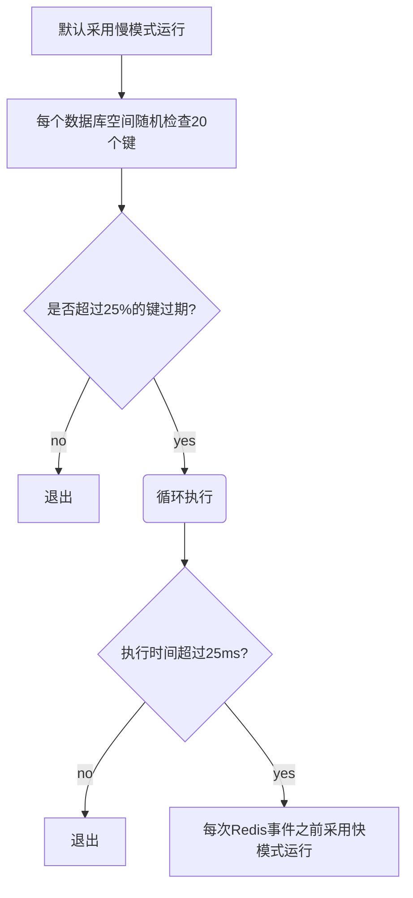

- [reids 内存分析](https://cnblogs.com/niejunlei/p/12898225.html)
- [【70期】Redis内存优化过吗](https://mp.weixin.qq.com/s/804NL73u0FGPj85ea7M1lw)

对于redis来说，什么是最重要的？

毋庸置疑，是内存。

## 一、reids 内存分析
redis内存使用情况：`info memory`

| 属性名                  | 属性说明                                                       |
| ----------------------- | -------------------------------------------------------------- |
| used memory             | Redis 分配器分配的内存总量，也就是内部存储的所有数据内存占用量 |
| used memory human       | 以可读的格式返回used memory                                    |
| used memory_rss         | 从操作系统的角度显示 Redis 进程占用的物理内存总量              |
| used memory_peak        | 内存使用的最大值，表示used memory 的峰值                       |
| used memory peak human  | 以可读的格式返回used memory peak                               |
| used memory_lua         | Lua 引擎所消耗的内存大小                                       |
| mem fraqmentation ratio | used memory_rss/used memory 比值，表示内存碎片率               |
| mem allocator           | Redis 所使用的内存分配器。默认为jemalloc                       |

示例：
```shell
127.0.0.1:6379> info memory
# Memory
used_memory:873848
used_memory_human:853.37K
used_memory_rss:14249984
used_memory_rss_human:13.59M
used_memory_peak:933720
used_memory_peak_human:911.84K
used_memory_peak_perc:93.59%
used_memory_overhead:832360
used_memory_startup:811864
used_memory_dataset:41488
used_memory_dataset_perc:66.93%
allocator_allocated:1032352
allocator_active:1253376
allocator_resident:4968448
total_system_memory:13137526784
total_system_memory_human:12.24G
used_memory_lua:30720
used_memory_lua_human:30.00K
used_memory_scripts:0
used_memory_scripts_human:0B
number_of_cached_scripts:0
maxmemory:0
maxmemory_human:0B
maxmemory_policy:noeviction
allocator_frag_ratio:1.21
allocator_frag_bytes:221024
allocator_rss_ratio:3.96
allocator_rss_bytes:3715072
rss_overhead_ratio:2.87
rss_overhead_bytes:9281536
mem_fragmentation_ratio:17.11
mem_fragmentation_bytes:13417160
mem_not_counted_for_evict:0
mem_replication_backlog:0
mem_clients_slaves:0
mem_clients_normal:20496
mem_aof_buffer:0
mem_allocator:jemalloc-5.1.0
active_defrag_running:0
lazyfree_pending_objects:0
lazyfreed_objects:0
```

可以看到，当前节点内存碎片率为`226893824/209522728≈1.08`，使用的内存分配器是`jemalloc`。

`used_memory_rss` 通常情况下是大于 `used_memory` 的，因为内存碎片的存在。

但是当操作系统把redis内存swap到硬盘时，`memory_fragmentation_ratio` 会小于1。redis使用硬盘作为内存，因为硬盘的速度，redis性能会受到极大的影响。

## 二、redis 内存使用
之前的文章 关于redis，你需要了解的几点！中我们简单介绍过redis的内存使用分布：自身内存，键值对象占用、缓冲区内存占用及内存碎片占用。

redis 空进程自身消耗非常的少，可以忽略不计，优化内存可以不考虑此处的因素。

### 1、对象内存
对象内存，也即真实存储的数据所占用的内存。

redis k-v结构存储，对象占用可以简单的理解为 `k-size + v-size`。

redis的键统一都为字符串类型，值包含多种类型：`string`、`list`、`hash`、`set`、`zset`五种基本类型及基于`string`的`Bitmaps`和`HyperLogLog`类型等。

在实际的应用中，一定要做好kv的构建形式及内存使用预期，可以参考 [关于redis，你需要了解的几点！](https://www.cnblogs.com/niejunlei/p/12896605.html)中关于不同值类型不同形式下的内部存储实现介绍。

### 2、缓冲内存
缓冲内存包括三部分：**客户端缓存**、**复制积压缓存**及**AOF缓冲区**。

#### 1）客户端缓存
接入redis服务器的TCP连接输入输出缓冲内存占用，TCP输入缓冲占用是不受控制的，最大允许空间为1G。输出缓冲占用可以通过`client-output-buffer-limit`参数配置。

**redis 客户端主要分为从客户端、订阅客户端和普通客户端。**

**从客户端连接占用**: 也就是我们所说的slave，主节点会为每一个从节点建立一条连接用于命令复制，缓冲配置为：`client-output-buffer-limit slave 256mb 64mb 60`。

主从之间的间络延迟及挂载的从节点数量是影响内存占用的主要因素。因此在涉及需要**异地部署**主从时要特别注意，另外，也要**避免主节点上挂载过多的从节点**（<=2）；

**订阅客户端内存占用**：发布订阅功能连接客户端使用单独的缓冲区，默认配置：`client-output-buffer-limit pubsub 32mb 8mb 60`。

当消费慢于生产时会造成缓冲区积压，因此需要特别注意消费者角色配比及生产、消费速度的监控。

**普通客户端内存占用**：除了上述之外的其它客户端，如我们通常的应用连接，默认配置：`client-output-buffer-limit normal 1000`。

可以看到，普通客户端没有配置缓冲区限制，通常一般的客户端内存消耗也可以忽略不计。

但是当redis服务器响应较慢时，容易造成大量的慢连接，主要表现为连接数的突增，如果不能及时处理，此时会严重影响redis服务节点的服务及恢复。

关于此，在实际应用中需要注意几点：

- maxclients最大连接数配置必不可少。
- 合理预估单次操作数据量（写或读）及网络时延ttl。
- 禁止线上大吞吐量命令操作，如keys等。

高并发应用情景下，redis内存使用需要有实时的监控预警机制，

#### 2）复制积压缓冲区
v2.8之后提供的一个可重用的固定大小缓冲区，用以实现向从节点的部分复制功能，避免全量复制。配置单数：`repl-backlog-size`，默认1M。单个主节点配置一个复制积压缓冲区。

#### 3）AOF缓冲区
AOF重写期间增量的写入命令保存，此部分缓存占用大小取决于AOF重写时间及增量。

### 3、内存碎片内存占用
【[关于redis，你需要了解的几点！](https://www.cnblogs.com/niejunlei/p/12896605.html)】简单介绍过 redis 的内存分配方式。

## 三、redis 子进程内存消耗
子进程即redis执行持久化（RDB/AOF）时fork的子任务进程。

### 1、关于linux系统的写时复制机制：
**父子进程会共享相同的物理内存页**，父进程处理写请求时会对需要修改的页复制一份副本进行修改，子进程读取的内存则为fork时的父进程内存快照，因此，子进程的内存消耗由期间的写操作增量决定。

### 2、关于linux的透明大页机制THP（Transparent Huge Page）：
**THP机制会降低fork子进程的速度**；写时复制内存页由4KB增大至2M。高并发情境下，写时复制内存占用消耗影响会很大，因此需要选择性关闭。

### 3、关于linux配置：
一般需要配置linux系统 vm.overcommit_memory=1，以允许系统可以分配所有的物理内存。防止fork任务因内存而失败。

## 四、redis 内存管理
redis的内存管理主要分为两方面：内存上限控制及内存回收管理。

### 1、内存上限：maxmemory
目的：缓存应用内存回收机制触发 + 防止物理内存用尽（redis 默认无限使用服务器内存） + 服务节点内存隔离（单服务器上部署多个redis服务节点）

在进行内存分配及限制时要充分考虑内存碎片占用影响。

**动态调整，扩展redis服务节点可用内存**：`config set maxmemory` {}。

### 2、内存回收
回收时机：键过期、内存占用达到上限

#### 1）过期键删除：
redis 键过期时间保存在内部的过期字典中，redis采用**惰性删除机制+定时任务删除机制**。

**惰性删除**：即读时删除，读取带有超时属性的键时，如果键已过期，则删除然后返回空值。这种方式存在问题是，触发时机，加入过期键长时间未被读取，那么它将会一直存在内存中，造成内存泄漏。

**定时任务删除**：redis内部维护了一个定时任务（默认每秒10次，可配置），通过自适应法进行删除。

删除逻辑如下：



> 需要说明的一点是，快慢模式执行的删除逻辑相同，这是超时时间不同。

#### 2）内存溢出控制
当内存达到`maxmemory`，会触发内存回收策略，具体策略依据`maxmemory-policy`来执行。

- `noevication`：默认不回收，达到内存上限，则不再接受写操作，并返回错误。
- `volatile-lru`：根据LRU算法删除设置了过期时间的键，如果没有则不执行回收。
- `allkeys-lru`：根据LRU算法删除键，针对所有键。
- `allkeys-random`：随机删除键。
- `volatitle-random`：速记删除设置了过期时间的键。
- `volatilte-ttl`：根据键ttl，删除最近过期的键，同样如果没有设置过期的键，则不执行删除。

**动态配置**：`config set maxmemory-policy` {}

在设置了`maxmemory`情况下，每次的redis操作都会检查执行内存回收，因此对于线上环境，要确保所这只的`maxmemory > used_memory`。

另外，可以通过动态配置`maxmemory`来主动触发内存回收。
