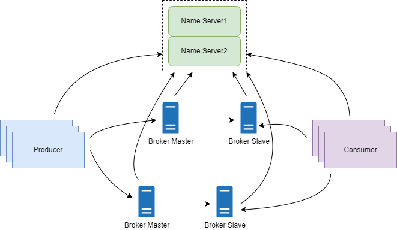
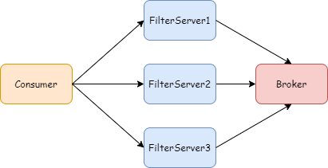

- [40 个定时任务，带你理解 RocketMQ 设计精髓！](https://mp.weixin.qq.com/s/5Cl2QmP7CptfQXEUtuZ4PA)
- [40 个定时任务，带你理解 RocketMQ 设计精髓！](https://mp.weixin.qq.com/s/tgVUcBMpRMTBr5rCzmUNWA)

今天来分享 RocketMQ 的定时任务。通过这些定时任务，能让我们更加理解 RocketMQ 的消息处理机制和设计理念。

从 RocketMQ 4.9.4 的源代码上看，RocketMQ 的定时任务有很多，今天主要讲解一些核心的定时任务。

## 1 架构回顾
首先再来回顾一下 RocketMQ 的架构图：



Name Server 集群部署，但是节点之间并不会同步数据，因为每个节点都会保存完整的数据。因此单个节点挂掉，并不会对集群产生影响。

Broker 可以采用主从集群部署，实现多副本存储和高可用。每个 Broker 节点都要跟所有的 Name Server 节点建立长连接，定义注册 Topic 路由信息和发送心跳。

Producer 和 Consumer 跟 Name Server 的任意一个节点建立长连接，定期从 Name Server 拉取 Topic 路由信息。

## 2 Producer 和 Consumer
### 2.1 获取 NameServer 地址
Producer 和 Consumer 要跟 Name Server 建立连接，就必须首先获取 Name Server 地址。Producer 和 Consumer 采用定时任务每两分钟获取 Name Server 地址并更新本地缓存。代码如下：
```java
//MQClientInstance类
this.scheduledExecutorService.scheduleAtFixedRate(new Runnable() {
 @Override
 public void run() {
  try {
   MQClientInstance.this.mQClientAPIImpl.fetchNameServerAddr();
  } catch (Exception e) {
   log.error("ScheduledTask fetchNameServerAddr exception", e);
  }
 }
}, 1000 * 10, 1000 * 60 * 2, TimeUnit.MILLISECONDS);
```

### 2.2 更新路由信息
Producer 和 Consumer 会定时从 Name Server 获取定时订阅信息，更新本地缓存，默认间隔是 30s（可以配置）。代码如下：
```java
//MQClientInstance类
this.scheduledExecutorService.scheduleAtFixedRate(new Runnable() {

 @Override
 public void run() {
  try {
   MQClientInstance.this.updateTopicRouteInfoFromNameServer();
  } catch (Exception e) {
   log.error("ScheduledTask updateTopicRouteInfoFromNameServer exception", e);
  }
 }
}, 10, this.clientConfig.getPollNameServerInterval(), TimeUnit.MILLISECONDS);
```

### 2.3 向 Broker 发送心跳
Producer 和 Consumer 会从本地缓存的 Broker 列表中定时清除离线的 Broker，并且向 Broker 发送心跳，默认间隔是 30s（可以配置）。代码如下：
```java
//MQClientInstance类
this.scheduledExecutorService.scheduleAtFixedRate(new Runnable() {

 @Override
 public void run() {
  try {
   MQClientInstance.this.cleanOfflineBroker();
   MQClientInstance.this.sendHeartbeatToAllBrokerWithLock();
  } catch (Exception e) {
   log.error("ScheduledTask sendHeartbeatToAllBroker exception", e);
  }
 }
}, 1000, this.clientConfig.getHeartbeatBrokerInterval(), TimeUnit.MILLISECONDS);
```

### 2.4 持久化 Offset
消费者需要定时持久化 MessageQueue 的偏移量，默认每 5s 更新一次（可以配置）。

**注意：** 集群模式需要向 Broker 发送持久化消息，因为集群模式偏移量保存在 Broker 端，而广播模式只需要把偏移量保存在消费者本地文件。 代码如下：
```java
//MQClientInstance类
this.scheduledExecutorService.scheduleAtFixedRate(new Runnable() {

 @Override
 public void run() {
  try {
   MQClientInstance.this.persistAllConsumerOffset();
  } catch (Exception e) {
   log.error("ScheduledTask persistAllConsumerOffset exception", e);
  }
 }
}, 1000 * 10, this.clientConfig.getPersistConsumerOffsetInterval(), TimeUnit.MILLISECONDS);
```

### 2.5 调整核心线程数
对于消费者采用推模式的情况，消费者会根据未消费的消息数量，定期更新核心线程数，默认每 1m 一次。

**注意：** 在 4.9.4 这个版本，更新核心线程数的代码并没有实现，只是预留了接口。 代码如下：
```java
//MQClientInstance类
this.scheduledExecutorService.scheduleAtFixedRate(new Runnable() {

 @Override
 public void run() {
  try {
   MQClientInstance.this.adjustThreadPool();
  } catch (Exception e) {
   log.error("ScheduledTask adjustThreadPool exception", e);
  }
 }
}, 1, 1, TimeUnit.MINUTES);
```

### 2.6 失效过期请求
Producer 和 Consumer 会定时扫描缓存在本地的请求，如果请求开始时间加超时时间（再加 1s）小于当前时间，则这个请求过期。通过定时任务（3s 一次）让过期请求失效，并且触发回调函数。
```java
//NettyRemotingClient.java
this.timer.scheduleAtFixedRate(new TimerTask() {
 @Override
 public void run() {
  try {
   NettyRemotingClient.this.scanResponseTable();
  } catch (Throwable e) {
   log.error("scanResponseTable exception", e);
  }
 }
}, 1000 * 3, 1000);
```

### 2.7 生产者
#### 2.7.1 性能记录
生产者发送消息后，会对成功失败的状态、花费时间进行记录，以此来计算吞吐量 TPS，响应时间 RT，代码如下：
```java
//Producer.java
executorService.scheduleAtFixedRate(new TimerTask() {
 @Override
 public void run() {
  snapshotList.addLast(statsBenchmark.createSnapshot());
  if (snapshotList.size() > 10) {
   snapshotList.removeFirst();
  }
 }
}, 1000, 1000, TimeUnit.MILLISECONDS);

executorService.scheduleAtFixedRate(new TimerTask() {
 private void printStats() {
  if (snapshotList.size() >= 10) {
   doPrintStats(snapshotList,  statsBenchmark, false);
  }
 }

 @Override
 public void run() {
  try {
   this.printStats();
  } catch (Exception e) {
   e.printStackTrace();
  }
 }
}, 10000, 10000, TimeUnit.MILLISECONDS);
```

### 2.8 消费者
#### 2.8.1 MessageQueue 加锁
对于顺序消息，要保证同一个 MessageQueue 只能被同一个 Consumer 消费。消费者初始化的时候，会启动一个定时任务，定时（默认 20s，可以配置）地向 Broker 发送锁定消息，Broker 收到请求后，就会把 MessageQueue、group 和 clientId 进行绑定，这样其他客户端就不能从这个 MessageQueue 拉取消息。

代码如下：
```java
//ConsumeMessageOrderlyService.java
this.scheduledExecutorService.scheduleAtFixedRate(new Runnable() {
 @Override
 public void run() {
  try {
   ConsumeMessageOrderlyService.this.lockMQPeriodically();
  } catch (Throwable e) {
   log.error("scheduleAtFixedRate lockMQPeriodically exception", e);
  }
 }
}, 1000 * 1, ProcessQueue.REBALANCE_LOCK_INTERVAL, TimeUnit.MILLISECONDS);
```

注意：Broker 的加锁是有时效的（默认 60s，可以配置），过期后，有可能被其他 Consumer 进行消费。

#### 2.8.2 性能快照
Consumer 每秒会记录一次性能快照，比如消息从创建到消费花费的时间，消息从保存到消费花费的时间，接收到消息的总数量，失败总数量。代码如下：
```java
//Consumer.java
executorService.scheduleAtFixedRate(new TimerTask() {
 @Override
 public void run() {
  snapshotList.addLast(statsBenchmarkConsumer.createSnapshot());
  if (snapshotList.size() > 10) {
   snapshotList.removeFirst();
  }
 }
}, 1000, 1000, TimeUnit.MILLISECONDS);
```

上面记录了性能快照后，Consumer 会每隔 10s 进行性能参数计算和打印。代码如下：
```java
//Consumer.java
executorService.scheduleAtFixedRate(new TimerTask() {
private void printStats() {
 if (snapshotList.size() >= 10) {
  Long[] begin = snapshotList.getFirst();
  Long[] end = snapshotList.getLast();

  final long consumeTps =
   (long) (((end[1] - begin[1]) / (double) (end[0] - begin[0])) * 1000L);
  final double averageB2CRT = (end[2] - begin[2]) / (double) (end[1] - begin[1]);
  final double averageS2CRT = (end[3] - begin[3]) / (double) (end[1] - begin[1]);
  final long failCount = end[4] - begin[4];
  final long b2cMax = statsBenchmarkConsumer.getBorn2ConsumerMaxRT().get();
  final long s2cMax = statsBenchmarkConsumer.getStore2ConsumerMaxRT().get();

  statsBenchmarkConsumer.getBorn2ConsumerMaxRT().set(0);
  statsBenchmarkConsumer.getStore2ConsumerMaxRT().set(0);

  System.out.printf("Current Time: %s TPS: %d FAIL: %d AVG(B2C) RT(ms): %7.3f AVG(S2C) RT(ms): %7.3f MAX(B2C) RT(ms): %d MAX(S2C) RT(ms): %d%n",
    System.currentTimeMillis(), consumeTps, failCount, averageB2CRT, averageS2CRT, b2cMax, s2cMax
  );
 }
}
```
通过性能参数的日志输出，可以很方便的对 RocketMQ 的消费者进行监控。

#### 2.8.3 清除过期消息
消费者会定期检查本地拉取的消息列表，如果列表中的消息已经过期（默认 15 分钟过期，可以配置），则把过期消息再次发送给 Broker，然后从本地消息列表删除。代码如下：
```java
//ConsumeMessageConcurrentlyService.java
this.cleanExpireMsgExecutors.scheduleAtFixedRate(new Runnable() {

 @Override
 public void run() {
  try {
   cleanExpireMsg();
  } catch (Throwable e) {
   log.error("scheduleAtFixedRate cleanExpireMsg exception", e);
  }
 }

}, this.defaultMQPushConsumer.getConsumeTimeout(), this.defaultMQPushConsumer.getConsumeTimeout(), TimeUnit.MINUTES);
```

#### 2.8.4 清除过期消息
消费者会每隔 30s 向 NameServer 拉取 MessageQueue 信息，然后跟本地保存的进行比较，如果不一致，则更新本地缓存信息。代码如下：
```java
//DefaultLitePullConsumerImpl.java
scheduledExecutorService.scheduleAtFixedRate(
new Runnable() {
 @Override
 public void run() {
  try {
   fetchTopicMessageQueuesAndCompare();
  } catch (Exception e) {
   log.error("ScheduledTask fetchMessageQueuesAndCompare exception", e);
  }
 }
}, 1000 * 10, this.getDefaultLitePullConsumer().getTopicMetadataCheckIntervalMillis(), TimeUnit.MILLISECONDS);
```

## 3 Broker
### 3.1 状态采样
Broker 端会对状态进行采用，比如一个 Topic、MessageQueue、Group 总共发送了多少条消息，Topic 总共发送的消息大小。Broker 会对这些状态按照秒、分钟、小时为单位进行采样并且定时打印，这里一共有 6 个定时任务。比如下面是按照秒进行采样的定时任务：
```java
//StatsItemSet.java
this.scheduledExecutorService.scheduleAtFixedRate(new Runnable() {
 @Override
 public void run() {
  try {
   samplingInSeconds();
  } catch (Throwable ignored) {
  }
 }
}, 0, 10, TimeUnit.SECONDS);
```

### 3.2 记录消息延时
Broker 读取消息时会记录消息从保存磁盘到被读取的时间差并定时打印。定时任务代码如下：
```java
//MomentStatsItemSet.java
this.scheduledExecutorService.scheduleAtFixedRate(new Runnable() {
 @Override
 public void run() {
  try {
   printAtMinutes();
  } catch (Throwable ignored) {
  }
 }
}, Math.abs(UtilAll.computeNextMinutesTimeMillis() - System.currentTimeMillis()), 1000 * 60 * 5, TimeUnit.MILLISECONDS);
```

### 3.3 持久化数据
Broker 会定时持久化消费偏移量、Topic 配置、定阅组配置等，默认 10s 一次（可以配置）。代码如下：
```java
//ScheduleMessageService.java
this.deliverExecutorService.scheduleAtFixedRate(new Runnable() {

 @Override
 public void run() {
  try {
   if (started.get()) {
    ScheduleMessageService.this.persist();
   }
  } catch (Throwable e) {
   log.error("scheduleAtFixedRate flush exception", e);
  }
 }
}, 10000, this.defaultMessageStore.getMessageStoreConfig().getFlushDelayOffsetInterval(), TimeUnit.MILLISECONDS);
```

### 3.4 失效过期请求
Broker 会定时扫描缓存在本地的请求，如果请求开始时间加超时时间（再加 1s）小于当前时间，则这个请求过期。通过定时任务（3s 一次）让过期请求失效，并且触发回调函数。
```java
//NettyRemotingServer.java
this.timer.scheduleAtFixedRate(new TimerTask() {

 @Override
 public void run() {
  try {
   NettyRemotingServer.this.scanResponseTable();
  } catch (Throwable e) {
   log.error("scanResponseTable exception", e);
  }
 }
}, 1000 * 3, 1000);
```

### 3.5 过滤服务
消费者可能会向 Broker 注册 filterClass 用来过滤消息。Broker 收到消费者注册的 filterClass 后会用定时任务来创建 FilterServer。代码如下：
```java
//FilterServerManager.java
this.scheduledExecutorService.scheduleAtFixedRate(new Runnable() {
 @Override
 public void run() {
  try {
   FilterServerManager.this.createFilterServer();
  } catch (Exception e) {
   log.error("", e);
  }
 }
}, 1000 * 5, 1000 * 30, TimeUnit.MILLISECONDS);
```

这样消费者拉取消息时首先从 FilterServer 拉取消息，FilterServer 从 Broker 拉取消息后进行过滤，只把消费者感兴趣的消息返回给消费者。一个 Broker 可以有多个 FilterServer。如下图：



### 3.6 记录消息总量
Broker 每天会记录前一天收发消息的总数量，定时任务如下（period 是 1 天）：
```java
//BrokerController.java
this.scheduledExecutorService.scheduleAtFixedRate(new Runnable() {
 @Override
 public void run() {
  try {
   BrokerController.this.getBrokerStats().record();
  } catch (Throwable e) {
   log.error("schedule record error.", e);
  }
 }
}, initialDelay, period, TimeUnit.MILLISECONDS);
```

### 3.7 持久化 Offset
Broker 默认每隔 5s（可以配置） 会持久化一次消息的 Offset，代码如下：
```java
//BrokerController.java
this.scheduledExecutorService.scheduleAtFixedRate(new Runnable() {
 @Override
 public void run() {
  try {
   BrokerController.this.consumerOffsetManager.persist();
  } catch (Throwable e) {
   log.error("schedule persist consumerOffset error.", e);
  }
 }
}, 1000 * 10, this.brokerConfig.getFlushConsumerOffsetInterval(), TimeUnit.MILLISECONDS);
```

### 3.8 持久化过滤参数
上面提到过，消费者可能会向 Broker 注册 filterClass，Broker 解析消费者注册的 filterClass 后，会把解析后的 FilterData 持久化到文件，代码如下：
```java
//BrokerController.java
this.scheduledExecutorService.scheduleAtFixedRate(new Runnable() {
 @Override
 public void run() {
  try {
   BrokerController.this.consumerFilterManager.persist();
  } catch (Throwable e) {
   log.error("schedule persist consumer filter error.", e);
  }
 }
}, 1000 * 10, 1000 * 10, TimeUnit.MILLISECONDS);
```

### 3.9 Broker 自我保护
当消费者读取消息缓慢时，Broker 为了保护自己，会把这个消费者设置为不允许读取的状态，这样这个消费组就不能再拉取消息了，代码如下：
```java
//BrokerController.java
this.scheduledExecutorService.scheduleAtFixedRate(new Runnable() {
 @Override
 public void run() {
  try {
   BrokerController.this.protectBroker();
  } catch (Throwable e) {
   log.error("protectBroker error.", e);
  }
 }
}, 3, 3, TimeUnit.MINUTES);
```

### 3.10 Broker 打印水位
Broker 会每隔 1s 打印一次水位，包括发送消息的延迟、接收消息的延迟、事务消息的延迟、查询消息的延迟，代码如下：
```java
//BrokerController.java
this.scheduledExecutorService.scheduleAtFixedRate(new Runnable() {
 @Override
 public void run() {
  try {
   BrokerController.this.printWaterMark();
  } catch (Throwable e) {
   log.error("printWaterMark error.", e);
  }
 }
}, 10, 1, TimeUnit.SECONDS);
```

### 3.11 Broker 打印 Offset 差
Broker 会定时打印最新的消息 Offset 和已经分发给 MessageQueue 和 Index 索引的 Offset 差距，代码如下：
```java
//BrokerController.java
this.scheduledExecutorService.scheduleAtFixedRate(new Runnable() {
 @Override
 public void run() {
  try {
   log.info("dispatch behind commit log {} bytes", BrokerController.this.getMessageStore().dispatchBehindBytes());
  } catch (Throwable e) {
   log.error("schedule dispatchBehindBytes error.", e);
  }
 }
}, 1000 * 10, 1000 * 60, TimeUnit.MILLISECONDS);
```

### 3.12 获取 NameServer 地址
Broker 会定期获取 NameServer 的地址，并更新本地缓存，代码如下：
```java
//BrokerController.java
this.scheduledExecutorService.scheduleAtFixedRate(new Runnable() {

 @Override
 public void run() {
  try {
   BrokerController.this.brokerOuterAPI.fetchNameServerAddr();
  } catch (Throwable e) {
   log.error("ScheduledTask fetchNameServerAddr exception", e);
  }
 }
}, 1000 * 10, 1000 * 60 * 2, TimeUnit.MILLISECONDS);
```

### 3.13 打印主从偏移量差距
Broker 会定时打印 master 节点和 slave 节点消息 Offset 的差距，代码如下：
```java
//BrokerController.java
this.scheduledExecutorService.scheduleAtFixedRate(new Runnable() {
 @Override
 public void run() {
  try {
   BrokerController.this.printMasterAndSlaveDiff();
  } catch (Throwable e) {
   log.error("schedule printMasterAndSlaveDiff error.", e);
  }
 }
}, 1000 * 10, 1000 * 60, TimeUnit.MILLISECONDS);
```

### 3.14 向 NameServer 注册
Broker 会定时向（默认 30s，可配置，最高不超过 60s）所有 NameServer 发送注册消息，代码如下：
```java
//BrokerController.java
this.scheduledExecutorService.scheduleAtFixedRate(new Runnable() {

 @Override
 public void run() {
  try {
   BrokerController.this.registerBrokerAll(true, false, brokerConfig.isForceRegister());
  } catch (Throwable e) {
   log.error("registerBrokerAll Exception", e);
  }
 }
}, 1000 * 10, Math.max(10000, Math.min(brokerConfig.getRegisterNameServerPeriod(), 60000)), TimeUnit.MILLISECONDS);
```

### 3.15 同步 Slave
Broker 的 Master 节点会每间隔 10s 向 Slave 节点同步数据，包括 Topic 配置、消费偏移量、延迟偏移量、消费组配置，代码如下：
```java
//BrokerController.java
slaveSyncFuture = this.scheduledExecutorService.scheduleAtFixedRate(new Runnable() {
 @Override
 public void run() {
  try {
   BrokerController.this.slaveSynchronize.syncAll();
  }
  catch (Throwable e) {
   log.error("ScheduledTask SlaveSynchronize syncAll error.", e);
  }
 }
}, 1000 * 3, 1000 * 10, TimeUnit.MILLISECONDS);
```

### 3.16 删除过期文件
Broker 会周期性（默认 10s，可以配置）地执行删除任务，删除过期的 CommitLog 文件和 ConsumeQueue 文件，代码如下：
```java
//DefaultMessageStore.java
this.scheduledExecutorService.scheduleAtFixedRate(new Runnable() {
 @Override
 public void run() {
  DefaultMessageStore.this.cleanFilesPeriodically();
 }
}, 1000 * 60, this.messageStoreConfig.getCleanResourceInterval(), TimeUnit.MILLISECONDS);
```

### 3.17 文件大小检查
Broker 会每隔 10 分钟检查 CommitLog 文件和 ConsumeQueue 文件，用当前文件的最小（起始） Offset 减去上一个文件最小（起始） Offset，如果不等于一个文件的大小，就说明文件存在问题。代码如下：
```java
//DefaultMessageStore.java
this.scheduledExecutorService.scheduleAtFixedRate(new Runnable() {
 @Override
 public void run() {
  DefaultMessageStore.this.checkSelf();
 }
}, 1, 10, TimeUnit.MINUTES);
```

### 3.18 保存堆栈映射
Broker 会每隔 1s 记录所有存活线程的堆栈映射信息，前提是 debugLockEnable 开关配置是打开的。代码如下：
```java
//DefaultMessageStore.java
this.scheduledExecutorService.scheduleAtFixedRate(new Runnable() {
 @Override
 public void run() {
  if (DefaultMessageStore.this.getMessageStoreConfig().isDebugLockEnable()) {
   try {
    if (DefaultMessageStore.this.commitLog.getBeginTimeInLock() != 0) {
     long lockTime = System.currentTimeMillis() - DefaultMessageStore.this.commitLog.getBeginTimeInLock();
     if (lockTime > 1000 && lockTime < 10000000) {

      String stack = UtilAll.jstack();
      final String fileName = System.getProperty("user.home") + File.separator + "debug/lock/stack-"
       + DefaultMessageStore.this.commitLog.getBeginTimeInLock() + "-" + lockTime;
      MixAll.string2FileNotSafe(stack, fileName);
     }
    }
   } catch (Exception e) {
   }
  }
 }
}, 1, 1, TimeUnit.SECONDS);
```

### 3.19 检查物理磁盘
Broker 会每隔 10s 检查保存 CommitLog 的磁盘空间是否达到阈值，如果达到，会打印 error 级别的日志。代码如下：
```java
//DefaultMessageStore.java
this.diskCheckScheduledExecutorService.scheduleAtFixedRate(new Runnable() {
 public void run() {
  DefaultMessageStore.this.cleanCommitLogService.isSpaceFull();
 }
}, 1000L, 10000L, TimeUnit.MILLISECONDS);
```

### 3.20 持久化延时消息偏移量
RocketMQ 的延时消费分为 18 个级别，定义如下：
```java
//ScheduleMessageService.java
private String messageDelayLevel = "1s 5s 10s 30s 1m 2m 3m 4m 5m 6m 7m 8m 9m 10m 20m 30m 1h 2h";
```
RocketMQ 会为每个延时级别定义要给 ConsumeQueue，每隔 ConsumeQueue 都会有一个 Offset，通过 offsetTable(ConcurrentMap) 来记录不同延时级别对应的 Offset。

RocketMQ 会周期性地（默认 10s，可以配置）把 offsetTable 中保存的 Offset 持久化到文件。代码如下：
```java
//DefaultMessageStore.java
this.deliverExecutorService.scheduleAtFixedRate(new Runnable() {
 @Override
 public void run() {
  try {
   if (started.get()) {
    ScheduleMessageService.this.persist();
   }
  } catch (Throwable e) {
   log.error("scheduleAtFixedRate flush exception", e);
  }
 }
}, 10000, this.defaultMessageStore.getMessageStoreConfig().getFlushDelayOffsetInterval(), TimeUnit.MILLISECONDS);
```

### 3.21 关闭异常连接
Broker 会定时扫描所有的长连接，主要包括生产者、消费者和 FilterServer，如果连接不活跃，则关闭该连接，并从本地连接列表中移除。代码如下：
```java
//ClientHousekeepingService.java
this.scheduledExecutorService.scheduleAtFixedRate(new Runnable() {
 @Override
 public void run() {
  try {
   ClientHousekeepingService.this.scanExceptionChannel();
  } catch (Throwable e) {
   log.error("Error occurred when scan not active client channels.", e);
  }
 }
}, 1000 * 10, 1000 * 10, TimeUnit.MILLISECONDS);
```

### 3.22 清理过期消息
如果 Broker 配置了允许快速失败（brokerFastFailureEnable），则会每隔 10ms 定时清理过期请求，包括要发送的消息、接收的消息、心跳消息、要结束的事务消息。代码如下：
```java
scheduledExecutorService.scheduleAtFixedRate(
new Runnable() {
 @Override
 public void run() {
  try {
   fetchTopicMessageQueuesAndCompare();
  } catch (Exception e) {
   log.error("ScheduledTask fetchMessageQueuesAndCompare exception", e);
  }
 }
}, 1000 * 10, this.getDefaultLitePullConsumer().getTopicMetadataCheckIntervalMillis(), TimeUnit.MILLISECONDS);
```

**注意：** 清理消息前会判断是否系统繁忙，如果系统繁忙，会给发送队列中的消息直接返回系统繁忙，暂时不做过期消息清理。

## 4 NameServer
### 4.1 检查过期 Broker
在 3.14 节中讲过，Broker 会跟 NameServer 建立长连接，定时向 NameServer 发送注册消息。NameServer 会在本地维护一个 Broker 列表，定时任务会轮询本地保存的 Broker 列表，检查注册消息是否过期（超过 120s），如果注册消息过期，则关闭长连接，从本地缓存删除这个 Broker。代码如下：
```java
//NamesrvController.java
this.scheduledExecutorService.scheduleAtFixedRate(NamesrvController.this.routeInfoManager::scanNotActiveBroker, 5, 10, TimeUnit.SECONDS);
```

### 4.2 打印配置
NameServer 启动时，会加载 KV 格式的配置文件到 configTable 这个变量，NameServer 客户端也可以发送一个 KV 配置请求给 NameServer，NameServer 收到请求后也会保存到 configTable。

NameServer 会定时打印 configTable 中的配置，代码如下：
```java
//NamesrvController.java
this.scheduledExecutorService.scheduleAtFixedRate(NamesrvController.this.kvConfigManager::printAllPeriodically, 1, 10, TimeUnit.MINUTES);
```

## 5 总结
RocketMQ 的定时任务很多，这些定时任务的加入让 RocketMQ 的设计更加完备，包括业务处理、监控日志、心跳、清理任务、关闭连接、持久化数据等。通过对定时任务的理解，能够更深入地理解 RocketMQ 的设计理念。
