- [RocketMQ为什么这么快？我从源码中扒出了10大原因！](https://mp.weixin.qq.com/s/y1-A-SHAkGdg9IOTeUtPxg)


RocketMQ作为阿里开源的消息中间件，深受广大开发者的喜爱

而这其中一个很重要原因就是，它处理消息和拉取消息的速度非常快

那么，问题来了，RocketMQ为什么这么快呢？

接下来，我将从以下10个方面来探讨一下RocketMQ这么快的背后原因


如果你对RocketMQ还不了解，可以从公众号后台菜单栏中查看我之前写的关于RocketMQ的几篇文章

如果你对RocketMQ源码也感兴趣，可以从下面这个仓库fork一下源码，我在源码中加了中文注释，并且后面我还会持续更新注释

> https://github.com/sanyou3/rocketmq.git

本文是基于RocketMQ 4.9.x版本讲解

## 批量发送消息
RocketMQ在发送消息的时候支持一次性批量发送多条消息，如下代码所示：

```java
public class Producer {
    public static void main(String[] args) throws Exception {
        //创建一个生产者，指定生产者组为 sanyouProducer
        DefaultMQProducer producer = new DefaultMQProducer("sanyouProducer");
        // 指定NameServer的地址
        producer.setNamesrvAddr("192.168.200.143:9876");
        // 启动生产者
        producer.start();

        //用以及集合保存多个消息
        List<Message> messages = new ArrayList<>();
        messages.add(new Message("sanyouTopic", "三友的java日记 0".getBytes()));
        messages.add(new Message("sanyouTopic", "三友的java日记 1".getBytes()));
        messages.add(new Message("sanyouTopic", "三友的java日记 2".getBytes()));
        // 发送消息并得到消息的发送结果，然后打印
        SendResult sendResult = producer.send(messages);
        System.out.printf("%s%n", sendResult);

        // 关闭生产者
        producer.shutdown();
    }

}
```

通过批量发送消息，减少了RocketMQ客户端与服务端，也就是Broker之间的网络通信次数，提高传输效率

不过在使用批量消息的时候，需要注意以下三点：

1. 每条消息的Topic必须都得是一样的
2. 不支持延迟消息和事务消息
3. 不论是普通消息还是批量消息，总大小默认不能超过4m

## 消息压缩
RocketMQ在发送消息的时候，当发现消息的大小超过4k的时候，就会对消息进行压缩

这是因为如果消息过大，会对网络带宽造成压力

不过需要注意的是，如果是批量消息的话，就不会进行压缩，如下所示：

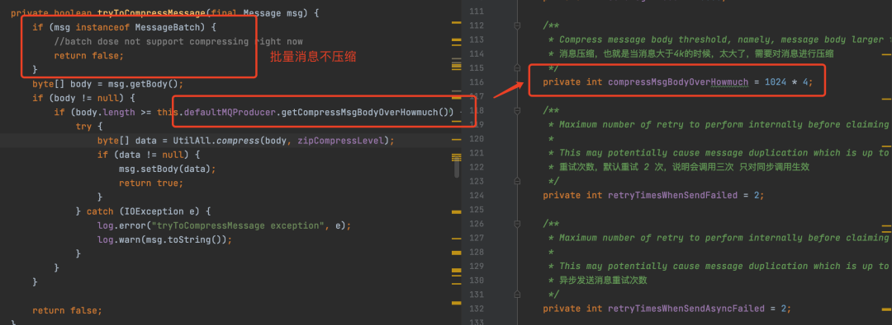

压缩消息除了能够减少网络带宽造成压力之外，还能够节省消息存储空间

RocketMQ在往磁盘存消息的时候，并不会去解压消息，而是直接将压缩后的消息存到磁盘

消费者拉取到的消息其实也是压缩后的消息

不过消费者在拿到消息之后会对消息进行解压缩

当我们的业务系统拿到消息的时候，其实就是解压缩后的消息

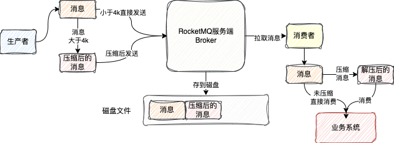

虽然压缩消息能够减少带宽压力和磁盘存储压力

但是由于压缩和解压缩的过程都是在客户端（生产者、消费者）完成的

所以就会导致客户端消耗更多的CPU资源，对CPU造成一定的压力

## 高性能网络通信模型
当生产者处理好消息之后，就会将消息通过网络通信发送给服务端

而RocketMQ之所以快的一个非常重要原因就是它拥有高性能网络通信模型

RocketMQ网络通信这块底层是基于Netty来实现的

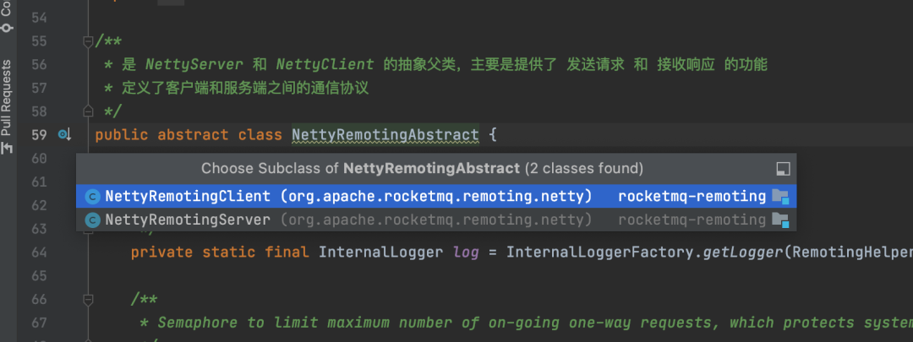

Netty是一款非常强大、非常优秀的网络应用程序框架，主要有以下几个优点：

- 异步和事件驱动：Netty基于事件驱动的架构，使用了异步I/O操作，避免了阻塞式I/O调用的缺陷，能够更有效地利用系统资源，提高并发处理能力。
- 高性能：Netty针对性能进行了优化，比如使用直接内存进行缓冲，减少垃圾回收的压力和内存拷贝的开销，提供了高吞吐量、低延迟的网络通讯能力。
- 可扩展性：Netty的设计允许用户自定义各种Handler来处理协议编码、协议解码和业务逻辑等。并且，它的模块可插拔性设计使得用户可以根据需要轻松地添加或更换组件。
- 简化API：与Java原生NIO库相比，Netty提供了更加简洁易用的API，大大降低了网络编程的复杂度。
- 安全：Netty内置了对SSL/TLS协议的支持，使得构建安全通信应用变得容易。
- 丰富的协议支持：Netty提供了HTTP、HTTP/2、WebSocket、Google Protocol Buffers等多种协议的编解码支持，满足不同网络应用需求。
- ...

就是因为Netty如此的强大，所以不仅仅RocketMQ是基于Netty实现网络通信的

几乎绝大多数只要涉及到网络通信的Java类框架，底层都离不开Netty的身影

比如知名RPC框架Dubbo、Java gRPC实现、Redis的亲儿子Redisson、分布式任务调度平台xxl-job等等

它们底层在实现网络通信时，都是基于Netty框架

## 零拷贝技术
当消息达到RocketMQ服务端之后，为了能够保证服务端重启之后消息也不丢失，此时就需要将消息持久化到磁盘

由于涉及到消息持久化操作，就涉及到磁盘文件的读写操作

RocketMQ为了保证磁盘文件的高性能读写，使用到了一个叫零拷贝的技术

### 1、传统IO读写方式
说零拷贝之前，先说一下传统的IO读写方式。

比如现在有一个需求，将磁盘文件通过网络传输出去

那么整个传统的IO读写模型如下图所示


传统的IO读写其实就是read + write的操作，整个过程会分为如下几步

1. 用户调用read()方法，开始读取数据，此时发生一次上下文从用户态到内核态的切换，也就是图示的切换1
2. 将磁盘数据通过DMA拷贝到内核缓存区
3. 将内核缓存区的数据拷贝到用户缓冲区，这样用户，也就是我们写的代码就能拿到文件的数据
4. read()方法返回，此时就会从内核态切换到用户态，也就是图示的切换2
5. 当我们拿到数据之后，就可以调用write()方法，此时上下文会从用户态切换到内核态，即图示切换3
6. CPU将用户缓冲区的数据拷贝到Socket缓冲区
7. 将Socket缓冲区数据拷贝至网卡
8. write()方法返回，上下文重新从内核态切换到用户态，即图示切换4

整个过程发生了4次上下文切换和4次数据的拷贝，这在高并发场景下肯定会严重影响读写性能。

所以为了减少上下文切换次数和数据拷贝次数，就引入了零拷贝技术。

### 2、零拷贝
零拷贝技术是一个思想，指的是指计算机执行操作时，CPU不需要先将数据从某处内存复制到另一个特定区域。

实现零拷贝的有以下两种方式：

- mmap()
- sendfile()

#### mmap()
mmap（memory map）是一种内存映射文件的方法，即将一个文件或者其它对象映射到进程的地址空间，实现文件磁盘地址和进程虚拟地址空间中一段虚拟地址的一一对映关系。

简单地说就是内核缓冲区和应用缓冲区进行映射

用户在操作应用缓冲区时就好像在操作内核缓冲区

比如你往应用缓冲区写数据，就好像直接往内核缓冲区写数据，这个过程不涉及到CPU拷贝

而传统IO就需要将在写完应用缓冲区之后需要将数据通过CPU拷贝到内核缓冲区

同样地上述文件传输功能，如果使用mmap的话，由于我们可以直接操作内核缓冲区

此时我们就可以将内核缓冲区的数据直接CPU拷贝到Socket缓冲区

整个IO模型就会如下图所示：


基于mmap IO读写其实就变成mmap + write的操作，也就是用mmap替代传统IO中的read操作

- 当用户发起mmap调用的时候会发生上下文切换1，进行内存映射，然后数据被拷贝到内核缓冲区，mmap返回，发生上下文切换2
- 随后用户调用write，发生上下文切换3，将内核缓冲区的数据拷贝到Socket缓冲区，write返回，发生上下文切换4。

上下文切换的次数仍然是4次，但是拷贝次数只有3次，少了一次CPU拷贝。

所以总的来说，使用mmap就可以直接少一次CPU拷贝。

说了这么多，那么在Java中，如何去实现mmap，也就是内核缓冲区和应用缓冲区映射呢？

其实在Java NIO类库中就提供了相应的API，当然底层也还是调用Linux系统的mmap()实现的，代码如下所示

```java
FileChannel fileChannel = new RandomAccessFile("test.txt", "rw").getChannel();
MappedByteBuffer mappedByteBuffer = fileChannel.map(FileChannel.MapMode.READ_WRITE, 0, fileChannel.size());
```

MappedByteBuffer，你可以认为操作这个对象就好像直接操作内核缓冲区

比如可以通过MappedByteBuffer读写磁盘文件，此时就好像直接从内核缓冲区读写数据

当然也可以直接通过MappedByteBuffer将文件的数据拷贝到Socket缓冲区，实现上述文件传输的模型

这里我就不贴相应的代码了

RocketMQ在存储文件时，就是通过mmap技术来实现高效的文件读写

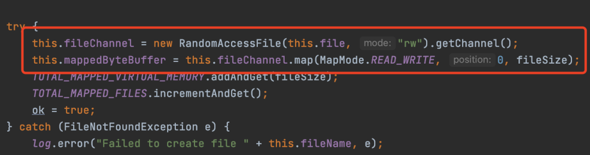
RocketMQ中使用mmap代码

> 虽然前面一直说mmap不涉及CPU拷贝，但在某些特定场景下，尤其是在写操作或特定的系统优化策略下，还是可能涉及CPU拷贝。

#### sendfile()
sendfile()跟mmap()一样，也会减少一次CPU拷贝，但是它同时也会减少两次上下文切换。

sendfile()主要是用于文件传输，比如将文件传输到另一个文件，又或者是网络

当基于sendfile()时，一次文件传输的过程就如下图所示：


用户发起sendfile()调用时会发生切换1，之后数据通过DMA拷贝到内核缓冲区，之后再将内核缓冲区的数据CPU拷贝到Socket缓冲区，最后拷贝到网卡，sendfile()返回，发生切换2。

同样地，Java NIO类库中也提供了相应的API实现sendfile

当然底层还是操作系统的sendfile()

```java
FileChannel channel = FileChannel.open(Paths.get("./test.txt"), StandardOpenOption.WRITE, StandardOpenOption.CREATE);
//调用transferTo方法向目标数据传输
channel.transferTo(position, len, target);
```

FileChannel的transferTo方法底层就是基于sendfile来的

在如上代码中，并没有文件的读写操作，而是直接将文件的数据传输到target目标缓冲区

也就是说，sendfile传输文件时是无法知道文件的具体的数据的

但是mmap不一样，mmap可以来直接修改内核缓冲区的数据

假设如果需要对文件的内容进行修改之后再传输，mmap可以满足

### 小总结
在传统IO中，如果想将用户缓存区的数据放到内核缓冲区，需要经过CPU拷贝

而基于零拷贝技术可以减少CPU拷贝次数，常见的有两种：

- mmap()
- sendfile()

mmap()是将用户缓冲区和内核缓冲区共享，操作用户缓冲区就好像直接操作内核缓冲区，读写数据时不需要CPU拷贝

Java中可以使用MappedByteBuffer这个API来达到操作内核缓冲区的效果

sendfile()主要是用于文件传输，可以通过sendfile()将一个文件内容传输到另一个文件中或者是网络中

sendfile()在整个过程中是无法对文件内容进行修改的，如果想修改之后再传输，可以通过mmap来修改内容之后再传输

上面出现的API都是Java NIO标准类库中的

如果你看的还是很迷糊，那直接记住一个结论

> 之所以基于零拷贝技术能够高效的实现文件的读写操作，主要因为是减少了CPU拷贝次数和上下文切换次数

在RocketMQ中，底层是基于mmap()来实现文件的高效读写的

## 顺序写
RocketMQ在存储消息时，除了使用零拷贝技术来实现文件的高效读写之外

还使用顺序写的方式提高数据写入的速度

RocketMQ会将消息按照顺序一条一条地写入文件中

这种顺序写的方式由于减少了磁头的移动和寻道时间，在大规模数据写入的场景下，使得数据写入的速度更快

## 高效的数据存储结构
### Topic和队列的关系
在RocketMQ中，默认会为每个Topic在每个服务端Broker实例上创建4个队列

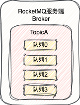
如果有两个Broker，那么默认就会有8个队列

每个Broker上的队列上的编号（queueId）都是从0开始

#### CommitLog
前面一直说，当消息到达RocektMQ服务端时，需要将消息存到磁盘文件

RocketMQ给这个存消息的文件起了一个高大上的名字：CommitLog

> 由于消息会很多，所以为了防止文件过大，CommitLog在物理磁盘文件上被分为多个磁盘文件，每个文件默认的固定大小是1G

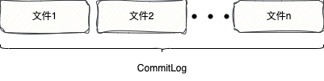

消息在写入到文件时，除了包含消息本身的内容数据，也还会包含其它信息，比如

- 消息的Topic
- 消息所在队列的id，生产者发送消息时会携带这个队列id
- 消息生产者的ip和端口
- ...

这些数据会和消息本身按照一定的顺序同时写到CommitLog文件中

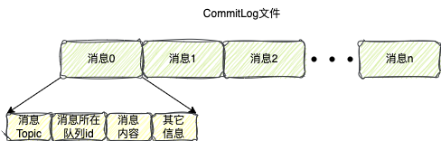

上图中黄色排列顺序和实际的存的内容并非实际情况，我只是举个例子

#### ConsumeQueue
除了CommitLog文件之外，RocketMQ还会为每个队列创建一个磁盘文件

RocketMQ给这个文件也起了一个高大上的名字：ConsumeQueue

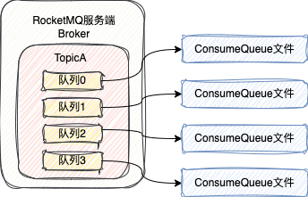

> 当消息被存到CommitLog之后，其实还会往这条消息所在队列的ConsumeQueue文件中插一条数据

每个队列的ConsumeQueue也是由多个文件组成，每个文件默认是存30万条数据

插入ConsumeQueue中的每条数据由20个字节组成，包含3部分信息

- 消息在CommitLog的起始位置（8个字节），也被称为偏移量
- 消息在CommitLog存储的长度（4个字节）
- 消息tag的hashCode（8个字节）


每条数据也有自己的编号（offset），默认从0开始，依次递增

所以，通过ConsumeQueue中存的数据可以从CommitLog中找到对应的消息

那么这个ConsumeQueue有什么作用呢？

其实通过名字也能猜到，这其实跟消息消费有关

当消费者拉取消息的时候，会告诉服务端四个比较重要的信息

- 自己需要拉取哪个Topic的消息
- 从Topic中的哪个队列（queueId）拉取
- 从队列的哪个位置（offset）拉取消息
- 拉取多少条消息(默认32条)

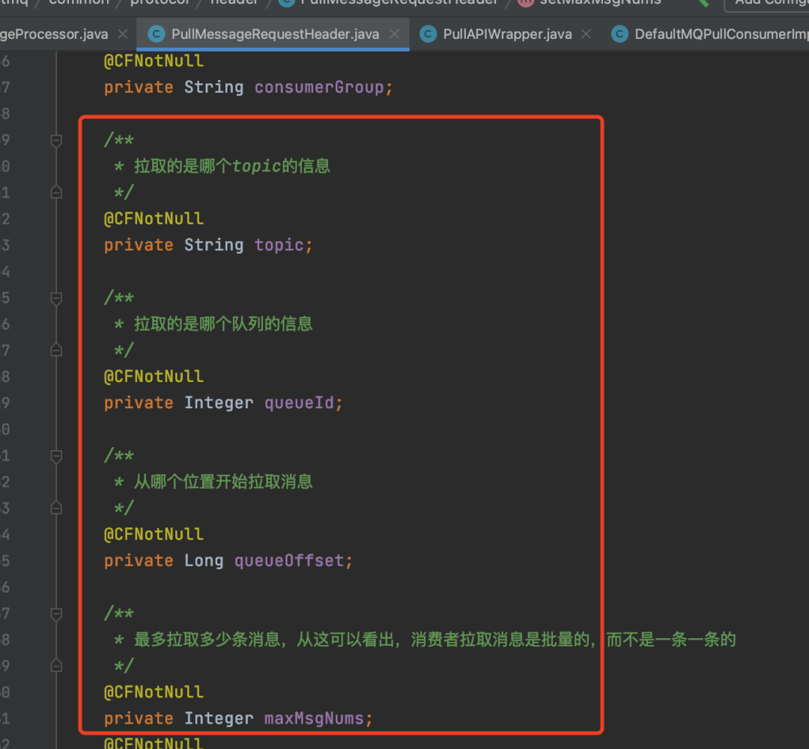

服务端接收到消息之后，总共分为四步处理：

- 首先会找到对应的Topic
- 之后根据queueId找到对应的ConsumeQueue文件
- 然后根据offset位置，从ConsumeQueue中读取跟拉取消息条数一样条数的数据
    > 由于ConsumeQueue每条数据都是20个字节，所以根据offset的位置可以很快定位到应该从文件的哪个位置开始读取数据

- 最后解析每条数据，根据偏移量和消息的长度到CommitLog文件查找真正的消息内容

整个过程如下图所示：

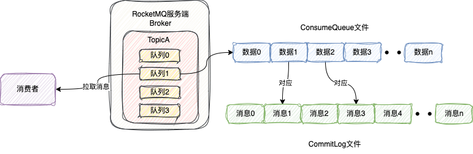

所以，从这可以看出，当消费者在拉取消息时，ConsumeQueue其实就相当于是一个索引文件，方便快速查找在CommitLog中的消息

并且无论CommitLog存多少消息，整个查找消息的时间复杂度都是O(1)

由于ConsumeQueue每条数据都是20个字节，所以如果需要找第n条数据，只需要从第n * 20个字节的位置开始读20个字节的数据即可，这个过程是O(1)的

当从ConsumeQueue找到数据之后，解析出消息在CommitLog存储的起始位置和大小，之后就直接根据这两个信息就可以从CommitLog中找到这条消息了，这个过程也是O(1)的

所以整个查找消息的过程就是O(1)的

所以从这就可以看出，ConsumeQueue和CommitLog相互配合，就能保证快速查找到消息，消费者从而就可以快速拉取消息

## 异步处理
RocketMQ在处理消息时，有很多异步操作，这里我举两个例子：

- 异步刷盘
- 异步主从复制

### 异步刷盘
前面说到，文件的内容都是先写到内核缓冲区，也可以说是PageCache

而写到PageCache并不能保证消息一定不丢失

因为如果服务器挂了，这部分数据还是可能会丢失的

所以为了解决这个问题，RocketMQ会开启一个后台线程

这个后台线程默认每隔0.5s会将消息从PageCache刷到磁盘中

这样就能保证消息真正的持久化到磁盘中

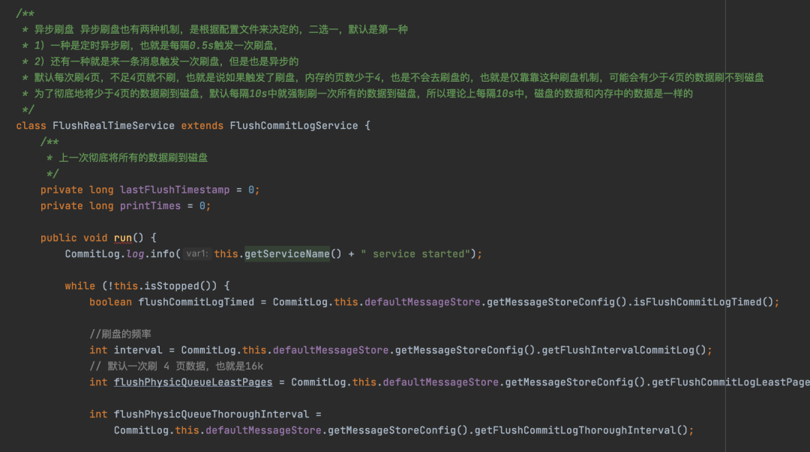

### 异步主从复制
在RocketMQ中，支持主从复制的集群模式


这种模式下，写消息都是写入到主节点，读消息一般也是从主节点读，但是有些情况下可能会从从节点读

从节点在启动的时候会跟主节点建立网络连接

当主节点将消息存储的CommitLog文件之后，会通过后台一个异步线程，不停地将消息发送给从节点

从节点接收到消息之后，就直接将消息存到CommitLog文件

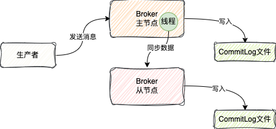

### 小总结
就是因为有这些异步操作，大大提高了消息存储的效率

不过值得注意的，尽管异步可以提高效率，但是也增加了不确定性，比如丢消息等等

当然RocketMQ也支持同步等待消息刷盘和主从复制成功，但这肯定会导致性能降低

所以在项目中可以根据自己的业务需要选择对应的刷盘和主从复制的策略

## 批量处理
除了异步之外，RocketMQ还大量使用了批量处理机制

比如前面说过，消费者拉取消息的时候，可以指定拉取拉取消息的条数，批量拉取消息

这种批量拉取机制可以减少消费者跟RocketMQ服务端的网络通信次数，提高效率

除了批量拉取消息之外，RocketMQ在提交消费进度的时候也使用了批量处理机制

所谓的提交消费进度就是指

当消费者在成功消费消息之后，需要将所消费消息的offset（ConsumeQueue中的offset）提交给RocketMQ服务端

告诉RocketMQ，这个Queue的消息我已经消费到了这个位置了

这样一旦消费者重启了或者其它啥的要从这个Queue重新开始拉取消息的时候

此时他只需要问问RocketMQ服务端上次这个Queue消息消费到哪个位置了


之后消费者只需要从这个位置开始消费消息就行了，这样就解决了接着消费的问题

RocketMQ在提交消费进度的时候并不是说每消费一条消息就提交一下这条消息对应的offset

而是默认每隔5s定时去批量提交一次这5s钟消费消息的offset

## 锁优化
由于RocketMQ内部采用了很多线程异步处理机制

这就一定会产生并发情况下的线程安全问题

在这种情况下，RocketMQ进行了多方面的锁优化以提高性能和并发能力

就比如拿消息存储来说

为了保证消息是按照顺序一条一条地写入到CommitLog文件中，就需要对这个写消息的操作进行加锁

而RocketMQ默认使用ReentrantLock来加锁，并不是synchronized

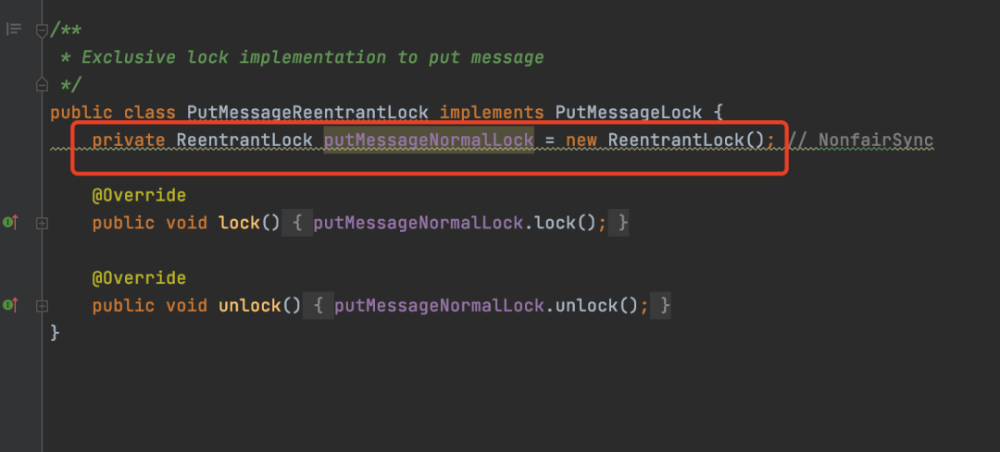

当然除了默认情况外，RocketMQ还提供了一种基于CAS加锁的实现

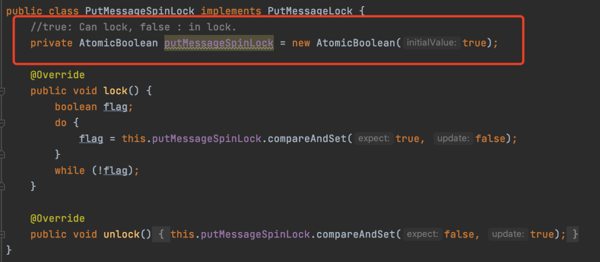

这种实现可以在写消息压力较低的情况下使用

当然除了写消息之外，在一些其它的地方，RocketMQ也使用了基于CAS的原子操作来代替传统的锁机制

例如使用大量使用了AtomicInteger、AtomicLong等原子类来实现并发控制，避免了显式的锁竞争，提高了性能

## 线程池隔离
RocketMQ在处理请求的时候，会为不同的请求分配不同的线程池进行处理

比如对于消息存储请求和拉取消息请求来说

Broker会有专门为它们分配两个不同的线程池去分别处理这些请求

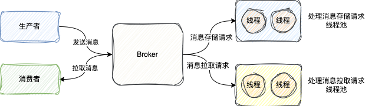

这种让不同的业务由不同的线程池去处理的方式，能够有效地隔离不同业务逻辑之间的线程资源的影响

比如消息存储请求处理过慢并不会影响处理拉取消息请求

所以RocketMQ通过线程隔离及时可以有效地提高系统的并发性能和稳定性

## 总结
到这我就从10个方面讲完了RocketMQ为什么这么快背后的原因

不知道你读完文章之后有什么感受

其实实际上RocketMQ快的原因远远不止我上面说的这几点

RocketMQ本身还做了很多其它的优化，比如拉取消息的长轮询机制、文件预热机制等等

正是因为有各种各样设计细节上的优化，才最终决定了RocketMQ出色的性能表现

好了，本文就讲到这里，如果觉得本文对你有点帮助，欢迎点赞、在看、收藏、转发分享给其他需要的人

你的支持就是我更新的最大动力，感谢感谢！

让我们下期再见，拜拜！

## 参考：

1、https://mp.weixin.qq.com/s/mOD9Z6pxSxBQuNx3YaUw3A