- [Spring Boot整合流程引擎Flowable](https://blog.csdn.net/qq_43372633/article/details/130598488)
- [SpringBoot+Flowable 完美结合，优雅实现工作流！](https://mp.weixin.qq.com/s/O-LrOhGf4Fe6fTSz6mXtqQ)

工作流Flowable学习，入门，实战

## 1. 工作流介绍
### 1.1 为什么使用工作流
在程序员工作中，或多或少都会遇见审批流程类型的业务需求。一个审批流程可能包含开始->申请->领导审批->老板审批->结束等多个阶段，如果我们用字段去定义每一个流程阶段(0->开始 1->申请 2->领导审批 3->老板审批 4->结束)，虽然可以实现流程运行逻辑，但这样业务代码逻辑复杂。如果审批流程还有驳回操作，则还需要加一个是否驳回字段，显然这样实现，成本太大，且不利于维护。

为了解决上述用代码逻辑硬写审批流程而导致的成本大，不利用维护的缺点，工作流因此而生。

### 1.2 工作流是什么
工作流，是把业务之间的各个步骤以及规则进行抽象和概括性的描述。使用特定的语言为业务流程建模，让其运行在计算机上，并让计算机进行计算和推动。工作流是复杂版本的状态机。

简单状态

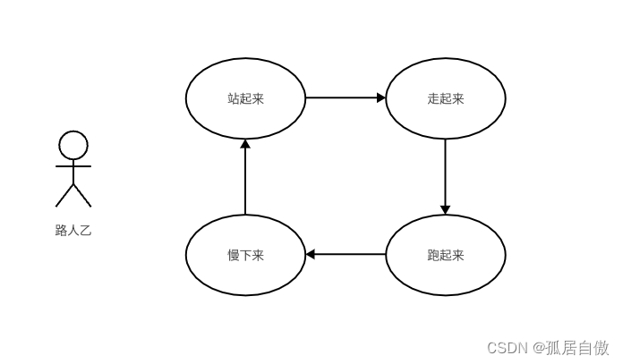

上图为工作流退化为基础状态机的例子，路人乙的状态非常简单，站起来->走起来->跑起来->慢下来->站起来，无限循环，如果让我们实现路人乙的状态切换，那么我们只需要用一个字段来记录路人乙当前的状态就好了。

而对于复杂的状态或者状态维度增加且状态流转的条件极为复杂，可能单纯用字段记录状态的实现方式就会不那么理想。如下图:

复杂状态

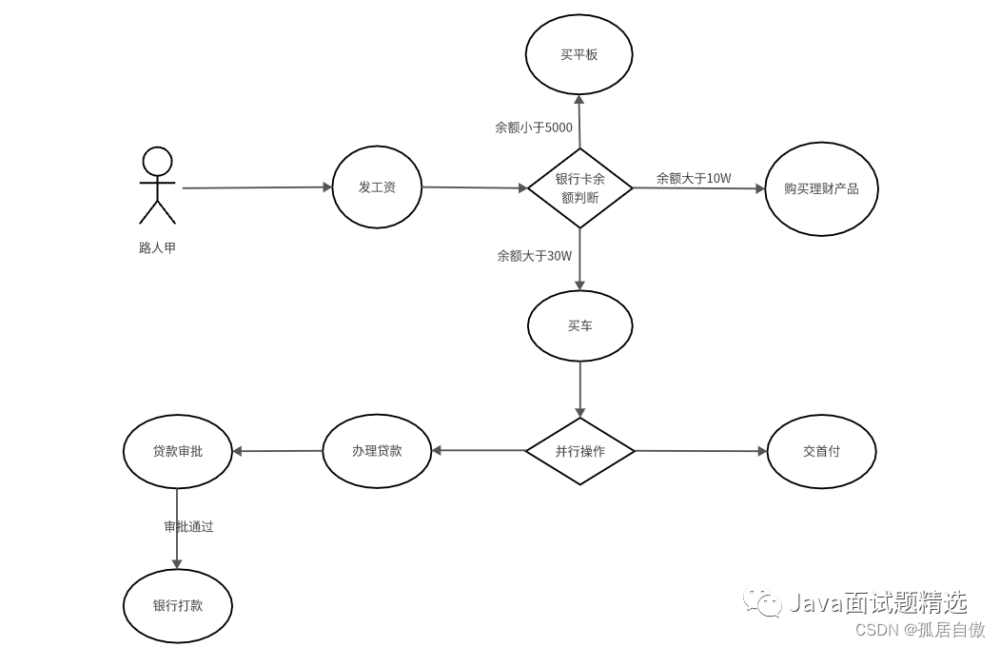

现在交给路人甲的选择就多了起来，当路人甲获发完工资后的时候，他会根据余额的大小来判断接下来该如何行动，如果数额小于等于5000，那么他决定买一个平板，如果数额小于等于10万，那么路人甲就决定去学习一下购买理财产品，但如果路人甲获得的余额数量超过了30万，他就决定购买一辆宝马，但购买宝马的流程是复杂的，路人甲决定同时完成交首付和贷款的手续。

其实这个流程还不算特别复杂，但到目前为止，单纯用一个字段来表明状态已经无法满足要求了。

> 工作流解决的痛点在于，解除业务宏观流程和微观逻辑的耦合，让熟悉宏观业务流程的人去制定整套流转逻辑，而让专业的人只需要关心他们应当关心的流程节点，就好比大家要一起修建一座超级体育场，路人甲只需要关心他身边的这一堆砖是怎么堆砌而非整座建筑。

### 1.3 工作流不能解决的问题
工作流无法解决毫无关系(没有前后关联)的事务。

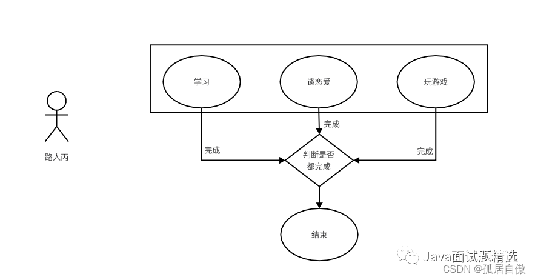

工作流是一个固定好的框架，大家就按照这个框架来执行流程就行了，但某些情况他本身没有流转顺序的。

比如：路人丙每天需要学习，谈恋爱以及玩游戏，它们之间没有关联性无法建立流程，但可以根据每一项完成的状态决定今天的任务是否完结，这种情况我们需要使用CMMN来建模，它就是专门针对这种情况而设计的，但今天我们不讲这个，而是讲讲BPMN协议。

## 2. BPMN2.0协议
### 2.1 什么是BPMN2.0协议

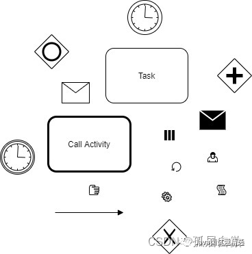

对于业务建模，我们需要一种通用的语言来描绘，这样在沟通上和实现上会降低难度，就像中文、英文一样，BPMN2.0便是一种国际通用的建模语言，他能让自然人轻松阅读，更能被计算机所解析。

### 2.2 BPMN2.0协议元素介绍
协议中元素的主要分类为，事件-任务-连线-网关。

一个流程必须包含一个事件（如：开始事件）和至少一个结束（事件）。其中网关的作用是流程流转逻辑的控制。任务则分很多类型，他们各司其职，所有节点均由连线联系起来。

下面我就以每种类型的节点简单地概括一下其作用。

#### 网关：
1. 互斥网关（Exclusive Gateway），又称排他网关，他有且仅有一个有效出口，可以理解为if......else if...... else if......else，就和我们平时写代码的一样。

2. 并行网关（Parallel Gateway），他的所有出口都会被执行，可以理解为开多线程同时执行多个任务。

3. 包容性网关（Inclusive Gateway），只要满足条件的出口都会执行，可以理解为 if(......) do, if (......) do, if (......) do，所有的条件判断都是同级别的。

#### 任务：
BPMN2.0协议的所有任务其实是从一个抽象任务派生而来的，抽象任务会有如下行为：

- 当流程流转到该任务时，应该做些什么？
- 当该任务获得信号(signal)的时候，它是否可以继续向下流转，而任务获得信号的这个动作我们称为Trigger。

利用如上的抽象行为，我们来解释一些比较常见且具有代表性的任务类型。

`人工任务（User Task）`，它是使用得做多的一种任务类型，他自带有一些人工任务的变量，例如签收人（Assignee），签收人就代表该任务交由谁处理，我们也可以通过某个特定或一系列特定的签收人来查找待办任务。利用上面的行为解释便是，当到达User Task节点的时候，节点设置Assignee变量或等待设置Assignee变量，当任务被完成的时候，我们使用Trigger来要求流程引擎退出该任务，继续流转。

`服务任务（Service Task）`，该任务会在到达的时候执行一段自动的逻辑并自动流转。从“到达自动执行一段逻辑”这里我们就可以发现，服务任务的想象空间就可以非常大，我们可以执行一段计算，执行发送邮件，执行RPC调用，而使用最广泛的则为HTTP调用，因为HTTP是使用最广泛的协议之一，它可以解决大部分第三方调用问题，在我们的使用中，HTTP服务任务也被我们单独剥离出来作为一个特殊任务节点。

`接受任务（Receive Task）`，该任务的名字让人费解，但它又是最简单的一种任务，当该任务到达的时候，它不做任何逻辑，而是被动地等待Trigger，它的适用场景往往是一些不明确的阻塞，比如：一个复杂的计算需要等待很多条件，这些条件是需要人为来判断是否可以执行，而不是直接执行，这个时候，工作人员如果判断可以继续了，那么就Trigger一下使其流转。

`调用活动（Call Activity）`，调用活动可以理解为函数调用，它会引用另外一个流程使之作为子流程运行，调用活动跟函数调用的功能一样，使流程模块化，增加复用的可能性。

上面大概介绍了一下常用的节点，下面的图就展示了一个以BPMN2.0为基础的流程模型，尽量覆盖到所介绍的所有节点。

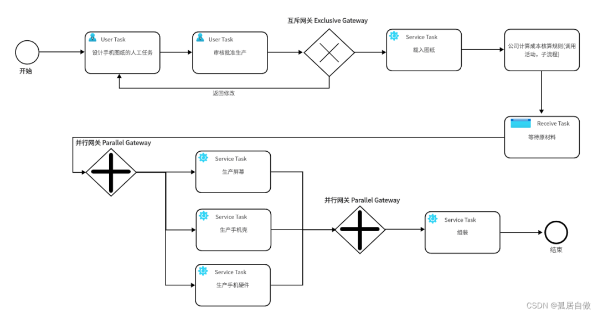

这里是一个生产手机的流程，从“手机设计”节点到“批准生产”节点是一个串行的任务，而审批的结果会遇到一个互斥网关，上面讲过，互斥网关只需要满足其中一个条件就会流转，而这里表达的意义就是审批是否通过。

“载入图纸”是一个服务任务，它是自动执行的，之后会卡在“等待原材料”这个节点，因为这个节点是需要人为去判断（比如原材料涨价，原材料不足等因素），所以需要在一种自定义的条件下Trigger，而该图的条件应该为“原材料足够”，原材料足够之后，我们会开始并行生产手机零件。

需要注意的是，并行网关在图中是成对出现的，他的作用是开始一系列并行任务和等待并行任务一起完成。

### 2.3 如何使用BPMN2.0协议
首先，从用户的角度来看，使用者其实只需要关心三件事

我如何把我的业务逻辑转化为流程图-即容易理解的绘图工具。
我如何使流程流转-即开箱即用的API。
我需要引擎告诉我，我现在该处理什么节点-即丰富且鲜明的事件机制。
图中是流程图的整个生命周期，从画图到部署，然后启动流程，流程经过人工或自动的方式流转，最后结束。

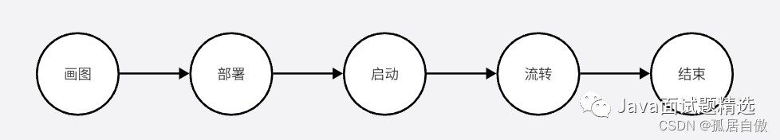

## 3. Flowable简介
### 3.1 Flowable是什么
Flowable是BPMN2.0协议的一种Java版本的实现，是一个使用Java编写的轻量级业务流程引擎。Flowable流程引擎可用于部署BPMN 2.0流程定义（用于定义流程的行业XML标准）， 创建这些流程定义的流程实例，进行查询，访问运行中或历史的流程实例与相关数据，等等。

Flowable可以嵌入Java应用程序中运行，也可以作为服务器、集群运行，更可以提供云服务。

### 3.2 Flowable与Activiti
Flowable是基于Activiti-6.0.0.Beta4分支开发的。目前Flowable已经修复了Activiti6很多的bug，可以实现零成本从Activiti迁移到Flowable。

## 4. Flowable实战
假设公司产品有一个新需求，需要你设计一个员工请假流程的功能。你该如何设计？

1. 我会用flowable来实现

2. 创建springboot项目（flowable-ui），该项目是启动flowable-ui网站，在本地进行流程画图设计。安装flowable-ui，启动服务进入folwable-ui网站画图，导出图对应的xml文件 (画图)

3. 创建springboot项目（flowable），该项目是启动流程应用，将对应的xml文件复制到resources下的processes文件夹中(processes文件夹需自己创建) (部署)

4. 启动springboot项目 (启动)

5. 通过接口调用，启动流程 (流转)

### 4.1 本地安装，启动flowable-ui
创建 springboot（flowable-ui）项目 项目目录

JavaSkillPointApplication文件
```java
package com.weige.javaskillpoint;

import org.springframework.boot.SpringApplication;
import org.springframework.boot.autoconfigure.SpringBootApplication;

@SpringBootApplication
public class JavaSkillPointApplication {

    public static void main(String[] args) {
        SpringApplication.run(JavaSkillPointApplication.class, args);
    }

}
```

application.yml文件
```yaml
server:
  port: 8088

flowable:
  idm:
    app:
      admin:
        # 登录的用户名
        user-id: admin
        # 登录的密码
        password: admin
        # 用户的名字
        first-name: wei
        last-name: kai
spring:
  # mysql连接信息
  datasource:
    # mysql8之后
    driver-class-name: com.mysql.cj.jdbc.Driver
    # mysql8之前
#    driver-class-name: com.mysql.jdbc.Driver
    url: jdbc:mysql://43.143.132.109:3306/flowable?useUnicode=true&characterEncoding=utf8&tinyInt1isBit=false&useSSL=false&serverTimezone=GMT&nullCatalogMeansCurrent=true
    username: root
    password: ******
  jpa:
    properties:
      hibernate:
        hbm2ddl:
          auto: update
        dialect: org.hibernate.dialect.MySQL5InnoDBDialect
    open-in-view: true
```

注意：

`&nullCatalogMeansCurrent=true` 这个一定要加在url后，不然flowable自动创建表失败

在数据库中创建flowable数据库，启动flowable-ui项目时，flowable服务会自动创建对应的表

启动项目后 网站的登录用户 密码 `user-id: admin password: admin`

pom.xml文件
```xml
 <dependencies>
    <!--Springboot项目自带 -->
    <dependency>
        <groupId>org.springframework.boot</groupId>
        <artifactId>spring-boot-starter</artifactId>
    </dependency>
    <dependency>
        <groupId>org.springframework.boot</groupId>
        <artifactId>spring-boot-starter-test</artifactId>
        <scope>test</scope>
    </dependency>
    <!--Springboot Web项目 -->
    <dependency>
        <groupId>org.springframework.boot</groupId>
        <artifactId>spring-boot-starter-web</artifactId>
    </dependency>

    <!--lombok -->
    <dependency>
        <groupId>org.projectlombok</groupId>
        <artifactId>lombok</artifactId>
        <version>1.18.22</version>
    </dependency>

    <!-- idm依赖提供身份认证 -->
    <dependency>
        <groupId>org.flowable</groupId>
        <artifactId>flowable-spring-boot-starter-ui-idm</artifactId>
        <version>6.7.1</version>
    </dependency>

    <!-- modeler绘制流程图 -->
    <dependency>
        <groupId>org.flowable</groupId>
        <artifactId>flowable-spring-boot-starter-ui-modeler</artifactId>
        <version>6.7.1</version>
    </dependency>

    <!-- jpa -->
    <dependency>
        <groupId>org.springframework.boot</groupId>
        <artifactId>spring-boot-starter-data-jpa</artifactId>
    </dependency>

    <!-- mysql驱动 -->
    <dependency>
        <groupId>mysql</groupId>
        <artifactId>mysql-connector-java</artifactId>
    </dependency>

    <!-- flowable -->
    <dependency>
        <groupId>org.flowable</groupId>
        <artifactId>flowable-spring-boot-starter</artifactId>
        <version>6.7.1</version>
    </dependency>
</dependencies>
```

启动项目

访问 http://localhost:8088/

这个时候就可以开始设计员工请假流程图 我先画一个完整的出来 将每个步骤对应的信息都截下来 供大家参考

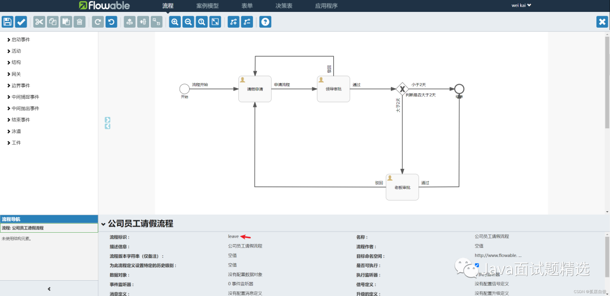
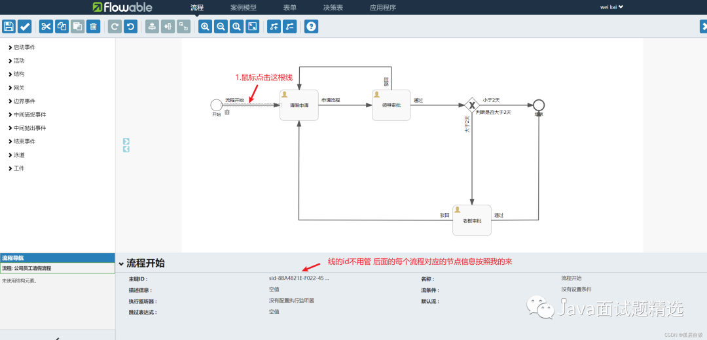
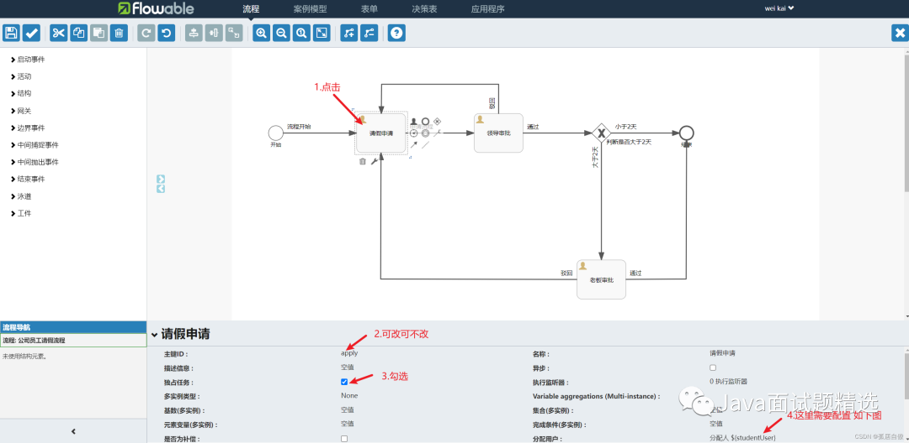
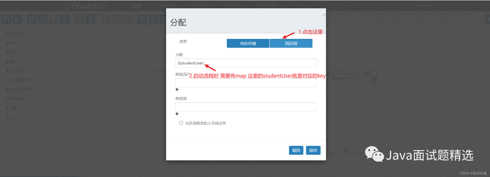
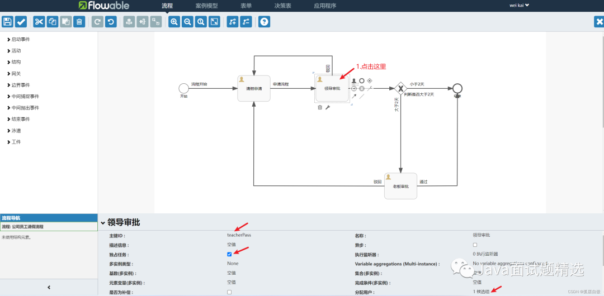
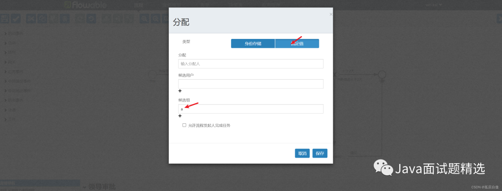
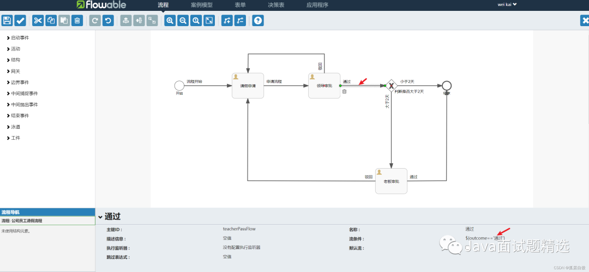
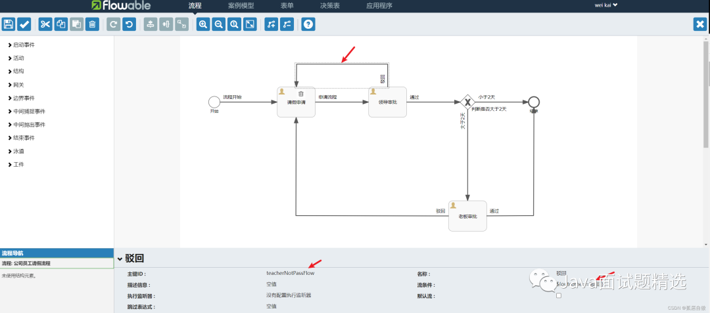
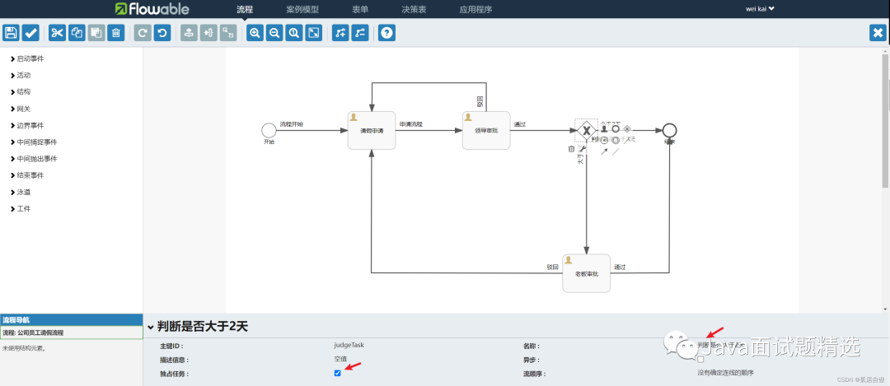
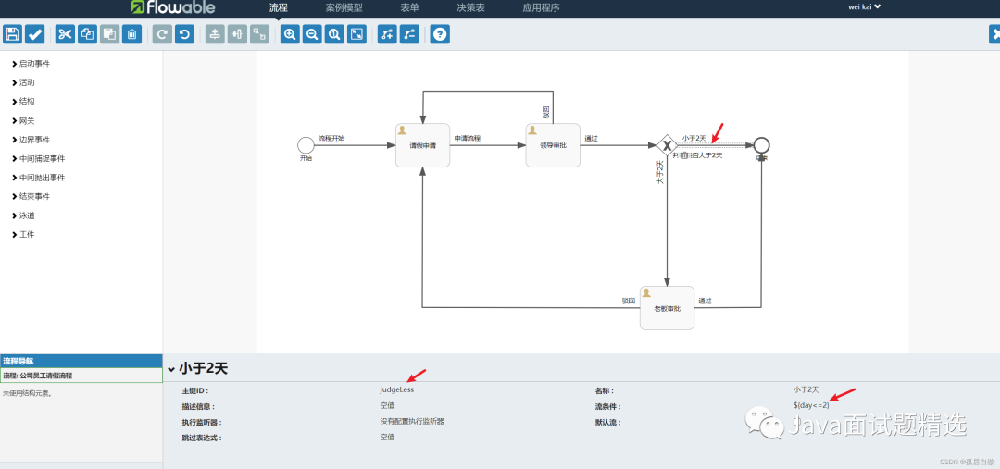
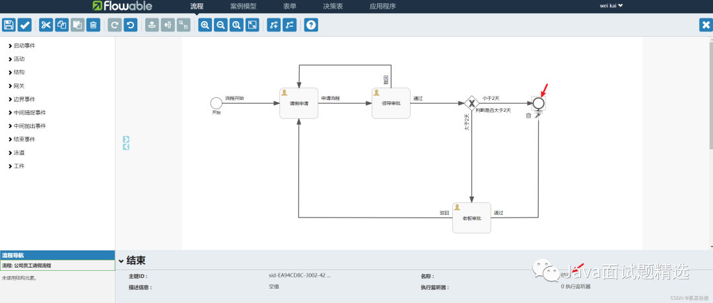
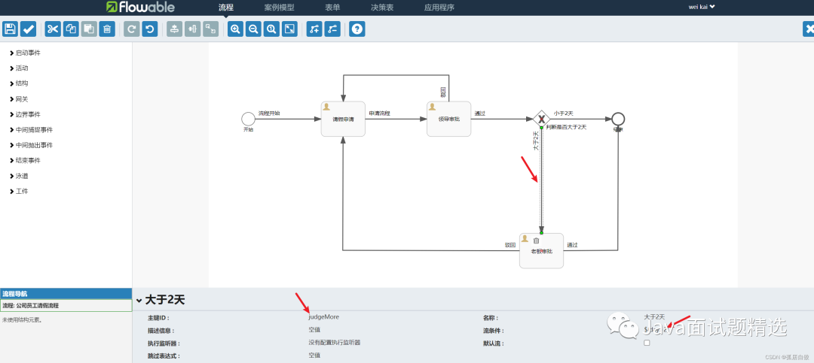
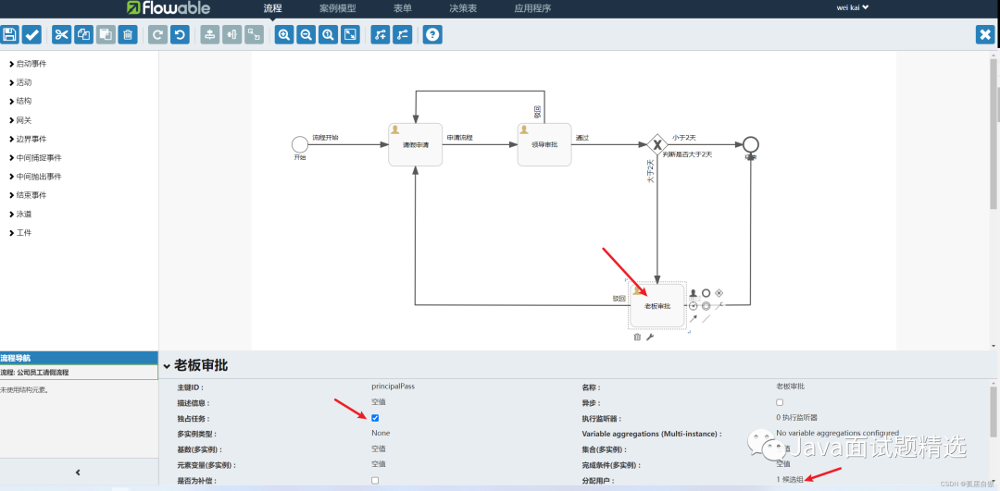
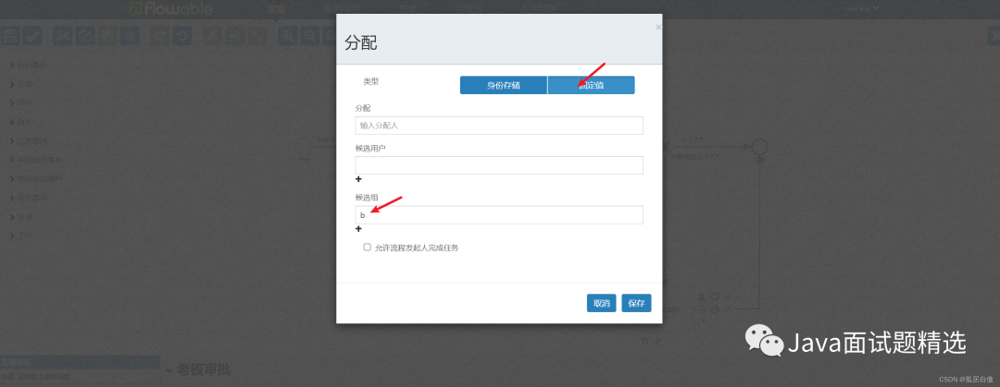

推荐大家画一遍 这里我会上传请假流程的xml文件，大家直接导入即可，通过链接下载流程xml文件

链接: https://pan.baidu.com/s/10FAFBiM3SYUj9FcSoPadtw?pwd=rqku 提取码: rqku

### 4.2 创建flowable应用项目 部署并启动
创建springboot项目

项目目录

JavaSkillPointApplication文件
```java
package com.weige.javaskillpoint;

import org.springframework.boot.SpringApplication;
import org.springframework.boot.autoconfigure.SpringBootApplication;

@SpringBootApplication
public class JavaSkillPointApplication {

    public static void main(String[] args) {
        SpringApplication.run(JavaSkillPointApplication.class, args);
    }

}
```

公司员工请假流程.bpmn20.xml 在resources下创建processes文件夹 复制xml文件到该目录即可

```xml
<?xml version="1.0" encoding="UTF-8"?>
<definitions xmlns="http://www.omg.org/spec/BPMN/20100524/MODEL" xmlns:xsi="http://www.w3.org/2001/XMLSchema-instance" xmlns:xsd="http://www.w3.org/2001/XMLSchema" xmlns:flowable="http://flowable.org/bpmn" xmlns:bpmndi="http://www.omg.org/spec/BPMN/20100524/DI" xmlns:omgdc="http://www.omg.org/spec/DD/20100524/DC" xmlns:omgdi="http://www.omg.org/spec/DD/20100524/DI" typeLanguage="http://www.w3.org/2001/XMLSchema" expressionLanguage="http://www.w3.org/1999/XPath" targetNamespace="http://www.flowable.org/processdef" exporter="Flowable Open Source Modeler" exporterVersion="6.7.1">
  <process id="leave" name="公司员工请假流程" isExecutable="true">
    <documentation>公司员工请假流程</documentation>
    <startEvent id="startEvent1" name="开始 " flowable:formFieldValidation="true"></startEvent>
    <userTask id="apply" name="请假申请 " flowable:assignee="${studentUser}" flowable:formFieldValidation="true">
      <extensionElements>
        <modeler:initiator-can-complete xmlns:modeler="http://flowable.org/modeler"><![CDATA[false]]></modeler:initiator-can-complete>
      </extensionElements>
    </userTask>
    <userTask id="teacherPass" name="领导审批 " flowable:candidateGroups="a" flowable:formFieldValidation="true"></userTask>
    <exclusiveGateway id="judgeTask" name="判断是否大于2天"></exclusiveGateway>
    <sequenceFlow id="applyFlow" name="申请流程 " sourceRef="apply" targetRef="teacherPass"></sequenceFlow>
    <userTask id="principalPass" name="老板审批" flowable:candidateGroups="b" flowable:formFieldValidation="true"></userTask>
    <endEvent id="sid-EA94CD8C-3002-421E-BD64-B46EBDD8070F" name="结束"></endEvent>
    <sequenceFlow id="principalCheck" name="通过" sourceRef="principalPass" targetRef="sid-EA94CD8C-3002-421E-BD64-B46EBDD8070F">
      <conditionExpression xsi:type="tFormalExpression"><![CDATA[${outcome=='通过'}]]></conditionExpression>
    </sequenceFlow>
    <sequenceFlow id="sid-8BA4821E-F022-45C8-B86B-CD7052B9FB05" name="流程开始 " sourceRef="startEvent1" targetRef="apply"></sequenceFlow>
    <sequenceFlow id="teacherPassFlow" name="通过 " sourceRef="teacherPass" targetRef="judgeTask">
      <conditionExpression xsi:type="tFormalExpression"><![CDATA[${outcome=='通过'}]]></conditionExpression>
    </sequenceFlow>
    <sequenceFlow id="teacherNotPassFlow" name="驳回" sourceRef="teacherPass" targetRef="apply">
      <conditionExpression xsi:type="tFormalExpression"><![CDATA[${outcome=='驳回'}]]></conditionExpression>
    </sequenceFlow>
    <sequenceFlow id="judgeLess" name="小于2天" sourceRef="judgeTask" targetRef="sid-EA94CD8C-3002-421E-BD64-B46EBDD8070F">
      <conditionExpression xsi:type="tFormalExpression"><![CDATA[${day<=2}]]></conditionExpression>
    </sequenceFlow>
    <sequenceFlow id="judgeMore" name="大于2天 " sourceRef="judgeTask" targetRef="principalPass">
      <conditionExpression xsi:type="tFormalExpression"><![CDATA[${day>2}]]></conditionExpression>
    </sequenceFlow>
    <sequenceFlow id="principalNotPassFlow" name="驳回 " sourceRef="principalPass" targetRef="apply">
      <conditionExpression xsi:type="tFormalExpression"><![CDATA[${outcome=='驳回'}]]></conditionExpression>
    </sequenceFlow>
  </process>
  <bpmndi:BPMNDiagram id="BPMNDiagram_leave">
    <bpmndi:BPMNPlane bpmnElement="leave" id="BPMNPlane_leave">
      <bpmndi:BPMNShape bpmnElement="startEvent1" id="BPMNShape_startEvent1">
        <omgdc:Bounds height="30.0" width="30.0" x="74.99999776482586" y="159.99999329447763"></omgdc:Bounds>
      </bpmndi:BPMNShape>
      <bpmndi:BPMNShape bpmnElement="apply" id="BPMNShape_apply">
        <omgdc:Bounds height="80.0" width="100.0" x="254.99999620020395" y="134.99999798834327"></omgdc:Bounds>
      </bpmndi:BPMNShape>
      <bpmndi:BPMNShape bpmnElement="teacherPass" id="BPMNShape_teacherPass">
        <omgdc:Bounds height="79.99999999999994" width="100.0" x="494.9999926239253" y="134.99999798834327"></omgdc:Bounds>
      </bpmndi:BPMNShape>
      <bpmndi:BPMNShape bpmnElement="judgeTask" id="BPMNShape_judgeTask">
        <omgdc:Bounds height="40.0" width="40.0" x="734.9999780952935" y="154.99999567866334"></omgdc:Bounds>
      </bpmndi:BPMNShape>
      <bpmndi:BPMNShape bpmnElement="principalPass" id="BPMNShape_principalPass">
        <omgdc:Bounds height="80.0" width="100.0" x="704.9999785423283" y="434.999993517995"></omgdc:Bounds>
      </bpmndi:BPMNShape>
      <bpmndi:BPMNShape bpmnElement="sid-EA94CD8C-3002-421E-BD64-B46EBDD8070F" id="BPMNShape_sid-EA94CD8C-3002-421E-BD64-B46EBDD8070F">
        <omgdc:Bounds height="28.0" width="28.0" x="914.9999863654377" y="160.99999089539082"></omgdc:Bounds>
      </bpmndi:BPMNShape>
      <bpmndi:BPMNEdge bpmnElement="judgeLess" id="BPMNEdge_judgeLess" flowable:sourceDockerX="20.0" flowable:sourceDockerY="20.0" flowable:targetDockerX="14.0" flowable:targetDockerY="14.0">
        <omgdi:waypoint x="774.9442491776681" y="174.9999951288619"></omgdi:waypoint>
        <omgdi:waypoint x="914.9999863654377" y="174.9999912788773"></omgdi:waypoint>
      </bpmndi:BPMNEdge>
      <bpmndi:BPMNEdge bpmnElement="judgeMore" id="BPMNEdge_judgeMore" flowable:sourceDockerX="20.0" flowable:sourceDockerY="20.0" flowable:targetDockerX="50.0" flowable:targetDockerY="40.0">
        <omgdi:waypoint x="754.9999781250214" y="194.94667175689042"></omgdi:waypoint>
        <omgdi:waypoint x="754.9999784827237" y="434.999993517995"></omgdi:waypoint>
      </bpmndi:BPMNEdge>
      <bpmndi:BPMNEdge bpmnElement="principalNotPassFlow" id="BPMNEdge_principalNotPassFlow" flowable:sourceDockerX="50.0" flowable:sourceDockerY="40.0" flowable:targetDockerX="50.0" flowable:targetDockerY="40.0">
        <omgdi:waypoint x="704.9999785423213" y="474.88912948633504"></omgdi:waypoint>
        <omgdi:waypoint x="304.0" y="474.0"></omgdi:waypoint>
        <omgdi:waypoint x="304.86621744522387" y="214.94999798834328"></omgdi:waypoint>
      </bpmndi:BPMNEdge>
      <bpmndi:BPMNEdge bpmnElement="teacherNotPassFlow" id="BPMNEdge_teacherNotPassFlow" flowable:sourceDockerX="50.0" flowable:sourceDockerY="39.99999999999997" flowable:targetDockerX="50.0" flowable:targetDockerY="40.0">
        <omgdi:waypoint x="544.9999926239253" y="134.99999798834327"></omgdi:waypoint>
        <omgdi:waypoint x="544.9999926239253" y="75.0"></omgdi:waypoint>
        <omgdi:waypoint x="306.0" y="75.0"></omgdi:waypoint>
        <omgdi:waypoint x="305.3994977262591" y="134.99999798834327"></omgdi:waypoint>
      </bpmndi:BPMNEdge>
      <bpmndi:BPMNEdge bpmnElement="applyFlow" id="BPMNEdge_applyFlow" flowable:sourceDockerX="50.0" flowable:sourceDockerY="40.0" flowable:targetDockerX="50.0" flowable:targetDockerY="39.99999999999997">
        <omgdi:waypoint x="354.94999620020394" y="174.99999798834324"></omgdi:waypoint>
        <omgdi:waypoint x="494.9999926238438" y="174.99999798834324"></omgdi:waypoint>
      </bpmndi:BPMNEdge>
      <bpmndi:BPMNEdge bpmnElement="principalCheck" id="BPMNEdge_principalCheck" flowable:sourceDockerX="50.0" flowable:sourceDockerY="40.0" flowable:targetDockerX="14.0" flowable:targetDockerY="14.0">
        <omgdi:waypoint x="804.9499785423245" y="474.71097808621374"></omgdi:waypoint>
        <omgdi:waypoint x="928.0" y="474.0"></omgdi:waypoint>
        <omgdi:waypoint x="928.953164519099" y="188.9499145334794"></omgdi:waypoint>
      </bpmndi:BPMNEdge>
      <bpmndi:BPMNEdge bpmnElement="sid-8BA4821E-F022-45C8-B86B-CD7052B9FB05" id="BPMNEdge_sid-8BA4821E-F022-45C8-B86B-CD7052B9FB05" flowable:sourceDockerX="15.0" flowable:sourceDockerY="15.0" flowable:targetDockerX="50.0" flowable:targetDockerY="40.0">
        <omgdi:waypoint x="104.94999736929918" y="174.99999362086504"></omgdi:waypoint>
        <omgdi:waypoint x="254.99999620020395" y="174.9999968967466"></omgdi:waypoint>
      </bpmndi:BPMNEdge>
      <bpmndi:BPMNEdge bpmnElement="teacherPassFlow" id="BPMNEdge_teacherPassFlow" flowable:sourceDockerX="50.0" flowable:sourceDockerY="39.99999999999997" flowable:targetDockerX="20.0" flowable:targetDockerY="20.0">
        <omgdi:waypoint x="594.949992623855" y="174.9999974384194"></omgdi:waypoint>
        <omgdi:waypoint x="734.9999775100968" y="174.99999589808294"></omgdi:waypoint>
      </bpmndi:BPMNEdge>
    </bpmndi:BPMNPlane>
  </bpmndi:BPMNDiagram>
</definitions>
```

application.yml
```yaml
server:
  port: 8081

spring:
  # mysql连接信息
  datasource:
    # mysql8之后
#    driver-class-name: com.mysql.cj.jdbc.Driver
    # mysql8之前
    driver-class-name: com.mysql.jdbc.Driver
    url: jdbc:mysql://43.143.132.109:3306/flowable?useUnicode=true&characterEncoding=utf8&tinyInt1isBit=false&useSSL=false&serverTimezone=GMT
    username: root
    password: ******
```

注意：这里的数据库url链接应与flowable-ui项目保持一致

JavaSkillPointApplicationTests测试文件

```java
package com.weige.javaskillpoint;

import org.flowable.engine.HistoryService;
import org.flowable.engine.RuntimeService;
import org.flowable.engine.TaskService;
import org.flowable.engine.history.HistoricActivityInstance;
import org.flowable.engine.runtime.ProcessInstance;
import org.flowable.task.api.Task;
import org.junit.jupiter.api.Test;
import org.springframework.beans.factory.annotation.Autowired;
import org.springframework.boot.test.context.SpringBootTest;
import org.springframework.util.CollectionUtils;

import java.util.HashMap;
import java.util.List;
import java.util.Map;
import java.util.stream.Collectors;

@SpringBootTest
class JavaSkillPointApplicationTests {
    @Autowired
    private RuntimeService runtimeService;

    @Autowired
    private TaskService taskService;

    @Autowired
    private HistoryService historyService;

    @Test
    void sub() {
        // 员工提交请假申请
        Map<String, Object> map = new HashMap<>();
        map.put("day", 5);
        map.put("studentUser", "小明");
        // leave为员工请假流程xml文件中的id
        ProcessInstance a1 = runtimeService.startProcessInstanceByKey("leave", map);

        Task task = taskService.createTaskQuery().processInstanceId(a1.getId()).singleResult();
        taskService.complete(task.getId());
    }


    @Test
    void queryLeadTask() {
        // 查询领导分组的任务
        List<Task> teacher = taskService.createTaskQuery().taskCandidateGroup("a").list();
        for (Task task : teacher) {
            // 根据任务id查询当前任务参数
            Map<String, Object> variables = taskService.getVariables(task.getId());
            System.out.println(variables.get("day") + "," + variables.get("studentUser"));
        }
    }

    @Test
    void queryBossTask() {
        // 查询老板分组的任务
        List<Task> teacher = taskService.createTaskQuery().taskCandidateGroup("b").list();
        for (Task task : teacher) {
            // 根据任务id查询当前任务参数
            Map<String, Object> variables = taskService.getVariables(task.getId());
            System.out.println(variables.get("day") + "," + variables.get("studentUser"));
        }
    }

    @Test
    void LeadApprovalTask() {
        // 领导审批
        List<Task> teacherTaskList = taskService.createTaskQuery().taskCandidateGroup("a").list();
        Map<String, Object> teacherMap = new HashMap<>();
        teacherMap.put("outcome", "通过");
        for (Task teacherTask : teacherTaskList) {
            taskService.complete(teacherTask.getId(), teacherMap);
        }
    }

    @Test
    void boosApprovalTask() {
        // 老板审批
        List<Task> teacherTaskList = taskService.createTaskQuery().taskCandidateGroup("b").list();
        Map<String, Object> teacherMap = new HashMap<>();
        teacherMap.put("outcome", "通过");
        for (Task teacherTask : teacherTaskList) {
            taskService.complete(teacherTask.getId(), teacherMap);
        }
    }

    @Test
    void queryHistory() {
        List<ProcessInstance> processInstance = runtimeService.createProcessInstanceQuery().processDefinitionKey("leave").orderByStartTime().desc().list();
        if (CollectionUtils.isEmpty(processInstance)) {
            System.out.println("------------------------------------------");
        }
        // 获取最近的一个流程
        List<HistoricActivityInstance> activities = historyService.createHistoricActivityInstanceQuery()
                .processInstanceId(processInstance.get(0).getId())
                // 只查询已经完成的活动
                .finished()
                // 按照结束时间排序
                .orderByHistoricActivityInstanceEndTime().desc()
                .list();
        List<String> collect = activities.stream().map(a -> "活动名称:" + a.getActivityName() + ";活动执行时间:" + a.getDurationInMillis() + "毫秒").collect(Collectors.toList());
        for (String s : collect) {
            System.out.println(s);
        }
    }

    @Test
    void Test() {
        // 发起请假
        Map<String, Object> map = new HashMap<>();
        map.put("day", 5);
        map.put("studentUser", "小明");
        ProcessInstance studentLeave = runtimeService.startProcessInstanceByKey("leave", map);
        Task task = taskService.createTaskQuery().processInstanceId(studentLeave.getId()).singleResult();
        taskService.complete(task.getId());

        // 领导审批
        List<Task> teacherTaskList = taskService.createTaskQuery().taskCandidateGroup("a").list();
        Map<String, Object> teacherMap = new HashMap<>();
        teacherMap.put("outcome", "通过");
        for (Task teacherTask : teacherTaskList) {
            taskService.complete(teacherTask.getId(), teacherMap);
        }

        // 老板审批
        List<Task> principalTaskList = taskService.createTaskQuery().taskCandidateGroup("b").list();
        Map<String, Object> principalMap = new HashMap<>();
        principalMap.put("outcome", "通过");
        for (Task principalTask : principalTaskList) {
            taskService.complete(principalTask.getId(), principalMap);
        }

        // 查看历史
        List<HistoricActivityInstance> activities = historyService.createHistoricActivityInstanceQuery()
                .processInstanceId(studentLeave.getId())
                .finished()
                .orderByHistoricActivityInstanceEndTime().asc()
                .list();
        for (HistoricActivityInstance activity : activities) {
            System.out.println(activity.getActivityName());
        }
    }
}
```

### 4.3 启动流程代码详解
流程实例

1. 现在已经在流程引擎中部署了流程定义，因此可以使用这个流程定义作为“蓝图”启动流程实例。

2. 我们使用RuntimeService启动一个流程实例。

3. 收集的数据作为一个java.util.Map实例传递，其中的键就是之后用于获取变量的标识符。

4. 这个流程实例使用key启动。这个key就是BPMN 2.0 XML文件中设置的id属性。

5. 在这个例子里是StudentLeave。

这两个就是在XML文件钟定义的变量
```shell
flowable:assignee="${studentUser}"
${outcome==‘通过’}
${day <= 2}
```

员工对应的BPMN 2.0 XML属性，我们通过id启动流程
```xml
<process id="leave" name="公司员工请假流程" isExecutable="true">
```

员工对应的BPMN 2.0 XML属性 通过assignee员工可以发起请假流程
```xml
<userTask id="apply" name="请假申请 " flowable:assignee="${studentUser}" flowable:formFieldValidation="true">
    <extensionElements>
       <modeler:initiator-can-complete xmlns:modeler="http://flowable.org/modeler"><![CDATA[false]]></modeler:initiator-can-complete>
     </extensionElements>
</userTask>
```

领导对应的BPMN 2.0 XML属性 通过candidateGroups可以查询领导下可以审批的任务
```xml
<userTask id="teacherPass" name="领导审批 " flowable:candidateGroups="a" flowable:formFieldValidation="true"></userTask>
```

老板对应的BPMN 2.0 XML属性 通过candidateGroups可以查询老板下可以审批的任务
```xml
<userTask id="principalPass" name="老板审批" flowable:candidateGroups="b" flowable:formFieldValidation="true"></userTask>
```

员工发起请假流程代码：

```java
@SpringBootTest
class JavaSkillPointApplicationTests {
    @Autowired
    private RuntimeService runtimeService;

    @Autowired
    private TaskService taskService;

    @Autowired
    private HistoryService historyService;

    @Test
    void sub() {
        // 员工提交请假申请
        Map<String, Object> map = new HashMap<>();
        map.put("day", 5);
        map.put("studentUser", "小明");
        // leave为员工请假流程xml文件中的id
        ProcessInstance leave= runtimeService.startProcessInstanceByKey("leave", map);
  
        Task task = taskService.createTaskQuery().processInstanceId(leave.getId()).singleResult();
        // 员工提交请假申请
        taskService.complete(task.getId());
    }
}
```

查询领导审批任务代码：
```java
@SpringBootTest
class JavaSkillPointApplicationTests {
    @Autowired
    private RuntimeService runtimeService;

    @Autowired
    private TaskService taskService;

    @Autowired
    private HistoryService historyService;

    @Test
    void queryLeadTask() {
        // 查询领导分组的任务
        List<Task> teacher = taskService.createTaskQuery().taskCandidateGroup("a").list();
        for (Task task : teacher) {
            // 根据任务id查询当前任务参数
            Map<String, Object> variables = taskService.getVariables(task.getId());
            System.out.println(variables.get("day") + "," + variables.get("studentUser"));
        }
    }
}
```

查询老板审批任务代码：
```java
@SpringBootTest
class JavaSkillPointApplicationTests {
    @Autowired
    private RuntimeService runtimeService;

    @Autowired
    private TaskService taskService;

    @Autowired
    private HistoryService historyService;

    @Test
    void queryBossTask() {
        // 查询老板分组的任务
        List<Task> teacher = taskService.createTaskQuery().taskCandidateGroup("b").list();
        for (Task task : teacher) {
            // 根据任务id查询当前任务参数
            Map<String, Object> variables = taskService.getVariables(task.getId());
            System.out.println(variables.get("day") + "," + variables.get("studentUser"));
        }
    }
}
```

领导进行审批任务代码（通过或驳回）：
```java
@SpringBootTest
class JavaSkillPointApplicationTests {
    @Autowired
    private RuntimeService runtimeService;

    @Autowired
    private TaskService taskService;

    @Autowired
    private HistoryService historyService;

  @Test
    void LeadApprovalTask() {
        // 领导审批
        List<Task> teacherTaskList = taskService.createTaskQuery().taskCandidateGroup("a").list();
        Map<String, Object> teacherMap = new HashMap<>();
        teacherMap.put("outcome", "通过");
        for (Task teacherTask : teacherTaskList) {
            taskService.complete(teacherTask.getId(), teacherMap);
        }
    }
}
```

老板进行审批任务代码（通过或驳回）：
```java
@SpringBootTest
class JavaSkillPointApplicationTests {
    @Autowired
    private RuntimeService runtimeService;

    @Autowired
    private TaskService taskService;

    @Autowired
    private HistoryService historyService;

  @Test
    void boosApprovalTask() {
        // 老板审批
        List<Task> teacherTaskList = taskService.createTaskQuery().taskCandidateGroup("b").list();
        Map<String, Object> teacherMap = new HashMap<>();
        teacherMap.put("outcome", "通过");
        for (Task teacherTask : teacherTaskList) {
            taskService.complete(teacherTask.getId(), teacherMap);
        }
    }
}
```

查询最进一个流程所走的节点时间（这里的流程不能走完，如果day=5，我们先执行领导审批，则开始查询流程开始到领导审批的节点信息，如果我们进行了老板审批，则该流程结束，此时查询为流程节点信息为空，因为该流程已执行完。）：
```java
@SpringBootTest
class JavaSkillPointApplicationTests {
    @Autowired
    private RuntimeService runtimeService;

    @Autowired
    private TaskService taskService;

    @Autowired
    private HistoryService historyService;

  @Test
    void queryHistory() {
        List<ProcessInstance> processInstance = runtimeService.createProcessInstanceQuery().processDefinitionKey("leave").orderByStartTime().desc().list();
        if (CollectionUtils.isEmpty(processInstance)) {
            System.out.println("------------------------------------------");
        }
        // 获取最近的一个流程
        List<HistoricActivityInstance> activities = historyService.createHistoricActivityInstanceQuery()
                .processInstanceId(processInstance.get(0).getId())
                // 只查询已经完成的活动
                .finished()
                // 按照结束时间排序
                .orderByHistoricActivityInstanceEndTime().desc()
                .list();
        List<String> collect = activities.stream().map(a -> "活动名称:" + a.getActivityName() + ";活动执行时间:" + a.getDurationInMillis() + "毫秒").collect(Collectors.toList());
        for (String s : collect) {
            System.out.println(s);
        }
    }
}
```

员工请假天数小于等于2时
```java
@SpringBootTest
class JavaSkillPointApplicationTests {
    @Autowired
    private RuntimeService runtimeService;

    @Autowired
    private TaskService taskService;

    @Autowired
    private HistoryService historyService;

  @Test
    void Test() {
        // 发起请假
        Map<String, Object> map = new HashMap<>();
        map.put("day", 2);
        map.put("studentUser", "小明");
        ProcessInstance studentLeave = runtimeService.startProcessInstanceByKey("leave", map);
        Task task = taskService.createTaskQuery().processInstanceId(studentLeave.getId()).singleResult();
        taskService.complete(task.getId());

        // 领导审批
        List<Task> teacherTaskList = taskService.createTaskQuery().taskCandidateGroup("a").list();
        Map<String, Object> teacherMap = new HashMap<>();
        teacherMap.put("outcome", "通过");
        for (Task teacherTask : teacherTaskList) {
            taskService.complete(teacherTask.getId(), teacherMap);
        }

        // 老板审批
        List<Task> principalTaskList = taskService.createTaskQuery().taskCandidateGroup("b").list();
        Map<String, Object> principalMap = new HashMap<>();
        principalMap.put("outcome", "通过");
        for (Task principalTask : principalTaskList) {
            taskService.complete(principalTask.getId(), principalMap);
        }

        // 查看历史
        List<HistoricActivityInstance> activities = historyService.createHistoricActivityInstanceQuery()
                .processInstanceId(studentLeave.getId())
                .finished()
                .orderByHistoricActivityInstanceEndTime().asc()
                .list();
        for (HistoricActivityInstance activity : activities) {
            System.out.println(activity.getActivityName());
        }
    }
}
```

图片
员工请假天数大于2时

```java
@SpringBootTest
class JavaSkillPointApplicationTests {
    @Autowired
    private RuntimeService runtimeService;

    @Autowired
    private TaskService taskService;

    @Autowired
    private HistoryService historyService;

  @Test
    void Test() {
        // 发起请假
        Map<String, Object> map = new HashMap<>();
        map.put("day", 5);
        map.put("studentUser", "小明");
        ProcessInstance studentLeave = runtimeService.startProcessInstanceByKey("leave", map);
        Task task = taskService.createTaskQuery().processInstanceId(studentLeave.getId()).singleResult();
        taskService.complete(task.getId());

        // 领导审批
        List<Task> teacherTaskList = taskService.createTaskQuery().taskCandidateGroup("a").list();
        Map<String, Object> teacherMap = new HashMap<>();
        teacherMap.put("outcome", "通过");
        for (Task teacherTask : teacherTaskList) {
            taskService.complete(teacherTask.getId(), teacherMap);
        }

        // 老板审批
        List<Task> principalTaskList = taskService.createTaskQuery().taskCandidateGroup("b").list();
        Map<String, Object> principalMap = new HashMap<>();
        principalMap.put("outcome", "通过");
        for (Task principalTask : principalTaskList) {
            taskService.complete(principalTask.getId(), principalMap);
        }

        // 查看历史
        List<HistoricActivityInstance> activities = historyService.createHistoricActivityInstanceQuery()
                .processInstanceId(studentLeave.getId())
                .finished()
                .orderByHistoricActivityInstanceEndTime().asc()
                .list();
        for (HistoricActivityInstance activity : activities) {
            System.out.println(activity.getActivityName());
        }
    }
}
```

### 4.4 flowable数据库说明
Flowable的所有数据库表都以ACT_开头。第二部分是说明表用途的两字符标示符。服务API的命名也大略符合这个规则。

- `ACT_RE_*` ：’ RE ’表示repository（存储）。RepositoryService接口操作的表。带此前缀的表包含的是静态信息，如，流程定义，流程的资源（图片，规则等）。

- `ACT_RU_*` ：’ RU ’表示runtime。这是运行时的表存储着流程变量，用户任务，变量，职责（job）等运行时的数据。flowable只存储实例执行期间的运行时数据，当流程实例结束时，将删除这些记录。这就保证了这些运行时的表小且快。

- `ACT_ID_*` : ’ ID ’表示identity(组织机构)。这些表包含标识的信息，如用户，用户组，等等。

- `ACT_HI_*` : ’ HI ’表示history。就是这些表包含着历史的相关数据，如结束的流程实例，变量，任务，等等。

- `ACT_GE_*` : 普通数据，各种情况都使用的数据。

一般数据对应表

| 表名             | 表说明                   |
| ---------------- | ------------------------ |
| ACT_GE_BYTEARRAY | 通用的流程定义和流程资源 |
| ACT_GE_PROPERTY  | 系统相关属性             |

流程历史记录表

| 表名                | 表说明                       |
| ------------------- | ---------------------------- |
| ACT_HI_ACTINST      | 历史的流程实例               |
| ACT_HI_ATTACHMENT   | 历史的流程附件               |
| ACT_HI_COMMENT      | 历史的说明性信息             |
| ACT_HI_DETAIL       | 历史的流程运行中的细节信息   |
| ACT_HI_IDENTITYLINK | 历史的流程运行过程中用户关系 |
| ACT_HI_PROCINST     | 历史的流程实例               |
| ACT_HI_TASKINST     | 历史的任务实例               |
| ACT_HI_VARINST      | 历史的流程运行中的变量信息   |

用户用户组表

| 表名                | 表说明             |
| ------------------- | ------------------ |
| ACT_ID_BYTEARRAY    | 二进制数据表       |
| ACT_ID_GROUP        | 用户组信息表       |
| ACT_ID_INFO         | 用户信息详情表     |
| ACT_ID_MEMBERSHIP   | 人与组关系表       |
| ACT_ID_PRIV         | 权限表             |
| ACT_ID_PRIV_MAPPING | 用户或组权限关系表 |
| ACT_ID_PROPERTY     | 属性表             |
| ACT_ID_TOKEN        | 系分登录日志表     |
| ACT_ID_USER         | 用户表             |

流程定义表

| 表名              | 表说明           |
| ----------------- | ---------------- |
| ACT_RE_DEPLOYMENT | 部署单元信息     |
| ACT_RE_MODEL      | 模型信息         |
| ACT_RE_PROCDEF    | 已部署的流程定义 |

运行实例表

| 表名                  | 表说明             |
| --------------------- | ------------------ |
| ACT_RU_DEADLETTER_JOB | 正在运行的任务表   |
| ACT_RU_EVENT_SUBSCR   | 运行时事件         |
| ACT_RU_EXECUTION      | 运行时流程执行实例 |
| ACT_RU_DEADLETTER_JOB | 历史作业表         |
| ACT_RU_EVENT_SUBSCR   | 运行时用户关系信息 |
| ACT_RU_EXECUTION      | 运行时作业表       |
| ACT_RU_DEADLETTER_JOB | 暂停作业表         |
| ACT_RU_EVENT_SUBSCR   | 运行时任务表       |
| ACT_RU_EXECUTION      | 定时作业表         |
| ACT_RU_EXECUTION      | 运行时变量表       |

其他表

| 表名             | 表说明       |
| ---------------- | ------------ |
| ACT_EVT_LOG      | 事件日志表   |
| ACT_PROCDEF_INFO | 流程定义信息 |
